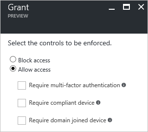
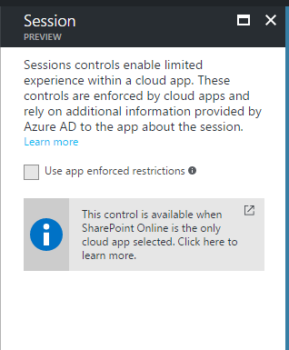
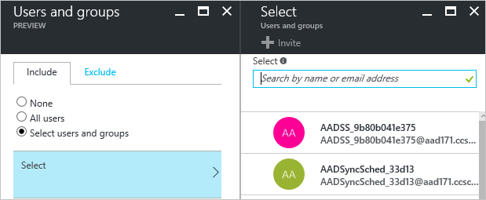
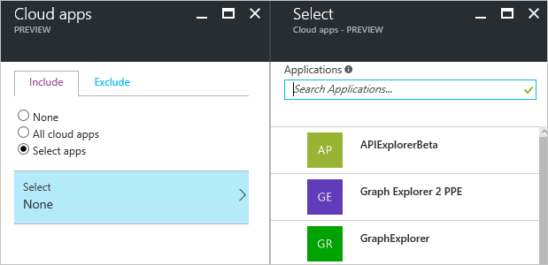
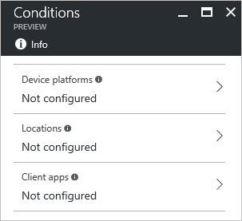
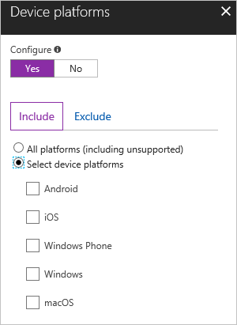
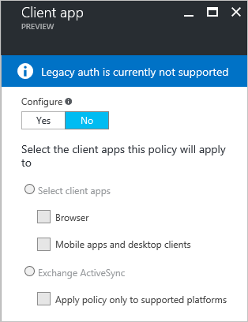

# Conditional access in Azure Active Directory

> [!div class="op_single_selector"]
> * [Azure portal](active-directory-conditional-access-azure-portal.md)
> * [Azure classic portal](active-directory-conditional-access.md)

In a mobile-first, cloud-first world, Azure Active Directory enables single sign-on to devices, apps, and services from anywhere. With the proliferation of devices (including BYOD), work off corporate networks, and 3rd party SaaS apps, IT professionals are faced with two opposing goals:

- Empower the end users to be productive wherever and whenever
- Protect the corporate assets at any time

To improve productivity, Azure Active Directory provides your users with a broad range of options to access your corporate assets. With application access management, Azure Active Directory enables you to ensure that only *the right people* can access your applications. What if you want to have more control over how the right people are accessing your resources under certain conditions? What if you even have conditions under which you want to block access to certain apps even for the *right people*? For example, it might be OK for you if the right people are accessing certain apps from a trusted network; however, you might not want them to access these apps from a network you don't trust. You can address these questions using conditional access.

Conditional access is a capability of Azure Active Directory that enables you to enforce controls on the access to apps in your environment based on specific conditions. With controls, you can either tie additional requirements to the access or you can block it. The implementation of conditional access is based on policies. A policy-based approach simplifies your configuration experience because it follows the way you think about your access requirements.  

Typically, you define your access requirements using statements that are based on the following pattern:

When you replace the two occurrences of “*this*” with real-world information, you have an example for a policy statement that probably looks familiar to you:

*When contractors are trying to access our cloud apps from networks that are not trusted, then block access.*

The policy statement above highlights the power of conditional access. While you can enable contractors to basically access your cloud apps (**who**), with conditional access, you can also define conditions under which the access is possible (**how**).

In the context of Azure Active Directory conditional access,

- "**When this happens**" is called **condition statement**
- "**Then do this**" is called **controls**

The combination of a condition statement with your controls represents a conditional access policy.

## Controls

In a conditional access policy, controls define what it is that should happen when a condition statement has been satisfied.  
With controls, you can either block access or allow access with additional requirements.
When you configure a policy that allows access, you need to select at least one requirement.   

### Grant controls
The current implementation of Azure Active Directory enables you to configure the following grant control requirements:

- **Multi-factor Authentication** - You can require strong authentication through multi-factor authentication. As provider, you can use Azure Multi-Factor or an on-premises multi-factor authentication provider, combined with Active Directory Federation Services (AD FS). Using multi-factor authentication helps protect resources from being accessed by an unauthorized user who might have gained access to the credentials of a valid user.

- **Compliant device** - You can set conditional access policies at the device level. You might set up a policy to only enable computers that are compliant, or mobile devices that are enrolled in a mobile device management application, can access your organization's resources. For example, you can use Intune to check device compliance, and then report it to Azure AD for enforcement when the user attempts to access an application. For detailed guidance about how to use Intune to protect apps and data, see Protect apps and data with Microsoft Intune. You also can use Intune to enforce data protection for lost or stolen devices. For more information, see Help protect your data with full or selective wipe using Microsoft Intune.

- **Domain joined device** – You can require the device you have used to connect to Azure Active Directory to be a domain joined device. This policy applies to Windows desktops, laptops, and enterprise tablets. For more information about how to set up automatic registration of domain-joined devices with Azure AD, see [Automatic device registration with Azure Active Directory for Windows domain-joined devices](active-directory-conditional-access-automatic-device-registration.md).

If you have more than one requirement selected in a conditional access policy, you can also configure your requirements for applying them. You can choose to require all of the selected controls or one of them.

### Session controls
Session controls enable limiting experience within a cloud app. The session controls are enforced by cloud apps and rely on additional information provided by Azure AD to the app about the session.

#### Use app enforced restrictions
You can use this control to require Azure AD to pass the device information to the cloud app. This helps the cloud app know if the user is coming from a compliant device or domain joined device. This control is currently only supported with SharePoint as the cloud app. SharePoint uses the device information to provide users a limited or full experience depending on the device state.
To learn more about how to require limited access with SharePoint, go [here](https://aka.ms/spolimitedaccessdocs).

## Condition Statement

The previous section has introduced you to supported options to block or restrict access to your resources in form of controls. In a conditional access policy, you define the criteria that need to be met for your controls to be applied in form of a condition statement.  

You can include the following assignments into your condition statement:

- **Who** - In many cases, you want your controls to be applied to a specific set of users. In a condition statement, you can define this set by selecting the users and groups your policy applies to. If necessary, you can also explicitly exclude a set of users from your policy by exempting them.  
By selecting users and groups, you define the scope of users your policy applies to.    

	

- **What** - Typically, there are certain apps that are running in your environment requiring, from a protection perspective, more attention than others. This affects, for example, apps that have access to sensitive data.
By selecting cloud apps, you define the scope of cloud apps your policy applies to. If necessary, you can also explicitly exclude a set of apps from your policy.

	

- **How** - As long as access to your apps is performed under conditions you can control, there might be no need for imposing additional controls on how your cloud apps are accessed by your users. However, things might look different if access to your cloud apps is performed, for example, from networks that are not trusted or devices that are not compliant. In a condition statement, you can define certain access conditions that have additional requirements for how access to your apps is performed.

	

## Conditions

In the current implementation of Azure Active Directory, you can define conditions for the following areas:

- **Device platforms** – The device platform is characterized by the operating system that is running on your device (Android, iOS, Windows Phone, Windows). You can define the device platforms that are included as well as device platforms that are exempted from a policy.  
To use device platforms in the policy, first change the configure toggles to **Yes**, and then select all or individual device platforms the policy applies to. If you select individual device platforms, the policy has only an impact on these platforms. In this case, sign-ins to other supported platforms are not impacted by the policy.

	

- **Locations** -  The location is identified by the IP address of the client you have used to connect to Azure Active Directory. This condition requires you to be familiar with Trusted IPs. Trusted IPs is a feature of multi-factor authentication that enables you to define trusted IP address ranges representing your organization's local intranet. When you configure a location conditions, Trusted IPs enables you to distinguish between connections made from your organization's network and all other locations. For more details, see [Trusted IPs](../multi-factor-authentication/multi-factor-authentication-whats-next.md#trusted-ips).  
You can either include all locations or all trused IPs and you can exclude all trusted IPs.

	

- **Client app** - The client app can be either on a generic level the app (web browser, mobile app, desktop client) you have used to connect to Azure Active Directory or you can specifically select Exchange Active Sync.  
Legacy authentication refers to clients using basic authentication such as older Office clients that don’t use modern authentication. Conditional access is currently not supported with legacy authentication.

	

## What you should know

### Do I need to assign a user to my policy?

When configuring a conditional access policy, you should at least assign one group to it. A conditional access policy that has no users and groups assigned, is never triggered.

When you intend to assign several users and groups to a policy, you should start small by assigning only one user or group, and then test your configuration. If your policy works as expected, you can then add additional assignments to it.  

### How are assignments evaluated?

All assignments are logically **ANDed**. If you have more than one assignment configured, to trigger a policy, all assignments must be satisfied.  

If you need to configure a location condition that applies to all connections made from outside your organization's network, you can accomplish this by:

- Including **All locations**
- Excluding **All trusted IPs**

### What happens if you have policies in the Azure classic portal and Azure portal configured?  
Both policies are enforced by Azure Active Directory and the user gets access only when all requirements are met.

### What happens if you have policies in the Intune Silverlight portal and the Azure Portal?
Both policies are enforced by Azure Active Directory and the user gets access only when all requirements are met.

### What happens if I have multiple policies for the same user configured?  
For every sign-in, Azure Active Directory evaluates all policies and ensures that all requirements are met before granted access to the user.

### Does conditional access work with Exchange ActiveSync?

Yes, you can use Exchange ActiveSync in a conditional access policy.

### What happens if I require multi-factor authentication or a compliant device?

Currently, the user will be prompted for multi-factor authentication irrespective of the device.

## What you should avoid doing

The conditional access framework provides you with a great configuration flexibility. However, great flexibility  also means that you should carefully review each configuration policy prior to releasing it to avoid undesirable results. In this context, you should pay special attention to assignments affecting complete sets such as **all users / groups / cloud apps**.

In your environment, you should avoid the following configurations:

**For all users, all cloud apps:**

- **Block access** - This configuration blocks your entire organization, which is definitely not a good idea.

- **Require compliant device** - For users that don't have enrolled their devices yet, this policy blocks all access including access to the Intune portal. If you are an administrator without an enrolled device, this policy blocks you from getting back into the Azure portal to change the policy.

- **Require domain join** - This policy block access has also the potential to block access for all users in your organization if you don't have a domain-joined device yet.

**For all users, all cloud apps, all device platforms:**

- **Block access** - This configuration blocks your entire organization, which is definitely not a good idea.

## Common scenarios

### Requiring multi-factor authentication for apps

Many environments have apps requiring a higher level of protection than the others.
This is, for example, the case for apps that have access to sensitive data.
If you want to add another layer of protection to these apps, you can configure a conditional access policy that requires multi-factor authentication when users are accessing these apps.

### Requiring multi-factor authentication for access from networks that are not trusted

This scenario is similar to the previous scenario because it adds a requirement for multi-factor authentication.
However, the main difference is the condition for this requirement.  
While the focus of the previous scenario was on apps with access to sensitve data, the focus of this scenario is on trusted locations.  
In other words, you might have a requirement for multi-factor authentication if an app is accessed by a user from a network you don't trust.

### Only trusted devices can access Office 365 services

If you are using Intune in your environment, you can immediately start using the conditional access policy interface in the Azure console.

Many Intune customers are using conditional access to ensure that only trusted devices can access Office 365 services. This means that mobile devices are enrolled with Intune and meet compliance policy requirements, and that Windows PCs are joined to an on-premises domain. A key improvement is that you do not have to set the same policy for each of the Office 365 services.  When you create a new policy, configure the Cloud apps to include each of the O365 apps that you wish to protect with  with Conditional Access.

## Next steps

If you want to know how to configure a conditional access policy, see [Get started with conditional access in Azure Active Directory](active-directory-conditional-access-azure-portal-get-started.md).
