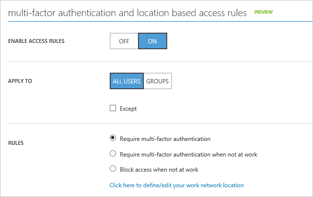

<properties
	pageTitle="Azure Conditional Access Preview for SaaS Apps| Microsoft Azure"
	description="Conditional access in Azure AD allows you to configure per-application multi-factor authentication access rules and the ability to block access for users not on a trusted network. "
	services="active-directory"
	documentationCenter=""
	authors="femila"
	manager="swadhwa"
	editor=""/>

<tags
	ms.service="active-directory"
	ms.workload="identity"
	ms.tgt_pltfrm="na"
	ms.devlang="na"
	ms.topic="article"
	ms.date="07/14/2016"
	ms.author="femila"/>

# Getting started with conditional access to Azure AD  

The Azure Active Directory Conditional Access for [SaaS](https://azure.microsoft.com/overview/what-is-saas/) apps and Azure AD connected apps is available for public preview. The preview allows you to configure conditional access based on group, location, and application sensitivity. 

You can apply multi-factor authentication rules to all users that are assigned to the application, or only for users within specified security groups. With conditional access based on application sensitivity, you can set multi-factor authentication (MFA) access rules per application, that provides the ability to block access for users who are not on a trusted network. Users may be excluded from the multi-factor authentication requirement if they are accessing the application from an IP address that in inside the organization’s network.

These capabilities will be available to customers that have purchased an Azure Active Directory Premium license.

## Scenario prerequisites
* License for Azure Active Directory Premium

* Federated or managed Azure Active Directory tenant

* Federated tenants require that multi-factor authentication be enabled.

## Known issues in this Preview release
This preview applies to pre-integrated federated SaaS applications, applications that use password single sign-on, registered developed and line of business applications and Azure AD Application Proxy. Additional applications are still being enabled.

## Configure per-application access rules

This section describes how to configure per-application access rules.

1. Sign in to the Azure classic portal Using an account that is a global administrator for Azure AD.
2. On the left pane, select **Active Directory**.
3. On the Directory tab, select your directory.
4. Select the **Applications** tab.
5. Select the application that the rule will be set for.
6. Select the **Configure** tab.
7. Scroll down to the access rules section. Select the desired access rule.
8. Specify the users the rule will apply to.
9. Enable the policy by selecting **Enabled to be On**.

##Understanding access rules

This section gives a detailed description of the access rules supported in the Azure Conditional Application Access Preview.

### Specifying the users the access rules apply to

By default the policy will apply to all users that have access to the application. However, you can also restrict the policy to users that are members of the specified security groups. The **Add Group** button is used to select one or more groups from the group selection dialog that the access rule will apply to. This dialog can also be used to remove selected groups. When the rules are selected to apply to Groups, the access rules will only be enforced for users that belong to one of the specified security groups.

Security groups can also be explicitly excluded from the policy by selecting the Except option and specifying one or more groups. Users that are a member of a group in the Except list will not be subject to the multi-factor authentication requirement, even if they are a member of a group that the access rule applies to.
The access rule shown in the below will require all users in the Managers group to use multi-factor authentication when accessing the application.

## Conditional Access Rules with MFA
If a user has been configured using the per-user multi-factor authentication feature, this setting on the user will combine with the multi-factor authentication rules of the app. This means a user that has been configured for per-user multi-factor authentication will be required to perform multi-factor authentication even if they have been exempted from the application multi-factor authentication rules. Learn more about multi-factor authentication and per-user settings.

### Access rule options
The current preview supports the following options:

* **Require multi-factor authentication**: With this option the users that the access rules apply to will be required to complete multi-factor authentication before accessing the application the policy applies to.

* **Require multi-factor authentication when not at work**: With this option a user that is coming from a trusted IP address will not be required to perform multi-factor authentication. The trusted IP address ranges can be configured on the multi-factor authentication settings page.

* **Block access when not at work**: With this option a user that is not coming from a trusted IP address will be blocked. The trusted IP address ranges can be configured on the multi-factor authentication settings page.

### Setting rule status
Access rule status allows turning the rules on or off. When the access rules are off, the multi-factor authentication requirement will not be enforced.

### Access rule evaluation

Access rules are evaluated when a user accesses a federated application that uses OAuth 2.0, OpenID Connect, SAML or WS-Federation. In addition, access rules are evaluated when the OAuth 2.0 and OpenID Connect when a refresh token is used to acquire an access token. If policy evaluation fails when a refresh token is used, the error invalid_grant will be returned, this indicates the user needs to re-authenticate to the client.
Configure federation services to provide multi-factor authentication

For federated tenants, multi-factor authentication (MFA) may performed by Azure Active Directory or by the on-premises AD FS server.

By default, MFA will occur at a page hosted by Azure Active Directory. In order to configure MFA on-premises, the –SupportsMFA property must be set to **true** in Azure Active Directory, by using the Azure AD module for Windows PowerShell.

The following example shows how to enable on-premises MFA by using the [Set-MsolDomainFederationSettings cmdlet](https://msdn.microsoft.com/library/azure/dn194088.aspx) on the contoso.com tenant:

    Set-MsolDomainFederationSettings -DomainName contoso.com -SupportsMFA $true

In addition to setting this flag, the federated tenant AD FS instance must be configured to perform multi-factor authentication. Follow the instructions for deploying Azure Multi-Factor Authentication on-premises.

## Related Articles

- [Securing access to Office 365 and other apps connected to Azure Active Directory](active-directory-conditional-access.md)
- [Article Index for Application Management in Azure Active Directory](active-directory-apps-index.md)
