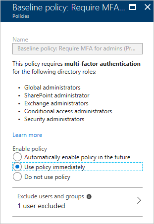

# What is baseline protection?  

In the last year, identity attacks have increased by 300%. To protect your environment from the ever-increasing attacks, Azure Active Directory (Azure AD) introduces a new feature called baseline protection. Baseline protection is a set of predefined conditional access policies. The goal of these policies is to ensure that you have at least the baseline level of security enabled in your environment. 

During the preview, you need to enable baseline policies if you want to activate them. Post general availability, these policies are by default enabled. 

The first baseline protection policy requires MFA for privileged accounts. Attackers who get control of privileged accounts can do tremendous damage, so it is critical to protect these accounts, first. The following privileged roles are in scope for this policy: 

- Global administrator  

- SharePoint administrator  

- Exchange administrator  

- Conditional access administrator  

- Security administrator  

## How to get started 

To enable baseline policy:  

1. Sign in to the [Azure portal](https://portal.azure.com) as global administrator, security administrator, or conditional access administrator.

2. In the **Azure portal**, on the left navbar, click **Azure Active Directory**.

    

3. On the **Azure Active Directory** page, in the **Manage** section, click **Conditional access**.

    

4. In the list of policies, click **Baseline policy: Require MFA for admins (Preview)**. 

5. To enable the policy, click **Use policy immediately**.

6. Click **Save**. 
 

The baseline policy provides you with the option to exclude users and groups. You might want to exclude one *[emergency-access administrative account](active-directory-admin-manage-emergency-access-accounts.md)* to ensure you are not locked out of the tenant.
  
 

## What you should know 

The directory roles that are included in the baseline policy are the most privileged Azure AD roles. Based on feedback, others might be included in the future. 

If you have accounts with administrator privileges in your scripts, you should use [Managed Service Identity (MSI)](managed-service-identity/overview.md) or [service principals (with certificates)](https://docs.microsoft.com/azure/azure-resource-manager/resource-group-authenticate-service-principal) instead. As a temporary workaround, you can exclude specific user accounts from your baseline policy. 

The policy applies to legacy authentication flows like POP, IMAP, older Office desktop client. 

## Next steps

If you want to know how to configure a conditional access policy, see [Get started with conditional access in Azure Active Directory](active-directory-conditional-access-azure-portal-get-started.md).

If you are ready to configure conditional access policies for your environment, see the [best practices for conditional access in Azure Active Directory](active-directory-conditional-access-best-practices.md). 
