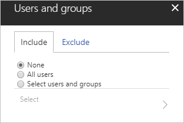
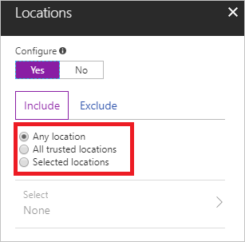

# Conditions in Azure Active Directory conditional access 

With [Azure Active Directory (Azure AD) conditional access](active-directory-conditional-access-azure-portal.md), you can control how authorized users access your cloud apps. In a conditional access policy, you define the response ("do this") to the reason for triggering your policy ("when this happens"). 

In the context of conditional access:

- "**When this happens**" is called **conditions**. 
- "**Then do this**" is called **access controls**.

The combination of your conditions with your access controls represents a conditional access policy.

This article gives you an overview of the conditions and how they are used in a conditional access policy. 

## Users and groups

The users and groups condition is mandatory in a conditional access policy. In your policy, you can either select **All users** or select specific users and groups.

When you select:

- **All users**, your policy is applied to all users with in the directory. This includes guest users.

- **Select users and groups**, you can target specific sets of users. For example, you can select a group that contains all members of the HR department, when you have an HR app selected as cloud app. 

- A group, it can be any type of group in Azure AD, including dynamic or assigned security and distribution groups.

You can also exclude specific users or groups from a policy. One common use case are service accounts if your policy enforces multi-factor authentication. 

Targeting specific sets of users is useful for the deployment of a new policy. In a new policy, you should target only an initial set of users to validate the policy behavior. 

## Cloud apps 

A cloud app is a web sites or service. This includes web sites protected by the Azure Application Proxy. For a detailed description of the supported cloud apps, see [cloud apps assignment](active-directory-conditional-access-technical-reference.md#cloud-apps-assignments). 	

The cloud apps condition is mandatory in a conditional access policy. In your policy, you can either select **All cloud apps** or select specific apps.

You can select:

- **All cloud apps** to baseline policies to be applied to the entire organization. A common use case for this selection is a policy that requires multi-factor authentication when sign-in risk is detected for any cloud app.

- Individual cloud apps to target specific services by policy. For example, you can require users to have a [compliant device](active-directory-conditional-access-policy-connected-applications.md) to access SharePoint Online. This policy is also applied to other services when they access SharePoint content, for example, Microsoft Teams. 

You can also exclude specific apps from a policy; however, these apps are still subject to the policies applied to services they access. 

## Sign-in risk

A sign-in risk is an indicator for the likelihood (high, medium, or low) that a sign-in attempt was not performed by the legitimate owner of a user account. Azure AD calculates the sign-in risk level during the sign-in of a user. You can use the calculated sign-in risk level as condition in a conditional access policy. 

To use this condition, you need to have [Azure Active Directory Identity Protection](active-directory-identityprotection.md) enabled.
 
Common use cases for this condition are policies that:

- Block users with a high sign-in risk to prevent potentially non-legitimate users from accessing your cloud apps. 
- Require multi-factor authentication for users with a medium sign-in risk. By enforcing multi-factor authentication, you can provide additional confidence that the sign-in is performed by the legitimate owner of an account.

For more information, see [Risky sign-ins](active-directory-identityprotection.md#risky-sign-ins).  

## Device platforms

The device platform is characterized by the operating system that is running on your device. Azure AD identifies the platform by using information provided by the device, such as user agent. Because this information is unverified, it is recommended that all platforms have a policy applied to them, either by blocking access, requiring compliance with Intune policies or requiring the device be domain joined. The default is to apply policy to all device platforms. 

For a complete list of the supported device platforms, see [device platform condition](active-directory-conditional-access-technical-reference.md#device-platform-condition).

A common use case for this condition is a policy that restricts access to your cloud apps to [trusted devices](active-directory-conditional-access-policy-connected-applications.md#trusted-devices). For more scenarios including the device platform condition, see [Azure Active Directory app-based conditional access](active-directory-conditional-access-mam.md).

## Locations

With locations, you have the option to define conditions that are based on where a connection attempt was initiated from. 
     

Common use cases for this condition are policies that:

- Require multi-factor authentication for users accessing a service when they are off the corporate network.  

- Block access for users accessing a service from specific countries or regions. 

For more information, see [Location conditions in Azure Active Directory conditional access](active-directory-conditional-access-locations.md).

## Client apps

The client apps condition allows you to apply a policy to different types of applications, such as:

- Web sites and services
- Mobile apps and desktop applications. 

An application is classified as:

- A web site or service if it uses the web SSO protocols, SAML, WS-Fed or OpenID Connect for a confidential client.

- A a mobile app or desktop application if it uses the mobile app OpenID Connect for a native client.

For a complete list of the client apps you can use in your conditional access policy, see the [Azure Active Directory Conditional Access technical reference](active-directory-conditional-access-technical-reference.md#client-apps-condition).

Common use cases for this condition are policies that:

- Require a [compliant device](active-directory-conditional-access-policy-connected-applications.md) for mobile and desktop applications that download large amounts of data to the device, while allowing browser access from any device.

- Block access from web applications, but allow access from mobile and desktop applications.

In addition to using web SSO and modern authentication protocols, you can apply this condition to mail applications that use Exchange ActiveSync, like the native mail apps on most smartphones. Currently, client apps using legacy protocols need to be secured using AD FS.

 For more information, see:

- [Set up SharePoint Online and Exchange Online for Azure Active Directory conditional access](active-directory-conditional-access-no-modern-authentication.md)
 
- [Azure Active Directory app-based conditional access](active-directory-conditional-access-mam.md) 

## Next steps

- If you want to know how to configure a conditional access policy, see [get started with conditional access in Azure Active Directory](active-directory-conditional-access-azure-portal-get-started.md).

- If you are ready to configure conditional access policies for your environment, see the [best practices for conditional access in Azure Active Directory](active-directory-conditional-access-best-practices.md). 

