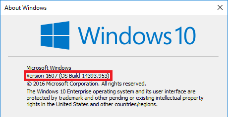

# You can't get there from here on a Windows device

During an attempt to, for example, access your organization's SharePoint Online intranet you might run into a page that states that *you can't get there from here*. You are seeing this page, because your administrator has configured a conditional access policy that prevents access to your organization's resources under certain conditions. While it might be necessary to contact helpdesk or your administrator to get this problem solved, there are a few things you can try out yourself, first.

If you are using a **Windows** device, you should check the following:

- Are you using a supported browser?

- Are you running a supported version of Windows on your device?

- Is your device compliant?

## Supported browser

If your administrator has configured a conditional access policy, you can only access your organization's resources by using a supported browser. On a Windows device, only **Internet Explorer** and **Edge** are supported.

You can easily identify whether you can't access a resource due to an unsupported browser by looking at the details section of the error page:

The only remediation is to use a browser that the application supports for your device platform. For a complete list of supported browsers, see [supported browsers](active-directory-conditional-access-supported-apps.md).  

## Supported versions of Windows

The following must be true about the Windows operating system on your device: 

- If you are running a Windows desktop operating system on your device, it needs to be Windows 7 or later.
- If you are running a Windows server operating system on your device, it needs to be Windows Server 2008 R2 or later. 

## Compliant device

Your administrator might have configured a conditional access policy that allows access to your organization's resources only from compliant devices. To be compliant, your device must be either joined to your on-premises Active Directory or joined to your Azure Active Directory.

You can easily identify whether you can't access a resource due to a device that is not compliant by looking at the details section of the error page:
 

### Is your device joined to an on-premises Active Directory?

**If your device is joined to an on-premises Active Directory in your organization:**

1. Make sure that you sign in to Windows by using your work account (your Active Directory account).
2. Connect to your corporate network via a virtual private network (VPN) or DirectAccess.
3. After you are connected, press the Windows logo key + the L key to lock your Windows session.
4. Unlock your Windows session by entering your work account credentials.
5. Wait for a minute, and then try again to access the application or service.
6. If you see the same page, click the **More details** link, and then contact your administrator with the details.

### Is your device not joined to an on-premises Active Directory?

If your device is not joined to an on-premises Active Directory and runs Windows 10, you have two options:

* Run Azure AD Join
* Add your work or school account to Windows

For information about how these options are different, see [Using Windows 10 devices in your workplace](active-directory-azureadjoin-windows10-devices.md).  
If your device:

- Belongs to your organization, you should run Azure AD Join.
- Is a personal device or a Windows phone, you should add your work or school account to Windows 

#### Azure AD Join on Windows 10

The steps to join your device to Azure AD are tied the version of Windows 10 you are running on it. To determine the version of your Windows 10 operating system, run the **winver** command: 

**Windows 10 Anniversary Update (Version 1607):**

1. Open the **Settings** app.
2. Click **Accounts** > **Access work or school**.
3. Click **Connect**.
4. Click **Join this device to Azure AD**.
5. Authenticate to your organization, provide multi-factor authentication if prompted, and then follow the steps that are shown.
6. Sign out, and then sign in with your work account.
7. Try again to access the application.

**Windows 10 November 2015 Update (Version 1511):**

1. Open the **Settings** app.
2. Click **System** > **About**.
3. Click **Join Azure AD**.
4. Authenticate to your organization, provide multi-factor authentication if prompted, and then follow the steps that are shown.
5. Sign out, and then sign in with your work account (your Azure AD account).
6. Try again to access the application.

#### Workplace Join on Windows 8.1

If your device is not domain-joined and runs Windows 8.1, to do a Workplace Join and enroll in Microsoft Intune, do the following steps:

1. Open **PC Settings**.
2. Click **Network** > **Workplace**.
3. Click **Join**.
4. Authenticate to your organization, provide multi-factor authentication if prompted, and then follow the steps that are shown.
5. Click **Turn on**.
6. Try again to access the application.

#### Add your work or school account to Windows 

**Windows 10 Anniversary Update (Version 1607):**

1. Open the **Settings** app.
2. Click **Accounts** > **Access work or school**.
3. Click **Connect**.
4. Authenticate to your organization, provide multi-factor authentication if prompted, and then follow the steps that are shown.
5. Try again to access the application.

**Windows 10 November 2015 Update (Version 1511):**

1. Open the **Settings** app.
2. Click **Accounts** > **Your accounts**.
3. Click **Add work or school account**.
4. Authenticate to your organization, provide multi-factor authentication if prompted, and then follow the steps that are shown.
5. Try again to access the application.

## Next steps
[Azure Active Directory conditional access](active-directory-conditional-access-azure-portal.md)

