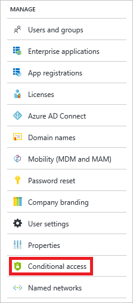
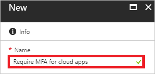
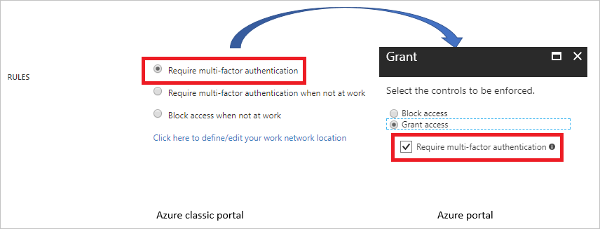

# Migrate classic policies in the Azure portal 

[Conditional access](active-directory-conditional-access-azure-portal.md) is a capability of Azure Active directory (Azure AD) that enables you to control how authorized users access your cloud apps. While the purpose is still the same, the release of the new Azure portal has also introduced significant improvements to how conditional access works. The conditional access policies you have configured outside the Azure portal can coexist with the new policies you are creating in the Azure portal. As long as you are not disabling or removing them, they are still applied in your environment. However, we recommend that you migrate your classic policies to the new Azure AD conditional access policies because:

- The new policies enable you to address scenarios you could not handle with classic policies.

- You can reduce the number of policies you have to manage by consolidating them.   

This topic assists you with the migration of your existing classic policies to the new the new Azure AD conditional access policies.

## Classic policies

The conditional access policies for Azure AD and Intune you have not created in the Azure portal are also known as **classic policies**. To migrate your classic policies, you don't need to have access to your Azure classic portal. The Azure portal provides you with a [**Classic policies (preview)** view](https://portal.azure.com/#blade/Microsoft_AAD_IAM/ConditionalAccessBlade/ClassicPolicies) that enables you to review your classic policies.

### Open a classic policy

**To open a classic policy:**

1. In the [Azure portal](https://portal.azure.com), on the left navbar, click **Azure Active Directory**.

    

2. On the **Azure Active Directory** page, in the **Manage** section, click **Conditional access**.

    
 
2. On the **Conditional access - Policies** page, in the **Manage** section, click **Classic policies (preview)**.

3. From the list of classic policies, select the policy you care about.   

    

## Azure AD conditional access policies

This topic provides you with detailed steps that enable you to migrate your classic policies without being familiar with Azure AD conditional access polices. However, being familiar with the basic concepts and terminology of Azure AD conditional access helps to improve your migration experience.

See:

- [Conditional access in Azure Active Directory](active-directory-conditional-access-azure-portal.md) to learn about the basic concepts and the terminology

- [Get started with conditional access in Azure Active Directory](active-directory-conditional-access-azure-portal-get-started.md) to familiarize yourself with the user interface in the Azure portal

 

## Multi-factor authentication policy 

This example shows how to migrate a classic policy that requires multi-factor authentication** for a cloud app. 

**To migrate a classic policy:**

1. [Open the classic policy](#open-a-classic-policy) to get the the configuration settings.
2. Create a new Azure AD conditional access policy to replace your classic policy. 

### Create a new conditional access policy

1. In the [Azure portal](https://portal.azure.com), on the left navbar, click **Azure Active Directory**.

    

2. On the **Azure Active Directory** page, in the **Manage** section, click **Conditional access**.

    

3. On the **Conditional Access** page, to open the **New** page, in the toolbar on the top, click **Add**.

    

4. On the **New** page, in the **Name** textbox, type a name for your policy.

    

5. In the **Assignments** section, click **Users and groups**.

    

    a. If you have all users selected in your classic policy, click **All users**. 

    

    b. If you have groups selected in your classic policy, click **Select users and groups**, and then select the required users and groups.

    

    c. If you have the excluded groups, click the **Exclude** tab, and then select the required users and groups. 

    

6. On the **New** page, to open the **Cloud apps** page, in the **Assignment** section, click **Cloud apps**.

    

8. On the **Cloud apps** page, perform the following steps:

    

    a. Click **Select apps**.

    b. Click **Select**.

    c. On the **Select** page, select your cloud app, and then click **Select**.

    d. On the **Cloud apps** page, click **Done**.

9. If you have **Require multi-factor authentication** selected:

    

    a. In the **Access controls** section, click **Grant**.

    

    b. On the **Grant** page, click **Grant access**, and then click **Require multi-factor authentication**.

    c. Click **Select**.

10. Click **On** to enable your policy.

    

11. Disable the classic policy. 

    

 

## Next steps

- If you want to know how to configure a conditional access policy, see [Get started with conditional access in Azure Active Directory](active-directory-conditional-access-azure-portal-get-started.md).

- If you are ready to configure conditional access policies for your environment, see the [best practices for conditional access in Azure Active Directory](active-directory-conditional-access-best-practices.md). 
