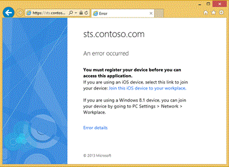

<properties
	pageTitle="Setting up on-premises conditional access using Azure Active Directory Device Registration | Microsoft Azure"
	description="A step-by-step guide to enable conditional access to on-premises applications using Active Directory Federation Service (AD FS) in Windows Server 2012 R2."
	services="active-directory"
	documentationCenter=""
	authors="femila"
	manager="swadhwa"
	editor=""/>

<tags
	ms.service="active-directory"
	ms.workload="identity"
	ms.tgt_pltfrm="na"
	ms.devlang="na"
	ms.topic="article"
	ms.date="06/23/2016"
	ms.author="femila"/>

# Setting up on-premises conditional access using Azure Active Directory Device Registration

Personally owned devices of your users can be marked known to your organization by requiring the users to work place join their devices to the Azure Active Directory Device Registration service. Below is a step-by-step guide to enable conditional access to on-premises applications using Active Directory Federation Service (AD FS) in Windows Server 2012 R2.

> [AZURE.NOTE]
> Office 365 license or Azure AD Premium license is required when using devices registered in Azure Active Directory Device Registration service conditional access policies. This includes policies enforced by Active Directory Federation Services (AD FS) to on-premises resources.

For more information on the conditional access scenarios for on-premises, see [Join to Workplace from Any Device for SSO and Seamless Second Factor Authentication Across Company Applications](https://technet.microsoft.com/library/dn280945.aspx).

These capabilities are available to customers that purchase an Azure Active Directory Premium license.

Supported Devices
-------------------------------------------------------------------------
* Windows 7 domain joined devices.
* Windows 8.1 personal and domain joined devices.
* iOS 6 and later, for Safari browser
* Android 4.0 or later, Samsung GS3 or above phones, Samsung Note2 or above tablets.

Scenario Prerequisites
------------------------------------------------------------------------
* Subscription to Office 365 or Azure Active Directory Premium
* An Azure Active Directory tenant
* Windows Server Active Directory (Windows Server 2008 or above)
* Updated schema in Windows Server 2012 R2
* License for Azure Active Directory Premium
* Windows Server 2012 R2 Federation Services, configured for SSO to Azure AD
* Windows Server 2012 R2 Web Application Proxy Microsoft Azure Active Directory Connect (Azure AD Connect). [Download Azure AD Connect here](http://www.microsoft.com/en-us/download/details.aspx?id=47594).
* Verified domain.

Known issues in this release
-------------------------------------------------------------------------------
* Device based conditional access policies require device object write-back to Active Directory from Azure Active Directory. It can take up to 3 hours for device objects to be written-back to Active Directory
* iOS 7 devices will always prompt the user to select a certificate during client certificate authentication.
* Some versions of iOS8, before iOS 8.3 do not work.

## Scenario assumptions
This scenario assumes that you have a hybrid environment consisting of an Azure AD tenant and a on-premises Active Directory. These tenants should be connected using Azure AD Connect and with a verified domain and AD FS for SSO. The checklist below will help you configure your environment to the stage described above.

Checklist: Prerequisites for Conditional Access scenario
--------------------------------------------------------------
Connect your Azure AD tenant with your on-premises Active Directory.

## Configure Azure Active Directory Device Registration Service
Use this guide to deploy and configure Azure Active Directory Device Registration Service for your organization.

This guide assumes that you have configured Windows Server Active Directory and have subscribed to Microsoft Azure Active Directory. See prerequisites above.

To deploy Azure Active Directory Device Registration Service with your Azure Active Directory tenant, complete the tasks in the following checklist, in order. When a reference link takes you to a conceptual topic, return to this checklist after you review the conceptual topic so that you can proceed with the remaining tasks in this checklist. Some tasks will include a scenario validation step that can help you confirm the step was completed successfully.

## Part 1: Enable Azure Active Directory Device Registration

Follow the checklist below to enable and configure the Azure Active Directory Device Registration Service.

| Task                                                                                                                                                                                                                                                                                                                                                                                             | Reference                                                       |
|--------------------------------------------------------------------------------------------------------------------------------------------------------------------------------------------------------------------------------------------------------------------------------------------------------------------------------------------------------------------------------------------------|-----------------------------------------------------------------|
| Enable Device Registration in your Azure Active Directory tenant to allow devices to join the workplace. By default, multi-factor authentication is not enabled for the service. However, multi-factor authentication is recommended when registering a device. Before enabling multi-factor authentication in ADRS, ensure that AD FS is configured for a multi-factor authentication provider. | [Enable Azure Active Directory Device Registration](active-directory-conditional-access-device-registration-overview.md)               |
| Devices will discover your Azure Active Directory Device Registration Service by looking for well-known DNS records. You must configure your company DNS so that devices can discover your Azure Active Directory Device Registration Service.                                                                                                                                                   | [Configure Azure Active Directory Device Registration discovery.](active-directory-conditional-access-device-registration-overview.md) |

##Part 2: Deploy and configure Windows Server 2012 R2 Active Directory Federation Services and set up a federation relationship with Azure AD

| Task                                                                                                                                                                                                                                                                                                                                                                                             | Reference                                                       |
|--------------------------------------------------------------------------------------------------------------------------------------------------------------------------------------------------------------------------------------------------------------------------------------------------------------------------------------------------------------------------------------------------|-----------------------------------------------------------------|
| Deploy Active Directory Domain Services domain with the Windows Server 2012 R2 schema extensions. You do not need to upgrade any of your domain controllers to Windows Server 2012 R2. The schema upgrade is the only requirement. | [Upgrade your Active Directory Domain Services Schema](#upgrade-your-active-directory-domain-services-schema)               |
| Devices will discover your Azure Active Directory Device Registration Service by looking for well-known DNS records. You must configure your company DNS so that devices can discover your Azure Active Directory Device Registration Service.                                                                                                                                                   | [Prepare your Active Directory support devices](#prepare-your-active-directory-to-support-devices) |

##Part 3: Enable device writeback in Azure AD

| Task                                                                                                                                                                                                                                                                                                                                                                                             | Reference                                                       |
|--------------------------------------------------------------------------------------------------------------------------------------------------------------------------------------------------------------------------------------------------------------------------------------------------------------------------------------------------------------------------------------------------|-----------------------------------------------------------------|
| Complete part 2 of Enabling device writeback in Azure AD Connect. Upon completion, return this this guide. | [Enabling device writeback in Azure AD Connect](#upgrade-your-active-directory-domain-services-schema)               |

##[Optional] Part 4: Enable multi-factor authentication

It is strongly recommended that you configure one of the several options for multi-factor authentication. If you want to require MFA, see [Choose the multi-factor security solution for you](../multi-factor-authentication/multi-factor-authentication-get-started.md). It includes a description of each solution, and links to help you configure the solution of your choice.

## Part 5: Verification

The deployment is now complete. You can now try out some scenarios. Follow the links below to experiment with the service and become familiar with the features

| Task                                                                                                                                                                                                                         | Reference                                                                       |
|------------------------------------------------------------------------------------------------------------------------------------------------------------------------------------------------------------------------------|---------------------------------------------------------------------------------|
| Join some devices to your workplace using Azure Active Directory Device Registration. You can join iOS, Windows, and Android devices                                                                                         | [Join devices to your workplace using Azure Active Directory Device Registration](#join-devices-to-your-workplace-using-azure-active-directory-device-registration) |
| You can view and enable/disable registered devices using the Administrator Portal. In this task you will view some registered devices using the Administrator Portal.                                                        | [Azure Active Directory Device Registration Overview](active-directory-conditional-access-device-registration-overview.md)                             |
| Verify that device objects are written back from Azure Active Directory to Windows Server Active Directory.                                                                                                                  | [Verify registered devices are written-back to Active Directory](#verify-registered-devices-are-written-back-to-active-directory)                  |
| Now that users can register their devices, you can create application access polices in AD FS that allow only registered devices. In this task you will create an application access rule and a custom access denied message | [Create an application access policy and custom access denied message](#create-an-application-access-policy-and-custom-access-denied-message)            |

## Integrate Azure Active Directory with on-premises Active Directory
This will help you integrate your Azure AD tenant with your on-premises active directory, using Azure AD Connect. Although the steps are available in the Azure classic portal, make note of any special instructions listed in this section.

1.	Log on to the Azure classic portal using an account that is a Global Administrator in Azure AD.
2.	On the left pane, select **Active Directory**.
3.	On the **Directory** tab, select your directory.
4.	Select the **Directory Integration** tab.
5.	Under **deploy and manage** section, follow the steps 1 through 3 to integrate Azure Active Directory with your on-premises directory.
  1.	Add domains.
  2.	Install and run Azure AD Connect: Install Azure AD Connect using the following instructions, [Custom installation of Azure AD Connect](active-directory-aadconnect-get-started-custom.md).
  3. Verify and manage directory sync. Single sign-on instructions are available within this step.
  
  > [AZURE.NOTE] 
  > Configure Federation with AD FS as outlined in the document linked above. You do not need to configure any of the preview features.

## Upgrade your Active Directory Domain Services schema

> [AZURE.NOTE]
> Upgrading your Active Directory schema cannot be reversed. It is recommended that you first perform this in a test environment.

1. Log in to your domain controller with an account that has both Enterprise Admin and Schema Admin rights.
2. Copy the **[media]\support\adprep** directory and sub-directories to one of your Active Directory domain controllers.
3. Where [media] is the path to the Windows Server 2012 R2 installation media.
4. From a command prompt, navigate to the adprep directory and execute: **adprep.exe /forestprep**. Follow the onscreen instructions to complete the schema upgrade.

## Prepare your Active Directory to support devices

>[AZURE.NOTE] This is a one-time operation that you must run to prepare your Active Directory forest to support devices. You must be logged on with enterprise administrator permissions and your Active Directory forest must have the Windows Server 2012 R2 schema to complete this procedure.

##Prepare your Active Directory forest to support devices

> [AZURE.NOTE]
>This is a one-time operation that you must run to prepare your Active Directory forest to support devices. You must be logged on with enterprise administrator permissions and your Active Directory forest must have the Windows Server 2012 R2 schema to complete this procedure.

### Prepare your Active Directory forest

1.	On your federation server, open a Windows PowerShell command window and type:
     Initialize-ADDeviceRegistration
2.	When prompted for **ServiceAccountName**, enter the name of the service account you selected as the service account for AD FS. If it is a gMSA account, enter the account in the **domain\accountname$** format. For a domain account, use the format **domain\accountname**.

### Enable device authentication in AD FS

1. On your federation server, open the AD FS management console and navigate to **AD FS** > **Authentication Policies**.
2. Select **Edit Global Primary Authentication…** from the **Actions** pane.
3. Check **Enable device authentication** and then select**OK**.
4. By default, AD FS will periodically remove unused devices from Active Directory. You must disable this task when using Azure Active Directory Device Registration so that devices can be managed in Azure.

### Disable unused device cleanup
1. On your federation server, open a Windows PowerShell command window and type:
    Set-AdfsDeviceRegistration -MaximumInactiveDays 0

### Prepare Azure AD Connect for device writeback

1.	Complete Part 1: Prepare Azure AD Connect.

## Join devices to your workplace using Azure Active Directory Device Registration

### Join an iOS device using Azure Active Directory Device Registration

Azure Active Directory Device Registration uses the Over-the-Air Profile enrollment process for iOS devices. This process begins with the user connecting to the profile enrollment URL using the Safari web browser. The URL format is as follows:

    https://enterpriseregistration.windows.net/enrollmentserver/otaprofile/"yourdomainname"

Where `yourdomainname` is the domain name that you have configured with Azure Active Directory. For example, if your domain name is contoso.com, the URL would be:

    https://enterpriseregistration.windows.net/enrollmentserver/otaprofile/contoso.com

There are many different ways to communicate this URL to your users. One recommended way is to publish this URL in a custom application access denied message in AD FS. This is covered in the upcoming section: [Create an application access policy and custom access denied message](#create-an-application-access-policy-and-custom-access-denied-message).

###Join a Windows 8.1 device using Azure Active Directory Device Registration

1. On your Windows 8.1 device, navigate to **PC Settings** > **Network** > **Workplace**.
2. Enter your user name in UPN format. For example, dan@contoso.com..
3. Select **Join**.
4. When prompted, sign-in with your credentials. The device is now joined.

###Join a Windows 7 device using Azure Active Directory Device Registration
To register Windows 7 domain joined devices you need to deploy the device registration software package. The software package is called Workplace Join for Windows 7 and is available for download at the [Microsoft Connect website](https://connect.microsoft.com/site1164). Instructions how to use the package are available at [Configure automatic device registration for Windows 7 domain joined devices](active-directory-conditional-access-automatic-device-registration-windows7.md).

### Join an Android device using Azure Active Directory Device Registration

The [Azure Authenticator for Android topic](active-directory-conditional-access-azure-authenticator-app.md) has instructions on how to install Azure authenticator app on your Android device and add a work account. When a work account is created successfully on an Android device, that device is workplace joined to the organization.

## Verify registered devices are written-back to Active Directory
You can view and verify that your device objects have been written back to your Active Directory using LDP.exe or ADSI Edit. Both are available with the Active Directory Administrator tools.

By default, device objects that are written-back from Azure Active Directory will be placed in the same domain as your AD FS farm.

    CN=RegisteredDevices,defaultNamingContext

## Create an application access policy and custom access denied message
Consider the following scenario: You create an application Relying Party Trust in AD FS and configure an Issuance Authorization Rule that allows only registered devices. Now only devices that are registered are allowed to access the application. To make it easy for your users to gain access to the application, you configure a custom access denied message that includes instructions on how to join their device. Now your users have a seamless way to register their devices in order to access an application.

The following steps will show you how to implement this scenario.

>[AZURE.NOTE]
This section assumes that you have already configured a Relying Party Trust for your application in AD FS.

1. Open the AD FS MMC tool and navigate to AD FS > Trust Relationships > Relying Party Trusts.
2. Locate the application for which this new access rule will apply. Right-click the application and select Edit Claim Rules…
3. Select the **Issuance Authorization Rules** tab and then select **Add Rule…**
4. From the **Claim rule** template drop down list, select **Permit or Deny Users Based on an Incoming Claim**. Select **Next**.
5. In the Claim Rule name: field type: **Permit access from registered devices**
6. From the Incoming claim type: drop down list, select **Is Registered User**.
7. In the Incoming claim value: field, type: **true**
8. Select the **Permit access to users with this incoming claim** radio button.
9. Select **Finish** and then select **Apply**.
10. Remove any rules that are more permissive than the rule you just created. For example, remove the default **Permit Access to all Users** rule.

Your application is now configured to allow access only when the user is coming from a device that they registered and joined to the workplace. For more advanced access polices, see [Manage Risk with Multi-Factor Access Control](https://technet.microsoft.com/library/dn280949.aspx).

Next, you will configure a custom error message for your application. The error message will let users know that they must join their device to the workplace before they are allowed access to the application. You can create a custom application access denied message using custom HTML and Windows PowerShell.

On your federation server, open a Windows PowerShell command window and type the following command. Replace portions of the command with items that are specific to your system:

    Set-AdfsRelyingPartyWebContent -Name "relying party trust name" -ErrorPageAuthorizationErrorMessage
You must register your device before you can access this application.

**If you are using an iOS device, select this link to join your device**:

    a href='https://enterpriseregistration.windows.net/enrollmentserver/otaprofile/yourdomain.com

Join this iOS device to your workplace.

**If you are using a Windows 8.1 device**, you can join your device by going to **PC Settings **> **Network** > **Workplace**.

Where "**relying party trust name**" is the name of your applications Relying Party Trust object in AD FS.
Where **yourdomain.com** is the domain name that you have configured with Azure Active Directory. For example, contoso.com.
Be sure to remove any line breaks (if any) from the html content that you pass to the **Set-AdfsRelyingPartyWebContent** cmdlet.

Now when users access your application from a device that is not registered with the Azure Active Directory Device Registration Service, they will receive a page that looks similar to the screen shot below.

##Related Articles

- [Article Index for Application Management in Azure Active Directory](active-directory-apps-index.md)
