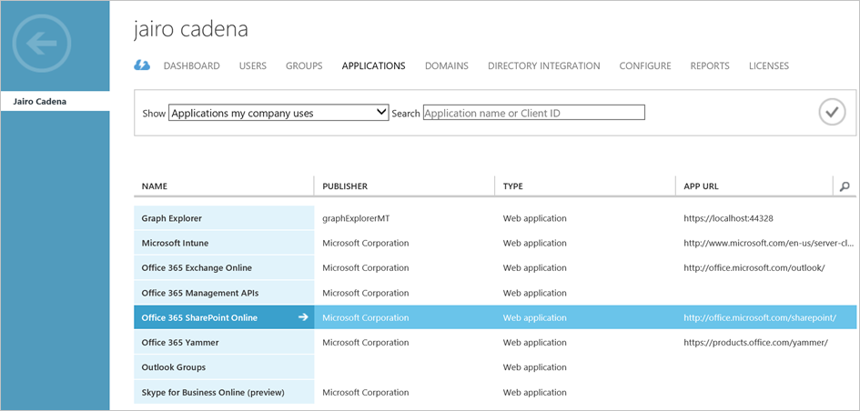
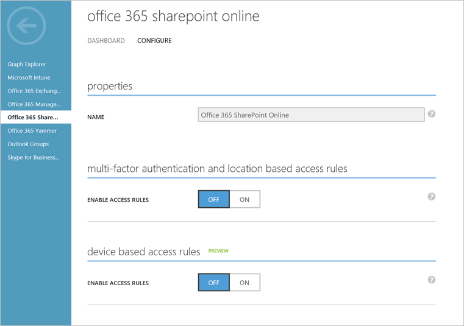

<properties
	pageTitle="How to set Azure Active Directory device-based conditional access policy for access control to Azure Active Directory connected applications"
	description="Explains how IT admins can set device-based conditional access policies for Azure AD connected applications."
	services="active-directory"
	documentationCenter=""
	authors="markusvi"
	manager="femila"
	editor=""/>

<tags
	ms.service="active-directory"
	ms.workload="identity"
	ms.tgt_pltfrm="na"
	ms.devlang="na"
	ms.topic="article"
	ms.date="08/08/2016"
	ms.author="markvi"/>

# How to set Azure Active Directory device-based conditional access policy for access control to Azure Active Directory connected applications 

Azure Active Directory device-based conditional access is the ability you have to protect organizational resources from:

- Access made from unknown / unmanaged devices 
- From devices that don’t meet security policies as defined by your organization. 

For an overview on conditional access, see [Azure Active Directory conditional access](active-directory-conditional-access.md). 

You can set device-based conditional access policies to protect the following: 

- Office 365 SharePoint Online to protect organizational sites and documents. 

- Office 365 Exchange Online to protect organizational email. 

- SaaS applications connected to Azure AD for authentication. 

- On-premises applications published through the Azure AD Application Proxy. 

In the Azure management portal, you can set this policy by going to the specific application in the directory. 

 
  

After selecting the application, click the **Configure** tab to set the Conditional Access policy.  

  

 

To enable a device-based conditional access policy, in the **Device based access rules** section, for **Enable Access Rules**, select **On**. 

This policy consist of three components:

1. **Apply To** -  The scope of users this policy applies to when accessing the application. 

2. **Device Rules** -  The required conditions devices must meet before accessing the application. 

3. **Application Enforcement** -  The client applications (native vs. browser) the policy should be evaluated for. 

  
 

## Selecting the users the policy applies to 

In the **Apply To** section, you can select the scope of users this policy applies to. 

You have two options for the scope:

- **All Users** - For everyone accessing the application 

- **Groups** - To limit the scope to users that are a member of a group or groups. 

By selecting **Except**, you can exclude users from this policy while accessing the application. This is helpful when you need to enable specific users to access the application temporarily. Select this option, for example, if some of your users have devices that are not ready for conditional access (not yet registered, coming out of compliance, etc.).
 

## Selecting the conditions devices must meet 

With **Device Rules**, you set the conditions for devices to be able to access the application. 

For Device-based Conditional Access, the following devices are supported: 

- Windows 10 Anniversary Update, Windows 7 and Windows 8.1. 

- Windows Server 2016, Windows Server 2012 R2, Windows Server 2012 and Windows Server 2008 R2 

- iOS devices (iPad, iPhone) 

- Android devices 

Support for Mac is coming soon. 

  

 >[AZURE.NOTE] For information about differences between Domain Join and Azure AD Join please see [Using Windows 10 devices in your workplace](active-directory-azureadjoin-windows10-devices.md). 

You have two options for device rules: 

- **All devices must be compliant** - This requires all device platforms accessing the application to be compliant. For platforms that don't support Device-based Conditional Access, the devices are denied access. 

- **Only selected devices must be compliant** - This requires only selected device platforms to be compliant. Non-selected platforms or other platforms accessing the application are allowed access.”

  

Azure AD joined devices are compliant if they are marked as **compliant** in the directory by Microsoft Intune or a 3rd party Mobile Device Management (MDM) system that integrates with Azure AD. 

Domain joined devices are compliant in one of two ways: 

- If they are registered with Azure AD, the fact that they are domain joined many organizations treat them as trusted devices. 

- If they are marked as ‘compliant’ in the Azure AD by System Center Configuration Manager 2016. 

 
 

Windows personal devices are compliant if they are marked as **compliant** in the directory by Microsoft Intune or a 3rd party Mobile Device Management (MDM) system that integrates with Azure AD. 

Non-Windows devices are compliant if they are marked as **compliant** in the directory by Microsoft Intune. 

 >[AZURE.NOTE] For more information on how to setup Azure AD for device compliance by management system, see [Azure Active Directory Conditional Access](active-directory-conditional-access.md). 

When you select specific device platforms, you can select one or multiple options including Android, iOS, Windows Mobile (Windows 8.1 phones and tablets) and Windows (all other Windows devices including all Windows 10 devices). 
With this option, the policy evaluation only occurs on the selected platforms. If access is attempted from a device that is not part of the selection, no device policy is evaluated and the device is allowed if the user is. 

  

## Selecting the type of client applications under which policy will be evaluated 

In the **Application Enforcement** section, you set the type of applications the policy must be evaluated for.

You have two options for applications: 

- For browser and native applications 
- For only native applications. 

Selecting **For browser and native applications** enforces the policy on access to applications by: 

- Browsers (e.g. Edge in Windows 10, Safari in iOS, etc.) 
- Applications using the Active Directory Application Library (ADAL) in any platform or the Web Account Manager (WAM) API in Windows 10 

>[AZURE.NOTE] For more information about browser support and other considerations for the end-user accessing device-based CA protected applications see, [Azure Active Directory Conditional Access](active-directory-conditional-access.md). 

 

## Protecting email access from Exchange Active Sync based applications 

In Office 365 Exchange Online applications, you have an additional section called **Exchange Activesync**. This section enables you to block email access to Exchange Active Sync based mail applications. 

 

 
## Additional topics

- [Azure Active Directory Conditional Access](active-directory-conditional-access.md) 
