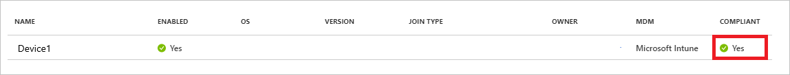

# Configure Azure Active Directory device-based conditional access policies

With [Azure Active Directory (Azure AD) conditional access](active-directory-conditional-access-azure-portal.md), you can control how authorized users can access your resources. For example, you can limit the access to certain resources to managed devices. A conditional access policy that requires a managed device is also known as device-based conditional access policy.

This topic explains how you can configure device-based conditional access policies for Azure AD-connected applications. 

## Before you begin

Device-based conditional access ties **Azure AD conditional access** and **Azure AD device management together**. If you are not familiar with one of these areas yet, you should read the following topics, first:

- **[Conditional access in Azure Active Directory](active-directory-conditional-access-azure-portal.md)** - This topic provides you with a conceptual overview of conditional access and the related terminology.

- **[Introduction to device management in Azure Active Directory](device-management-introduction.md)** - This topic gives you an overview of the various options you have to connect devices with Azure AD. 

## Managed devices  

In a mobile-first, cloud-first world, Azure Active Directory enables single sign-on to devices, apps, and services from anywhere. For certain resources in your environment, granting access to the right users might not be good enough. In addition to the right users, you also might require that access attempts can only be performed using a managed device.

A managed device is a device that meets your standards for security and compliance. In simple terms, managed devices are devices that are are under *some sort* of organizational control. In Azure AD, the prerequisite for a managed device is that it has been registered with Azure AD. Registering a device creates an identity for the device in form of a device object. This object is used by Azure to track status information about a device. As an Azure AD administrator, you can already use this object to toggle (enable/disable) the state of a device.
  

To get a device registered with Azure AD, you have three options:

- **[Azure AD registered devices](device-management-introduction.md#azure-ad-registered-devices)** - to get a personal device registered with Azure AD

- **[Azure AD joined devices](device-management-introduction.md#azure-ad-joined-devices)** - to get an organizational Windows 10 device that is not joined to an on-premises AD registered with Azure AD. 

- **[Hybrid Azure AD joined devices](device-management-introduction.md#hybrid-azure-ad-joined-devices)** - to get a Windows 10 device that is joined to an on-premises AD registered with Azure AD.

To become a managed device, a registered device can be a Hybrid Azure AD joined device or a device that has been marked as compliant.  

 
## Require Hybrid Azure AD joined devices

In your conditional access policy, you can select **Require Hybrid Azure AD joined device** to state that the selected cloud apps can only be accessed using a managed device. 

This setting only applies to Windows 10 devices that are joined to an on-premises AD. You can only register these devices with Azure AD using a Hybrid Azure AD join, which is an [automated process](device-management-hybrid-azuread-joined-devices-setup.md) to get a Windows 10 device registered. 

What makes a Hybrid Azure AD joined device a managed device?  For devices that are joined to an on-premises AD, it is assumed that the control over these devices is enforced using management solutions such as **System Center Configuration Manager (SCCM)** or **group policy (GP)** to manage them. Because there is no method for Azure AD to determine whether any of these methods has been applied to a device, requiring a hybrid Azure AD joined device is a relatively weak mechanism to require a managed device. It is up to you as an administrator to judge whether the methods that are applied to your on-premises domain-joined devices are strong enough to constitute a managed device if such a device is also a Hybrid Azure AD joined device.

## Require device to be marked as compliant

The option to *require a device to be marked as compliant* is the strongest form to request a managed device.

This option requires a device to be registered with Azure AD, and also to be marked as compliant by:
         
- Intune 
- A third-party mobile device managed system that manages Windows 10 devices via Azure AD integration 
 

For a device that is marked as compliant, you can assume that: 

- The mobile devices your workforce uses to access company data are managed
- Mobile apps your workforce uses are managed
- Your company information is protected by helping to control the way your workforce accesses and shares it
- The device and its apps are compliant with company security requirements

## Next steps

Before configuring a device-based conditional access policy in your environment, you should take a look at the [best practices for conditional access in Azure Active Directory](active-directory-conditional-access-best-practices.md).

