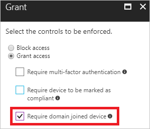

# Configure Azure Active Directory device-based conditional access policies

With [Azure Active Directory (Azure AD) conditional access](active-directory-conditional-access-azure-portal.md), you can fine-tune how authorized users can access your resources. For example, you limit the access to certain resources to trusted devices. A conditional access policy that requires a trusted device is also known as device-based conditional access policy.

This topic provides you with information on how to configure device-based conditional access policies for Azure AD-connected applications. 

## Before you begin

Device-based conditional access ties **Azure AD conditional access** and **Azure AD device management together**. If you are not familiar with one of these areas yet, you should read the following topics, first:

- **[Conditional access in Azure Active Directory](active-directory-conditional-access-azure-portal.md)** - This topic provides you with a conceptual overview of conditional access and the related terminology.

- **[Introduction to device management in Azure Active Directory](device-management-introduction.md)** - This topic gives you an overview of the various options you have to connect devices with Azure AD. 

## Trusted devices

In a mobile-first, cloud-first world, Azure Active Directory enables single sign-on to devices, apps, and services from anywhere. For certain resources in your environment, granting access to the right users might not be good enough. In addition to the right users, you might also require a trusted device to be used to access a resource. In your environment, you can define what a trusted device is based on the following components:

- The [device platforms](active-directory-conditional-access-azure-portal.md#device-platforms) on a device
- Whether a device is compliant
- Whether a device is domain-joined 

The [device platforms](active-directory-conditional-access-azure-portal.md#device-platforms) is characterized by the operating system that is running on your device. In your device-based conditional access policy, you can limit access to certain resources to specific device platforms.

In a device-based conditional access policy, you can require trusted devices to be marked as compliant.

Devices can be marked as compliant in the directory by:

- Intune 
- A third-party mobile device managed system that manages Windows 10 devices via Azure AD integration 
 
  

Only devices that are connected to Azure AD can be marked as compliant. To connect a device to Azure Active Directory, you have the following options: 

- Azure AD registered
- Azure AD joined
- Hybrid Azure AD joined

    

If you have an on-premises Active Directory (AD) footprint, you might consider devices that are not connected to Azure AD but joined to your AD to be trusted.

## Next steps

Before configuring a device-based conditional access policy in your environment, you should take a look at the [best practices for conditional access in Azure Active Directory](active-directory-conditional-access-best-practices.md).

