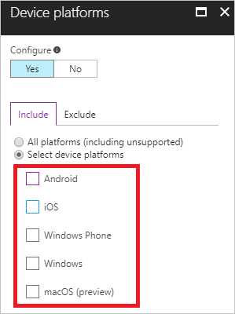
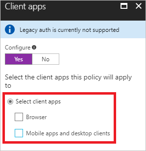
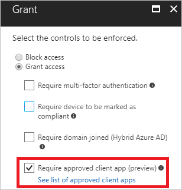

# Azure Active Directory conditional access technical reference

You can use [Azure Active Directory (Azure AD) conditional access](active-directory-conditional-access-azure-portal.md) to fine-tune how authorized users can access your resources.  

This topic provides support information for the following configuration options for a conditional access policy: 

- Cloud applications assignments

- Device platform condition 

- Client applications condition

- Approved client application requirement

## Cloud applications assignments

When you configure a conditional access policy, you need to [select the cloud apps that use your policy](active-directory-conditional-access-azure-portal.md#who). 

### Microsoft cloud applications

You can assign a conditional access policy to the following cloud apps from Microsoft:

- Azure RemoteApp

- Microsoft Dynamics 365

- Microsoft Office 365 Yammer

- Microsoft Office 365 Exchange Online

- Microsoft Office 365 SharePoint Online (includes OneDrive for Business)

- Microsoft Power BI 

- Microsoft Visual Studio Team Services

- Microsoft Teams

### Other applications 

In addition to the Microsoft cloud apps, you can assign a conditional access policy to the following types of cloud apps:

- Azure Active Directory (Azure AD)-connected applications

- Pre-integrated federated software as a service (SaaS) application

- Applications that use password single sign-on (SSO)

- Line-of-business applications

- Applications that use Azure AD Application Proxy

## Device platform condition

In a conditional access policy, you can configure the device platform condition to tie the policy to the operating system on a client.

Azure AD conditional access supports the following device platforms:

- Android

- iOS

- Windows Phone

- Windows

- macOS (preview)

## Client applications condition 

When you configure a conditional access policy, you can [**Select client apps**](active-directory-conditional-access-azure-portal.md#client-apps) for the client app condition. Set the client apps condition to grant or block access when an access attempt is made from the following types of client apps:

- Browser
- Mobile apps and desktop apps

### Supported browsers 

Control browser access by using the **Browser** option in your conditional access policy. Access is granted only when the access attempt is made by a supported browser. When an access attempt is made by an unsupported browser, the attempt is blocked.

In your conditional access policy, the following browsers are supported: 

| OS                     | Browsers                    | Support     |
| :--                    | :--                         | :-:         |
| Windows 10             | Internet Explorer, Edge     | ![Check][1] |
| Windows 10             | Chrome                      | Preview     |
| Windows 8 / 8.1        | Internet Explorer, Chrome   | ![Check][1] |
| Windows 7              | Internet Explorer, Chrome   | ![Check][1] |
| iOS                    | Safari                      | ![Check][1] |
| Android                | Chrome                      | ![Check][1] |
| Windows Phone          | Internet Explorer, Edge     | ![Check][1] |
| Windows Server 2016    | Internet Explorer, Edge     | ![Check][1] |
| Windows Server 2016    | Chrome                      | Coming soon |
| Windows Server 2012 R2 | Internet Explorer, Chrome   | ![Check][1] |
| Windows Server 2008 R2 | Internet Explorer, Chrome   | ![Check][1] |
| macOS                  | Safari                      | ![Check][1] |
| macOS                  | Chrome                      | Coming soon |

> [!NOTE]
> For Chrome support, use Windows 10 Creators Update and install this [extension](https://chrome.google.com/webstore/detail/windows-10-accounts/ppnbnpeolgkicgegkbkbjmhlideopiji).

### Supported mobile applications and desktop clients

Control app and client access by using the **Mobile apps and desktop clients** option in your conditional access policy. Access is granted only when the access attempt is made by a supported mobile app or desktop client. When an access attempt is made by an unsupported app or client, the attempt is blocked.

The following mobile apps and desktop clients support conditional access for Office 365 and other Azure AD-connected service applications:

| Client applications| Target service| Platform |
| --- | --- | --- |
| Azure Multi-Factor Authentication and location policy for apps (device-based policies are not supported)| Any My Apps app service| Android, iOS|
| Azure RemoteApp| Azure RemoteApp service| Windows 10, Windows 8.1, Windows 7, iOS, Android, macOS|
| Dynamics 365 app| Dynamics 365| Windows 10, Windows 8.1, Windows 7, iOS, Android|
| Microsoft Office 365 Teams (controls all services that support Microsoft Teams and all of its client apps: Windows Desktop, iOS, Android, Windows Phone, web client)| Microsoft Teams| Windows 10, Windows 8.1, Windows 7, iOS, Android|
| Mail/Calendar/People app, Outlook 2016, Outlook 2013 (with modern authentication), Skype for Business (with modern authentication)| Office 365 Exchange Online| Windows 10|
| Outlook 2016, Outlook 2013 (with modern authentication), Skype for Business (with modern authentication)| Office 365 Exchange Online| Windows 8.1, Windows 7|
| Outlook mobile app| Office 365 Exchange Online| iOS|
| Outlook 2016 (Office for macOS)| Office 365 Exchange Online| macOS|
| Office 2016 apps, Universal Office apps, Office 2013 (with modern authentication), [OneDrive](https://support.office.com/en-US/article/Azure-Active-Directory-conditional-access-with-the-OneDrive-sync-client-on-Windows-028d73d7-4b86-4ee0-8fb7-9a209434b04e) sync client, future support planned for Office Groups and SharePoint app| Office 365 SharePoint Online| Windows 10|
| Office 2016 apps, Office 2013 (with modern authentication), [OneDrive](https://support.office.com/en-US/article/Azure-Active-Directory-conditional-access-with-the-OneDrive-sync-client-on-Windows-028d73d7-4b86-4ee0-8fb7-9a209434b04e) sync client| Office 365 SharePoint Online| Windows 8.1, Windows 7|
| Office mobile apps| Office 365 SharePoint Online| iOS, Android|
| Office 2016 for macOS (support only for Word, Excel, PowerPoint, OneNote), future support planned for OneDrive for Business| Office 365 SharePoint Online| macOS|
| Office Yammer app| Office 365 Yammer| Windows 10, iOS, Android|
| PowerBI app (not currently supported on Android)| PowerBI service| Windows 10, Windows 8.1, Windows 7, and iOS|
| Visual Studio Team Services app| Visual Studio Team Services| Windows 10, Windows 8.1, Windows 7, iOS, Android|

## Approved client application requirement 

Control client connections by using the **Require approved client app** option in your conditional access policy. Access is granted only when a connection attempt is made by an approved client app.

The following client apps can be used with the Approved client application requirement:

- Microsoft Excel

- Microsoft OneDrive

- Microsoft Outlook

- Microsoft OneNote

- Microsoft PowerPoint

- Microsoft SharePoint

- Microsoft Skype for Business

- Microsoft Teams

- Microsoft Visio

- Microsoft Word

**Remarks**

- The approved client apps support the Intune mobile application management feature.

- The **Require approved client app** requirement:

    - Only supports the iOS and Android for [device platform condition](#device-platforms-condition).

    - Does not support the **Browser** option for the [client apps condition](#supported-browsers).
    
    - Supersedes the **Mobile apps and desktop clients** option for the [client apps condition](#supported-mobile-apps-and-desktop-clients) when that option is selected.

## Next steps

- For an overview of conditional access, see [conditional access in Azure Active Directory](active-directory-conditional-access-azure-portal.md).
- If you are ready to configure conditional access policies in your environment, see the [recommended practices for conditional access in Azure Active Directory](active-directory-conditional-access-best-practices.md).

<!--Image references-->
[1]: ./media/active-directory-conditional-access-technical-reference/01.png

