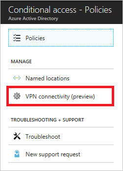
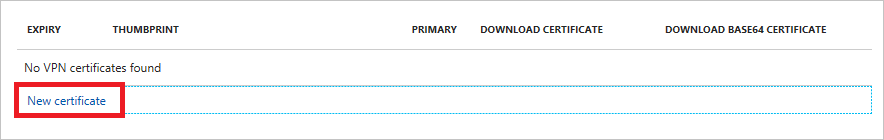
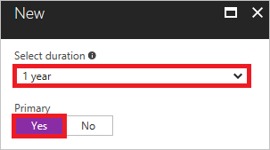
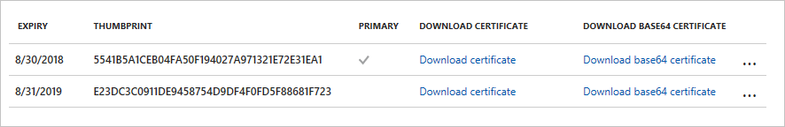
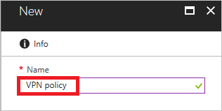
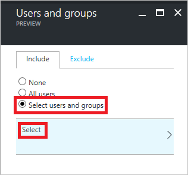
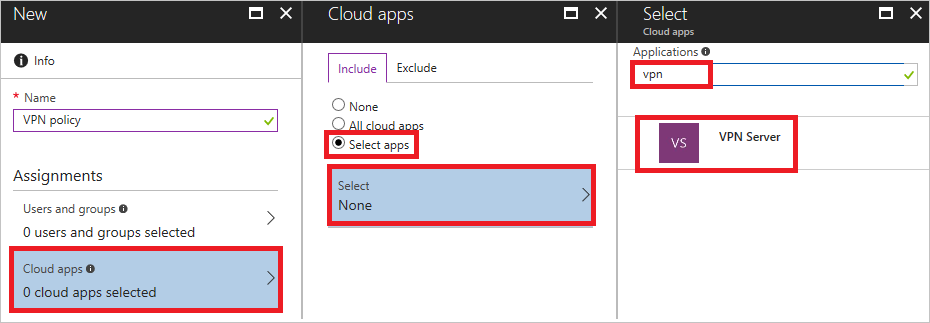
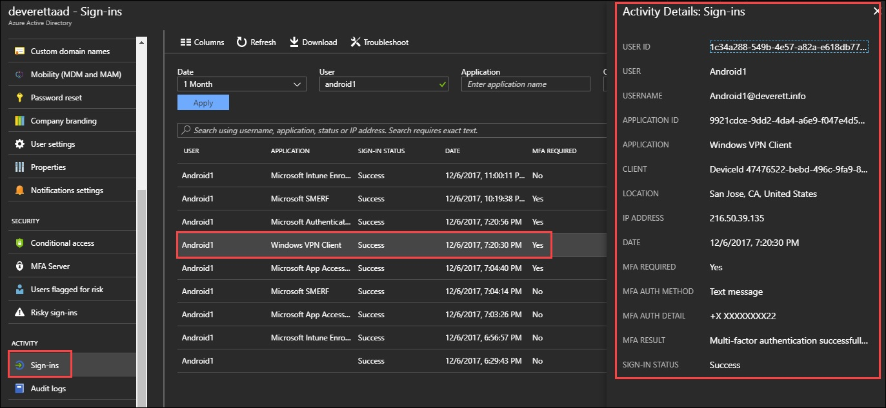

# Azure Active Directory conditional access for VPN connectivity (preview)

With [Azure Active Directory (Azure AD) conditional access](active-directory-conditional-access-azure-portal.md), you can fine-tune how authorized users access your resources. With Azure AD conditional access for virtual private network (VPN) connectivity, you can help protect your VPN connections.

To configure conditional access for VPN connectivity, you must complete the following steps: 

1. Create Root Certificates for VPN Authentication with Azure AD.
2. Create a Server Authentication Certificate that supports IKEv2.
3. Request a Server Authentication Certificate for IKEv2.
4. Configure Routing and Remote Access and Network Policy Server.
5. Verify that the Standard VPN works.
6. Remove Weak Authentication Methods.
7. Configure EAP-TLS to Ignore Certificate Revocation List (CRL) Checking.
8. Configure your Conditional Access Policy.
9. Create OMA-DM based VPNv2 Profiles to Windows 10 Devices
10. Configure your VPN Client.


## Before you begin

This topic assumes that you're familiar with the following topics:

- [Conditional access in Azure Active Directory](active-directory-conditional-access-azure-portal.md)
- [VPN and conditional access](https://docs.microsoft.com/windows/access-protection/vpn/vpn-conditional-access)


To gain insights on how Microsoft implements this feature, see [Enhancing remote access in Windows 10 with an automatic VPN profile](https://www.microsoft.com/itshowcase/Article/Content/894/Enhancing-remote-access-in-Windows-10-with-an-automatic-VPN-profile).


## Prerequisites

To configure Azure Active Directory conditional access for VPN connectivity, you need to have a VPN server configured.  For more information, see the [Always On VPN Deployment Guide](https://docs.microsoft.com/en-us/windows-server/remote/remote-access/vpn/always-on-vpn/deploy/always-on-vpn-deploy).


## Step 1: Create Root Certificates for VPN Authentication with Azure AD 

This step configures root certificates for VPN authentication with Azure AD. To configure conditional access for VPN connectivity, you need to:

1. Create a VPN certificate in the Azure portal (you can create more than one certificate).
2. Download the VPN certificate.
2. Deploy the certificate to your VPN server.

Azure AD uses the VPN certificate to sign certificates issued to Windows 10 clients when authenticating to Azure AD for VPN connectivity. The certificate marked as **Primary** is the Issuer that Azure AD uses. The token that the Windows 10 client requests are a certificate that it then presents to the application, which in this case is the VPN server.

In the Azure portal, you can create two certificates to manage the transition when one certificate is about to expire. When you create a certificate, you can choose whether it is the primary certificate, which is used during the authentication to sign the certificate for the connection.

To create a VPN certificate:

1. Sign in to your [Azure portal](https://portal.azure.com) as a global administrator.

2. On the left menu, click **Azure Active Directory**. 

    

3. On the **Azure Active Directory** page, in the **Manage** section, click **Conditional access**.

    

4. On the **Conditional access** page, in the **Manage** section, click **VPN connectivity (preview)**.

    

5. On the **VPN connectivity** page, click **New certificate**.

    

6. On the **New** page, perform the following steps:

    

    a. For **Select duration**, select either 1 or 2 years. You can add up to two certificates to manage transitions when the certificate is about to
        expire. You can choose which one is the primary (the one used during authentication to sign the certificate for connectivity).

    b. For **Primary**, select **Yes**.

    c. Click **Create**.

7. On the **VPN connectivity** page, click **Download certificate**. 
   
    

    >[!NOTE]
    >The **Download base64 certificate** option is available for some configurations that require base64 certificates for deployment. 

8. On your VPN server, add the downloaded certificate as a *trusted root CA for VPN authentication*.

9. (Optional) For Windows RRAS-based deployments, on your NPS server, add the root certificate into the *Enterprise NTauth* store by running the following commands:

    1.  `certutil -dspublish <CACERT> RootCA`

    2.  `certutil -dspublish <CACERT> NtAuthCA`

10. On the VPN Server, sign in as **Enterprise Administrator**, open Windows PowerShell as **Administrator**, and run the following commands to import the root certificates to the VPN server and VPN clients:

    |Command  |Description  |  
    |---------|-------------| 
    |`certutil -dspublish -f VpnCert.cer RootCA`     |Creates two **Microsoft VPN root CA gen 1** containers under the **CN=AIA** and **CN=Certification Authorities** containers, and publishes each root certificate as a value on the _cACertificate_ attribute of both **Microsoft VPN root CA gen 1** containers.|  
    |`certutil -dspublish -f VpnCert.cer NTAuthCA`   |Creates one **CN=NTAuthCertificates** container under the **CN=AIA** and **CN=Certification Authorities** containers, and publishes each root certificate as a value on the _cACertificate_ attribute of the **CN=NTAuthCertificates** container. |  
    |`gpupdate /force`     |Expedites adding the root certificates to the Windows server and client computers.  |
    
    These commands publish the root certificate to the **CN=Certification Authorities** and **CN=AIA** containers in the Configuration naming context. Once the CN=Configuration naming context has replicated to all domain controllers in the forest, Windows 10 clients add the root certificate to their trusted root authorities container when Group Policy refreshes.

11.  Verify that the root certificates are present and show as trusted:

    1.  On the VPN server, in the Start menu, type **pkiview.msc** to open the Enterprise PKI dialog.

    2.  Right-click **Enterprise PKI** and select **Manage AD Containers**.

    3.  Verify that each Microsoft VPN root CA gen 1 certificate is present under:

        -   NTAuthCertificates

        -   AIA Container

        -   Certificate Authorities Container

## Step 2: [Create a Customer Server Authentication Template that Supports IKEv2](https://docs.microsoft.com/en-us/windows-server/remote/remote-access/vpn/always-on-vpn/deploy/vpn-deploy-server-infrastructure#create-the-vpn-server-authentication-template)

With this step, you can configure a new Server Authentication template for your VPN server.

Adding the IP Security (IPsec) IKE Intermediate application policy allows the server to filter certificates if more than one certificate is available with the Server Authentication extended key usage. 

## Step 3: [Request a Server Authentication Certificate for IKEv2](https://docs.microsoft.com/en-us/windows-server/remote/remote-access/vpn/always-on-vpn/deploy/vpn-deploy-server-infrastructure#enroll-and-validate-the-server-certificates)

## [Step 4: Configure Routing and Remote Access and Network Policy Server](https://docs.microsoft.com/en-us/windows-server/remote/remote-access/vpn/always-on-vpn/deploy/vpn-deploy-ras#configure-remote-access-as-a-vpn-server)
In this step, you configure Remote Access VPN to allow IKEv2 VPN connections, deny connections from other VPN protocols, and assign a static IP address pool for the issuance of IP addresses to connecting authorized VPN clients.

## Step 5: Verify that the Standard VPN works
In this step, configure the template VPN profile on a domain-joined client computer. The type of user account you use (that is, standard user or administrator) for this part of the process does not matter.

1.  Sign in to a domain-joined client computer as a member of the **VPN Users** group.

2.  On the Start menu, type **VPN**, and press Enter.

3.  In the details pane, click **Add a VPN connection**.

4.  In the VPN Provider list, click **Windows (built-in)**.

5.  In Connection Name, enter the name of the VPN profile.

6.  In Server name or address, enter the **external** FQDN of your VPN server \(for example, **vpn.contoso.com**\).

7. In VPN type, select **Automatic**.

8. In Type of sign-in info, select **User name and password**.

9. In User name (optional), enter the user name.

10. In Password, enter the user's password.

11. Click **Save**.

12. In the Setting window, click the VPN connection you just added and click **Connect**.

## Step 6: Remove Weak Authentication Methods
If Standard VPN is verified to be working correctly, proceed with removing weak authentication protocols and enforcing Certificate Authentication using Protected Extensible Authentication Protocol (PEAP). 

>[!IMPORTANT]
>IKEv2 gateway enforcement can be configured in NPS to prevent connections from being allowed from anything but certificates that chain to the **AAD Conditional Access** root certificate by adding a Vendor Specific setting to the Network Policy. The attribute is _Allowed-Certificate-OID_, and should contain the AAD Conditional Access OID. Doing this will prevent client certificates that do not have the AAD Conditional Access OID from satisfying the request. Alternatively, customers that happen to be using RRAS as their gateway can implement gateway enforcement against RRAS, if they prefer not to do it in NPS. See Gateway Enforcement in this article. 

**Procedure**
1. In the Routing and Remote Access MMC, expand **Policies\\Network Policies**.

3.  Right-\click the **Connections to Microsoft Routing and Remote Access Server** network policy and select **Properties**.

4.  Click the **Constraints** tab and do the following:

    a. Under EAP Types, select the **Microsoft Encrypted Authentication version 2 (MS-CHAPv2)** check box and click **Remove**.
    
    b. Under EAP Types, click **Add**, select the **Microsoft: Protected EAP \(PEAP\)** check box, and click **OK**.

    c. Select **Microsoft: Protected EAP \(PEAP\)** and click **Move Up** to place it at the top of the order.

    d. Select **Microsoft: Protected EAP \(PEAP\)** again and click **Edit**.

    e. On the Add EAP page, click **Add**.

    f. Select **Smart Card or other certificate**, and click **OK**.

    g. Select **Smart Card or other certificate** and click **Move Up** to place it at the top of the order.

    g.  For everything under Less secure authentication methods, clear all the check boxes, and click **OK**.

8.  (Optional) If you have implemented [Gateway Enforcement](#gateway-enforcement), do the following:

    a. Under Vendor Specific, click **Add**.
    b. Select the first option of **Allowed-Certificate-OID** and click **Add**.
    c. Paste the AAD Conditional Access OID as the attribute value and click **OK** twice.

9. Click **Close** and click **Apply**.

## Step 7: Configure EAP-TLS to Ignore Certificate Revocation List (CRL) Checking
>[!IMPORTANT]
>Failure to implement this registry change will cause IKEv2 connections using cloud certificates with PEAP to fail, but IKEv2 connections using Client Auth certificates issued from the on-premises CA will work.

An EAP-TLS client cannot connect unless the NPS server completes a revocation check of the certificate chain (including the root certificate) of the client and verifies that certificates have been revoked. Cloud certificates issued to the user by Azure AD do not have a CRL because they are short-lived certificates with a lifetime of one hour. EAP on NPS needs to be configured to ignore the absence of a CRL. By default, IgnoreNoRevocationCheck is set to 0 (disabled) by default. You can add IgnoreNoRevocationCheck and set it to 1 to allow authentication of clients when the certificate does not include CRL distribution points. 

Since the authentication method is EAP-TLS, this registry value is only needed under EAP\13. If other EAP authentication methods are used, then the registry value should be added under those as well. 

**Procedure**

1. Open **regedit.exe** on the NPS server.
2. Navigate to **HKEY_LOCAL_MACHINE\SYSTEM\CurrentControlSet\Services\RasMan\PPP\EAP\13**.
3. Click **Edit > New** and select **DWORD (32-bit) Value** and type **IgnoreNoRevocationCheck**.
4. Double-click **IgnoreNoRevocationCheck** and set the Value data to **1**.
5. Click **OK** and reboot the server. Restarting the RRAS and NPS services will not suffice.

For more information, see [How to Enable or Disable Certificate Revocation Checking (CRL) on Clients](https://technet.microsoft.com/en-us/library/bb680540.aspx).

>[!NOTE]
>In secure environments, the TlsVersion registry setting might be needed to specify on the client to negotiate the correct version of TLS. For more information, see [KB3121002](https://support.microsoft.com/en-us/help/3121002/windows-10-devices-can-t-connect-to-an-802-1x-environment).


|Registry Path  |EAP Extension  |
|---------|---------|
|HKLM\SYSTEM\CurrentControlSet\Services\RasMan\PPP\EAP\13     |EAP-TLS         |
|HKLM\SYSTEM\CurrentControlSet\Services\RasMan\PPP\EAP\25     |PEAP         |
|HKLM\SYSTEM\CurrentControlSet\Services\RasMan\PPP\EAP\26     |EAP-MSCHAP v2         |


## Step 8: Configure your Conditional Access Policy

This section provides you with instructions for configuring your conditional access policy for VPN connectivity.

After a root certificate has been created, the 'VPN connectivity' triggers the creation of the 'VPN Server' cloud application in the customer's tenant. Create a Conditional Access policy that is assigned to VPN users and set the **Cloud app** to **VPN Server**: 

- **Users**: All Users
- **Cloud App**: VPN Server
- **Grant (access control)**: 'Require multi-factor authentication'. Other controls can be used if desired.


1. On the **Conditional Access** page, in the toolbar on the top, click **Add**.

    

2. On the **New** page, in the **Name** box, type a name for your policy. For example, type **VPN policy**.

    

5. In the **Assignment** section, click **Users and groups**.

    

6. On the **Users and groups** page, perform the following steps:

    

    a. Click **Select users and groups**.

    b. Click **Select**.

    c. On the **Select** page, select your test user, and then click **Select**.

    d. On the **Users and groups** page, click **Done**.

7. On the **New** page, perform the following steps:

    

    a. In the **Assignments** section, click **Cloud apps**.

    b. On the **Cloud apps** page, click **Select apps**, and then click **Select**.

    c. On the **Select** page, in the **Applications** box, type **vpn**.

    d. Select **VPN Server**.

    e. Click **Select**.


13. On the **New** page, to open the **Grant** page, in the **Controls** section, click **Grant**.

    

14. On the **Grant** page, perform the following steps:

    

    a. Select **Require multi-factor authentication**.

    b. Click **Select**.

15. On the **New** page, under **Enable policy**, click **On**.

    

16. On the **New** page, click **Create**.

## Step 9: Create OMA-DM based VPNv2 Profiles to Windows 10 devices
In this step, you can use one of two methods. The first method is a managed deployment using Intune to deploy a VPN Device Configuration policy, which does not have an option for AutoVPN. The second method can be used for unmanaged environments using a PowerShell script that leverages the Common Information Model, which creates a WMI session in the user’s context. From this context, it then creates a new instance of the MDM_VPNv2_01 WMI class. 

VPNv2 profiles can also be created via SCCM, Intune or with a PowerShell Script using [VPNv2 CSP settings](https://docs.microsoft.com/en-us/windows/client-management/mdm/vpnv2-csp). 

### Managed Deployment using Intune
Customers that wish to use AutoVPN with Intune can configure Custom Device Configuration Profiles in Microsoft Intune. Cloud Identity Support engineers should engage a support engineer from the Mobility POD for assistance with Intune Device Configuration Policies. 

Everything discussed in this section is the minimum needed to make this work with Conditional Access. It does not cover Split Tunneling, Using WIP, creating custom Intune device configuration profiles to get AutoVPN working, or SSO. 

1.  In the Azure portal, navigate to **Intune**.
2.  Click **Device configuration** and select **Profiles**.
3.  Click **Create Profile**.
4.  In Name, enter a name for the VPN profile.
5.  In Platform, select **Windows 10 or later**.
6.  In Profile type, select **VPN**.
7.  Under Settings, for Conditional Access, set the **Conditional access for this VPN connection** to **Enabled**. Doing this sets `<DevideCompliance\><Enabled\>true<\/Enabled\>` in the VPNv2 profile, which tells the VPN clients to request an Azure AD Certificate. 
8. Under Settings, for Base VPN, verify or set the following settings:
    - **Connection name**: Enter a name for this connection. End users see this name when they browse their device for the list of available VPN connections.
    - **Servers**: Add one or more VPN servers by clicking **Add**.
    - **Description** and **IP Address or FQDN** values must align with the Subject Name in the VPN server's authentication certificate.
    - **Default server**: Set to **true** on one of the VPN servers listed. Doing this enables this server as the default server that devices use to establish the connection. Set only one server as the default.
    - **Connection type**: Set to **IKEv2**. If you set it to **Automatic**, the VPN client attempts all connection types.
    - **EAP XML\\TrustedRootCA**: Set the **\<TrustedRootCA>5a 89 fe cb 5b 49 a7 0b 1a 52 63 b7 35 ee d7 1c c2 68 be 4b <\/TrustedRootCA> with the thumbprint of the root certificate authority at the top of the chain of the Server Authentication certificate. Additional root certificates can be added by adding additional **\<TrustedRootCA><\/TrustedRootCA>** entries. If the CA that issued the Server Authentication certificate was an International authority, this is not the certificate thumbprint to use. It must be the root CA. **Do NOT** use the thumbprint of the cloud root certificate. 
    - **EAP XML\\TLSExtension**: Must be present and contain **\<EKUName>AAD Conditional Access<\/EKUName>** and **\<EKUOID>1.3.6.1.4.1.311.87<\/EKUOID>**. These values tell the VPN client which certificate in the user's store should be used to perform VPN authentication. This is required when more than one certificate is in the user's store. If EAP/TLS fails, the entire **\<TLSExtension>** can be removed for troubleshooting. However, there must not be any certificates in the user's certificate store other than cloud certificates. 
9.  Click **Create**. @Reviewer: This step is missing from the CSS wiki, and I'm not sure where it goes in this process. Is it after selecting VPN for the Profile type or does it happen in this sequence?
10. In Intune, under Device configuration, select the newly created device configuration profile.  
11. Select **Assignments**, under Include, click **Select groups to include**.
    >[!IMPORTANT]
    >Ensure that you have added the users to the Azure AD group that receives this policy on all Windows 10 devices.
12. Select the Azure AD group that receives this policy and click **Save**.

#### Force MDM Policy Sync on the Client
If the VPN profile does not show up on the client device, under Settings\\Network & Internet\\VPN, you can force MDM policy to sync.

1.  Sign in to a domain-joined client computer as a member of the **VPN Users** group.
2.  On the Start menu, type **account**, and press Enter.
3.  In the left navigation pane, click **Access work or school**.
4.  If you do not see **Connected to <\domain> MDM**, and you want to trigger synchronization manually, do the following:
    a. Press **Windows key + r**, and enter the following command to enable MDM Enrollment:```ms-device-enrollment:?mode=mdm```
    b. Enter the username that is logged on to the device that needs the VPN profile. 
5.  Under Access work or school, click **Connected to <\domain> MDM** and click **Info**.
6.  Click **Sync** and verify the VPN profile appears under Settings\\Network & Internet\\VPN.

#### Example EAP XML
The EAP XML sample below contains the minimum settings need to make this work with IKEv2. 

```XML
<EapHostConfig xmlns="http://www.microsoft.com/provisioning/EapHostConfig"><EapMethod><Type xmlns="http://www.microsoft.com/provisioning/EapCommon">25</Type><VendorId xmlns="http://www.microsoft.com/provisioning/EapCommon">0</VendorId><VendorType xmlns="http://www.microsoft.com/provisioning/EapCommon">0</VendorType><AuthorId xmlns="http://www.microsoft.com/provisioning/EapCommon">0</AuthorId></EapMethod><Config xmlns="http://www.microsoft.com/provisioning/EapHostConfig"><Eap xmlns="http://www.microsoft.com/provisioning/BaseEapConnectionPropertiesV1"><Type>25</Type><EapType xmlns="http://www.microsoft.com/provisioning/MsPeapConnectionPropertiesV1"><ServerValidation><DisableUserPromptForServerValidation>true</DisableUserPromptForServerValidation><ServerNames></ServerNames></ServerValidation><FastReconnect>true</FastReconnect><InnerEapOptional>false</InnerEapOptional><Eap xmlns="http://www.microsoft.com/provisioning/BaseEapConnectionPropertiesV1"><Type>13</Type><EapType xmlns="http://www.microsoft.com/provisioning/EapTlsConnectionPropertiesV1"><CredentialsSource><CertificateStore><SimpleCertSelection>true</SimpleCertSelection></CertificateStore></CredentialsSource><ServerValidation><DisableUserPromptForServerValidation>true</DisableUserPromptForServerValidation><ServerNames></ServerNames><TrustedRootCA>5a 89 fe cb 5b 49 a7 0b 1a 52 63 b7 35 ee d7 1c c2 68 be 4b </TrustedRootCA></ServerValidation><DifferentUsername>false</DifferentUsername><PerformServerValidation xmlns="http://www.microsoft.com/provisioning/EapTlsConnectionPropertiesV2">true</PerformServerValidation><AcceptServerName xmlns="http://www.microsoft.com/provisioning/EapTlsConnectionPropertiesV2">false</AcceptServerName><TLSExtensions xmlns="http://www.microsoft.com/provisioning/EapTlsConnectionPropertiesV2"><FilteringInfo xmlns="http://www.microsoft.com/provisioning/EapTlsConnectionPropertiesV3"><EKUMapping><EKUMap><EKUName>AAD Conditional Access</EKUName><EKUOID>1.3.6.1.4.1.311.87</EKUOID></EKUMap></EKUMapping><ClientAuthEKUList Enabled="true"><EKUMapInList><EKUName>AAD Conditional Access</EKUName></EKUMapInList></ClientAuthEKUList></FilteringInfo></TLSExtensions></EapType></Eap><EnableQuarantineChecks>false</EnableQuarantineChecks><RequireCryptoBinding>false</RequireCryptoBinding><PeapExtensions><PerformServerValidation xmlns="http://www.microsoft.com/provisioning/MsPeapConnectionPropertiesV2">false</PerformServerValidation><AcceptServerName xmlns="http://www.microsoft.com/provisioning/MsPeapConnectionPropertiesV2">false</AcceptServerName></PeapExtensions></EapType></Eap></Config></EapHostConfig>
```

### Unmanaged Deployment using Windows PowerShell
Customers that do not have management solutions like Intune or SCCM can use the script method outlined here. This method requires a configuration file. 

1. Change the following settings in the ProfileXML file (see full script below):

    |Settings to change  |Description  |
    |---------|---------|
    |**\<IssuerHash><\/IssuerHash>**    |This instance of \<IssuerHash> must contain no spaces. It contains a semicolon separated list of thumbprints for all root CAs that issued the Server Authentication certificates to the VPN servers, not subordinate/intermediate issuing CA thumbprints. <br><br>All instances of \<IssuerHash> outside of \<Sso> must contain spaces. It contains a semicolon separated list of thumbprints for all root CAs that issued the Server Authentication certificates to the VPN servers, not subordinate/intermediate issuing CA thumbprints.         |
    |**\<Servers><\/Servers>**           |This must contain a semicolon separated list of names for the VPN Servers. This should include all names that are included in the Subject Alternative Name of the Server Authentication certificates.          |
    |**\<DnsSuffix><\/DnsSuffix>**      |This must contain the FQDN of the DNS domain **\<DnsSuffix>corp.contoso.com<\/DnsSuffix>**          |
2. Save the ProfileXML file, for example, _TestVPN_.
3. Open PowerShell as **Administrator** and run `Set-ExecutionPolicy unrestricted`.
4. After running the script, test the VPN connection on the client device by verifying it in the Certificate snap-in:
    a.  On the Start menu, type **certmgr.msc**, and press Enter.
    b.  Verify that the **Microsoft VPN root CA gen 1** issues a certificate to the personal certificate store.
5. Examine the Sign-in logs in the Azure portal and observe the initial sign-in where MFA from the Windows VPN client took place.

    

>[!IMPORTANT]
>If this script is run more than once, make sure to increase the $Version number between each run to update the VPNv2 Profile. Failure to increase the $Version number results in a connection failure warning:  _The modem (or other connecting device) is already in use or is not configured properly_.


```PowerShell
$ProfileName = 'TestVPN'
$ProfileNameEscaped = $ProfileName -replace ' ', '%20'

$Version = 201710170002

$ProfileXML = '<VPNProfile>
  <RememberCredentials>true</RememberCredentials>
  <AlwaysOn>true</AlwaysOn>
  <DnsSuffix>corp.deverett.info</DnsSuffix>
  <TrustedNetworkDetection>corp.deverett.info</TrustedNetworkDetection>
  <DeviceCompliance>
    <Enabled>true</Enabled>
    <Sso>
      <Enabled>false</Enabled>
      <Eku>1.3.6.1.5.5.7.3.2</Eku>
      <IssuerHash>‎5a89fecb5b49a70b1a5263b735eed71cc268be4b</IssuerHash>
    </Sso>
  </DeviceCompliance>
  <NativeProfile>
    <Servers>deWS2012R2VPN.corp.deverett.info;deWS2012R2VPN</Servers>
    <RoutingPolicyType>SplitTunnel</RoutingPolicyType>
    <Authentication>
      <UserMethod>Eap</UserMethod>
      <MachineMethod>Eap</MachineMethod>
      <Eap>
        <Configuration>
          <EapHostConfig xmlns="http://www.microsoft.com/provisioning/EapHostConfig">
            <EapMethod>
              <Type xmlns="http://www.microsoft.com/provisioning/EapCommon">25</Type>
              <VendorId xmlns="http://www.microsoft.com/provisioning/EapCommon">0</VendorId>
              <VendorType xmlns="http://www.microsoft.com/provisioning/EapCommon">0</VendorType>
              <AuthorId xmlns="http://www.microsoft.com/provisioning/EapCommon">0</AuthorId>
            </EapMethod>
            <Config xmlns="http://www.microsoft.com/provisioning/EapHostConfig">
              <Eap xmlns="http://www.microsoft.com/provisioning/BaseEapConnectionPropertiesV1">
                <Type>25</Type>
                <EapType xmlns="http://www.microsoft.com/provisioning/MsPeapConnectionPropertiesV1">
                  <ServerValidation>
                    <DisableUserPromptForServerValidation>true</DisableUserPromptForServerValidation>
                    <ServerNames></ServerNames>
                    <TrustedRootCA>5a 89 fe cb 5b 49 a7 0b 1a 52 63 b7 35 ee d7 1c c2 68 be 4b </TrustedRootCA>
                  </ServerValidation>
                  <FastReconnect>true</FastReconnect>
                  <InnerEapOptional>false</InnerEapOptional>
                  <Eap xmlns="http://www.microsoft.com/provisioning/BaseEapConnectionPropertiesV1">
                    <Type>13</Type>
                    <EapType xmlns="http://www.microsoft.com/provisioning/EapTlsConnectionPropertiesV1">
                      <CredentialsSource>
                        <CertificateStore>
                          <SimpleCertSelection>true</SimpleCertSelection>
                        </CertificateStore>
                      </CredentialsSource>
                      <ServerValidation>
                        <DisableUserPromptForServerValidation>true</DisableUserPromptForServerValidation>
                        <ServerNames></ServerNames>
                        <TrustedRootCA>5a 89 fe cb 5b 49 a7 0b 1a 52 63 b7 35 ee d7 1c c2 68 be 4b </TrustedRootCA>
                      </ServerValidation>
                      <DifferentUsername>false</DifferentUsername>
                      <PerformServerValidation xmlns="http://www.microsoft.com/provisioning/EapTlsConnectionPropertiesV2">true</PerformServerValidation>
                      <AcceptServerName xmlns="http://www.microsoft.com/provisioning/EapTlsConnectionPropertiesV2">false</AcceptServerName>
                      <TLSExtensions xmlns="http://www.microsoft.com/provisioning/EapTlsConnectionPropertiesV2">
                        <FilteringInfo xmlns="http://www.microsoft.com/provisioning/EapTlsConnectionPropertiesV3">
                          <EKUMapping>
                            <EKUMap>
                              <EKUName>AAD Conditional Access</EKUName>
                              <EKUOID>1.3.6.1.4.1.311.87</EKUOID>
                            </EKUMap>
                          </EKUMapping>
                          <ClientAuthEKUList Enabled="true">
                            <EKUMapInList>
                              <EKUName>AAD Conditional Access</EKUName>
                            </EKUMapInList>
                          </ClientAuthEKUList>
                        </FilteringInfo>
                      </TLSExtensions>
                    </EapType>
                  </Eap>
                  <EnableQuarantineChecks>false</EnableQuarantineChecks>
                  <RequireCryptoBinding>true</RequireCryptoBinding>
                  <PeapExtensions>
                    <PerformServerValidation xmlns="http://www.microsoft.com/provisioning/MsPeapConnectionPropertiesV2">true</PerformServerValidation>
                    <AcceptServerName xmlns="http://www.microsoft.com/provisioning/MsPeapConnectionPropertiesV2">false</AcceptServerName>
                  </PeapExtensions>
                </EapType>
              </Eap>
            </Config>
          </EapHostConfig>
        </Configuration>
      </Eap>
    </Authentication>
  </NativeProfile>
  <Route>
    <Address>10.0.0.0</Address>
    <PrefixSize>8</PrefixSize>
    <Metric>1</Metric>
  </Route>
</VPNProfile>'

###########################
###########################
###########################
$EventLogName = 'TestVPN Setup'
$EventSourceName = "$ProfileName  " + "$Version"
New-Eventlog -LogName "$EventLogName" -Source "$EventSourceName" -ErrorAction SilentlyContinue
$Message = 'Start.'
Write-EventLog -LogName "$EventLogName" -Source "$EventSourceName" -Message "$Message"  -Id 100 -Category 0 -EntryType Information
Write-Host "$Message"


###########################
# Identify OS build number
###########################
try
{
    $OsInfo = Get-WmiObject -class Win32_OperatingSystem
    $OsBuild = $OsInfo.BuildNumber
    if ($OsBuild -lt '14332')
    {
        $Message = "$ProfileName is not available.  OS build must be at least 14332."
        Write-EventLog -LogName "$EventLogName" -Source "$EventSourceName" -Message "$Message" -Id 202 -Category 0 -EntryType Warning
        Write-Host "$Message"
        exit
    } else {
        $Message = "$ProfileName is available.  OS build is at least 14332."
        Write-EventLog -LogName "$EventLogName" -Source "$EventSourceName" -Message "$Message" -Id 200 -Category 0 -EntryType Information
        Write-Host "$Message"
    }
}
catch [Exception]
{
    $Message = "Unable to obtain OS build number: $_"
    Write-EventLog -LogName "$EventLogName" -Source -Source "$EventSourceName" -Message "$Message" -Id 201 -Category 0 -EntryType Error
    Write-Host "$Message"
    exit
}


###########################
###########################
###########################
$ProfileXML = $ProfileXML -replace '<', '&lt;'
$ProfileXML = $ProfileXML -replace '>', '&gt;'
$ProfileXML = $ProfileXML -replace '"', '&quot;'

$nodeCSPURI = './Vendor/MSFT/VPNv2'
$namespaceName = "root\cimv2\mdm\dmmap"
$className = "MDM_VPNv2_01"

###########################
# Get user SID
###########################
try 
{
    $SidValue = (whoami /user)[6].Split()[1]

    $Message = "User SID is $SidValue."
    Write-EventLog -LogName "$EventLogName" -Source "$EventSourceName" -Message "$Message" -Id 300 -Category 0 -EntryType Information
    Write-Host "$Message"
}
catch [Exception]
{
    $Message = "Unable to get user SID. User may be logged on over Remote Desktop: $_"
    Write-EventLog -LogName "$EventLogName" -Source "$EventSourceName" -Message "$Message" -Id 302 -Category 0 -EntryType Warning
    Write-Host "$Message"
    exit
}

$session = New-CimSession
$options = New-Object Microsoft.Management.Infrastructure.Options.CimOperationOptions
$options.SetCustomOption('PolicyPlatformContext_PrincipalContext_Type', 'PolicyPlatform_UserContext', $false)
$options.SetCustomOption('PolicyPlatformContext_PrincipalContext_Id', "$SidValue", $false)

###########################
# Verify current VPN profile version
###########################
$MsitAutoVpnVersionPath = "hklm:\software\MicrosoftIT\$ProfileName\" + $SidValue
$MsitAutoVpnVersion = (Get-ItemProperty -Path "$MsitAutoVpnVersionPath" -ErrorAction SilentlyContinue).MsitAutoVpnVersion

if ($Version -le $MsitAutoVpnVersion)
{
    $existingInstances = $session.EnumerateInstances($namespaceName, $className, $options)
    foreach ($existingInstance in $existingInstances)
    {
        $InstanceId = $existingInstance.InstanceID
        if ("$InstanceId" -like "$ProfileNameEscaped")
        {
            $Message = "User already has latest version of $ProfileName profile."
            Write-EventLog -LogName "$EventLogName" -Source "$EventSourceName" -Message "$Message" -Id 410 -Category 0 -EntryType Information
            Write-Host "$Message"
            exit
        }
    }
} 
$Message = "$ProfileName profile either does not exist or is out-of-date."
Write-EventLog -LogName "$EventLogName" -Source "$EventSourceName" -Message "$Message" -Id 400 -Category 0 -EntryType Information
Write-Host "$Message"

###########################
# Delete old VPN profile
###########################
try
{
    $deleteInstances = $session.EnumerateInstances($namespaceName, $className, $options)
    foreach ($deleteInstance in $deleteInstances)
    {
        $InstanceId = $deleteInstance.InstanceID
        if ("$InstanceId" -eq "$ProfileNameEscaped")
        {
            $session.DeleteInstance($namespaceName, $deleteInstance, $options)
            $Message = "Removed $ProfileName profile $InstanceId"
            Write-EventLog -LogName "$EventLogName" -Source "$EventSourceName" -Message "$Message" -Id 500 -Category 0 -EntryType Information
            Write-Host "$Message"
        } else {
            $Message = "Ignoring existing VPN profile $InstanceId"
            Write-EventLog -LogName "$EventLogName" -Source "$EventSourceName" -Message "$Message" -Id 510 -Category 0 -EntryType Information
            Write-Host "$Message"
        }
    }
}
catch [Exception]
{
    $Message = "Unable to remove existing outdated instance(s) of $ProfileName profile: $_"
    Write-EventLog -LogName "$EventLogName" -Source "$EventSourceName" -Message "$Message" -Id 501 -Category 0 -EntryType Error
    Write-Host "$Message"
    exit
}

###########################
# Create new VPN profile
###########################
try
{
    $newInstance = New-Object Microsoft.Management.Infrastructure.CimInstance $className, $namespaceName
    $property = [Microsoft.Management.Infrastructure.CimProperty]::Create("ParentID", "$nodeCSPURI", 'String', 'Key')
    $newInstance.CimInstanceProperties.Add($property)
    $property = [Microsoft.Management.Infrastructure.CimProperty]::Create("InstanceID", "$ProfileNameEscaped", 'String', 'Key')
    $newInstance.CimInstanceProperties.Add($property)
    $property = [Microsoft.Management.Infrastructure.CimProperty]::Create("ProfileXML", "$ProfileXML", 'String', 'Property')
    $newInstance.CimInstanceProperties.Add($property)

    $session.CreateInstance($namespaceName, $newInstance, $options)
    $Message = "Created $ProfileName profile."
    Write-EventLog -LogName "$EventLogName" -Source "$EventSourceName" -Message "$Message" -Id 600 -Category 0 -EntryType Information
    Write-Host "$Message"
}
catch [Exception]
{
    $Message = "Unable to create $ProfileName profile: $_"
    Write-EventLog -LogName "$EventLogName" -Source "$EventSourceName" -Message "$Message" -Id 601 -Category 0 -EntryType Error
    Write-Host "$Message"
    exit
}

###########################
# Update profile version number
###########################
try
{
    New-Item -Path "$MsitAutoVpnVersionPath" -Force
    Set-ItemProperty -Path "$MsitAutoVpnVersionPath" -Name 'MsitAutoVpnVersion' -Value $Version
    $Message = "Updated $ProfileName version."
    Write-EventLog -LogName "$EventLogName" -Source "$EventSourceName" -Message "$Message" -Id 700 -Category 0 -EntryType Information
    Write-Host "$Message"
}
catch [Exception]
{
    $Message = "Unable to update $ProfileName version: $_"
    Write-EventLog -LogName "$EventLogName" -Source "$EventSourceName" -Message "$Message" -Id 701 -Category 0 -EntryType Error
    Write-Host "$Message"
    exit
}


$Message = "Complete."
Write-EventLog -LogName "$EventLogName" -Source "$EventSourceName" -Message "$Message" -Id 800 -Category 0 -EntryType Information
Write-Host "$Message"
```

## Step 10: Configure your VPN Client 
@Reviewer: The link below doesn't seem to give much information on what to do to configure the VPN client; it seems more conceptual than procedural. Also, if there is a procedural step, it is only Intune.

In this step, you configure your VPN client connectivity profile as outlined in [VPN and conditional access](https://docs.microsoft.com/windows/access-protection/vpn/vpn-conditional-access).


## Next steps

To gain insights into how Microsoft implements this feature, see [Enhancing remote access in Windows 10 with an automatic VPN profile](https://www.microsoft.com/itshowcase/Article/Content/894/Enhancing-remote-access-in-Windows-10-with-an-automatic-VPN-profile).    

