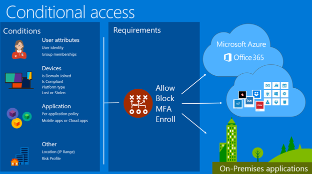

<properties
	pageTitle="Azure Active Directory Conditional Access | Microsoft Azure"  
    description="With conditional access control, Azure Active Directory checks the specific conditions you pick when authenticating the user and before allowing access to the application. Once those conditions are met, the user is authenticated and allowed access to the application."  
    services="active-directory" 
	keywords="conditional access to apps, conditional access with Azure AD, secure access to company resources, conditional access policies" 
	documentationCenter=""
	authors="markusvi"
	manager="femila"
	editor=""/>

<tags
	ms.service="active-directory"
	ms.devlang="na"
	ms.topic="article"
    ms.tgt_pltfrm="na"
    ms.workload="identity" 
	ms.date="07/26/2016"
	ms.author="markvi"/>

# Azure Active Directory Conditional Access   
  
Securing access to company resources is important to every organization. With the advent of cloud services and mobile devices, the way in which users access company resources has significantly changed. This requires a new approach to security.  
  
## Why conditional access?  

The conditional access control capabilities in Azure Active Directory offers simple ways for companies to secure  resources in the cloud and on-premises. Conditional access policies can be used to help protect against the risk of stolen and phished credentials, by requiring multi-factor authentication, as well as helping to keep company data safe, by requiring an Intune managed device granting access to sensitive services. 

## Licensing Requirements

Conditional access is a feature of [Azure AD Premium](http://www.microsoft.com/identity).  All users who access an application with conditional access policy applied, must have an Azure AD Premium license. You can learn more about usage with the [Unlicensed User report](https://aka.ms/utc5ix).

## How is conditional access control enforced?  

With conditional access control, Azure Active Directory checks the specific conditions you choose when authenticating a user, before allowing access to an application. Once these access requirements  are met, the user is authenticated and allowed access to the application.  
   
 

## Conditions
  
- **Group membership**: You can control the level of access to a user based on their membership to a group.

- **Location**: You can use the user location to trigger MFA and block controls when a user is not on a trusted network. 

- **Device platform**: You can use device platform type, such as iOS, Android, Windows Mobile and Windows as a conditions for applying policy.

- **Device enabled**: Device enabled / disabled state is validated during device policy evaluation. By disabling a lost or stolen device in the directory, it can no longer be used to satisfy policy requirements.

- **Sign-in and user risk**: Conditional Access risk policies are available with Azure AD Identity Protection and provide advance protection based on risk events and unusual sign-in activities. 

## Controls
   
- **Multi factor authentication (MFA)**: You can require strong authentication with MFA. MFA can be provided by Azure MFA or an on premise MFA provider, using ADFS. MFA authentication helps protect your resources from being accessed by an unauthorized user who has gain access to the username and password of a valid user. 

- **Block**: Access may be applied under conditions like user location. For example, blocking access when a user is not on a trusted network. 

- **Enrolled / Compliant devices**: At the device level, you can set policies that enforce that only Mobile Device Management (MDM) enrolled and compliant devices are allowed access. Microsoft Intune is used to validate the device is enrolled and compliant. The device level conditional access then ensures that only devices that are compliant with MDM policy are allowed access.  
 

## Applications

- The level of access that you can set using these policies can be applied to applications and services in the cloud or on-premises. Policy is directly applied to the web site or service. The policy is then enforced for browser access as well as applications accessing the service. The list of services policy can be applied to can be found here.

  
## Conditional access - a content map  
The following content map lists documents that you need to refer to learn more about enabling conditional access in your current deployment

### MFA and Location policies

- [Getting started with conditional access to Azure AD connected apps based on group, location, and MFA policies](active-directory-conditional-access-azuread-connected-apps.md)
- [What kind of applications are supported](active-directory-conditional-access-supported-apps.md)

### Device policies

[Help protect your data requiring Microsoft Intune](https://docs.microsoft.com/intune/deploy-use/use-remote-wipe-to-help-protect-data-using-microsoft-intune)

### Protecting resources based on sign-in risk

[Azure AD Identity Protection](active-directory-identityprotection.md)

### Additional Info

- [Conditional Access FAQs](active-directory-conditional-faqs.md)
- [Technical reference](active-directory-conditional-access-technical-reference.md)

