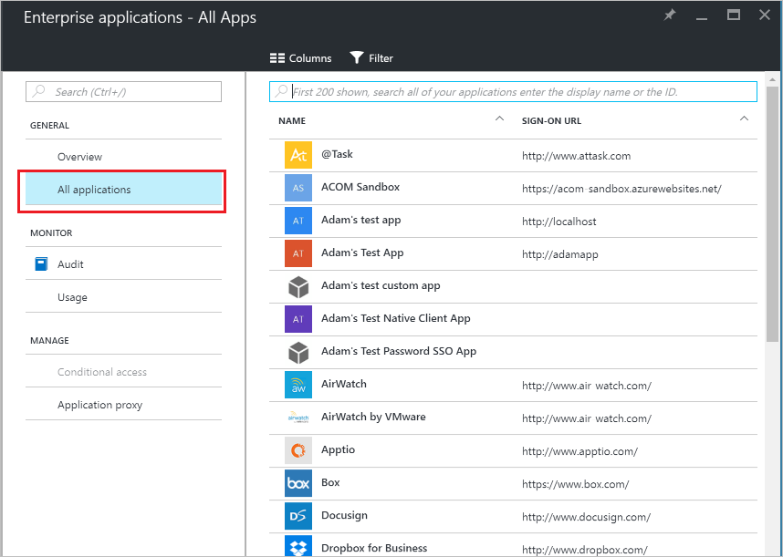

<properties
	pageTitle="Allow access to an enterprise app to a user or group not assigned to the app in Azure Active Directory | Microsoft Azure"
	description="How to allow a user who is not assigned access to an application to sign in using existing credentials"
	services="active-directory"
	documentationCenter=""
	authors="curtand"
	manager="femila"
	editor=""/>

<tags
	ms.service="active-directory"
	ms.workload="identity"
	ms.tgt_pltfrm="na"
	ms.devlang="na"
	ms.topic="article"
	ms.date="08/19/2016"
	ms.author="curtand"/>

# Allow access to an enterprise app to a user or group not assigned to the app

It's easy to allow a user who is not assigned access to an application to sign in using existing credentials in Azure Active Directory (Azure AD). You must have the appropriate permissions to manage the enterprise app. In the current preview, you must be global admin for the directory.

## How do I allow unassigned access?

1.  Sign in to the [Azure portal](https://portal.azure.com) with an account that's a global admin for the directory.

2.  Select **More services**, enter Active Directory in the text box, and then select **Enter**.

3. On the **Azure Active Directory - *directoryname*** blade (that is, the Azure AD blade for the directory you are managing), select **Enterprise apps**.

    

4. On the **Enterprise applications** blade, select **All applications**. You'll see a list of the apps you can manage.

  

5. On the **Enterprise applications - All apps** blade, select an app.

6. On the ***appname*** blade (that is, the blade with the name of the selected app in the title), select **Properties**.

	

7. On the ***appname*** **- Properties** blade, select **No** for **User assignment required?**.

8. Select the **Save** command.

## Next steps

- [See all of my groups](active-directory-groups-view-azure-portal.md)
- [Assign a user or group to an enterprise app](active-directory-coreapps-assign-user-azure-portal.md)
- [Remove a user or group assignment from an enterprise app](active-directory-coreapps-remove-assignment-user-azure-portal.md)
- [Disable user sign-ins for an enterprise app](active-directory-coreapps-disable-app-azure-portal.md)
- [Change the name or logo of an enterprise app](active-directory-coreapps-change-app-logo-azure-portal.md)
