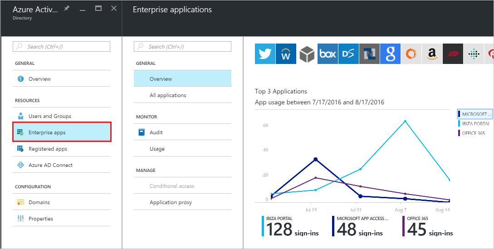
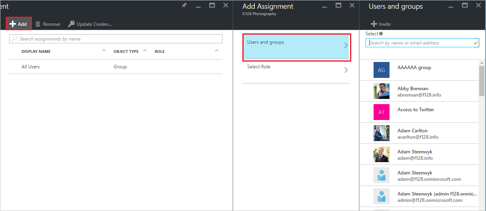

# Assign a user or group to an enterprise app in Azure Active Directory
It's easy to assign a user or a group to your enterprise applications in Azure Active Directory (Azure AD). You must have the appropriate permissions to manage the enterprise app, and you must be global admin for the directory.

## How do I assign user access to an enterprise app?
1. Sign in to the [Azure portal](https://portal.azure.com) with an account that's a global admin for the directory.
2. Select **More services**, enter Azure Active Directory in the text box, and then select **Enter**.
3. On the **Azure Active Directory - *directoryname*** blade (that is, the Azure AD blade for the directory you are managing), select **Enterprise applications**.

    
4. On the **Enterprise applications** blade, select **All applications**. You'll see a list of the apps you can manage.
5. On the **Enterprise applications - All applications** blade, select an app.
6. On the ***appname*** blade (that is, the blade with the name of the selected app in the title), select **Users & Groups**.

    
7. On the ***appname*** **- User & Group Assignment** blade, select the **Add** command.
8. On the **Add Assignment** blade, select **Users and groups**.

    
9. On the **Users and groups** blade, select one or more users or groups from the list and then select the **Select** button at the bottom of the blade.
10. On the **Add Assignment** blade, select **Role**. Then, on the **Select Role** blade, select a role to apply to the selected users or groups, and then select the **OK** button at the bottom of the blade.
11. On the **Add Assignment** blade, select the **Assign** button at the bottom of the blade. The assigned users or groups will have the permissions defined by the selected role for this enterprise app.

## Next steps
* [See all of my groups](active-directory-groups-view-azure-portal.md)
* [Remove a user or group assignment from an enterprise app](active-directory-coreapps-remove-assignment-azure-portal.md)
* [Disable user sign-ins for an enterprise app](active-directory-coreapps-disable-app-azure-portal.md)
* [Change the name or logo of an enterprise app](active-directory-coreapps-change-app-logo-user-azure-portal.md)
