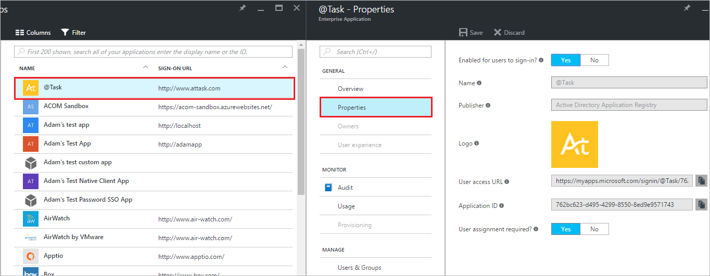

# Disable user sign-ins for an enterprise app in Azure Active Directory
It's easy to disable an enterprise application so that no users may sign in to it in Azure Active Directory (Azure AD). You must have the appropriate permissions to manage the enterprise app, and you must be global admin for the directory.

## How do I disable user sign-ins?
1. Sign in to the [Azure portal](https://portal.azure.com) with an account that's a global admin for the directory.
2. Select **More services**, enter **Azure Active Directory** in the text box, and then select **Enter**.
3. On the **Azure Active Directory** -  ***directoryname*** blade (that is, the Azure AD blade for the directory you are managing), select **Enterprise applications**.

    
4. On the **Enterprise applications** blade, select **All applications**. You see a list of the apps you can manage.
5. On the **Enterprise applications - All applications** blade, select an app.
6. On the ***appname*** blade (that is, the blade with the name of the selected app in the title), select **Properties**.

    
7. On the ***appname*** - **Properties** blade, select **No** for **Enabled for users to sign-in?**.
8. Select the **Save** command.

## Next steps
* [See all my groups](active-directory-groups-view-azure-portal.md)
* [Assign a user or group to an enterprise app](active-directory-coreapps-assign-user-azure-portal.md)
* [Remove a user or group assignment from an enterprise app](active-directory-coreapps-remove-assignment-azure-portal.md)
* [Change the name or logo of an enterprise app](active-directory-coreapps-change-app-logo-user-azure-portal.md)
