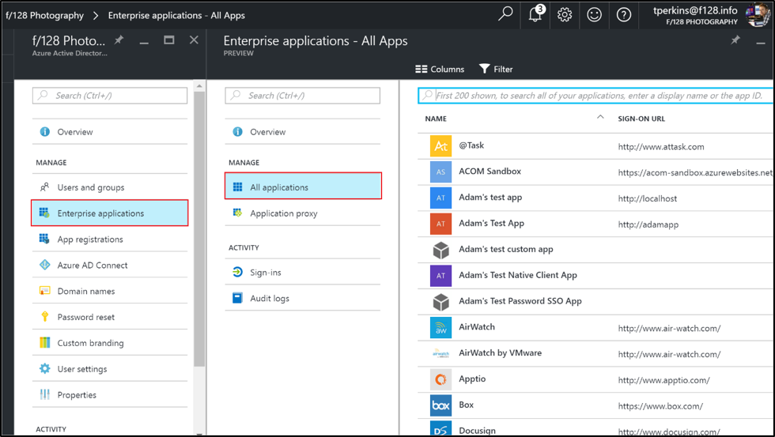
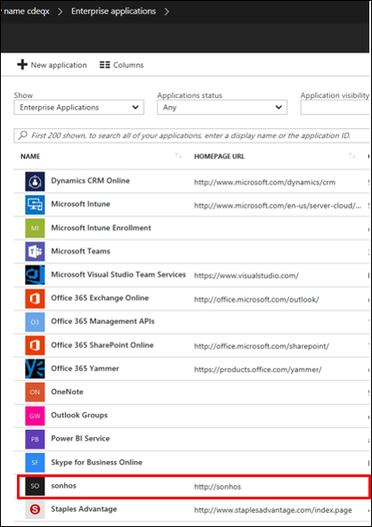

# Hide a third-party application from user's experience in Azure Active Directory

If you have a third-party application (an app published by others than Microsoft) that you do not want to show up on the users’ access panels or Office 365 launchers, there is an option to hide this app tile. By hiding the app users still have permissions to the app but will not see them appear on their app launchers. You must have the appropriate permissions to manage the enterprise app, and you must be global admin for the directory.

## Hiding a user's access panel
Use the following steps to hide a user's access panel and Office 365 app launchers

### How do I hide an app from user’s access panel and O365 app launchers?

1.	Sign in to the [Azure portal](https://portal.azure.com) with an account that's a global admin for the directory.
2.	Select **More services**, enter **Azure Active Directory** in the text box, and then select **Enter**.
3.	On the **Azure Active Directory - *directoryname*** screen (that is, the Azure AD screen for the directory you are managing), select **Enterprise applications**.

4.	On the **Enterprise applications** screen, select **All applications**. You see a list of the apps you can manage.
5.	On the **Enterprise applications - All applications** screen, select an app. 

6.	On the ***appname*** screen (that is, the screen with the name of the selected app in the title), select Properties.
7.	On the ***appname* - Properties** screen, select **Yes** for **Visible to users?**.

8.	Select the **Save** command.

## Next steps
* [See all my groups](active-directory-groups-view-azure-portal.md)
* [Assign a user or group to an enterprise app](active-directory-coreapps-assign-user-azure-portal.md)
* [Remove a user or group assignment from an enterprise app](active-directory-coreapps-remove-assignment-azure-portal.md)
* [Change the name or logo of an enterprise app](active-directory-coreapps-change-app-logo-user-azure-portal.md)
