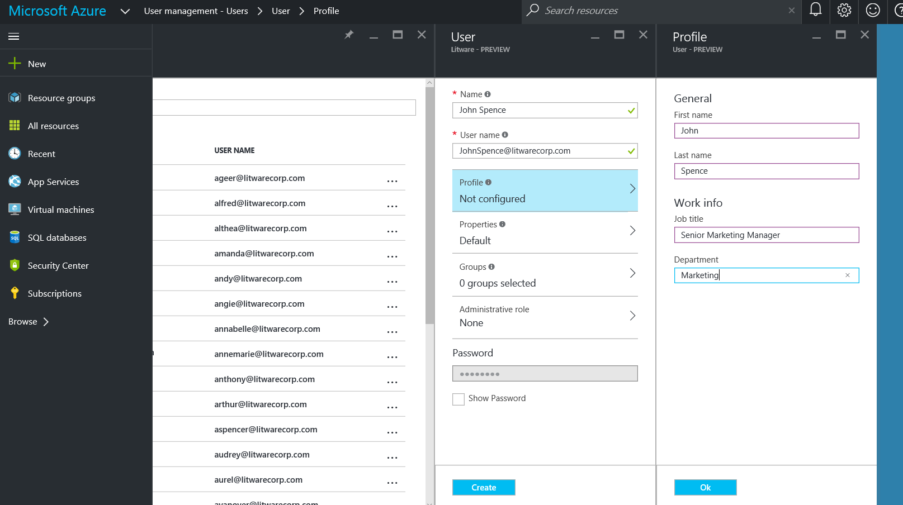
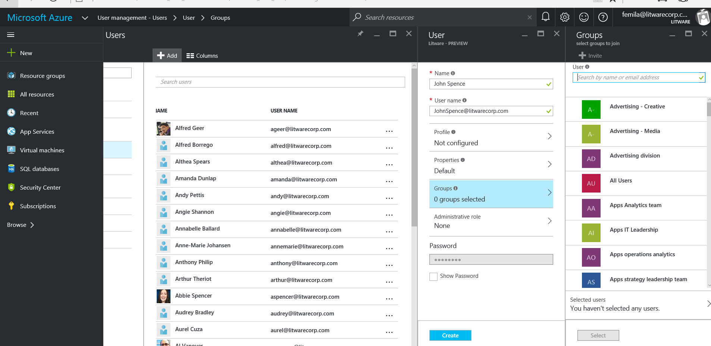
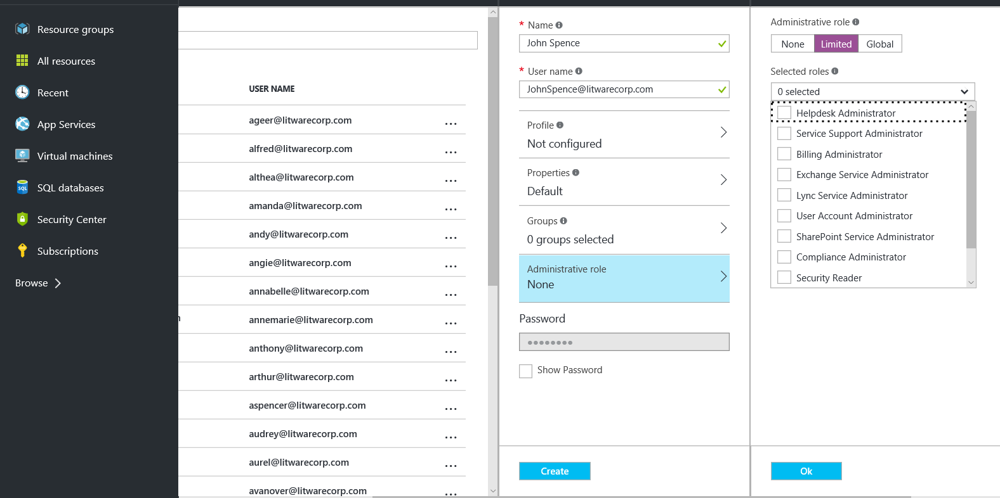

<properties
	pageTitle="Add new users to Azure Active Directory | Microsoft Azure"
	description="Explains how to add new users or change user information in Azure Active Directory."
	services="active-directory"
	documentationCenter=""
	authors="curtand"
	manager="femila"
	editor=""/>

<tags
	ms.service="active-directory"
	ms.workload="identity"
	ms.tgt_pltfrm="na"
	ms.devlang="na"
	ms.topic="get-started-article"
	ms.date="07/26/2016"
	ms.author="curtand"/>

# Add new users to Azure Active Directory

> [AZURE.SELECTOR]
- [Azure portal](active-directory-create-users-azure-portal.md)
- [Azure classic portal](active-directory-create-users.md)

This article explains how to add new users in your organization. Added users don't have administrator permissions by default, but you can assign roles to them at any time.

1.  Sign in to the [Azure portal](https://portal.azure.com) with an account that's a global admin for the directory.

2.  Select **Browse**, enter User Management in the text box, and then select **Enter**.

    

3.  On the User Management blade, select the **Users** tab, and then select **Add**.

    

4.  Enter details for the user – **Name,** **User name**, fill out the information in the **Profile** tab, and then select **OK** on the **Profile** tab.

    

5.  On the **Groups** tab, select the groups to which you want to add the user.

    

6.  Select an administrative role for the user from the options available, and click **Ok**. For more information about user and administrator roles, see [Assigning administrator roles in Azure AD](active-directory-assign-admin-roles.md).

    

7.  Click **Create**.

## What's next

- Add external user
- Configure user properties while adding a user
- Resetting a user's password in the new Azure portal
- Assigning a user to a role in your Azure AD
- Managing user properties
- Deleting a user in your Azure AD
