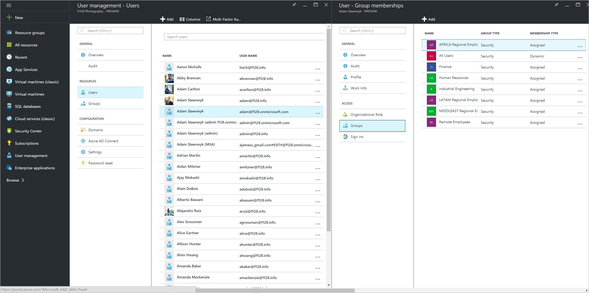

<properties
	pageTitle="Add users from other directories or partner companies in Azure Active Directory | Microsoft Azure"
	description="Explains how to add users or change user information in Azure Active Directory, including external and guest users."
	services="active-directory"
	documentationCenter=""
	authors="curtand"
	manager="femila"
	editor=""/>

<tags
	ms.service="active-directory"
	ms.workload="identity"
	ms.tgt_pltfrm="na"
	ms.devlang="na"
	ms.topic="get-started-article"
	ms.date="08/02/2016"
	ms.author="curtand"/>

# Add users from other directories or partner companies in Azure Active Directory

> [AZURE.SELECTOR]
- [Azure portal](active-directory-create-users-external-azure-portal.md)
- [Azure classic portal](active-directory-create-users-external.md)

This article explains how to add users either from other directories in Azure Active Directory (Azure AD) or from partner companies. For information about adding new users in your organization, and adding users who have Microsoft accounts, see [Add new users to Azure Active Directory](active-directory-create-users-azure-portal.md). Added users don't have administrator permissions by default, but you can assign roles to them at any time.

## Add a user

1.  Sign in to the [Azure portal](https://portal.azure.com) with an account that's a global admin for the directory.

2.  Select **Browse**, enter User Management in the text box, and then select **Enter**.

    

3.  On the **User Management** blade, select **Users**, and then select **Add**.

    

4. On the **User** blade:
	- Provide a display name in **Name** and the user's sign-in name in **User name**.

	- Select **Profile** to add the users first and last name, a job title, and a department name.

	

	- Select **Groups** to add the user to one or more groups.

	

	- Select **Organizational role** to assign the user to a role from the **Roles** list. For more information about user and administrator roles, see [Assigning administrator roles in Azure AD](active-directory-assign-admin-roles.md).

	

5. Select **Create**.

> [AZURE.IMPORTANT] If your organization uses more than one domain, you should know about the following issues when you add a user account:
>
> - TO add user accounts with the same user principal name (UPN) across domains, **first** add, for example, geoffgrisso@contoso.onmicrosoft.com, **followed by** geoffgrisso@contoso.com.
> - **Don't** add geoffgrisso@contoso.com before you add geoffgrisso@contoso.onmicrosoft.com. This order is important, and can be cumbersome to undo.

If you change information for a user whose identity is synchronized with your on-premises Active Directory service, you can't change the user information in the Azure classic portal. To change the user information, use your on-premises Active Directory management tools.

## What's next

- [Add a user](active-directory-create-users-azure-portal.md)
- [Reset a user's password in the new Azure portal](active-directory-create-users-reset-password-azure-portal.md)
- [Assign a user to a role in your Azure AD](active-directory-create-users-assign-role-azure-portal.md)
- [Change a user's work information](active-directory-create-users-work-info-azure-portal.md)
- [Manage user profiles](active-directory-create-users-profile-azure-portal.md)
- [Delete a user in your Azure AD](active-directory-create-users-delete-user-azure-portal.md)
