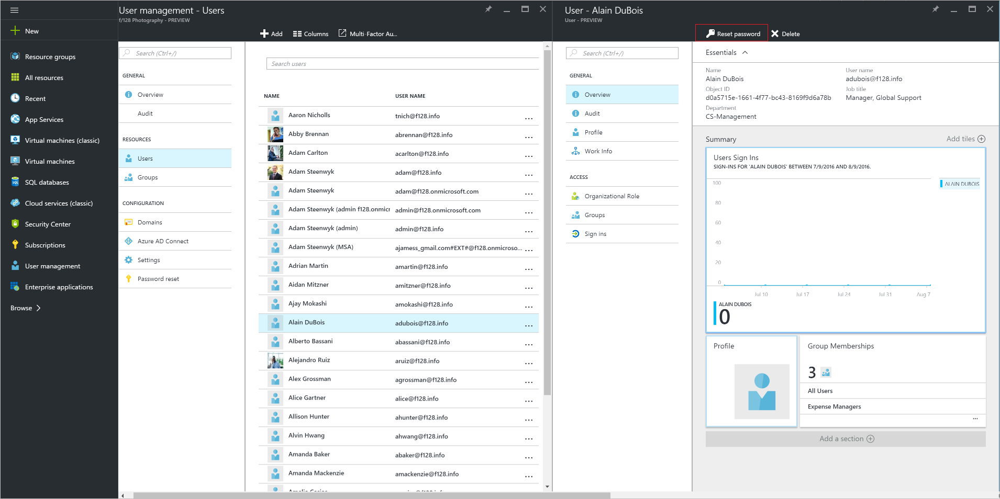

<properties
	pageTitle="Reset the password for a user in Azure Active Directory | Microsoft Azure"
	description="Explains how to reset the password for a user in Azure Active Directory"
	services="active-directory"
	documentationCenter=""
	authors="curtand"
	manager="femila"
	editor=""/>

<tags
	ms.service="active-directory"
	ms.workload="identity"
	ms.tgt_pltfrm="na"
	ms.devlang="na"
	ms.topic="article"
	ms.date="08/09/2016"
	ms.author="curtand"/>

# Reset the password for a user in Azure Active Directory

This article explains how to delete a user from a directory in Azure Active Directory (Azure AD). For information about adding new users in your organization, see [Add new users to Azure Active Directory](active-directory-create-users-azure-portal.md).

## Delete a user

1.  Sign in to the [Azure portal](https://portal.azure.com) with an account that's a global admin for the directory.

2.  Select **Browse**, enter User Management in the text box, and then select **Enter**.

    

3.  On the **User Management** blade, select **Users**.

    

4. On the **User Management - Users** blade, select a user from the list.

5. On the blade for the selected user, in the command bar, select **Reset password**.

    

## What's next

- [Add a user](active-directory-create-users-azure-portal.md)
- Reset a user's password in the new Azure portal
- Change a user's work information
- Manage user properties
- Delete a user in your Azure AD
