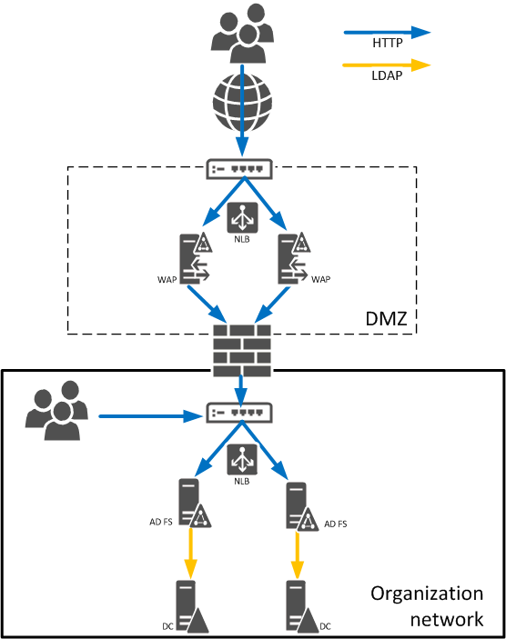
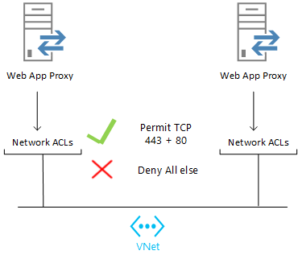
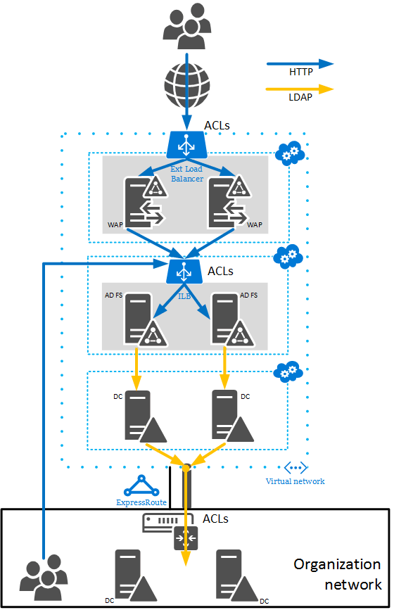
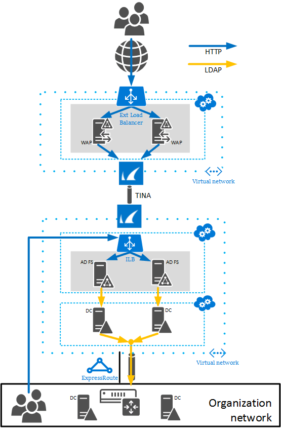
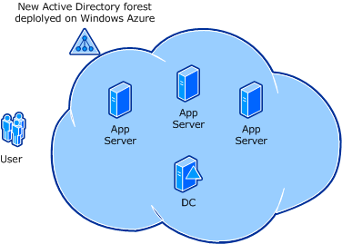
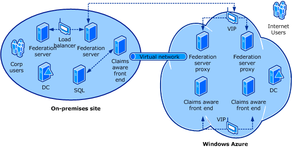
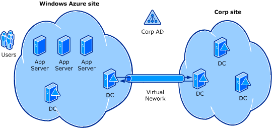

<properties
   pageTitle="Guidelines for Deploying Windows Server Active Directory on Azure Virtual Machines | Microsoft Azure"
   description="If you know how to deploy AD Domain Services and AD Federation Services on premises, learn how they work on Azure virtual machines."
   services="active-directory"
   documentationCenter=""
   authors="femila"
   manager="stevenpo"
   editor=""/>

<tags
   ms.service="active-directory"
   ms.devlang="na"
   ms.topic="article"
   ms.tgt_pltfrm="na"
   ms.workload="identity"
   ms.date="03/04/2016"
   ms.author="femila"/>

# Guidelines for deploying Windows Server Active Directory on Azure virtual machines

This article explains the important differences between deploying Windows Server Active Directory Domain Services (AD DS) and Active Directory Federation Services (AD FS) on-premises versus deploying them on Microsoft Azure virtual machines.

## Scope and audience

The article is intended for those already experienced with deploying Active Directory on-premises. It covers the differences between deploying Active Directory on Microsoft Azure virtual machines/Azure virtual networks and traditional on-premises Active Directory deployments. Azure virtual machines and Azure virtual networks are part of an Infrastructure-as-a-Service (IaaS) offering for organizations to leverage computing resources in the cloud.

For those that are not familiar with AD deployment, see the [AD DS Deployment Guide](https://technet.microsoft.com/library/cc753963) or [Plan your AD FS deployment](https://technet.microsoft.com/library/dn151324.aspx) as appropriate.

This article assumes that the reader is familiar with the following concepts:

- Windows Server AD DS deployment and management
- Deployment and configuration of DNS to support a Windows Server AD DS infrastructure
- Windows Server AD FS deployment and management
- Deploying, configuring, and managing relying party applications (websites and web services) that can consume Windows Server AD FS tokens
- General virtual machine concepts, such as how to configure a virtual machine, virtual disks, and virtual networks

This article highlights the requirements for a hybrid deployment scenario in which Windows Server AD DS or AD FS are partly deployed on-premises and partly deployed on Azure virtual machines. The document first covers the critical differences between running Windows Server AD DS and AD FS on Azure virtual machines versus on-premises, and important decisions that affect design and deployment. The rest of the paper explains guidelines for each of the decision points in more detail, and how to apply the guidelines to various deployment scenarios.

This article does not discuss the configuration of [Azure Active Directory](http://azure.microsoft.com/services/active-directory/), which is a REST-based service that provides identity management and access control capabilities for cloud applications. Azure Active Directory (Azure AD) and Windows Server AD DS are, however, designed to work together to provide an identity and access management solution for today’s hybrid IT environments and modern applications. To help understand the differences and relationships between Windows Server AD DS and Azure AD, consider the following:

1. You might run Windows Server AD DS in the cloud on Azure virtual machines when you are using Azure to extend your on-premises datacenter into the cloud.
2. You might use Azure AD to give your users single sign-on to Software-as-a-Service (SaaS) applications. Microsoft Office 365 uses this technology, for example, and applications running on Azure or other cloud platforms can also use it.
3. You might use Azure AD (its Access Control Service) to let users sign in using identities from Facebook, Google, Microsoft, and other identity providers to applications that are hosted in the cloud or on-premises.

For more information about these differences, see [Azure Identity](fundamentals-identity.md).

## Related resources

You may download and run the [Azure Virtual Machine Readiness Assessment](https://www.microsoft.com/download/details.aspx?id=40898). The assessment will automatically inspect your on-premises environment and generate a customized report based on the guidance found in this topic to help you migrate the environment to Azure.

We recommend that you also first review the tutorials, guides, and videos that cover the following topics:

- [Configure a Cloud-Only Virtual Network in the Azure Portal](../virtual-network/virtual-networks-create-vnet-arm-pportal.md)
- [Configure a Site-to-Site VPN in the Azure Portal](../vpn-gateway/vpn-gateway-site-to-site-create.md)
- [Install a new Active Directory forest on an Azure virtual network](active-directory-new-forest-virtual-machine.md)
- [Install a replica Active Directory domain controller on Azure](../active-directory/active-directory-install-replica-active-directory-domain-controller.md)
- [Microsoft Azure IT Pro IaaS: (01) Virtual Machine Fundamentals](https://channel9.msdn.com/Series/Windows-Azure-IT-Pro-IaaS/01)
- [Microsoft Azure IT Pro IaaS: (05) Creating Virtual Networks and Cross-Premises Connectivity](https://channel9.msdn.com/Series/Windows-Azure-IT-Pro-IaaS/05)

## Introduction

The fundamental requirements for deploying Windows Server Active Directory on Azure virtual machines differ very little from deploying it in on-premises virtual machines (and, to some extent, physical machines). For example, in the case of Windows Server AD DS, if the domain controllers (DCs) that you deploy on Azure virtual machines are replicas in an existing on-premises corporate domain/forest, then the Azure deployment can largely be treated in the same way as you might treat any other additional Windows Server Active Directory site. That is, subnets must be defined in Windows Server AD DS, a site created, the subnets linked to that site, and connected to other sites using appropriate site-links. There are, however, some differences that are common to all Azure deployments and some that vary according to the specific deployment scenario. Two fundamental differences are outlined below:

### Azure virtual machines may need connectivity to the on-premises corporate network.

Connecting Azure virtual machines back to an on-premises corporate network requires Azure virtual network, which includes a site-to-site or site-to-point virtual private network (VPN) component able to seamlessly connect Azure virtual machines and on-premises machines. This VPN component could also enable on-premises domain member computers to access a Windows Server Active Directory domain whose domain controllers are hosted exclusively on Azure virtual machines. It is important to note, though, that if the VPN fails, authentication and other operations that depend on Windows Server Active Directory will also fail. While users may be able to sign in using existing cached credentials, all peer-to-peer or client-to-server authentication attempts for which tickets have yet to be issued or have become stale will fail.

See [Virtual Network](http://azure.microsoft.com/documentation/services/virtual-network/) for a demonstration video and a list of step-by-step tutorials, including [Configure a Site-to-Site VPN in the Azure portal](../vpn-gateway/vpn-gateway-site-to-site-create.md).

> [AZURE.NOTE] You can also deploy Windows Server Active Directory on an Azure virtual network that does not have connectivity with an on-premises network. The guidelines in this topic, however, assume that an Azure virtual network is used because it provides IP addressing capabilities that are essential to Windows Server.

### Static IP addresses must be configured with Azure PowerShell.

Dynamic addresses are allocated by default, but use the Set-AzureStaticVNetIP cmdlet to assign a static IP address instead. That sets a static IP address that will persist through service healing and VM shutdown/restart. For more information, see [Static internal IP address for virtual machines](http://azure.microsoft.com/blog/static-internal-ip-address-for-virtual-machines/).

## Terms and definitions

The following is a non-exhaustive list of terms for various Azure technologies which will be referenced in this article.

- **Azure virtual machines**: The IaaS offering in Azure that allows customers to deploy VMs running nearly any traditionally on-premises server workload.

- **Azure virtual network**: The networking service in Azure that lets customers create and manage virtual networks in Azure and securely link them to their own on-premises networking infrastructure by using a virtual private network (VPN).

- **Virtual IP address**: An internet-facing IP address that is not bound to a specific computer or network interface card. Cloud services are assigned a virtual IP address for receiving network traffic which is redirected to an Azure VM. A virtual IP address is a property of a cloud-service which can contain one or more Azure virtual machines. Also note that an Azure virtual network can contain one or more cloud-services. Virtual IP addresses provide native load-balancing capabilities.

- **Dynamic IP address**: This is the IP address that is internal only. It should be configured as a static IP address (by using the Set-AzureStaticVNetIP cmdlet) for VMs that host the DC/DNS server roles.

- **Service healing**: The process in which Azure automatically returns a service to a running state again after it detects that the service has failed. Service healing is one of the aspects of Azure that supports availability and resiliency. While unlikely, the result following a service healing incident for a DC running on a VM is similar to an unplanned reboot, but has a few side-effects:

 - The virtual network adapter in the VM will change
 - The MAC address of the virtual network adapter will change
 - The Processor/CPU ID of the VM will change
 - The IP configuration of the virtual network adapter will not change as long as the VM is attached to a virtual network and the VM’s IP address is static.

 None of these behaviors affect Windows Server Active Directory because it has no dependency on the MAC address or Processor/CPU ID, and all Windows Server Active Directory deployments on Azure are recommended to be run on an Azure virtual network as outlined above.

## Is it safe to virtualize Windows Server Active Directory domain controllers?

Deploying Windows Server Active Directory DCs on Azure virtual machines is subject to the same guidelines as running DCs on-premises in a virtual machine. Running virtualized DCs is a safe practice as long as guidelines for backing up and restoring DCs are followed. For more information about constraints and guidelines for running virtualized DCs, see [Running Domain Controllers in Hyper-V](https://technet.microsoft.com/library/dd363553).

Hypervisors provide or trivialize technologies that can cause problems for many distributed systems, including Windows Server Active Directory. For example, on a physical server, you can clone a disk or use unsupported methods to roll back the state of a server, including using SANs and so on, but doing that on a physical server is much harder than restoring a virtual machine snapshot in a hypervisor. Azure offers functionality that can result in the same undesirable condition. For example, you should not copy VHD files of DCs instead of performing regular backups because restoring them can result in a similar situation to using snapshot restore features.

Such rollbacks introduce USN bubbles that can lead to permanently divergent states between DCs. That can cause issues such as:

- Lingering objects
- Inconsistent passwords
- Inconsistent attribute values
- Schema mismatches if the schema master is rolled back

For more information about how DCs are impacted, see [USN and USN Rollback](https://technet.microsoft.com/library/virtual_active_directory_domain_controller_virtualization_hyperv.aspx#usn_and_usn_rollback).

Beginning with Windows Server 2012, [additional safeguards are built in to AD DS](https://technet.microsoft.com/library/hh831734.aspx). These safeguards help protect virtualized domain controllers against the aforementioned problems, as long as the underlying hypervisor platform supports VM-GenerationID. Azure supports VM-GenerationID, which means that domain controllers that run Windows Server 2012 or later on Azure virtual machines have the additional safeguards.

> [AZURE.NOTE] You should shut down and restart a VM that runs the domain controller role in Azure within the guest operating system instead of using the **Shut Down** option in the Azure classic portal. Today, using the classic portal to shut down a VM causes the VM to be deallocated. A deallocated VM has the advantage of not incurring charges, but it also resets the VM-GenerationID, which is undesirable for a DC. When the VM-GenerationID is reset, the invocationID of the AD DS database is also reset, the RID pool is discarded, and SYSVOL is marked as non-authoritative. For more information, see [Introduction to Active Directory Domain Services (AD DS) Virtualization](https://technet.microsoft.com/library/hh831734.aspx) and [Safely Virtualizing DFSR](http://blogs.technet.com/b/filecab/archive/2013/04/05/safely-virtualizing-dfsr.aspx).

## Why deploy Windows Server AD DS on Azure Virtual Machines?

Many Windows Server AD DS deployment scenarios are well-suited for deployment as VMs on Azure. For example, suppose you have a company in Europe that needs to authenticate users in a remote location in Asia. The company has not previously deployed Windows Server Active Directory DCs in Asia due to the cost to deploy them and limited expertise to manage the servers post-deployment. As a result, authentication requests from Asia are serviced by DCs in Europe with suboptimal results. In this case, you can deploy a DC on a VM that you have specified must be run within the Azure datacenter in Asia. Attaching that DC to an Azure virtual network that is connected directly to the remote location will improve authentication performance.

Azure is also well-suited as a substitute to otherwise costly disaster recovery (DR) sites. The relatively low-cost of hosting a small number of domain controllers and a single virtual network on Azure represents an attractive alternative.

Finally, you may want to deploy a network application on Azure, such as SharePoint, that requires Windows Server Active Directory but has no dependency on the on-premises network or the corporate Windows Server Active Directory. In this case, deploying an isolated forest on Azure to meet the SharePoint server’s requirements is optimal. Again, deploying network applications that do require connectivity to the on-premises network and the corporate Active Directory is also supported.

> [AZURE.NOTE] Since it provides a layer-3 connection, the VPN component that provides connectivity between an Azure virtual network and an on-premises network can also enable member servers that run on-premises to leverage DCs that run as Azure virtual machines on Azure virtual network. But if the VPN is unavailable, communication between on-premises computers and Azure-based domain controllers will not function, resulting in authentication and various other errors.  

## Contrasts between deploying Windows Server Active Directory domain controllers on Azure Virtual Machines versus on-premises

- For any Windows Server Active Directory deployment scenario that includes more than a single VM, it is necessary to use an Azure virtual network for IP address consistency. Note that this guide assumes that DCs are running on an Azure virtual network.

- As with on-premises DCs, static IP addresses are recommended. A static IP address can only be configured by using Azure PowerShell. See [Static internal IP address for VMs](http://azure.microsoft.com/blog/static-internal-ip-address-for-virtual-machines/) for more details. If you have monitoring systems or other solutions that check for static IP address configuration within the guest operating system, you can assign the same static IP address to the network adapter properties of the VM. But be aware that the network adapter will be discarded if the VM undergoes service healing or is shut down in the classic portal and has its address deallocated. In that case, the static IP address within the guest will need to be reset.

- Deploying VMs on a virtual network does not imply (or require) connectivity back to an on-premises network; the virtual network merely enables that possibility. You must create a virtual network for private communication between Azure and your on-premises network. You need to deploy a VPN endpoint on the on-premises network. The VPN is opened from Azure to the on-premises network. For more information, see [Virtual Network Overview](../virtual-network/virtual-networks-overview.md) and [Configure a Site-to-Site VPN in the Azure Portal](../vpn-gateway/vpn-gateway-site-to-site-create.md).

> [AZURE.NOTE] An option to [create a point-to-site VPN](../vpn-gateway/vpn-gateway-point-to-site-create.md) is available to connect individual Windows-based computers directly to an Azure virtual network.

- Regardless of whether you create a virtual network or not, Azure charges for egress traffic but not ingress. Various Windows Server Active Directory design choices can affect how much egress traffic is generated by a deployment. For example, deploying a read-only domain controller (RODC) limits egress traffic because it does not replicate outbound. But the decision to deploy an RODC needs to be weighed against the need to perform write operations against the DC and the [compatibility](https://technet.microsoft.com/library/cc755190) that applications and services in the site have with RODCs. For more information about traffic charges, see [Azure pricing at-a-glance](http://azure.microsoft.com/pricing/).

- While you have complete control over what server resources to use for VMs on-premises, such as RAM, disk size, and so on, on Azure you must select from a list of preconfigured server sizes. For a DC, a data disk is needed in addition to the operating system disk in order to store the Windows Server Active Directory database.

## Can you deploy Windows Server AD FS on Azure virtual machines?

Yes, you can deploy Windows Server AD FS on Azure virtual machines, and the [best practices for AD FS deployment](https://technet.microsoft.com/library/dn151324.aspx) on-premises apply equally to AD FS deployment on Azure. But some of the best practices such as load balancing and high availability require technologies beyond what AD FS offers itself. They must be provided by the underlying infrastructure. Let’s review some of those best practices and see how they can be achieved by using Azure VMs and an Azure virtual network.

1. **Never expose security token service (STS) servers directly to the Internet.**

    This is important because the STS issues security tokens. As a result, STS servers such as AD FS servers should be treated with the same level of protection as a domain controller. If an STS is compromised, malicious users have the ability to issue access tokens potentially containing claims of their choosing to relying party applications and other STS servers in trusting organizations.

2. **Deploy Active Directory domain controllers for all user domains in the same network as the AD FS servers.**

    AD FS servers use Active Directory Domain Services to authenticate users. It is recommended to deploy domain controllers on the same network as the AD FS servers. This provides business continuity in case the link between the Azure network and your on-premises network is broken, and enables lower latency and increased performance for logins.

3. **Deploy multiple AD FS nodes for high availability and balancing the load.**

    In most cases, the failure of an application that AD FS enables is unacceptable because the applications that require security tokens are often mission critical. As a result, and because AD FS now resides in the critical path to accessing mission critical applications, the AD FS service must be highly available through multiple AD FS proxies and AD FS servers. To achieve distribution of requests, load balancers are typically deployed in front of both the AD FS Proxies and the AD FS servers.

4. **Deploy one or more Web Application Proxy nodes for internet access.**

    When users need to access applications protected by the AD FS service, the AD FS service needs to be available from the internet. This is achieved by deploying the Web Application Proxy service. It is strongly recommended to deploy more than one node for the purposes of high availability and load balancing.

5. **Restrict access from the Web Application Proxy nodes to internal network resources.**

    To allow external users to access AD FS from the internet, you need to deploy Web Application Proxy nodes (or AD FS Proxy in earlier versions of Windows Server). The Web Application proxy nodes are directly exposed to the Internet. They are not required to be domain-joined and they only need access to the AD FS servers over TCP ports 443 and 80. It is strongly recommended that communication to all other computers (especially domain controllers) is blocked.

    This is typically achieved on-premises by means of a DMZ. Firewalls use a whitelist mode of operation to restrict traffic from the DMZ to the on-premises network (that is, only traffic from the specified IP addresses and over specified ports is allowed, and all other traffic is blocked).

The following diagram shows a traditional on-premises AD FS deployment.

However, because Azure does not provide native, full-featured firewall capability, other options need to be used to restrict traffic. The following table shows each option and its advantages and disadvantages.

| Option | Advantage | Disadvantage |
| ------ | --------- | ------------ |
| [Azure network ACLs](virtual-networks-acl.md) | Less costly and simpler initial configuration | Additional network ACL configuration required if any new VMs are added to the deployment |
| [Barracuda NG firewall](https://www.barracuda.com/products/ngfirewall) | Whitelist mode of operation and it requires no network ACL configuration | Increased cost and complexity for initial setup |

The high-level steps to deploy AD FS in this case are as follows:

1. Create a [virtual network with cross-premises connectivity](../vpn-gateway/vpn-gateway-cross-premises-options.md), using either a VPN or [ExpressRoute](http://azure.microsoft.com/services/expressroute/).

2. Deploy domain controllers on the virtual network. This step is optional but recommended.

3. Deploy domain-joined AD FS servers on the virtual network.

4. Create an [internal load balanced set](http://azure.microsoft.com/blog/internal-load-balancing/) that includes the AD FS servers and uses a new private IP address within the virtual network (a dynamic IP address).

  1. Update DNS to create the FQDN to point to the private (dynamic) IP address of the internal load balanced set.

5. Create a cloud service (or a separate virtual network) for the Web Application Proxy nodes.

6. Deploy the Web Application Proxy nodes in the cloud service or virtual network

  1. Create an external load balanced set that includes the Web Application Proxy nodes.

  2. Update the external DNS name (FQDN) to point to the cloud service public IP address (the virtual IP address).

  3. Configure AD FS proxies to use the FQDN that corresponds to the internal load balanced set for the AD FS servers.

  4. Update claims-based web sites to use the external FQDN for their claims provider.

7. Restrict access between Web Application Proxy to any machine in the AD FS virtual network.

To restrict traffic, the load-balanced set for the Azure internal load balancer needs to be configured for only traffic to TCP ports 80 and 443, and all other traffic to the internal dynamic IP address of the load balanced set is dropped.

Traffic to the AD FS servers would be permitted only by the following sources:

- The Azure internal load balancer.
- The IP address of an administrator on the on-premises network.

> [AZURE.WARNING] The design must prevent Web Application Proxy nodes from reaching any other VMs in the Azure virtual network or any locations on the on-premises network. That can be done by configuring firewall rules in the on-premises appliance for Express Route connections or the VPN device for site-to-site VPN connections.

A disadvantage to this option is the need to configure the network ACLs for multiple devices, including internal load balancer, the AD FS servers, and any other servers that get added to the virtual network. If any device is added to the deployment without configuring network ACLs to restrict traffic to it, the entire deployment can be at risk. If the IP addresses of the Web Application Proxy nodes ever change, the network ACLs must be reset (which means the proxies should be configured to use [static dynamic IP addresses](http://azure.microsoft.com/blog/static-internal-ip-address-for-virtual-machines/)).

Another option is to use the [Barracuda NG Firewall](https://www.barracuda.com/products/ngfirewall) appliance to control traffic between AD FS proxy servers and the AD FS servers. This option complies with best practices for security and high availability, and requires less administration after the initial setup because the Barracuda NG Firewall appliance provides a whitelist mode of firewall administration and it can be installed directly on an Azure virtual network. That eliminates the need to configure network ACLs any time a new server is added to the deployment. But this option adds initial deployment complexity and cost.

In this case, two virtual networks are deployed instead of one. We'll call them VNet1 and VNet2. VNet1 contains the proxies and VNet2 contains the STSs and the network connection back to the corporate network. VNet1 is therefore physically (albeit virtually) isolated from VNet2 and, in turn, from the corporate network. VNet1 is then connected to VNet2 using a special tunneling technology known as Transport Independent Network Architecture (TINA). The TINA tunnel is attached to each of the virtual networks using a Barracuda NG firewall—one Barracuda on each of the virtual networks.  For high-availability, it is recommended that you deploy two Barracudas on each virtual network; one active, the other passive. They offer extremely rich firewalling capabilities which allow us to mimic the operation of a traditional on-premises DMZ in Azure.

For more information, see [AD FS: Extend a claims-aware on-premises front-end application to the Internet](#BKMK_CloudOnlyFed).

### An alternative to AD FS deployment if the goal is Office 365 SSO alone

There is another alternative to deploying AD FS altogether if your goal is only to enable sign-in for Office 365. In that case, you can simply deploy DirSync with password sync on-premises and achieve the same end-result with minimal deployment complexity because this approach does not require AD FS or Azure.

The following table compares how the sign-in processes work with and without deploying AD FS.

| Office 365 single sign-on using AD FS and DirSync | Office 365 same sign-on using DirSync + Password Sync |
| ------------- | ------------- |
| 1. The user logs on to a corporate network, and is authenticated to Windows Server Active Directory. | 1. The user logs on to a corporate network, and is authenticated to Windows Server Active Directory. |
| 2. The user tries to access Office 365 (I am @contoso.com). | 2. The user tries to access Office 365 (I am @contoso.com). |
| 3. Office 365 redirects the user to Azure AD. | 3. Office 365 redirects the user to Azure AD. |
| 4. Since Azure AD can’t authenticate the user and understands there is a trust with AD FS on-premises, it redirects the user to AD FS. | 4. Azure AD can’t accept Kerberos tickets directly and no trust relationship exists so it requests that the user enter credentials. |
| 5. The user sends a Kerberos ticket to the AD FS STS. | 5. The user enters the same on-premises password, and Azure AD validates them against the user name and password that was synchronized by DirSync. |
| 6. AD FS transforms the Kerberos ticket to the required token format/claims and redirects the user to Azure AD. | 6. Azure AD redirects the user to Office 365. |
| 7. The user authenticates to Azure AD (another transformation occurs). |  7. The user can sign in to Office 365 and OWA using the Azure AD token. |
| 8. Azure AD redirects the user to Office 365. |  |
| 9. The user is silently signed on to Office 365. |  |

In the Office 365 with DirSync with password sync scenario (no AD FS), single sign-on is replaced by “same sign-on” where “same” simply means that users must re-enter their same on-premises credentials when accessing Office 365. Note that this data can be remembered by the user’s browser to help reduce subsequent prompts.

### Additional food for thought

- If you deploy an AD FS proxy on an Azure virtual machine, connectivity to the AD FS servers is needed. If they are on-premises, it is recommended that you leverage the site-to-site VPN connectivity provided by the virtual network to allow the Web Application Proxy nodes to communicate with their AD FS servers.

- If you deploy an AD FS server on an Azure virtual machine, connectivity to Windows Server Active Directory domain controllers, Attribute Stores, and Configuration databases is necessary and may also require an ExpressRoute or a site-to-site VPN connection between the Azure virtual network and the on-premises network.

- Charges are applied to all traffic from Azure virtual machines (egress traffic). If cost is the driving factor, it is advisable to deploy the Web Application Proxy nodes on Azure, leaving the AD FS servers on-premises. If the AD FS servers are deployed on Azure virtual machines as well, additional costs will be incurred to authenticate on-premises users. Egress traffic incurs a cost regardless of whether or not it is traversing the ExpressRoute or the VPN site-to-site connection.

- If you decide to use Azure’s native server load balancing capabilities for high availability of AD FS servers, note that load balancing provides probes that are used to determine the health of the virtual machines within the cloud service. In the case of Azure virtual machines (as opposed to web or worker roles), a custom probe must be used since the agent that responds to the default probes is not present on Azure virtual machines. For simplicity, you might use a custom TCP probe — this requires only that a TCP connection (a TCP SYN segment sent and responded to with a TCP SYN ACK segment) be successfully established to determine virtual machine health. You can configure the custom probe to use any TCP port to which your virtual machines are actively listening.

> [AZURE.NOTE] Machines that need to expose the same set of ports directly to the Internet (such as port 80 and 443) cannot share the same cloud service. It is, therefore, recommended that you create a dedicated cloud service for your Windows Server AD FS servers in order to avoid potential overlaps between port requirements for an application and Windows Server AD FS.

## Deployment scenarios

The following section outlines commonplace deployment scenarios to draw attention to important considerations that must be taken into account. Each scenario has links to more details about the decisions and factors to consider.

1. [AD DS: Deploy an AD DS-aware application with no requirement for corporate network connectivity](#BKMK_CloudOnly)

    For example, an Internet-facing SharePoint service is deployed on an Azure virtual machine. The application has no dependencies on corporate-network resources. The application does require Windows Server AD DS but does NOT require the corporate Windows Server AD DS.

2. [AD FS: Extend a claims-aware on-premises front-end application to the Internet](#BKMK_CloudOnlyFed)

    For example, a claims-aware application that has been successfully deployed on-premises and used by corporate users needs to become accessible from the Internet. The application needs to be accessed directly over the Internet both by business partners using their own corporate identities and by existing corporate users.

3. [AD DS: Deploy a Windows Server AD DS-aware application that requires connectivity to the corporate network](#BKMK_HybridExt)

    For example, an LDAP-aware application that supports Windows-integrated authentication and uses Windows Server AD DS as a repository for configuration and user-profile data is deployed on an Azure virtual machine. It is desirable for the application to leverage the existing corporate Windows Server AD DS and provide single sign-on. The application is not claims-aware.

### 1. AD DS: Deploy an AD DS-aware application with no requirement for corporate network connectivity

**Figure 1**

#### Description

SharePoint is deployed on an Azure virtual machine and the application has no dependencies on corporate-network resources. The application does require Windows Server AD DS but does *not* require the corporate Windows Server AD DS. No Kerberos or federated trusts are required because users are self-provisioned through the application into the Windows Server AD DS domain that is also hosted in the cloud on Azure virtual machines.

#### Scenario considerations and how technology areas apply to the scenario

- [Network topology](#BKMK_NetworkTopology): Create an Azure virtual network without cross-premises connectivity (also known as site-to-site connectivity).

- [DC deployment configuration](#BKMK_DeploymentConfig): Deploy a new domain controller into a new, single-domain, Windows Server Active Directory forest. This should be deployed along with the Windows DNS server.

- [Windows Server Active Directory site topology](#BKMK_ADSiteTopology): Use the default Windows Server Active Directory site (all computers will be in Default-First-Site-Name).

- [IP addressing and DNS](#BKMK_IPAddressDNS):

 - Set a static IP address for the DC by using the Set-AzureStaticVNetIP Azure PowerShell cmdlet.
 - Install and configure Windows Server DNS on the domain controller(s) on Azure.
 - Configure the virtual network properties with the name and IP address of the VM that hosts the DC and DNS server roles.

- [Global Catalog](#BKMK_GC): The first DC in the forest must be a global catalog server. Additional DCs should also be configured as GCs because in a single domain forest, the global catalog does not require any additional work from the DC.

- [Placement of the Windows Server AD DS database and SYSVOL](#BKMK_PlaceDB): Add a data disk to DCs running as Azure VMs in order to store the Windows Server Active Directory database, logs, and SYSVOL.

- [Backup and Restore](#BKMK_BUR): Determine where you want to store system state backups. If necessary, add another data disk to the DC VM to store backups.

### 2 AD FS: Extend a claims-aware on-premises front-end application to the Internet

**Figure 2**

#### Description

A claims-aware application that has been successfully deployed on-premises and used by corporate users needs to become accessible directly from the Internet. The application serves as a web frontend to a SQL database in which it stores data. The SQL servers used by the application are also located on the corporate network. Two Windows Server AD FS STSs and a load-balancer have been deployed on-premises to provide access to the corporate users. The application now needs to be additionally accessed directly over the Internet both by business partners using their own corporate identities and by existing corporate users.

In an effort to simplify and meet the deployment and configuration needs of this new requirement, it is decided that two additional web frontends and two Windows Server AD FS proxy servers be installed on Azure virtual machines. All four VMs will be exposed directly to the Internet and will be provided connectivity to the on-premises network using Azure Virtual Network’s site-to-site VPN capability.

#### Scenario considerations and how technology areas apply to the scenario

- [Network topology](#BKMK_NetworkTopology): Create an Azure virtual network and [configure cross-premises connectivity](../vpn-gateway/vpn-gateway-site-to-site-create.md).

 > [AZURE.NOTE] For each of the Windows Server AD FS certificates, ensure that the URL defined within the certificate template and the resulting certificates can be reached by the Windows Server AD FS instances running on Azure. This may require cross-premises connectivity to parts of your PKI infrastructure. For example if the CRL's endpoint is LDAP-based and hosted exclusively on-premises, then cross-premises connectivity will be required. If this is not desirable, it may be necessary to use certificates issued by a CA whose CRL is accessible over the Internet.

- [Cloud services configuration](#BKMK_CloudSvcConfig): Ensure you have two cloud services in order provide two load-balanced virtual IP addresses. The first cloud service’s virtual IP address will be directed to the two Windows Server AD FS proxy VMs on ports 80 and 443. The Windows Server AD FS proxy VMs will be configured to point to the IP address of the on-premises load-balancer that fronts the Windows Server AD FS STSs. The second cloud service’s virtual IP address will be directed to the two VMs running the web frontend again on ports 80 and 443. Configure a custom probe to ensure the load-balancer only directs traffic to functioning Windows Server AD FS proxy and web frontend VMs.

- [Federation server configuration](#BKMK_FedSrvConfig): Configure Windows Server AD FS as a federation server (STS) to generate security tokens for the Windows Server Active Directory forest created in the cloud. Set federation claims provider trust relationships with the different partners you wish to accept identities from, and configure relying party trust relationships with the different applications you want to generate tokens to.

    In most scenarios, Windows Server AD FS proxy servers are deployed in an Internet-facing capacity for security purposes while their Windows Server AD FS federation counterparts remain isolated from direct Internet connectivity. Regardless of your deployment scenario, you must configure your cloud service with a virtual IP address that will provide a publicly exposed IP address and port that is able to load-balance across either your two Windows Server AD FS STS instances or proxy instances.

- [Windows Server AD FS high availability configuration](#BKMK_ADFSHighAvail): It is advisable to deploy a Windows Server AD FS farm with at least two servers for failover and load balancing. You might want to consider using the Windows Internal Database (WID) for Windows Server AD FS configuration data, and use the internal load balancing capability of Azure to distribute incoming requests across the servers in the farm.

For more information, see the [AD DS Deployment Guide](https://technet.microsoft.com/library/cc753963).

### 3. AD DS: Deploy a Windows Server AD DS-aware application that requires connectivity to the corporate network

**Figure 3**

#### Description

An LDAP-aware application is deployed on an Azure virtual machine. It supports Windows-integrated authentication and uses Windows Server AD DS as a repository for configuration and user profile data. The goal is for the application to leverage the existing corporate Windows Server AD DS and provide single sign-on. The application is not claims-aware. Users also need to access the application directly from the Internet. To optimize for performance and cost, it is decided that two additional domain controllers that are part of the corporate domain be deployed alongside the application on Azure.

#### Scenario considerations and how technology areas apply to the scenario

- [Network topology](#BKMK_NetworkTopology): Create an Azure virtual network with [cross-premises connectivity](../vpn-gateway/vpn-gateway-site-to-site-create.md).

- [Installation method](#BKMK_InstallMethod): Deploy replica DCs from the corporate Windows Server Active Directory domain. For a replica DC, you can install Windows Server AD DS on the VM, and optionally use the Install From Media (IFM) feature to reduce the amount of data that needs to be replicated to the new DC during installation. For a tutorial, see [Install a replica Active Directory domain controller on Azure](../active-directory/active-directory-install-replica-active-directory-domain-controller.md). Even if you use IFM, it may be more efficient to build the virtual DC on-premises and move the entire Virtual Hard Disk (VHD) to the cloud instead of replicating Windows Server AD DS during installation. For safety, it is recommended that you delete the VHD from the on-premises network once it has been copied to Azure.

- [Windows Server Active Directory site topology](#BKMK_ADSiteTopology): Create a new Azure site in Active Directory Sites and Services. Create a Windows Server Active Directory subnet object to represent the Azure virtual network and add the subnet to the site. Create a new site link that includes the new Azure site and the site in which the Azure virtual network VPN endpoint is located in order to control and optimize Windows Server Active Directory traffic to and from Azure.

- [IP addressing and DNS](#BKMK_IPAddressDNS):

 - Set a static IP address for the DC by using the Set-AzureStaticVNetIP Azure PowerShell cmdlet.
 - Install and configure Windows Server DNS on the domain controller(s) on Azure.
 - Configure the virtual network properties with the name and IP address of the VM that hosts the DC and DNS server roles.

- [Geo-distributed DCs](#BKMK_DistributedDCs): Configure additional virtual networks as needed. If your Active Directory site topology requires DCs in geographies that correspond to different Azure regions, than you want to create Active Directory sites accordingly.

- [Read-only DCs](#BKMK_RODC): You might deploy an RODC in the Azure site, depending on your requirements for performing write operations against the DC and the compatibility of applications and services in the site with RODCs. For more information about application compatibility, see the [Read-Only domain controllers application compatibility guide](https://technet.microsoft.com/library/cc755190).

- [Global Catalog](#BKMK_GC): GCs are needed to service logon requests in multidomain forests. If you do not deploy a GC in the Azure site, you will incur egress traffic costs as authentication requests cause queries GCs in other sites. To minimize that traffic, you can enable universal group membership caching for the Azure site in Active Directory Sites and Services.

    If you deploy a GC, configure site links and site links costs so that the GC in the Azure site is not preferred as a source DC by other GCs that need to replicate the same partial domain partitions.

- [Placement of the Windows Server AD DS database and SYSVOL](#BKMK_PlaceDB): Add a data disk to DCs running on Azure VMs in order to store the Windows Server Active Directory database, logs, and SYSVOL.

- [Backup and Restore](#BKMK_BUR): Determine where you want to store system state backups. If necessary, add another data disk to the DC VM to store backups.

## Deployment decisions and factors

This table summarizes the Windows Server Active Directory technology areas that are impacted in the preceding scenarios and the corresponding decisions to consider, with links to more detail below. Some technology areas might not be applicable to every deployment scenario, and some technology areas might be more critical to a deployment scenario than other technology areas.

For example, if you deploy a replica DC on a virtual network and your forest has only a single domain, then choosing to deploy a global catalog server in that case will not be critical to the deployment scenario because it will not create any additional replication requirements. On the other hand, if the forest has several domains, then the decision to deploy a global catalog on a virtual network could affect available bandwidth, performance, authentication, directory lookups, and so on.

| Windows Server Active Directory technology area | Decisions | Factors |
| ---- | ---- | ---- |
| [Network topology](#BKMK_NetworkTopology) | Do you create a virtual network? | <li>Requirements to access Corp resources</li> <li>Authentication</li> <li>Account management</li> |
| [DC deployment configuration](#BKMK_DeploymentConfig) | <li>Deploy a separate forest without any trusts?</li> <li>Deploy a new forest with federation?</li> <li>Deploy a new forest with Windows Server Active Directory forest trust or Kerberos?</li> <li>Extend Corp forest by deploying a replica DC?</li> <li>Extend Corp forest by deploying a new child domain or domain tree?</li> | <li>Security</li> <li>Compliance</li> <li>Cost</li> <li>Resiliency and fault-tolerance</li> <li>Application compatibility</li> |
| [Windows Server Active Directory site topology](#BKMK_ADSiteTopology) | How do you configure subnets, sites, and site links with Azure Virtual Network to optimize traffic and minimize cost? | <li>Subnet and site definitions</li> <li>Site link properties and change notification</li> <li>Replication compression</li> |
| [IP addressing and DNS](#BKMK_IPAddressDNS) | How to configure IP addresses and name resolution? | <li>Use the Use the Set-AzureStaticVNetIP cmdlet to assign a static IP address</li> <li>Install Windows Server DNS server and configure the virtual network properties with the name and IP address of the VM that hosts the DC and DNS server roles</li> |
| [Geo-distributed DCs](#BKMK_DistributedDCs) | How to replicate to DCs on separate virtual networks? | If your Active Directory site topology requires DCs in geographies that corresponds to different Azure regions, than you want to create Active Directory sites accordingly. [Configure virtual network to virtual network Connectivity](../vpn-gateway/virtual-networks-configure-vnet-to-vnet-connection.md) to replicate between domain controllers on separate virtual networks. |
| [Read-only DCs](#BKMK_RODC) | Use read-only or writeable DCs? | <li>Filter HBI/PII attributes</li> <li>Filter secrets</li> <li>Limit outbound traffic</li> |
| [Global catalog](#BKMK_GC) | Install global catalog? | <li>For single-domain forest, make all DCs GCs</li> <li>For multidomain forest, GCs are required for authentication</li> |
| [Installation method](#BKMK_InstallMethod) | How to install DC in Azure? | Either: <li>Install AD DS using Windows PowerShell or Dcpromo</li> <li>Move VHD of an on-premises virtual DC</li> |
| [Placement of the Windows Server AD DS database and SYSVOL](#BKMK_PlaceDB) | Where to store Windows Server AD DS database, logs, and SYSVOL? | Change Dcpromo.exe default values. These critical Active Directory files *must* be placed on Azure Data Disks instead of Operating System disks that implement write caching. |
| [Backup and Restore](#BKMK_BUR) | How to safeguard and recover data? | Create system state backups |
| [Federation server configuration](#BKMK_FedSrvConfig) | <li>Deploy a new forest with federation in the cloud?</li> <li>Deploy AD FS on-premises and expose a proxy in the cloud?</li> | <li>Security</li> <li>Compliance</li> <li>Cost</li> <li>Access to applications by business partners</li> |
| [Cloud services configuration](#BKMK_CloudSvcConfig) | A cloud service is implicitly deployed the first time you create a virtual machine. Do you need to deploy additional cloud services? | <li>Does a VM or VMs require direct exposure to the Internet?</li> <li> Does the service require load-balancing?</li> |
| [Federation server requirements for public and private IP addressing (dynamic IP vs. virtual IP)](#BKMK_FedReqVIPDIP) | <li>Does the Windows Server AD FS instance need to be reached directly from the Internet?</li> <li>Does the application being deployed in the cloud require its own Internet-facing IP address and port?</li> | Create one cloud-service for each virtual IP address that is required by your deployment |
| [Windows Server AD FS high availability configuration](#BKMK_ADFSHighAvail) | <li>How many nodes in my Windows Server AD FS server farm?</li> <li>How many nodes to deploy in my Windows Server AD FS proxy farm?</li> | Resiliency and fault tolerance |

### Network topology

In order to meet the IP address consistency and DNS requirements of Windows Server AD DS, it is necessary to first create an [Azure virtual network](../virtual-network/virtual-networks-overview.md) and attach your virtual machines to it. During its creation, you must decide whether to optionally extend connectivity to your on-premises corporate network, which transparently connects Azure virtual machines to on-premises machines — this is achieved using traditional VPN technologies and requires that a VPN endpoint be exposed on the edge of the corporate network. That is, the VPN is initiated from Azure to the corporate network, not vice-versa.

Note that additional charges apply when extending a virtual network to your on-premises network beyond the standard charges that apply to each VM. Specifically, there are charges for CPU time of the Azure Virtual Network gateway and for the egress traffic generated by each VM that communicates with on-premises machines across the VPN. For more information about network traffic charges, see [Azure pricing at-a-glance](http://azure.microsoft.com/pricing/).

### DC deployment configuration

The way you configure the DC depends on the requirements for the service you want to run on Azure. For example, you might deploy a new forest, isolated from your own corporate forest, for testing a proof-of-concept, a new application, or some other short term project that requires directory services but not specific access to internal corporate resources.

As a benefit, an isolated forest DC does not replicate with on-premises DCs, resulting in less outbound network traffic generated by the system itself, directly reducing costs. For more information about network traffic charges, see [Azure pricing at-a-glance](http://azure.microsoft.com/pricing/).

As another example, suppose you have privacy requirements for a service, but the service depends on access to your internal Windows Server Active Directory. If you are allowed to host data for the service in the cloud, you might deploy a new child domain for your internal forest on Azure. In this case, you can deploy a DC for the new child domain (without the global catalog in order to help address privacy concerns). This scenario, along with a replica DC deployment, requires a virtual network for connectivity with your on-premises DCs.

If you create a new forest, choose whether to use [Active Directory trusts](https://technet.microsoft.com/library/cc771397) or [Federation trusts](https://technet.microsoft.com/library/dd807036). Balance the requirements dictated by compatibility, security, compliance, cost, and resiliency. For example, to take advantage of [selective authentication](https://technet.microsoft.com/library/cc755844) you might choose to deploy a new forest on Azure and create a Windows Server Active Directory trust between the on-premises forest and the cloud forest. If the application is claims-aware, however, you might deploy federation trusts instead of Active Directory forest trusts. Another factor will be the cost to either replicate more data by extending your on-premises Windows Server Active Directory to the cloud or generate more outbound traffic as a result of authentication and query load.

Requirements for availability and fault tolerance also affect your choice. For example, if the link is interrupted, applications leveraging either a Kerberos trust or a federation trust are all likely entirely broken unless you have deployed sufficient infrastructure on Azure. Alternative deployment configurations such as replica DCs (writeable or RODCs) increase the likelihood of being able to tolerate link outages.

### Windows Server Active Directory site topology

You need to correctly define sites and site links in order to optimize traffic and minimize cost. Sites, site-links, and subnets affect the replication topology between DCs and the flow of authentication traffic. Consider the following traffic charges and then deploy and configure DCs according to the requirements of your deployment scenario:

- There is a nominal fee per hour for the gateway itself:

 - It can be started and stopped as you see fit

 - If stopped, Azure VMs are isolated from the corporate network

- Inbound traffic is free

- Outbound traffic is charged, according to [Azure pricing at-a-glance](http://azure.microsoft.com/pricing/). You can optimize site link properties between on-premises sites and the cloud sites as follows:

 - If you are using multiple virtual networks, configure the site-links and their costs appropriately to prevent Windows Server AD DS from prioritizing the Azure site over one that can provide the same levels of service at no charge. You might also consider disabling the Bridge all site link (BASL) option (which is enabled by default). This ensures that only directly-connected sites replicate with one another. DCs in transitively connected sites are no longer able to replicate directly with each other, but must replicate through a common site or sites. If the intermediary sites become unavailable for some reason, replication between DCs in transitively connected sites will not occur even if connectivity between the sites is available. Finally, where sections of transitive replication behavior remain desirable, create site link bridges that contain the appropriate site-links and sites, such as on-premises, corporate network sites.

 - [Configure site link costs](https://technet.microsoft.com/library/cc794882) appropriately to avoid unintended traffic. For example, if **Try Next Closest Site** setting is enabled, make sure the virtual network sites are not the next closest by increasing the cost associated of the site-link object that connects the Azure site back to the corporate network.

 - Configure site link [intervals](https://technet.microsoft.com/library/cc794878) and [schedules](https://technet.microsoft.com/library/cc816906) according to consistency requirements and rate of object changes. Align replication schedule with latency tolerance. DCs replicate only the last state of a value, so decreasing the replication interval can save costs if there is a sufficient object change rate.

- If minimizing costs is a priority, ensure replication is scheduled and change notification is not enabled. This is the default configuration when replicating between sites. This is not important if you are deploying an RODC on a virtual network because the RODC will not replicate any changes outbound. But if you deploy a writable DC, you should make sure the site link is not configured to replicate updates with unnecessary frequency. If you deploy a global catalog server (GC), make sure that every other site that contains a GC replicates domain partitions from a source DC in a site that is connected with a site-link or site-links that have a lower cost than the GC in the Azure site.

- It is possible to further still reduce network traffic generated by replication between sites by changing the replication compression algorithm. The compression algorithm is controlled by the REG_DWORD registry entry HKEY_LOCAL_MACHINE\SYSTEM\CurrentControlSet\Services\NTDS\Parameters\Replicator compression algorithm. The default value is 3, which correlates to the Xpress Compress algorithm. You can change the value to 2, which changes the algorithm to MSZip. In most cases, this will increase the compression, but it does so at the expense of CPU utilization. For more information, see [How Active Directory replication topology works](https://technet.microsoft.com/library/cc755994).

### IP addressing and DNS

Azure virtual machines are allocated “DHCP-leased addresses” by default. Because Azure virtual network dynamic addresses persist with a virtual machine for the lifetime of the virtual machine, the requirements of Windows Server AD DS are met.

As a result, when you use a dynamic address on Azure, you are in effect using a static IP address because it is routable for the period of the lease, and the period of the lease is equal to the lifetime of the cloud service.

However, the dynamic address is deallocated if the VM is shutdown. To prevent the IP address from being deallocated, you can [use Set-AzureStaticVNetIP to assign a static IP address](http://social.technet.microsoft.com/wiki/contents/articles/23447.how-to-assign-a-private-static-ip-to-an-azure-vm.aspx).

For name resolution, deploy your own (or leverage your existing) DNS server infrastructure; Azure-provided DNS does not meet the advanced name resolution needs of Windows Server AD DS. For example, it does not support dynamic SRV records, and so on. Name resolution is a critical configuration item for DCs and domain-joined clients. DCs must be capable of registering resource records and resolving other DC’s resource records.
For fault tolerance and performance reasons, it is optimal to install the Windows Server DNS service on the DCs running on Azure. Then configure the Azure virtual network properties with the name and IP address of the DNS server. When other VMs on the virtual network start, their DNS client resolver settings will be configured with DNS server as part of the dynamic IP address allocation.

> [AZURE.NOTE] You cannot join on-premises computers to a Windows Server AD DS Active Directory domain that is hosted on Azure directly over the Internet. The port requirements for Active Directory and the domain-join operation render it impractical to directly expose the necessary ports and in effect, an entire DC to the Internet.

VMs register their DNS name automatically on startup or when there is a name change.

For more information about this example and another example that shows how to provision the first VM and install AD DS on it, see [Install a new Active Directory forest on Microsoft Azure](active-directory-new-forest-virtual-machine.md). For more information about using Windows PowerShell, see [Install Azure PowerShell](../powershell-install-configure.md) and [Azure Management Cmdlets](https://msdn.microsoft.com/library/azure/jj152841).

### Geo-distributed DCs

Azure offers advantages when hosting multiple DCs on different virtual networks:

- Multi-site fault-tolerance

- Physical proximity to branch offices (lower latency)

For information about configuring direct communication between virtual networks, see [Configure virtual network to virtual network connectivity](../vpn-gateway/virtual-networks-configure-vnet-to-vnet-connection.md).

### Read-only DCs

You need to choose whether to deploy read-only or writeable DCs. You might be inclined to deploy RODCs because you will not have physical control over them, but RODCs are designed to be deployed in locations where their physical security is at risk, such as branch offices.

Azure does not present the physical security risk of a branch office, but RODCs might still prove to be more cost effective because the features they provide are well-suited to these environments albeit for very different reasons. For example, RODCs have no outbound replication and are able to selectively populate secrets (passwords). On the downside, the lack of these secrets might require on-demand outbound traffic to validate them as a user or computer authenticates. But secrets can be selectively prepopulated and cached.

RODCs provide an additional advantage in and around HBI and PII concerns because you can add attributes that contain sensitive data to the RODC filtered attribute set (FAS). The FAS is a customizable set of attributes that are not replicated to RODCs. You can use the FAS as a safeguard in case you are not permitted or do not want to store PII or HBI on Azure. For more information, see [RODC filtered attribute set[(https://technet.microsoft.com/library/cc753459)].

Make sure that applications will be compatible with RODCs you plan to use. Many Windows Server Active Directory-enabled applications work well with RODCs, but some applications can perform inefficiently or fail if they do not have access to a writable DC. For more information, see [Read-Only DCs application compatibility guide](https://technet.microsoft.com/library/cc755190).

### Global catalog

You need to choose whether to install a global catalog (GC). In a single domain forest, you should configure all DCs as global catalog servers. It will not increase costs because there will be no additional replication traffic.

In a multidomain forest, GCs are necessary to expand Universal Group memberships during the authentication process. If you do not deploy a GC, workloads on the virtual network that authenticate against a DC on Azure will indirectly generate outbound authentication traffic to query GCs on-premises during each authentication attempt.

The costs associated with GCs are less-predictable because they host every domain (in-part). If the workload hosts an Internet-facing service and authenticates users against Windows Server AD DS, the costs could be completely unpredictable. To help reduce GC queries outside of the cloud site during authentication, you can [enable Universal Group Membership Caching](https://technet.microsoft.com/library/cc816928).

### Installation method

You need to choose how to install the DCs on the virtual network:

- Promote new DCs. For more information, see [Install a new Active Directory forest on an Azure virtual network](active-directory-new-forest-virtual-machine.md).

- Move the VHD of an on-premises virtual DC to the cloud. In this case, you must ensure that the on-premises virtual DC is “moved,” not “copied” or “cloned.”

Use only Azure virtual machines for DCs (as opposed to Azure “web” or “worker” role VMs). They are durable and durability of state for a DC is required. Azure virtual machines are designed for workloads such as DCs.

Do not use SYSPREP to deploy or clone DCs. The ability to clone DCs is only available beginning in Windows Server 2012. The cloning feature requires support for VMGenerationID in the underlying hypervisor. Hyper-V in Windows Server 2012 and Azure virtual networks both support VMGenerationID, as do third-party virtualization software vendors.

### Placement of the Windows Server AD DS database and SYSVOL

Select where to locate the Windows Server AD DS database, logs, and SYSVOL. They must be deployed on Azure Data disks.

> [AZURE.NOTE] Azure Data disks are constrained to 1 TB.

Data disk drives do not cache writes by default. Data disk drives that are attached to a VM use write-through caching. Write-through caching makes sure the write is committed to durable Azure storage before the transaction is complete from the perspective of the VM’s operating system. It provides durability, at the expense of slightly slower writes.

This is important for Windows Server AD DS because write-behind disk-caching invalidates assumptions made by the DC. Windows Server AD DS attempts to disable write caching but it is up to the disk IO system to honor it. Failure to disable write caching may, under certain circumstances, introduce USN rollback resulting in lingering objects and other problems.

As a best practice for virtual DCs, do the following:

- Set the Host Cache Preference setting on the Azure data disk for NONE. This prevents issues with write caching for AD DS operations.

- Store the database, logs, and SYSVOL on the either same data disk or separate data disks. Typically, this is a separate disk from the disk used for the operating system itself. The key takeaway is that the Windows Server AD DS database and SYSVOL must not be stored on an Azure Operating System disk type. By default, the AD DS installation process installs these components in %systemroot% folder, which is NOT recommended for Azure.

### Backup and restore

Be aware of what is and is not supported for backup and restore of a DC in general, and more specifically, those running in a VM. See [Backup and Restore Considerations for Virtualized DCs](https://technet.microsoft.com/library/virtual_active_directory_domain_controller_virtualization_hyperv#backup_and_restore_considerations_for_virtualized_domain_controllers).

Create system state backups by using only backup software that is specifically aware of backup requirements for Windows Server AD DS, such as Windows Server Backup.

Do not copy or clone VHD files of DCs instead of performing regular backups. Should a restore ever be required, doing so using cloned or copied VHDs without Windows Server 2012 and a supported hypervisor will introduce USN bubbles.

### Federation server configuration

The configuration of Windows Server AD FS federation servers (STSs) depends in part on whether the applications that you want to deploy on Azure need to access resources on your on-premises network.

If the applications meet the following criteria, you could deploy the applications in isolation from your on-premises network.

- They accept SAML security tokens

- They are exposable to the Internet

- They do not access on-premises resources

In this case, configure Windows Server AD FS STSs as follows:

1. Configure an isolated single-domain forest on Azure.

2. Provide federated access to the forest by configuring a Windows Server AD FS federation server farm.

3. Configure Windows Server AD FS (federation server farm and federation server proxy farm) in the on-premises forest.

4. Establish a federation trust relationship between the on-premises and Azure instances of Windows Server AD FS.

On the other hand, if the applications require access to on-premises resources, you could configure Windows Server AD FS with the application on Azure as follows:

1. Configure connectivity between on-premises networks and Azure.

2. Configure a Windows Server AD FS federation server farm in the on-premises forest.

3. Configure a Windows Server AD FS federation server proxy farm on Azure.

This configuration has the advantage of reducing the exposure of on-premises resources, similar to configuring Windows Server AD FS with applications in a perimeter network.

Note that in either scenario, you can establish trusts relationships with more identity providers, if business-to-business collaboration is needed.

### Cloud services configuration

Cloud services are necessary if you want to expose a VM directly to the Internet or to expose an Internet-facing load-balanced application. This is possible because each cloud service offers a single configurable virtual IP address.

### Federation server requirements for public and private IP addressing (dynamic IP vs. virtual IP)

Each Azure virtual machine receives a dynamic IP address. A dynamic IP address is a private address accessible only within Azure. In most cases, however, it will be necessary to configure a virtual IP address for your Windows Server AD FS deployments. The virtual IP is necessary to expose Windows Server AD FS endpoints to the Internet, and will be used by federated partners and clients for authentication and ongoing management. A virtual IP address is a property of a cloud service which contains one or more Azure virtual machines. If the claims-aware application deployed on Azure and Windows Server AD FS are both Internet-facing and share common ports, each will require a virtual IP address of its own and it will therefore be necessary to create one cloud service for the application and a second for Windows Server AD FS.

For definitions of the terms virtual IP address and dynamic IP address, see [Terms and definitions](#BKMK_Glossary).

### Windows Server AD FS high availability configuration

While it is possible to deploy standalone Windows Server AD FS federation services, it is recommended to deploy a farm with at least two nodes for both AD FS STS and proxies for production environments.

See [AD FS 2.0 deployment topology considerations](https://technet.microsoft.com/library/gg982489) in the [AD FS 2.0 Design Guide](https://technet.microsoft.com/library/dd807036) to decide which deployment configuration options best suit your particular needs.

> [AZURE.NOTE] In order to get load balancing for Windows Server AD FS endpoints on Azure, configure all members of the Windows Server AD FS farm in the same cloud service, and use the load balancing capability of Azure for HTTP (default 80) and HTTPS ports (default 443). For more information, see [Azure load-balancer probe](https://msdn.microsoft.com/library/azure/jj151530).
Windows Server Network Load Balancing (NLB) is not supported on Azure.
