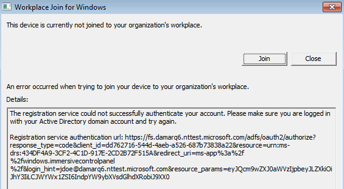

# Troubleshooting auto-registration of domain joined computers to Azure AD for Windows down-level clients 

This topic is applicable only to the following clients: 

- Windows 7 
- Windows 8.1 
- Windows Server 2008 R2 
- Windows Server 2012 
- Windows Server 2012 R2 
 

For Windows 10 or Windows Server 2016, see [Troubleshooting auto-registration of domain joined computers to Azure AD – Windows 10 and Windows Server 2016](active-directory-device-registration-troubleshoot-windows.md).

This topic assumes that you have configured auto-registration of domain-joined devices as outlined in described in [How to configure automatic registration of Windows domain-joined devices with Azure Active Directory](active-directory-device-registration-get-started.md).
 
This topic provides you with troubleshooting guidance on how to resolve potential issues.  
Some things to note for successful outcomes: 

- Registration of these clients on Azure AD is per user/device. As an example: If jdoe and jharnett log in to this device, a separate registration (DeviceID) is created for each of these users in the USER info tab.  

- Registration of these clients out of the box is configured to try at either logon or lock/unlock and there could be 5-minute delay that this is triggered using a Task Scheduler task. 

- A re-install of the operating system or a manual un-register and re-register may create a new registration on Azure AD and will result in multiple entries under the USER info tab in the Azure portal. 

## Step 1: Retrieve the registration status 

**To verify the registration status:**  

1. Open the command prompt as an administrator 

2. Type `"%programFiles%\Microsoft Workplace Join\autoworkplace.exe /i"`

This command displays a dialog box that provides you with more details about the join status.

## Step 2: Evaluate the registration status 

If the join was not successful, the dialog box provides you with details about the issue that has occured.

**The most common issues are:**

- A misconfigured AD FS or Azure AD

    

- You are not signed on as a domain user

    

- A quota has been reached

    

- The service is not responding 

    

You can also find the status information in the event log under **Applications and Services Log\Microsoft-Workplace Join**.
  
**The most common causes for a failed registration are:** 

- Your computer is not on the organization’s internal network or a VPN without connection to an on-premises AD domain controller.

- You are logged on to your computer with a local computer account. 

- Service configuration issues: 

  - The federation server has been configured to support **WIAORMULTIAUTHN**. 

  - There is no Service Connection Point object that points to your verified domain name in Azure AD in the AD forest where the computer belongs to.

  - A user has reached the limit of devices. Please see Get Started with Azure Active Directory Device Registration.

## Next steps

For more information, see the [Automatic device registration FAQ](active-directory-device-registration-faq.md) 
