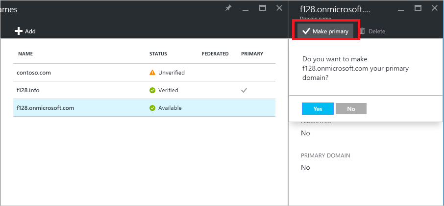

# Managing custom domain names in your Azure Active Directory
A domain name is an important part of the identifier for many directory resources: it is part of a user name or email address for a user, part of the address for a group, and can be part of the app ID URI for an application. A resource in Azure Active Directory (Azure AD) can include a domain name that is already verified to be owned by the directory that contains the resource. Only a global administrator can perform domain management tasks in Azure AD.

## Set the primary domain name for your Azure AD directory
When your directory is created, the initial domain name, such as ‘contoso.onmicrosoft.com,’ is also the primary domain name. The primary domain is the default domain name for a new user when you create a new user. This streamlines the process for an administrator to create new users in the portal. To change the primary domain name:

1. Sign in to the [Azure portal](https://portal.azure.com) with an account that's a global admin for the directory.
2. Select **More services**, enter **Azure Active Directory** in the text box, and then select **Enter**.
   
   
3. On the ***directory-name*** blade, select **Domain names**.
4. On the ***directory-name* - Domain names** blade, select the domain name you would like to make the primary domain name.
5. On the ***domainname*** blade (that is, the blade that opens that has your new domain name in the title), select the **Make primary** command. Confirm your choice when prompted.
   
   

You can change the primary domain name for your directory to be any verified custom domain that is not federated. Changing the primary domain for your directory will not change the user names for any existing users.

## Add custom domain names to your Azure AD
You can add up to 900 custom domain names to each Azure AD directory. The process to [add an additional custom domain name](active-directory-domains-add-azure-portal.md) is the same for the first custom domain name.

## Add subdomains of a custom domain
If you want to add a third-level domain name such as ‘europe.contoso.com’ to your directory, you should first add and verify the second-level domain, such as contoso.com. The subdomain will be automatically verified by Azure AD. To see that the subdomain that you just added has been verified, refresh the page in the browser that lists the domains.

## What to do if you change the DNS registrar for your custom domain name
If you change the DNS registrar for your custom domain name, you can continue to use your custom domain name with Azure AD itself without interruption and without additional configuration tasks. If you use your custom domain name with Office 365, Intune, or other services that rely on custom domain names in Azure AD, refer to the documentation for those services.

## Delete a custom domain name
You can delete a custom domain name from your Azure AD if your organization no longer uses that domain name, or if you need to use that domain name with another Azure AD.

To delete a custom domain name, you must first ensure that no resources in your directory rely on the domain name. You can't delete a domain name from your directory if:

* Any user has a user name, email address, or proxy address that includes the domain name.
* Any group has an email address or proxy address that includes the domain name.
* Any application in your Azure AD has an app ID URI that includes the domain name.

You must change or delete any such resource in your Azure AD directory before you can delete the custom domain name.

## Use PowerShell or Graph API to manage domain names
Most management tasks for domain names in Azure Active Directory can also be completed using Microsoft PowerShell, or programmatically using Azure AD Graph API.

* [Using PowerShell to manage domain names in Azure AD](https://msdn.microsoft.com/library/azure/e1ef403f-3347-4409-8f46-d72dafa116e0#BKMK_ManageDomains)
* [Using Graph API to manage domain names in Azure AD](https://msdn.microsoft.com/Library/Azure/Ad/Graph/api/domains-operations)

## Next steps
* [Add custom domain names](active-directory-domains-add-azure-portal.md)

