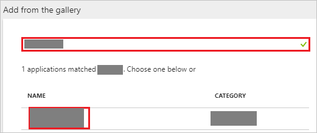
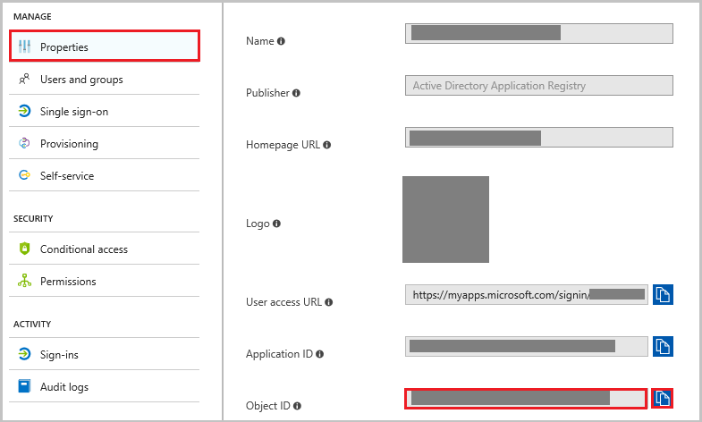
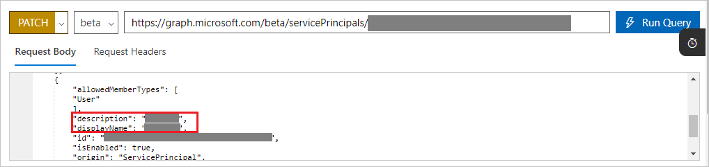

# Configuring Role claim issued in the SAML token for enterprise applications in Azure Active Directory

This feature allows users to customize the claim type for ‘roles’ claim in the response token received upon authorizing an app using Azure AD.

## Prerequisites
- An Azure AD subscription with directory setup
- A single sign-on enabled subscription
- You must configure SSO with your application

## When to use this feature

If your application expects custom roles to be passed in SAML response, you need to use this feature. This feature allows you to create as many roles as you need to be passed back from Azure AD to your application.

## Steps to use this feature

1. In the **[Azure portal](https://portal.azure.com)**, on the left navigation panel, click **Azure Active Directory** icon. 

	![The Azure Active Directory button][1]

2. Navigate to **Enterprise applications**. Then go to **All applications**.

	![The Enterprise applications blade][2]
	
3. To add new application, click **New application** button on the top of dialog.

	![The New application button][3]

4. In the search box, type the name of your application, select your application from result panel then click **Add** button to add the application.

	

5. Once the application is added, go to **Properties** page and copy the **Object ID**.

	

6. Open [Azure AD Graph Explorer](https://developer.microsoft.com/graph/graph-explorer) in another window.

	a. Sign in to the Graph Explorer site using the global Admin/Co-admin credentials for your tenant.

	b. You need to have sufficient permissions to create the roles. Click on **modify permissions** to get the required permissions. 

	

	c. Select following permissions from the list (if you don't have these already) and click "Modify Permissions" 

	

	d. This will ask you to login again and accept the consent. After accepting the consent, you are logged into the system again.

	e. Change the version to **beta** and fetch the list of Service Principals from your tenant using following query:
	
	 `https://graph.microsoft.com/beta/servicePrincipals`
		
	If you are using multiple directories, then you should follow this pattern `https://graph.microsoft.com/beta/contoso.com/servicePrincipals`
	
	
	
	f. From the list of service Principals fetched, get the one you need to modify. You can also use the Ctrl+F to search the application from all the listed ServicePrincipals. Search for the **Object id**, which you have copied from Properties page and use following query to get to the respective Service Principal.
	
	`https://graph.microsoft.com/beta/servicePrincipals/<objectID>`.

	

	g. Extract the appRoles property from the service principal object. 

	

	> [!Note]
	> If you are using the custom (non-gallery) app, you see the two default roles - User and msiam_access. In case of gallery app, msiam_access is the only default role. You do not need to make any changes in the default roles.

	h. You now need to generate new roles for your application. 

	i. Below JSON is an example of appRoles object. Please create a similar object to add the roles you want for your application. 

	```
	{
	   "appRoles": [
        {
            "allowedMemberTypes": [
                "User"
            ],
            "description": "msiam_access",
            "displayName": "msiam_access",
            "id": "b9632174-c057-4f7e-951b-be3adc52bfe6",
            "isEnabled": true,
            "origin": "Application",
            "value": null
        },
        {
            "allowedMemberTypes": [
                "User"
            ],
            "description": "Administrators Only",
            "displayName": "Admin",
            "id": "4f8f8640-f081-492d-97a0-caf24e9bc134",
            "isEnabled": true,
            "origin": "ServicePrincipal",
            "value": "Administrator"
        }
    ],
	}
	```
	> [!Note]
	> You can only add new roles after the **msiam_access** for the patch operation. Also, you can add as many roles as you want per your Organization need. Azure AD will send the **value** of these roles as the claim value in SAML response.
	
	j. Go back to your Graph Explorer and change the method from **GET** to **PATCH**. Patch the service principal object to have desired roles by updating appRoles property similar to the one shown above in the example. Click **Run Query** to execute the patch operation. A success message confirms the creation of the role.

	

7. After the service principal is patched with more roles, you can assign users to the respective roles. This can be done by going to portal and navigating to the respective app. Click on the **Users and Groups** tab on top. This lists all the users and groups which are already assigned to the application. You can add new users on new role and can also select the existing user and click **Edit** to change the role.

	

	a. To assign the role to any user, select the new role and click on **Assign** button in the bottom of the page.

	

	> [!Note]
	> Please note that you need to refresh your session in Azure portal to see new roles.

8. After assigning roles to the users, we need to update **Attributes** table to define customized mapping of **role** claim.

9. In the **User Attributes** section on the **Single sign-on** dialog, configure SAML token attribute as shown in the image and perform the following steps:
	
	| Attribute Name | Attribute Value |
	| -------------- | ----------------|    
	| Role Name 	 | user.assignedrole |

	a. Click **Add attribute** to open the **Add Attribute** dialog.

	

	

	b. In the **Name** textbox, type the attribute name as needed. In this example we have used **Role Name** as claim name.

	c. From the **Value** list, type the attribute value shown for that row.

	d. Leave the **Namespace** blank.
	
	e. Click **Ok**.

10. To test your application in IDP initiated Single Sign on, log into the Access Panel (https://myapps.microsoft.com) and click on your application tile. In the SAML token, you should see all the assigned roles for the user with the claim name you have given.

## Update existing role

To update an existing role, perform following steps -

1. Open [Azure AD Graph Explorer](https://developer.microsoft.com/graph/graph-explorer).

2. Sign in to the Graph Explorer site using the global Admin/Co-admin credentials for your tenant.
	
3. Change the version to **beta** and fetch the list of service Principals from your tenant using following query:
	
	`https://graph.microsoft.com/beta/servicePrincipals`
	
	If you are using multiple directories, then you should follow this pattern `https://graph.microsoft.com/beta/contoso.com/servicePrincipals`

	
	
4. From the list of Service Principals fetched, get the one you need to modify. You can also use the Ctrl+F to search the application from all the listed ServicePrincipals. Search for the **Object id**, which you have copied from Properties page and use following query to get to the respective Service Principal.
	
	`https://graph.microsoft.com/beta/servicePrincipals/<objectID>`.

	
	
5. Extract the appRoles property from the service principal object.
	
	
	
6. To update the existing role, please follow below steps:

	
	
	* Change the method from **GET** to **PATCH**.

	* Copy the existing roles and paste them in to the **Request Body**.

	* Update the value of role by updating the **Role description**, **Role value** or **Role displayname** as needed.

	* After you have updated all the required roles, click **Run Query**.
		
## Delete existing role

To delete an  existing role, perform following steps:

1. Open [Azure AD Graph Explorer](https://developer.microsoft.com/graph/graph-explorer) in another window.

2. Sign in to the Graph Explorer site using the global Admin/Co-admin credentials for your tenant.

3. Change the version to **beta** and fetch the list of service Principals from your tenant using following query:
	
	`https://graph.microsoft.com/beta/servicePrincipals`
	
	If you are using multiple directories, then you should follow this pattern `https://graph.microsoft.com/beta/contoso.com/servicePrincipals`
	
	
	
4. From the list of service Principals fetched, get the one you need to modify. You can also use the Ctrl+F to search the application from all the listed ServicePrincipals. Search for the **Object id**, which you have copied from Properties page and use following query to get to the respective Service Principal.
	 
	`https://graph.microsoft.com/beta/servicePrincipals/<objectID>`.

	
	
5. Extract the appRoles property from the service principal object.
	
	

6. To delete the existing role, please follow below steps:

	

	* Change the method from **GET** to **PATCH**.

	* Copy the existing roles from the application and paste them in the **Request Body**.
		
	* Set the **IsEnabled** value to **false** for the role, which you want to delete

	* Click **Run Query**.
	
	> [!NOTE] 
	> Please make sure that you have **msiam_access** user role and the id is matching in the generated role.
	
7. Once the role is disabled, delete that role block from the appRoles section, keep the method as **PATCH** and click **Run Query**.
	
8. After running the query the role will be deleted.
	
	> [!NOTE]
	> The role needs to be disabled first before it can be removed. 

## Next Steps

Refer [App documentation ](https://docs.microsoft.com/en-us/azure/active-directory/active-directory-saas-tutorial-list) for the additional steps.

<!--Image references-->
<!--Image references-->

[1]: ./media/active-directory-enterprise-app-role-management/tutorial_general_01.png
[2]: ./media/active-directory-enterprise-app-role-management/tutorial_general_02.png
[3]: ./media/active-directory-enterprise-app-role-management/tutorial_general_03.png
[4]: ./media/active-directory-enterprise-app-role-management/tutorial_general_04.png
