# What's new in Enterprise Application management in Azure Active Directory 

Azure Active Directory (Azure AD) has enhanced enterprise application management tools, with new features and capabilities to make managing apps simpler and efficient.

Following are some of the enhancements for Azure AD in the [Azure portal](https://portal.azure.com).

- An improved application gallery experience, with a simplified application creation model and support for all the application types that you’re used to. 
- A brand-new quick start experience that can help you get going with a pilot of your application. 
- Configure self-service policies with just a few clicks. 
- Improvements to application proxy, single sign-on configuration, and bring your own application experiences, allowing you to get more done than before.

## Improvements to the Azure Active Directory Application Gallery

Add your favorite applications whether they are from the [application gallery](active-directory-appssoaccess-whatis.md#get-started-with-the-azure-ad-application-gallery), custom applications you’re extending to the cloud, or new applications you’re developing.  You can get started with this new experience by clicking **Add** on the **Enterprise Applications** overview or **All applications** blades.
 
  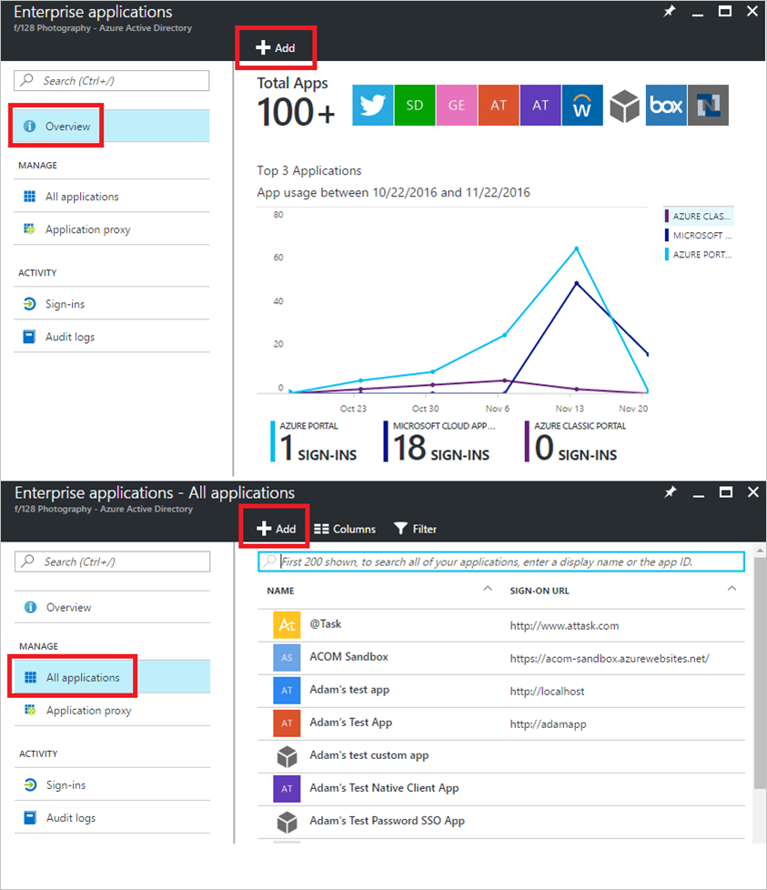

Once in the gallery, you’ll see all our featured applications which support user provisioning displayed front-and-center.  You can browse all sorts of different categories to drill into the applications you care about, or you can use the search experience to rapidly find the applications you want to integrate.

  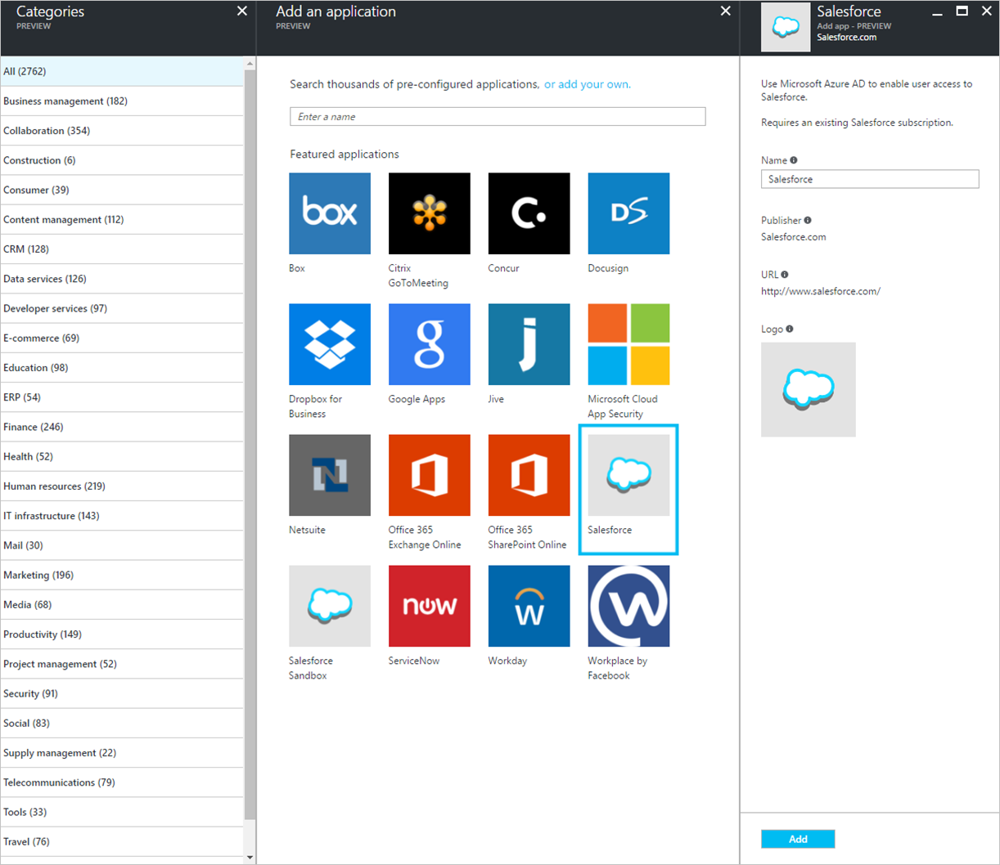

## Add custom applications from one place

In addition to adding pre-integrated applications from the gallery, all the custom application configuration experiences that you were used to in the classic management portal are now possible in the new portal. Whether you are extending an application from on-premises using the application proxy, integrating your own password or federated SSO application, or creating a brand-new application using the application registry, you can get to it all from this one single place.

  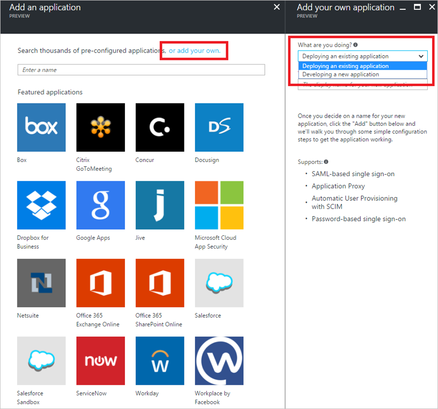

 
**To get started adding your own application**:

1. Click the **add your own link** at the top of the application gallery. 
2. You’ll see two options in front of you: **deploy an existing application** or **develop a new application**. Read on to learn the difference between the two options and how to use them.

### Deploying existing applications

1. If you’ve got an application running already and just want to integrate it into Azure AD for single-sign on or provisioning, choose the **Deploy an existing application** option. Pick a name for your application, click **Add**.
2. That's it! Instead of needing to know all the details about your application up front, you can now set up how your new application works by navigating through the left menu and configuring the application to your liking at any time.

  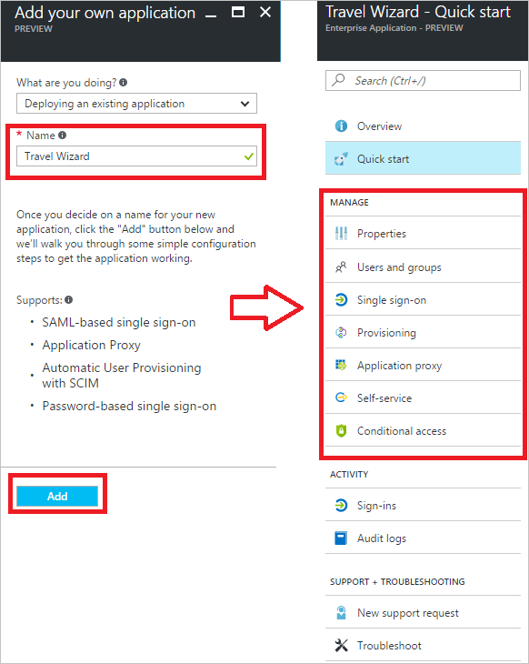
 
### Developing new applications

1. If you’re developing a new application, there's an easy way for you to get to the Application Registry right from the gallery:
2. Click on the **add your own** option from the Application Gallery, select the **develop an existing application** choice, and you’ll see a quick link right to the application add experience.

  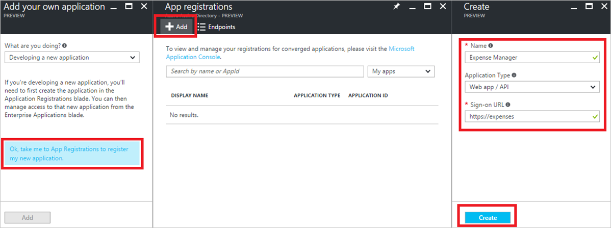

>[!NOTE]
>Once you add an application using the Application Registry, you’ll see it show up in the list of Enterprise Applications where you’ll be able to configure single sign-on and manage access policies for your new application.

  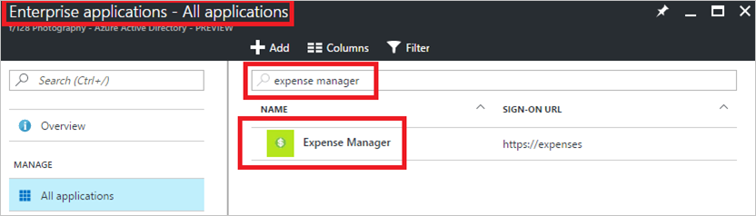

## Quick start: Get going with your new application right away 

After you’ve added an application, whether it be pre-integrated or your own app, we’ve created a tailored quick-start experience to get you grounded in the new applications experience quickly. If you follow each option systematically, we’ll walk you through the UI and show you how to get going with a pilot of your new application as quickly as possible. 
 
  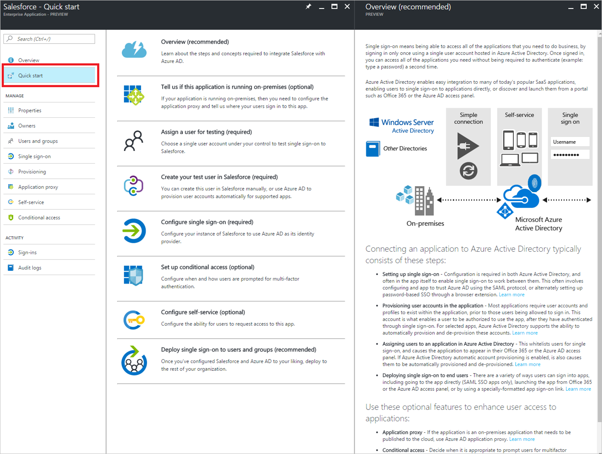

 You can visit this new quick start experience at any time, and for any application, by clicking on **Quick start** from the application left navigation menu.

## Updated application proxy configuration
Now, let’s say one of the new applications you added is running in your on-premises environment and you want to integrate it with Azure AD.  One of the cool new things about the new application configuration experience in the new Azure AD portal is that by splitting the application’s sign-on mode from its application proxy configuration, you can now easily expose password SSO or federated applications that are running in your corporate network right to the cloud, without having to create multiple instances of the application.

In addition to this, you can now also configure any of the new applications you’ve added for use with the Azure AD Application Proxy right from the new portal, including applications which support native Windows authentication experiences.

  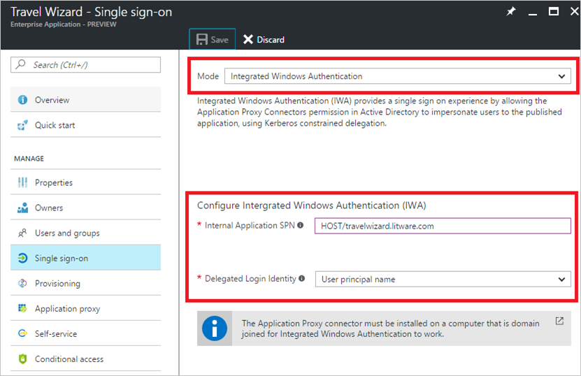
 

To get started configuring a native Windows authentication application with the Application Proxy:
1. Click on the Single sign-on navigation item and choose **Integrated Windows Authentication** from the sign-on settings blade and configure the settings to your liking.
2. On top of supporting these new authentication modes, you can now also upload certificates from custom domains to support applications running on secure endpoints within your organization.  
 
   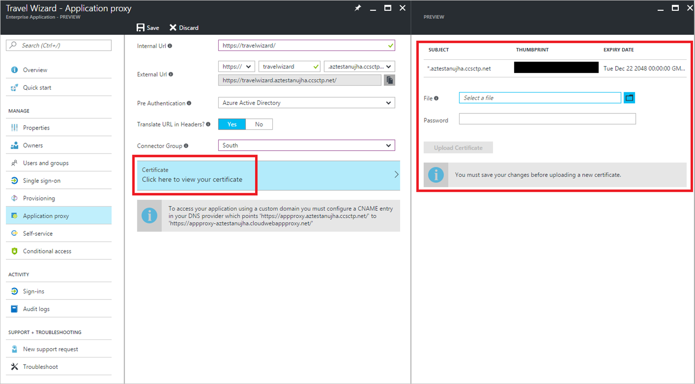

3. To upload a new certificate for your favorite on-premises application, click on the **Application proxy** option from the left navigation menu, click the **Certificate** selector, and upload a certificate file we can use to encrypt requests from our cloud endpoint to your application.

## Advanced federated single sign-on configuration

For those of you using federated applications today, there are many new features in the SAML-based sign-on configuration blade. To start with, now you can fully customize, add, remove, and map the existing user attributes issued as claims in SAML tokens.
 
  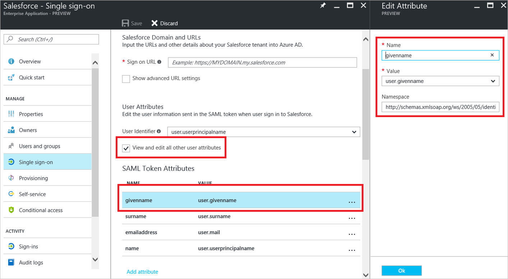

To check that out the new federated SSO configuration:
1. Open a federated application’s **single sign-on** blade from the left navigation menu and make sure the ‘*SAML-based Sign-on** mode is selected. 
2. Once there, enable the checkbox under the **User Attributes** heading to modify all of the attributes included in the SAML token passed to that application.

You can also create, rollover, and manage certificates used for federated single sign-on, as well as edit who gets notified when your certificate is about to expire. You’ll see these new options under the **Certificates** heading on the same Single sign-on blade.
 
  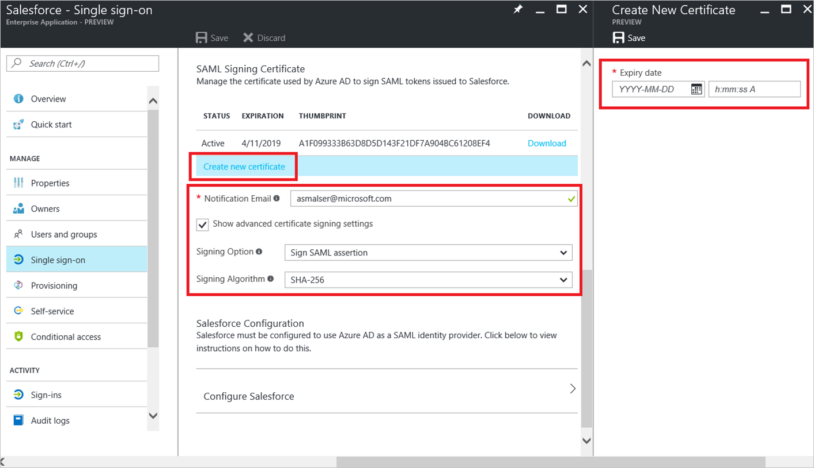

### Relay State paramenter
Finally, we’ve also extended the set of SAML URL parameters we support to include the **Relay State parameter**, which is the page your users will land on inside of a federated application once the sign-in is completed. This is very useful setting to configure if you want to send your users to a specific place within the application to get them going quickly.

  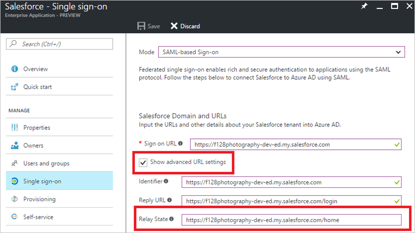
 
**To set the relay state parameter**:

1. Enable the **Show advanced URL settings** check-box under the **Domain and URLs** heading on the single-sign on configuration blade. 
2. Once you do this, you’ll see a set of new URL input boxes appear which will allow you to set this, and other, SAML URL settings.

## Bring your own password SSO applications

We know that not every application supports federation right out of the box. For example, maybe one of the new applications you added has a custom login screen that your users use a username and password to sign in to. You can still integrate these types of applications with Azure AD using our **Bring your own applications** feature, which is now available for you to configure in the new portal.
 
  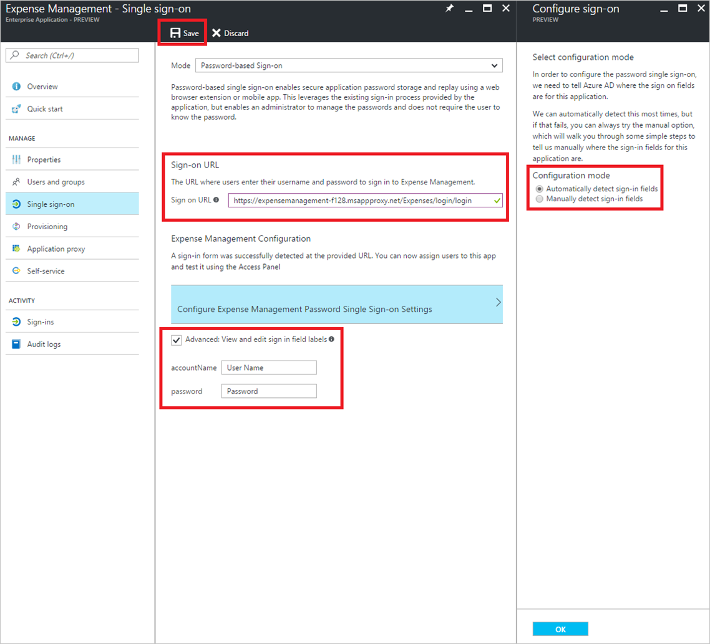

**To check out the 'Bring your own applications' feature**:

1. After you set the single sign-on mode for a new custom application that you’ve added to **Password-based Sign-on**, enter the URL where the application renders its login screen and click **Save**.  
2. Once you do that, we’ll automatically scrape that URL for a username and password input box and allow you to use Azure AD to securely transmit passwords to that application using the access panel browser extension.

## Configure self-service application access

After you’ve added lots of new applications, maybe you want to allow your users to browse and add those applications to their own access panels, without needing to bother you as an administrator. Now, with this latest release, you can configure and manage self-service application access right from the new portal.

  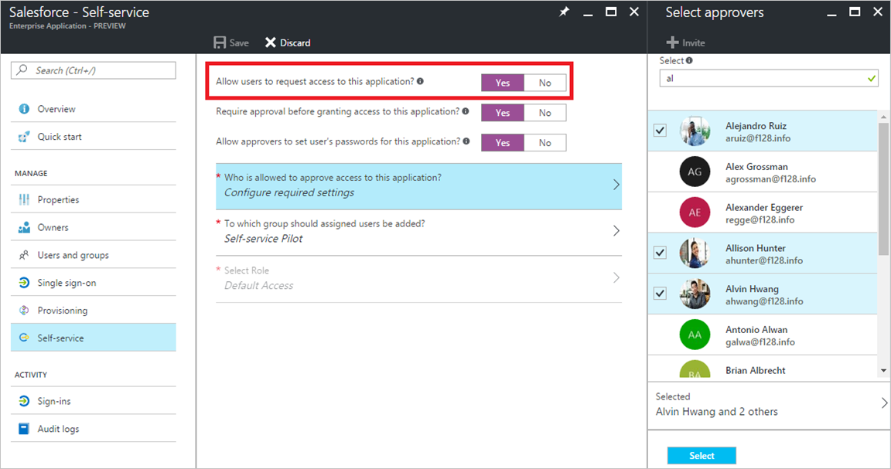
 
**To configure and manage self-service application access**:

1. To get started, you can select the **Self-service** option from the application’s left navigation menu and set the **Allow users to request access to this application?** option to ‘**Yes**’. 
2. This will enable you to configure who is allowed to approve access to this application, and which group self-service users will be added. In addition, if the application is configured for password single-sign on, you’ll also see another option which lets you optionally allow those approvers to manage the passwords assigned to the application.

##Feedback

We hope you like using the improved Azure AD experience. Please keep the feedback coming! Post your feedback and ideas for improvement in the **Admin Portal** section of our [feedback forum](https://feedback.azure.com/forums/169401-azure-active-directory/category/162510-admin-portal).  We’re excited about building cool new stuff every day, and use your guidance to shape and define what we build next.

## Next steps

For more details, see [Managing Applications with Azure Active Directory](active-directory-enable-sso-scenario.md).

