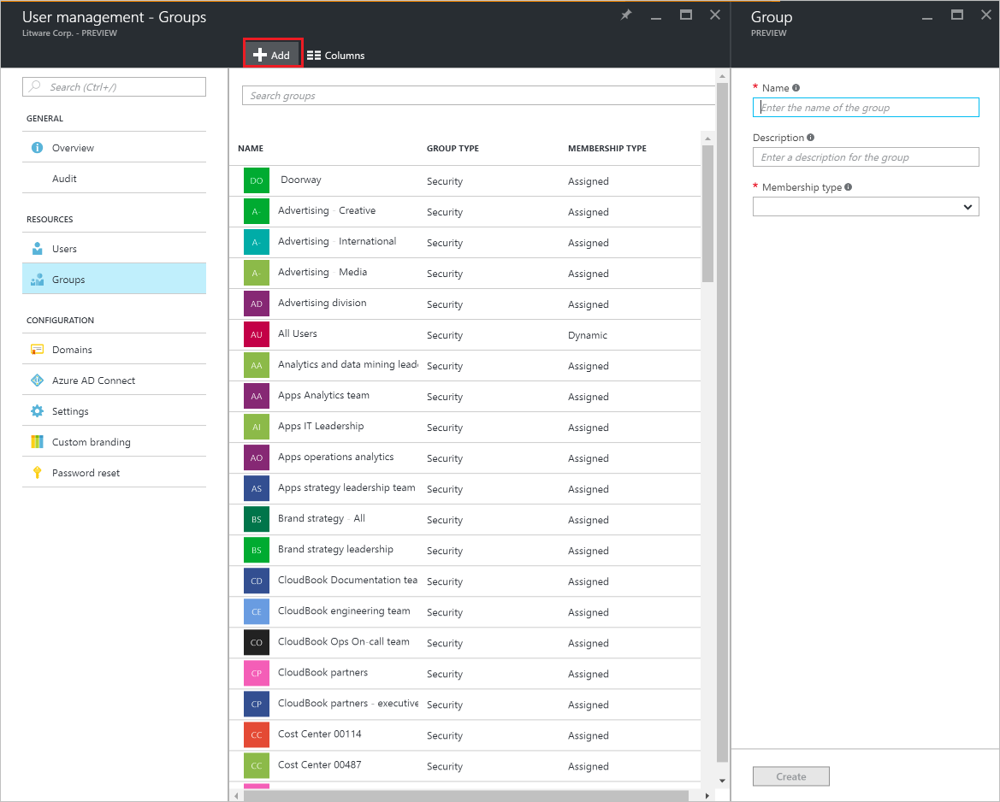
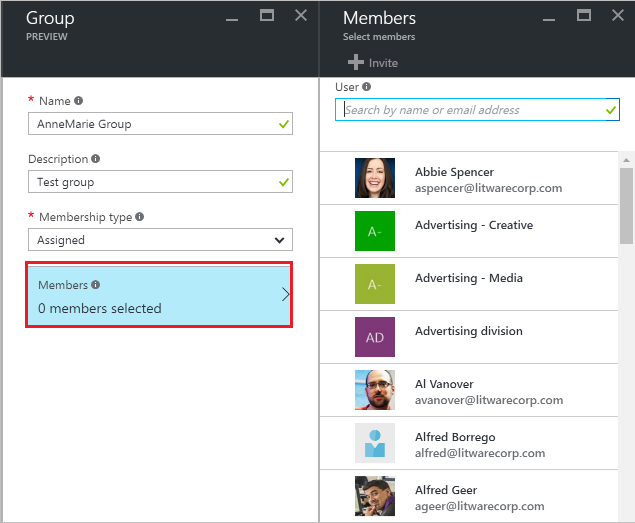
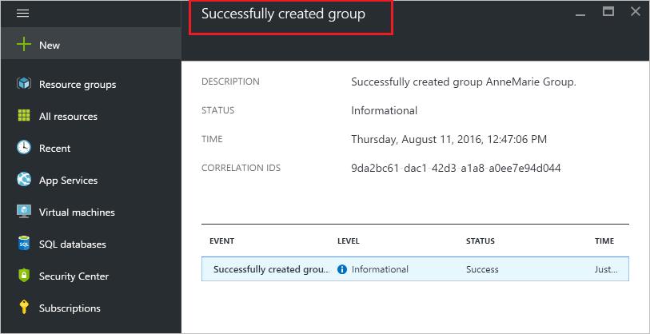

# Create a group and add members in Azure Active Directory
> [!div class="op_single_selector"]
> * [Azure portal](active-directory-groups-create-azure-portal.md)
> * [Azure classic portal](active-directory-accessmanagement-manage-groups.md)
> * [PowerShell](active-directory-accessmanagement-groups-settings-v2-cmdlets.md)
>
>

This article explains how to create and populate a new group in Azure Active Directory. Use a group to perform management tasks such as assigning licenses or permissions to a number of users or devices at once.

## How do I create a group?
1. Sign in to the [Azure portal](https://portal.azure.com) with an account that's a global admin for the directory.
2. Select **More services**, enter **User and groups** in the text box, and then select **Enter**.

   
3. On the **Users and groups** blade, select **All groups**.

   
4. On the **Users and groups - All groups** blade, select the **Add** command.

   
5. On the **Group** blade, add a name and description for the group.
6. To select members to add to the group, select **Assigned** in the **Membership type** box, and then select **Members**. For more information about how to manage the membership of a group dynamically, see [Using attributes to create advanced rules for group membership](active-directory-groups-dynamic-membership-azure-portal.md).

   
7. On the **Members** blade, select one or more users or devices to add to the group and select the **Select** button at the bottom of the blade to add them to the group. The **User** box filters the display based on matching your entry to any part of a user or device name. No wildcard characters are accepted in that box.
8. When you finish adding members to the group, select **Create** on the **Group** blade.    

   

## Next steps
These articles provide additional information on Azure Active Directory.

* [See existing groups](active-directory-groups-view-azure-portal.md)
* [Manage settings of a group](active-directory-groups-settings-azure-portal.md)
* [Manage members of a group](active-directory-groups-members-azure-portal.md)
* [Manage memberships of a group](active-directory-groups-membership-azure-portal.md)
* [Manage dynamic rules for users in a group](active-directory-groups-dynamic-membership-azure-portal.md)
