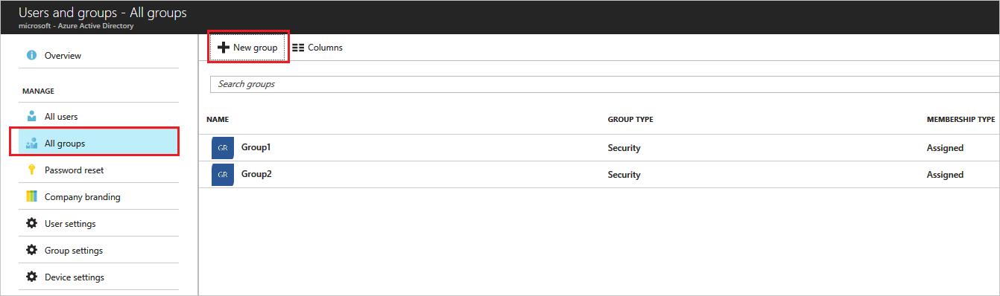
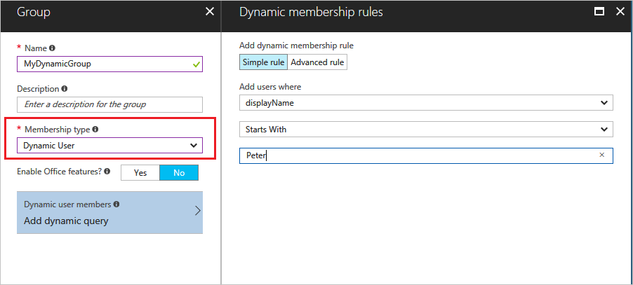

---

title: Attribute-based dynamic group membership in Azure Active Directory | Microsoft Docs
description: How to create advanced rules for dynamic group membership including supported expression rule operators and parameters.
services: active-directory
documentationcenter: ''
author: curtand
manager: femila
editor: ''

ms.assetid: fb434cc2-9a91-4ebf-9753-dd81e289787e
ms.service: active-directory
ms.workload: identity
ms.tgt_pltfrm: na
ms.devlang: na
ms.topic: article
ms.date: 09/29/2017
ms.author: curtand
ms.reviewer: piotrci

ms.custom: H1Hack27Feb2017;it-pro

---
# Create attribute-based rules for dynamic group membership in Azure Active Directory
In Azure Active Directory (Azure AD), you can create advanced rules to enable complex attribute-based dynamic memberships for groups. This article details the attributes and syntax to create dynamic membership rules for users or devices.

When any attributes of a user or device change, the system evaluates all dynamic group rules in a directory to see if the change would trigger any group adds or removes. If a user or device satisfies a rule on a group, they are added as a member of that group. If they no longer satisfy the rule, they are removed.

> [!NOTE]
> - You can set up a rule for dynamic membership on security groups or Office 365 groups.
>
> - This feature requires an Azure AD Premium P1 license for each user member added to at least one dynamic group. It is not mandatory to actually assign licenses to users for them to be members in dynamic groups, but you do need to have the minimum number of licenses in the tenant to cover all such users. For example: if you have a total of 1,000 unique users in all dynamic groups in your tenant, you need to have at least 1,000 licenses for Azure AD Premium P1, or above, to meet the license requirement.
>
> - You can create a dynamic group for devices or users, but you cannot create a rule that contains both user and device objects.

> - At the moment it is not possible to create a device group based on owning user's attributes. Device membership rules can only reference immediate attributes of device objects in the directory.

## To create an advanced rule
1. Sign in to the [Azure AD admin center](https://aad.portal.azure.com) with an account that is a global administrator or a user account administrator.
2. Select **Users and groups**.
3. Select **All groups**, and select **New group**.

   

4. On the **Group** blade, enter a name and description for the new group. Select a **Membership type** of either **Dynamic User** or **Dynamic Device**, depending on whether you want to create a rule for users or devices, and then select **Add dynamic query**. You can use the rule builder to build a simple rule, or write an advanced rule yourself. This article contains more information about available user and device attributes as well as examples of advanced rules.

   

5. After creating the rule, select **Add query** at the bottom of the blade.
6. Select **Create** on the **Group** blade to create the group.

> [!TIP]
> Group creation may fail if the advanced rule you entered was incorrect. A notification will be displayed in the upper-right hand corner of the portal; it contains an explanation of why the rule could not be accepted by the system. Read it carefully to understand how you need to adjust the rule to make it valid.

## Constructing the body of an advanced rule
The advanced rule that you can create for the dynamic memberships for groups is essentially a binary expression that consists of three parts and results in a true or false outcome. The three parts are:

* Left parameter
* Binary operator
* Right constant

A complete advanced rule looks similar to this: (leftParameter binaryOperator "RightConstant"), where the opening and closing parenthesis are optional for the entire binary expression, double quotes are optional as well, only required for the right constant when it is string, and the syntax for the left parameter is user.property. An advanced rule can consist of more than one binary expressions separated by the -and, -or, and -not logical operators.

The following are examples of a properly constructed advanced rule:
```
(user.department -eq "Sales") -or (user.department -eq "Marketing")
(user.department -eq "Sales") -and -not (user.jobTitle -contains "SDE")
```
For the complete list of supported parameters and expression rule operators, see sections below. For the attributes used for device rules, see [Using attributes to create rules for device objects](#using-attributes-to-create-rules-for-device-objects).

The total length of the body of your advanced rule cannot exceed 2048 characters.

> [!NOTE]
> String and regex operations are not case sensitive. You can also perform Null checks, using $null as a constant, for example, user.department -eq $null.
> Strings containing quotes " should be escaped using 'character, for example, user.department -eq \`"Sales".

## Supported expression rule operators
The following table lists all the supported expression rule operators and their syntax to be used in the body of the advanced rule:

| Operator | Syntax |
| --- | --- |
| Not Equals |-ne |
| Equals |-eq |
| Not Starts With |-notStartsWith |
| Starts With |-startsWith |
| Not Contains |-notContains |
| Contains |-contains |
| Not Match |-notMatch |
| Match |-match |
| In | -in |
| Not In | -notIn |

## Operator precedence

All Operators are listed below per precedence from lower to higher. Operators on same line are in equal precedence:
````
-any -all
-or
-and
-not
-eq -ne -startsWith -notStartsWith -contains -notContains -match –notMatch -in -notIn
````
All operators can be used with or without the hyphen prefix. Parentheses are needed only when precedence does not meet your requirements.
For example:
```
   user.department –eq "Marketing" –and user.country –eq "US"
```
is equivalent to:
```
   (user.department –eq "Marketing") –and (user.country –eq "US")
```
## Using the -In and -notIn operators

If you want to compare the value of a user attribute against a number of different values you can use the -In or -notIn operators. Here is an example using the -In operator:
```
	user.department -In [ "50001", "50002", "50003", “50005”, “50006”, “50007”, “50008”, “50016”, “50020”, “50024”, “50038”, “50039”, “51100” ]
```
Note the use of the "[" and "]" at the beginning and end of the list of values. This condition evaluates to True of the value of user.department equals one of the values in the list.


## Query error remediation
The following table lists common errors and how to correct them

| Query Parse Error | Error Usage | Corrected Usage |
| --- | --- | --- |
| Error: Attribute not supported. |(user.invalidProperty -eq "Value") |(user.department -eq "value")<br/><br/>Make sure the attribute is on the [supported properties list](#supported-properties). |
| Error: Operator is not supported on attribute. |(user.accountEnabled -contains true) |(user.accountEnabled -eq true)<br/><br/>The operator used is not supported for the property type (in this example, -contains cannot be used on type boolean). Use the correct operators for the property type. |
| Error: Query compilation error. |1. (user.department -eq "Sales") (user.department -eq "Marketing")<br/><br/>2. (user.userPrincipalName -match "*@domain.ext") |1. Missing operator. Use -and or -or two join predicates<br/><br/>(user.department -eq "Sales") -or (user.department -eq "Marketing")<br/><br/>2.Error in regular expression used with -match<br/><br/>(user.userPrincipalName -match ".*@domain.ext"), alternatively: (user.userPrincipalName -match "@domain.ext$")|

## Supported properties
The following are all the user properties that you can use in your advanced rule:

### Properties of type boolean
Allowed operators

* -eq
* -ne

| Properties | Allowed values | Usage |
| --- | --- | --- |
| accountEnabled |true false |user.accountEnabled -eq true |
| dirSyncEnabled |true false |user.dirSyncEnabled -eq true |

### Properties of type string
Allowed operators

* -eq
* -ne
* -notStartsWith
* -StartsWith
* -contains
* -notContains
* -match
* -notMatch
* -in
* -notIn

| Properties | Allowed values | Usage |
| --- | --- | --- |
| city |Any string value or $null |(user.city -eq "value") |
| country |Any string value or $null |(user.country -eq "value") |
| companyName | Any string value or $null | (user.companyName -eq "value") |
| department |Any string value or $null |(user.department -eq "value") |
| displayName |Any string value |(user.displayName -eq "value") |
| facsimileTelephoneNumber |Any string value or $null |(user.facsimileTelephoneNumber -eq "value") |
| givenName |Any string value or $null |(user.givenName -eq "value") |
| jobTitle |Any string value or $null |(user.jobTitle -eq "value") |
| mail |Any string value or $null (SMTP address of the user) |(user.mail -eq "value") |
| mailNickName |Any string value (mail alias of the user) |(user.mailNickName -eq "value") |
| mobile |Any string value or $null |(user.mobile -eq "value") |
| objectId |GUID of the user object |(user.objectId -eq "1111111-1111-1111-1111-111111111111") |
| onPremisesSecurityIdentifier | On-premises security identifier (SID) for users who were synchronized from on-premises to the cloud. |(user.onPremisesSecurityIdentifier -eq "S-1-1-11-1111111111-1111111111-1111111111-1111111") |
| passwordPolicies |None DisableStrongPassword DisablePasswordExpiration DisablePasswordExpiration, DisableStrongPassword |(user.passwordPolicies -eq "DisableStrongPassword") |
| physicalDeliveryOfficeName |Any string value or $null |(user.physicalDeliveryOfficeName -eq "value") |
| postalCode |Any string value or $null |(user.postalCode -eq "value") |
| preferredLanguage |ISO 639-1 code |(user.preferredLanguage -eq "en-US") |
| sipProxyAddress |Any string value or $null |(user.sipProxyAddress -eq "value") |
| state |Any string value or $null |(user.state -eq "value") |
| streetAddress |Any string value or $null |(user.streetAddress -eq "value") |
| surname |Any string value or $null |(user.surname -eq "value") |
| telephoneNumber |Any string value or $null |(user.telephoneNumber -eq "value") |
| usageLocation |Two lettered country code |(user.usageLocation -eq "US") |
| userPrincipalName |Any string value |(user.userPrincipalName -eq "alias@domain") |
| userType |member guest $null |(user.userType -eq "Member") |

### Properties of type string collection
Allowed operators

* -contains
* -notContains

| Properties | Allowed values | Usage |
| --- | --- | --- |
| otherMails |Any string value |(user.otherMails -contains "alias@domain") |
| proxyAddresses |SMTP: alias@domain smtp: alias@domain |(user.proxyAddresses -contains "SMTP: alias@domain") |

## Multi-value properties
Allowed operators

* -any (satisfied when at least one item in the collection matches the condition)
* -all (satisfied when all items in the collection match the condition)

| Properties | Values | Usage |
| --- | --- | --- |
| assignedPlans |Each object in the collection exposes the following string properties: capabilityStatus, service, servicePlanId |user.assignedPlans -any (assignedPlan.servicePlanId -eq "efb87545-963c-4e0d-99df-69c6916d9eb0" -and assignedPlan.capabilityStatus -eq "Enabled") |

Multi-value properties are collections of objects of the same type. You can use -any and -all operators to apply a condition to one or all of the items in the collection, respectively. For example:

assignedPlans is a multi-value property that lists all service plans assigned to the user. The below expression will select users who have the Exchange Online (Plan 2) service plan that is also in Enabled state:

```
user.assignedPlans -any (assignedPlan.servicePlanId -eq "efb87545-963c-4e0d-99df-69c6916d9eb0" -and assignedPlan.capabilityStatus -eq "Enabled")
```

(The Guid identifier identifies the Exchange Online (Plan 2) service plan.)

> [!NOTE]
> This is useful if you want to identify all users for whom an Office 365 (or other Microsoft Online Service) capability has been enabled, for example to target them with a certain set of policies.

The following expression will select all users who have any service plan that is associated with the Intune service (identified by service name "SCO"):
```
user.assignedPlans -any (assignedPlan.service -eq "SCO" -and assignedPlan.capabilityStatus -eq "Enabled")
```

## Use of Null values

To specify a null value in a rule, you can use "null" or $null. Example:
```
   user.mail –ne null
```
is equivalent to
```
   user.mail –ne $null
   ```

## Extension attributes and custom attributes
Extension attributes and custom attributes are supported in dynamic membership rules.

Extension attributes are synced from on-premises Window Server AD and take the format of "ExtensionAttributeX", where X equals 1 - 15.
An example of a rule that uses an extension attribute would be
```
(user.extensionAttribute15 -eq "Marketing")
```
Custom Attributes are synced from on-premises Windows Server AD or from a connected SaaS application and the the format of "user.extension_[GUID]\__[Attribute]", where [GUID] is the unique identifier in AAD for the application that created the attribute in AAD and [Attribute] is the name of the attribute as it was created.
An example of a rule that uses a custom attribute is
```
user.extension_c272a57b722d4eb29bfe327874ae79cb__OfficeNumber  
```
The custom attribute name can be found in the directory by querying a user's attribute using Graph Explorer and searching for the attribute name.

## "Direct Reports" Rule
You can create a group containing all direct reports of a manager. When the manager's direct reports change in the future, the group's membership will be adjusted automatically.

> [!NOTE]
> 1. For the rule to work, make sure the **Manager ID** property is set correctly on users in your tenant. You can check the current value for a user on their **Profile tab**.
> 2. This rule only supports **direct** reports. It is currently not possible to create a group for a nested hierarchy, e.g. a group that includes direct reports and their reports.

**To configure the group**

1. Follow steps 1-5 from section [To create the advanced rule](#to-create-the-advanced-rule), and select a **Membership type** of **Dynamic User**.
2. On the **Dynamic membership rules** blade, enter the rule with the following syntax:

    *Direct Reports for "{obectID_of_manager}"*

    An example of a valid rule:
```
                    Direct Reports for "62e19b97-8b3d-4d4a-a106-4ce66896a863"
```
    where “62e19b97-8b3d-4d4a-a106-4ce66896a863” is the objectID of the manager. The object ID can be found on manager's **Profile tab**.
3. After saving the rule, all users with the specified Manager ID value will be added to the group.

## Using attributes to create rules for device objects
You can also create a rule that selects device objects for membership in a group. The following device attributes can be used.

 Device attribute  | Values | Example
 ----- | ----- | ----------------
 accountEnabled | true false | (device.accountEnabled -eq true)
 displayName | any string value |(device.displayName -eq "Rob Iphone”)
 deviceOSType | any string value | (device.deviceOSType -eq "iPad") -or (device.deviceOSType -eq "iPhone")
 deviceOSVersion | any string value | (device.OSVersion -eq "9.1")
 deviceCategory | a valid device category name | (device.deviceCategory -eq "BYOD")
 deviceManufacturer | any string value | (device.deviceManufacturer -eq "Samsung")
 deviceModel | any string value | (device.deviceModel -eq "iPad Air")
 deviceOwnership | Personal, Company, Unknown | (device.deviceOwnership -eq "Company")
 domainName | any string value | (device.domainName -eq "contoso.com")
 enrollmentProfileName | Apple Device Enrollment Profile name | (device.enrollmentProfileName -eq "DEP iPhones")
 isRooted | true false | (device.isRooted -eq true)
 managementType | MDM (for mobile devices)<br>PC (for computers managed by the Intune PC agent) | (device.managementType -eq "MDM")
 organizationalUnit | any string value matching the name of the organizational unit set by an on-premises Active Directory | (device.organizationalUnit -eq "US PCs")
 deviceId | a valid Azure AD device ID | (device.deviceId -eq "d4fe7726-5966-431c-b3b8-cddc8fdb717d")
 objectId | a valid Azure AD object ID |  (device.objectId -eq 76ad43c9-32c5-45e8-a272-7b58b58f596d")


## Changing dynamic membership to static, and vice versa
It is possible to change how membership is managed in a group. This is useful when you want to keep the same group name and ID in the system, so any existing references to the group are still valid; creating a new group would require updating those references.

We are in the process of updating the Azure portal to support this functionality. In the meantime, you can use the [Azure classic portal](https://manage.windowsazure.com) (follow the instructions [here](active-directory-groups-dynamic-membership-azure-portal.md)) or use PowerShell cmdlets as shown below.

> [!WARNING]
> When changing an existing static group to a dynamic group, all existing members will be removed from the group, and then the membership rule will be processed to add new members. If the group is used to control access to apps or resources, the original members may lose access until the membership rule is fully processed.
>
> It is a recommended practice to test the new membership rule beforehand to make sure that the new membership in the group is as expected.

**Using PowerShell to change membership management on a group**

> [!NOTE]
> To change dynamic group properties you will need to use cmdlets from **the preview version of** [Azure AD PowerShell Version 2](https://docs.microsoft.com/en-us/powershell/azure/active-directory/install-adv2?view=azureadps-2.0). You can install the preview from [here](https://www.powershellgallery.com/packages/AzureADPreview).

Here is an example of functions that switch membership management on an existing group. Note that care is taken to correctly manipulate the GroupTypes property and preserve any values that may exist there, unrelated to dynamic membership.

```
#The moniker for dynamic groups as used in the GroupTypes property of a group object
$dynamicGroupTypeString = "DynamicMembership"

function ConvertDynamicGroupToStatic
{
    Param([string]$groupId)

    #existing group types
    [System.Collections.ArrayList]$groupTypes = (Get-AzureAdMsGroup -Id $groupId).GroupTypes

    if($groupTypes -eq $null -or !$groupTypes.Contains($dynamicGroupTypeString))
    {
        throw "This group is already a static group. Aborting conversion.";
    }


    #remove the type for dynamic groups, but keep the other type values
    $groupTypes.Remove($dynamicGroupTypeString)

    #modify the group properties to make it a static group: i) change GroupTypes to remove the dynamic type, ii) pause execution of the current rule
    Set-AzureAdMsGroup -Id $groupId -GroupTypes $groupTypes.ToArray() -MembershipRuleProcessingState "Paused"
}

function ConvertStaticGroupToDynamic
{
    Param([string]$groupId, [string]$dynamicMembershipRule)

    #existing group types
    [System.Collections.ArrayList]$groupTypes = (Get-AzureAdMsGroup -Id $groupId).GroupTypes

    if($groupTypes -ne $null -and $groupTypes.Contains($dynamicGroupTypeString))
    {
        throw "This group is already a dynamic group. Aborting conversion.";
    }
    #add the dynamic group type to existing types
    $groupTypes.Add($dynamicGroupTypeString)

    #modify the group properties to make it a static group: i) change GroupTypes to add the dynamic type, ii) start execution of the rule, iii) set the rule
    Set-AzureAdMsGroup -Id $groupId -GroupTypes $groupTypes.ToArray() -MembershipRuleProcessingState "On" -MembershipRule $dynamicMembershipRule
}
```
To make a group static:
```
ConvertDynamicGroupToStatic "a58913b2-eee4-44f9-beb2-e381c375058f"
```
To make a group dynamic:
```
ConvertStaticGroupToDynamic "a58913b2-eee4-44f9-beb2-e381c375058f" "user.displayName -startsWith ""Peter"""
```
## Next steps
These articles provide additional information on groups in Azure Active Directory.

* [See existing groups](active-directory-groups-view-azure-portal.md)
* [Create a new group and adding members](active-directory-groups-create-azure-portal.md)
* [Manage settings of a group](active-directory-groups-settings-azure-portal.md)
* [Manage memberships of a group](active-directory-groups-membership-azure-portal.md)
* [Manage dynamic rules for users in a group](active-directory-groups-dynamic-membership-azure-portal.md)
