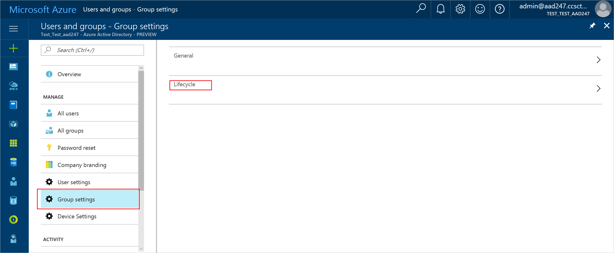

---
title: Set expiration properties for a group in Azure Active Directory preview | Microsoft Docs
description: How to set expiration dates and send expiration notifications for a group in Azure Active Directory
services: active-directory
documentationcenter: ''
author: curtand
manager: femila
editor: ''

ms.assetid: 
ms.service: active-directory
ms.workload: identity
ms.tgt_pltfrm: na
ms.devlang: na
ms.topic: article
ms.date: 05/24/2017
ms.author: curtand                       

---

# Set expiration properties for an Office 365 group and send expiration notifications
With administrators and information workers able to create and administer their own groups, as scale increases, you there need the ability to set the global options in a tenant for the default expiration behaviors of groups. You can use this functionality to automatically reclaim resource space and prevent address book pollution with groups that are no longer actively used. For example, groups with one or zero members.

1. Open the [Azure portal](https://portal.azure.com) with an account What creds are required?

2. Open Azure AD, select **More services**, and then select **Users and groups**.

3. on the **Users and groups** blade, select **Group settings** and then in **Users and groups - Group settings** select **Lifecycle**.

  

3. Select **Group settings** and then select **Lifecycle** to open the Lifecycle settings.

  

4. In the **Lifecycle** settings, you can:

  - Turn expiration on or off as the default in the tenant.
  - Set the default group expiration interval.
  - Set the times when the first and second notifications of the upcoming expiration of the group are sent to the group owner. The notification emails always contain an embedded link to renew the group. Does it insist that you have two notifications or is there a way not to?
  - Specify an email address where the expiration notifications should be sent when a group has no owner.
  - Narrow the groups that expire to only a selection of groups. You can choose to default expiration to the group **All Groups**, the group of all **Office groups**, the group of all **Security groups**, or select **Specify groups** to customize which groups expire and how.

When a group expires, the group is deleted one day after the expiration date, and can still be restored as described in [Restore a deleted Office 365 group in Azure Active Directory] (https://docs.microsoft.com/azure/active-directory/active-directory-groups-restore-azure-portal).
    

## Next steps
These articles provide additional information on Azure Active Directory groups.

* [See existing groups](active-directory-groups-view-azure-portal.md)
* [Manage settings of a group](active-directory-groups-settings-azure-portal.md)
* [Manage members of a group](active-directory-groups-members-azure-portal.md)
* [Manage memberships of a group](active-directory-groups-membership-azure-portal.md)
* [Manage dynamic rules for users in a group](active-directory-groups-dynamic-membership-azure-portal.md)
