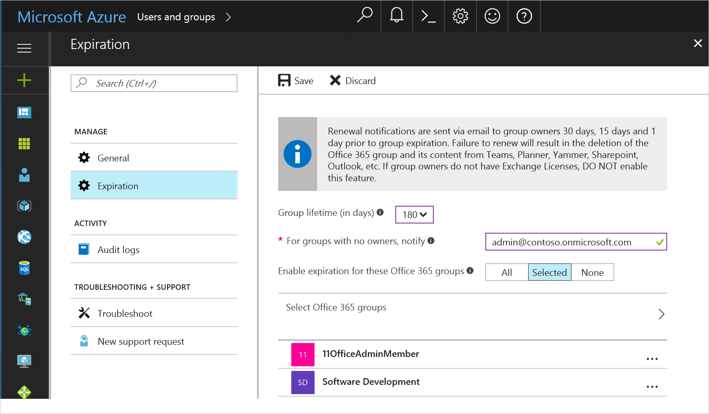
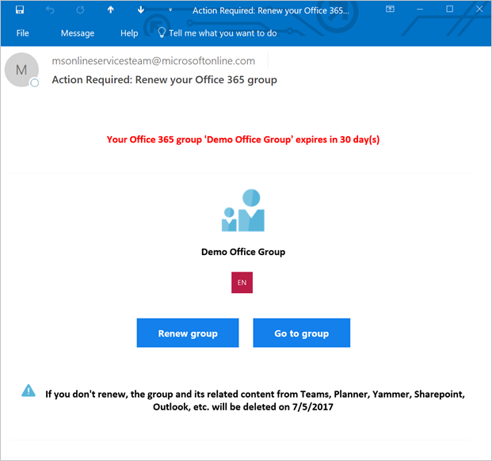
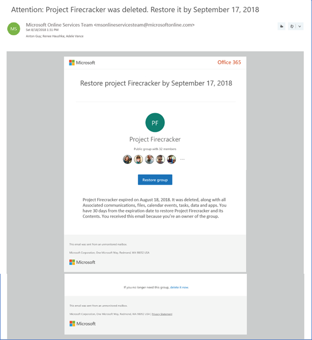

---
title: Preview Office 365 groups expiration in Azure Active Directory | Microsoft Docs
description: How to set up expiration for Office 365 groups in Azure Active Directory (preview)
services: active-directory
documentationcenter: ''
author: curtand
manager: femila
editor: ''

ms.assetid: 
ms.service: active-directory
ms.workload: identity
ms.tgt_pltfrm: na
ms.devlang: na
ms.topic: article
ms.date: 08/09/2017
ms.author: curtand                   
ms.reviewer: kairaz.contractor
ms.custom: it-pro

---

# Configure Office 365 groups expiration (preview)

You can now manage the lifecycle of Office 365 groups by setting expiration for any Office 365 groups that you select. Once this expiration is set, owners of those groups are asked to renew their groups if they still need the groups. Any Office 365 group that is not renewed will be deleted. Any Office 365 group that was deleted can be restored within 30 days by the group owners or the administrator.  

> [!NOTE]
> You can set expiration for only Office 365 groups.
>
> Setting expiration for O365 groups requires that an Azure AD Premium license is assigned to
>   - The administrator who configures the expiration settings for the tenant
>   - All members of the groups selected for this setting

## Set Office 365 groups expiration

1. Open the [Azure AD admin center](https://aad.portal.azure.com) with an account that is a global administrator in your Azure AD tenant.

2. Open Azure AD, select **Users and groups**.

3. Select **Group settings** and then select **Expiration** to open the expiration settings.
  
  

4. On the **Expiration** blade, you can:

  * Set the group lifetime in days. You could select one of the preset values, or a custom value (should be 31 days or more). 
  * Specify an email address where the renewal and expiration notifications should be sent when a group has no owner. 
  * Select which Office 365 groups expire. You can enable expiration for **All** Office 365 groups, you can select from among the Office 365 groups, or you select **None** to disable expiration for all groups.
  * Save your settings when you're done by selecting **Save**.

For instructions on how to download and install the Microsoft PowerShell module to configure expiration for Office 365 groups via PowerShell, see [Azure Active Directory V2 PowerShell Module - Public Preview Release 2.0.0.137](https://www.powershellgallery.com/packages/AzureADPreview/2.0.0.137).

Email notifications such as this one are sent to the Office 365 group owners 30 days, 15 days, and 1 day prior to expiration of the group.

The group owner can then select **Renew group** to renew the Office 365
group, or can select **Go to group** to see the members and other details
about the group.

When a group expires, the group is deleted one day after the expiration date. An email notification such as this one is sent to the Office 365 group owners informing them about the expiration and subsequent deletion of their Office 365 group.

The group can be restored by selecting **Restore group** or by using PowerShell cmdlets, as described in [Restore a deleted Office 365 group in Azure Active Directory] (https://docs.microsoft.com/azure/active-directory/active-directory-groups-restore-azure-portal).
    
If the group you're restoring contains documents, SharePoint sites, or other persistent objects, it might take up to 24 hours to fully restore the group and its contents.

> [!NOTE]
> * When deploying the expiration settings, there might be some groups that are older than the expiration window. These groups are not be immediately deleted, but are set to 30 days until expiration. The first renewal notification email is sent out within a day. For example, Group A was created 400 days ago, and the expiration interval is set to 180 days. When you apply expiration settings, Group A has 30 days before it is deleted, unless the owner renews it.
> * When a dynamic group is deleted and restored, it is seen as a new group and re-populated according to the rule. This process might take up to 24 hours.

## Next steps
These articles provide additional information on Azure AD groups.

* [See existing groups](active-directory-groups-view-azure-portal.md)
* [Manage settings of a group](active-directory-groups-settings-azure-portal.md)
* [Manage members of a group](active-directory-groups-members-azure-portal.md)
* [Manage memberships of a group](active-directory-groups-membership-azure-portal.md)
* [Manage dynamic rules for users in a group](active-directory-groups-dynamic-membership-azure-portal.md)
