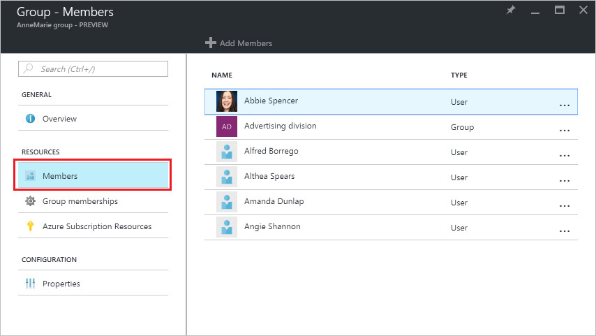

<properties
	pageTitle="Manage the members for a group in Azure Active Directory | Microsoft Azure"
	description="How to users and devices that are members of a group in Azure Active Directory"
	services="active-directory"
	documentationCenter=""
	authors="curtand"
	manager="femila"
	editor=""/>

<tags
	ms.service="active-directory"
	ms.workload="identity"
	ms.tgt_pltfrm="na"
	ms.devlang="na"
	ms.topic="article"
	ms.date="08/11/2016"
	ms.author="curtand"/>

# Manage the members for a group in Azure Active Directory

This article explains how to manage the members for a group in Azure Active Directory (Azure AD).

## How do I find the members and manage them?

1.  Sign in to the [Azure portal](https://portal.azure.com) with an account that's a global admin for the directory.

2.  Select **Browse**, enter User Management in the text box, and then select **Enter**.

  

3.  On the **User Management** blade, select **Groups**.

  

4. On the **User Management - Groups** blade, select a group.

5. On the **Group - *groupname*** blade, select **Members**.

  

6. To add members to the group, on the **Group - Members** blade, select **Add Members**.

  

7. On the **Members** blade, select one or more users or devices to add to the group and select the **Select** button at the bottom of the blade to add them to the group. The **User** box filters the display based on matching your entry to any part of a user or device name. No wildcard characters are accepted in that box.

8. To remove members from the group, on the **Group - Members** blade, select a member.

9. On the ***membername*** blade, select the **Remove** command, and confirm your choice at the prompt.

  

9. When you finish changing members for the group, select **Save**.

## Additional information

These articles provide additional information on Azure Active Directory.

* [See existing groups](active-directory-groups-view-azure-portal.md)
* [Create a new group and adding members](active-directory-groups-create-azure-portal.md)
* [Manage settings of a group](active-directory-groups-settings-azure-portal.md)
* [Manage memberships of a group](active-directory-groups-membership-azure-portal.md)
* [Manage dynamic rules for users in a group](active-directory-groups-dynamic-users-azure-portal.md)
* [Manage dynamic rules for devices in a group](active-directory-groups-dynamic-devices-azure-portal.md)
