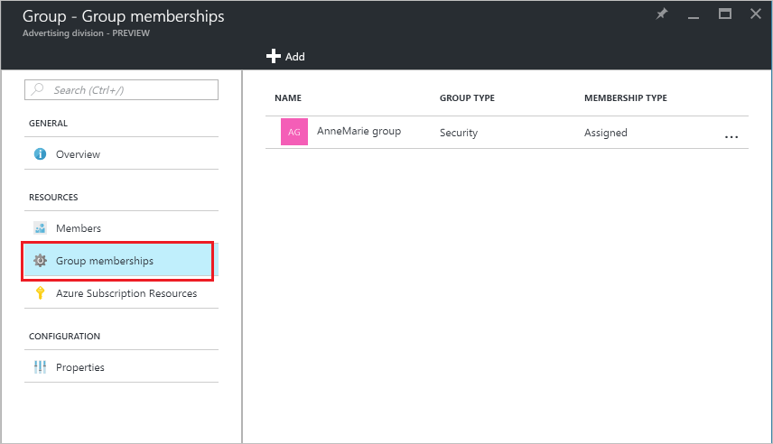
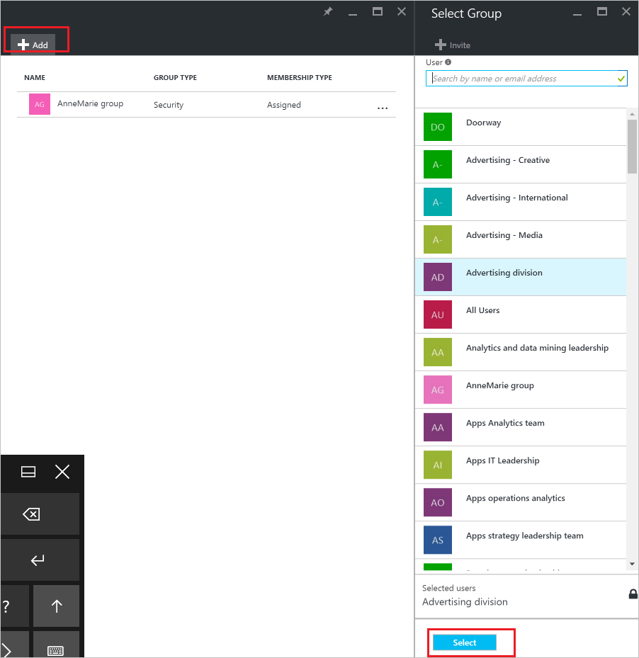

<properties
	pageTitle="Manage the groups your group is a member of in Azure Active Directory | Microsoft Azure"
	description="Groups can contain other groups in Azure Active Directory. Here's how to manage those memberships."
	services="active-directory"
	documentationCenter=""
	authors="curtand"
	manager="femila"
	editor=""/>

<tags
	ms.service="active-directory"
	ms.workload="identity"
	ms.tgt_pltfrm="na"
	ms.devlang="na"
	ms.topic="article"
	ms.date="08/11/2016"
	ms.author="curtand"/>

# Manage the groups your group is a member of in Azure Active Directory

Groups can contain other groups in Azure Active Directory. Here's how to manage those memberships.

## How do I find the groups my group is a member of?

1.  Sign in to the [Azure portal](https://portal.azure.com) with an account that's a global admin for the directory.

2.  Select **Browse**, enter User Management in the text box, and then select **Enter**.

  

3.  On the **User Management** blade, select **Groups**.

  

4. On the **User Management - Groups** blade, select a group.

5. On the **Group - *groupname*** blade, select **Group memberships**.

  

6. To add your group as a member of another group, on the **Group - Group memberships** blade, select the **Add** command.

7. Select a group from the **Select Group** blade, and then select the **Select** button at the bottom of the blade. You can add your group to only one group at a time. The **User** box filters the display based on matching your entry to any part of a user or device name. No wildcard characters are accepted in that box.

  

8. To remove your group as a member of another group, on the **Group - Group memberships** blade, select a group.

9. On the ***groupname*** blade, select the **Remove** command, and confirm your choice at the prompt.

  

9. When you finish changing group memberships for your group, select **Save**.

## Additional information

These articles provide additional information on Azure Active Directory.

* [See existing groups](active-directory-groups-view-azure-portal.md)
* [Create a new group and adding members](active-directory-groups-create-azure-portal.md)
* [Manage settings of a group](active-directory-groups-settings-azure-portal.md)
* [Manage members of a group](active-directory-groups-members-azure-portal.md)
* [Manage dynamic rules for users in a group](active-directory-groups-dynamic-users-azure-portal.md)
* [Manage dynamic rules for devices in a group](active-directory-groups-dynamic-devices-azure-portal.md)
