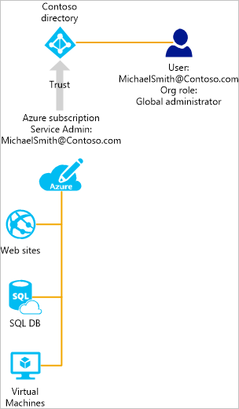

# How Azure subscriptions are associated with Azure Active Directory
This article covers information about the relationship between an Azure subscription and Azure Active Directory (Azure AD), and how to add an existing subscription to your Azure AD directory.

## Your Azure subscription's relationship to Azure AD
Your Azure subscription has a trust relationship with Azure AD, which means that it trusts the directory to authenticate users, services, and devices. Multiple subscriptions can trust the same directory, but each subscription trusts only one directory. 

The trust relationship that a subscription has with a directory is unlike the relationship that it has with other resources in Azure (websites, databases, and so on). If a subscription expires, access to the other resources associated with the subscription also stops. But an Azure AD directory remains in Azure, and you can associate a different subscription with that directory and manage the directory using the new subscription.

All users have a single home directory that authenticates them, but they can also be guests in other directories. In Azure AD, you can see the directories of which your user account is a member or guest.

## Azure AD and cloud service subscriptions
Azure AD provides the core directory and identity management capabilities behind most of Microsoft’s cloud services, including:

* Azure
* Microsoft Office 365
* Microsoft Dynamics CRM Online
* Microsoft Intune

You get the Azure AD service free when you sign up for any of these Microsoft cloud services. If you want to add an additional Azure subscription to an Azure AD directory, you must be signed in with a Microsoft account. If you sign in to Azure with a work or school account, you can't add an Azure subscription to an existing directory because your work or school account can't be authenticated directly by Azure. 

## To add an existing subscription to your Azure AD directory
You must sign in with an account that exists in both the current directory with which the subscription is associated and in the directory you want to add it to. 

1. Sign in to the [Azure Account Center](https://account.windowsazure.com/Home/Index) with an account that is the Account Administrator of the subscription whose ownership you want to transfer.
2. Ensure that the user who you want to be the subscription owner is in the targeted directory.
3. Click **Transfer subscription**.
4. Specify the recipient. The recipient automatically gets an email with an acceptance link.
5. The recipient clicks the link and follows the instructions, including entering their payment information. When the recipient succeeds, the subscription is transferred. 
6. The default directory of the subscription is changed to the directory that the user is in.

## Suggestions to manage both a subscription and a directory
The administrative roles for an Azure subscription manage resources tied to the Azure subscription. This section explains the differences between Azure subscription admins and Azure AD directory admins. Administrative roles and other suggestions for using them to manage your subscription are covered at [Assigning administrator roles in Azure Active Directory](active-directory-assign-admin-roles.md).

By default, you are assigned the Service Administrator role when you sign up. If others need to sign in and access services using the same subscription, you can add them as co-administrators. 

Azure AD has a different set of administrative roles to manage the directory and identity-related features. For example, the global administrator of a directory can add users and groups to the directory, or require multifactor authentication for users. A user who creates a directory is assigned to the global administrator role and they can assign administrative roles to other users. Azure AD administrative roles are also used by other services such as Office 365 and Microsoft Intune. 

Azure subscription admins and Azure AD directory admins are two separate roles. 
* Azure subscription admins can manage resources in Azure and can use Azure AD in the Azure portal (because the Azure portal itself is an Azure resource). 
* Directory admins can manage properties only in the Azure AD directory.

A person can be in both roles but it isn’t required. A directory global administrator might not be assigned as service administrator or co-administrator of an Azure subscription, or vice versa. Without being an administrator of the subscription, the user can sign in to the Azure portal, but can't manage the directories for that subscription in the portal. However, this user can manage directories using other tools such as Azure AD PowerShell or the Office 365 Admin Center.

## Next steps
* To learn more about how to change administrators for an Azure subscription, see [Transfer ownership of an Azure subscription to another account](../billing/billing-subscription-transfer.md)
* To learn more about how resource access is controlled in Microsoft Azure, see [Understanding resource access in Azure](active-directory-understanding-resource-access.md)
* For more information on how to assign roles in Azure AD, see [Assigning administrator roles in Azure Active Directory](active-directory-assign-admin-roles-azure-portal.md)

<!--Image references-->
[1]: ./media/active-directory-how-subscriptions-associated-directory/WAAD_PassThruAuth.png
[2]: ./media/active-directory-how-subscriptions-associated-directory/WAAD_OrgAccountSubscription.png
[3]: ./media/active-directory-how-subscriptions-associated-directory/WAAD_SignInDisambiguation.PNG
