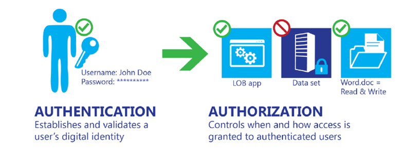
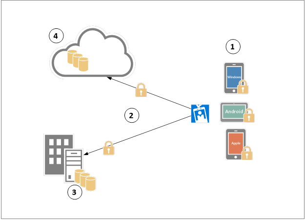

<properties
	pageTitle="Azure Active Directory hybrid identity design considerations - determine data protection requirements | Microsoft Azure"
	description="When planning your hybrid identity solution, identify the data protection requirements for your business and which options are available to best fulfil these requirements."
	documentationCenter=""
	services="active-directory"
	authors="billmath"
	manager="stevenpo"
	editor=""/>

<tags
	ms.service="active-directory"
	ms.devlang="na"
	ms.topic="article"
    ms.tgt_pltfrm="na"
    ms.workload="identity" 
	ms.date="08/08/2016"
	ms.author="billmath"/>

#Plan for enhancing data security through strong identity solution

The first step to protect the data is identify who can access that data and as part of this process you need to have an identity solution that can integrates with your system to provide authentication and authorization capabilities. Authentication and authorization are often confused with each other and their roles misunderstood. In reality they are quite different, as shown in the figure below:

 
**Mobile device management lifecycle stages**

When planning your hybrid identity solution you must understand the data protection requirements for your business and which options are available to best fulfil these requirements.
 
>[AZURE.NOTE]
Once you finish planning for data security, review [Determine multi-factor authentication requirements](active-directory-hybrid-identity-design-considerations-multifactor-auth-requirements.md) to ensure that your selections regarding multi-factor authentication requirements were not affected by the decisions you made in this section.

## Determine data protection requirements
In the age of mobility, most companies have a common goal: enable their users to be productive on their mobile devices while on-premises or remotely from anywhere in order to increase productivity. While this could be a common goal, companies that have such requirement will also be concern regarding the amount of threats that must be mitigated in order to keep company’s data secure and maintain user’s privacy. Each company might have different requirements in this regard; different compliance rules that will vary according to which industry the company is acting will lead to different design decisions. 

However, there are some security aspects that should be explored and validated, regardless of the industry, which are explained in the next section.

## Data protection paths

 
**Data protection paths**

In the above diagram, the identity component will be the first one to be verified before data is accessed. However, this data can be in different states during the time it was accessed. Each number on this diagram represents a path in which data can be located at some point in time. These numbers are explained below:

1. Data protection at the device level.
2. Data protection while in transit.
3. Data protection while at rest on-premises.
4. Data protection while at rest in the cloud.

Although the technical controls that will enable IT to protect the data itself on each one of those phases are not directly offered by the hybrid identity solution, it is necessary that the hybrid identity solution is capable of leveraging both on-premises and cloud identity management resources to identify the user before grant access to the data. When planning your hybrid identity solution ensure that the following questions are answered according to your organization’s requirements:

## Data protection at rest
Regardless of where the data is at rest (device, cloud or on-premises), it is important to perform an assessment to understand the organization needs in this regard. For this area, ensure that the following questions are asked:

- Does your company need to protect data at rest?
 - If yes, is the hybrid identity solution able to integrate with your current on-premises infrastructure?
 - If yes, is the hybrid identity solution able to integrate with your workloads located in the cloud?
- Is the cloud identity management able to protect the user’s credentials and other data stored in the cloud?

## Data protection in transit
Data in transit between the device and the datacenter or between the device and the cloud must be protected. However, being in-transit does not necessarily mean a communications process with a component outside of your cloud service; it moves internally, also, such as between two virtual networks. For this area, ensure that the following questions are asked:

- Does your company need to protect data in transit?
 - If yes, is the hybrid identity solution able to integrate with secure controls such as SSL/TLS?
- Does the cloud identity management keep the traffic to and within the directory store (within and between datacenters) signed?

## Compliance
Regulations, laws and regulatory compliance requirements will vary according to the industry that your company belongs. Companies in high regulated industries must address identity-management concerns related to compliance issues. Regulations such as Sarbanes-Oxley (SOX), the Health Insurance Portability and Accountability Act (HIPAA), the Gramm-Leach-Bliley Act (GLBA) and the Payment Card Industry Data Security Standard (PCI DSS) are very strict regarding identity and access. The hybrid identity solution that your company will adopt must have the core capabilities that will fulfill the requirements of one or more of these regulations. For this area, ensure that the following questions are asked:

- Is the hybrid identity solution compliant with the regulatory requirements for your business?
- Does the hybrid identity solution has built in capabilities that will enable your company to be compliant regulatory requirements? 
 
>[AZURE.NOTE]
Make sure to take notes of each answer and understand the rationale behind the answer. [Define Data Protection Strategy](active-directory-hybrid-identity-design-considerations-data-protection-strategy.md) will go over the options available and advantages/disadvantages of each option.  By having answered those questions you will select which option best suits your business needs.

## Next steps
 [Determine content management requirements](active-directory-hybrid-identity-design-considerations-contentmgt-requirements.md)

## See Also
[Design considerations overview](active-directory-hybrid-identity-design-considerations-overview.md)
