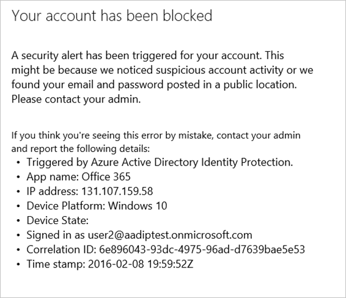
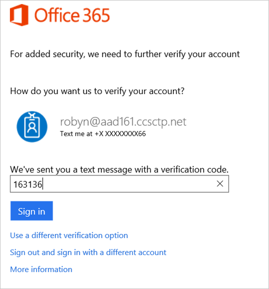
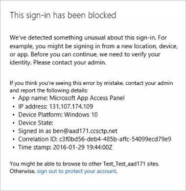
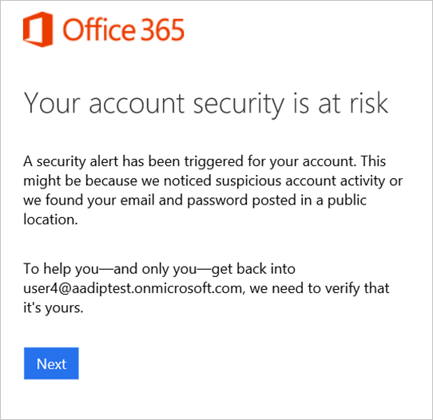
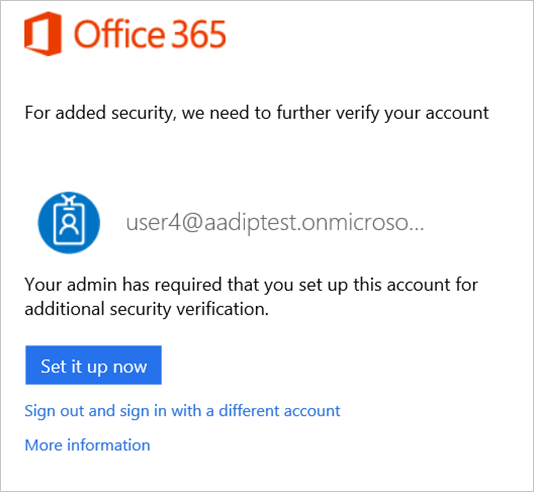

<properties
	pageTitle="Azure Active Directory Identity Protection flows| Microsoft Azure"
	description="Learn how Azure AD Identity Protection enables you to limit the ability of an attacker to exploit a compromised identity or device and to secure an identity or a device that was previously suspected or known to be compromised."
	services="active-directory"
	keywords="azure active directory identity protection, cloud app discovery, managing applications, security, risk, risk level, vulnerability, security policy"
	documentationCenter=""
	authors="markusvi"
	manager="stevenpo"
	editor=""/>

<tags
	ms.service="active-directory"
	ms.workload="identity"
	ms.tgt_pltfrm="na"
	ms.devlang="na"
	ms.topic="article"
	ms.date="03/02/2016"
	ms.author="markvi"/>

#Azure Active Directory Identity Protection flows

## User risk remediation and mitigation flows  

The following sections provide an overview of the user experience for user risk remediation and mitigation flows.

## Compromised Account Recovery Flow

When a user risk security policy has been configured, users who meet the user risk level specified in the policy (and are therefore assumed compromised) must go through the user compromise recovery flow before they can sign-in. 

The user compromise recovery flow has three steps:

1. The user is informed that their account security is at risk because of suspicious activity or leaked credentials.

 

  

2.	The user is required to prove their identity by solving a security challenge. If the user is registered for multi-factor authentication they can self-recover from being compromised. They will need to round-trip a security code to their phone number. 

 

 

3.	Finally, the user is forced to change their password since someone else may have had access to their account. 
Screenshots of this experience are below.
 
 

 

 
## Reset password
If a user is blocked from signing in, an administrator can generate a temporary password for them. They will have to change their password the next time they sign in. A password change remediates and closes most types of risk events for the user.

 

  

## User risk level mitigation

## Compromised account: blocked 

To get a user that was blocked by a user risk security policy unblocked, the user must contact an administrator or help desk. Self-recovering by solving multi-factor authentication is not an option in this case.

 

 

## What is a sign-in risk level?

A sign-in risk level is an indication (High, Medium, or Low) of the likelihood that for a specific sign-in, someone else is attempting to authenticate with the user’s identity. The sign-in risk level is evaluated at the time of a sign-in and considers risk events and indicators detected in real-time for that specific sign-in. 

## Mitigating sign-in risk events 
A mitigation is an action to limit the ability of an attacker to exploit a compromised identity or device without restoring the identity or device to a safe state. A mitigation does not resolve previous sign-in risk events associated with the identity or device.

You can use conditional access in Azure AD Identity Protection to automatically mitigate sign-in risk events. Using these policies, you consider the risk level of the user or the sign-in to block risky sign-ins or require the user to perform multi-factor authentication. These actions may prevent an attacker from exploiting a stolen identity to cause damage, and may give you some time to secure the identity. 

##Sign-in risk mitigation flows 

There are two types of sign-in risk mitigation flows:

- Risky sign-in recovery flow

- Risky sign-in blocked flow

## Risky sign-in recovery flow

When an administrator has configured a policy for sign-in risks, the affected users are notified when they try to sign-in. 

The risky sign-in flow has two steps: 

1. The user is informed that something unusual was detected about their sign-in, such as signing in from a new location, device, or app. 
 

 

2. The user is required to prove their identity by solving a security challenge. If the user is registered for multi-factor authentication they need to round-trip a security code to their phone number. Since this is a just a risky sign in and not a compromised account, the user won’t have to change the password in this flow. 
 

 
 
## Risky sign-in blocked flow
Administrators can also choose to set a Sign-In Risk policy to block users upon sign-in depending on the risk level. To get unblocked, end users must contact an administrator or help desk, or they can try signing in from a familiar location or device. Self-recovering by solving multi-factor authentication is not an option in this case.

 

 
 
## Multi-factor authentication registration

The best user experience for both, the compromised account recovery flow and the risky sign-in flow, is when the user can self-recover. If a user is registered for multi-factor authentication, they already have a phone number associated with their account that can be used to pass security challenges. No help desk or administrator involvement is needed to recover from account compromise. Thus, it’s highly recommended to get your users registered for multi-factor authentication. 

Administrators can:

- set a policy that requires users to set up their accounts for additional security verification. 
- allow skipping multi-factor authentication registration for up to 30 days, in case they want to give users a grace period before registering.

 
  

 
  

 
  

 

 

## Multi-factor authentication registration during a risky sign-in

It is important that users register for multi-factor authentication so that they are prepared and able to pass security challenges. If a user isn’t registered for multi-factor authentication but the policy requires them to be, they could be asked to register during a risky sign-in. This means, an attacker could end up being asked to add a phone number instead of the good user.  
To avoid this situation, require users to register for multi-factor authentication as soon as possible, so that a phone number is already associated with their account in case they ever get compromised. Alternatively, administrators can completely block compromised users who aren’t registered for multi-factor authentication.

  

 
  

  

 

## See also

- [Azure Active Directory Identity Protection](active-directory-identityprotection.md) 