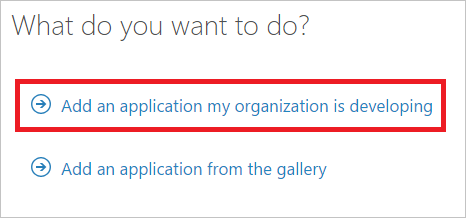
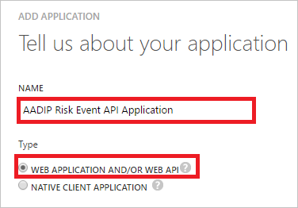
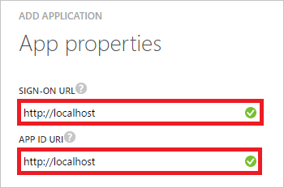
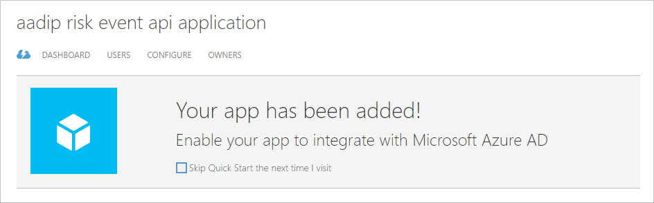
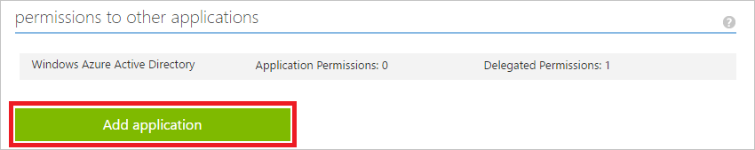
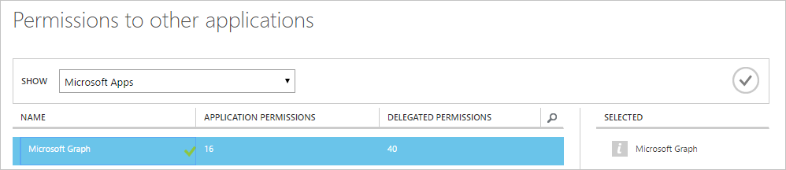
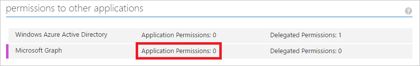
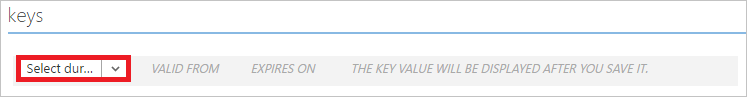
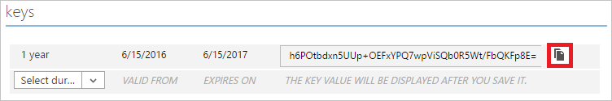

<properties
	pageTitle="Get started with Azure Active Directory Identity Protection and Microsoft Graph | Microsoft Azure"
	description="Provides an introduction to query Microsoft Graph for a list of risk events and associated information from Azure Active Directory."
	services="active-directory"
	keywords="azure active directory identity protection, risk event, vulnerability, security policy, Microsoft Graph"
	documentationCenter=""
	authors="markusvi"
	manager="femila"
	editor=""/>

<tags
	ms.service="active-directory"
	ms.workload="identity"
	ms.tgt_pltfrm="na"
	ms.devlang="na"
	ms.topic="article"
	ms.date="06/15/2016"
	ms.author="markvi"/>

# Get started with Azure Active Directory Identity Protection and Microsoft Graph

Microsoft Graph is Microsoft’s unified API endpoint and the home of [Azure Active Directory Identity Protection’s](active-directory-identityprotection.md) APIs. Our first API, **identityRiskEvents**, allows you to query Microsoft Graph for a list of [risk events](active-directory-identityprotection-risk-events-types.md) and associated information. This article gets you started querying this API. For an in depth introduction, full documentation, and access to the Graph Explorer, see the [Microsoft Graph site](https://graph.microsoft.io/).

There are three steps to accessing Identity Protection data through Microsoft Graph:

1. Add an application with a client secret. 

2. Use this secret and a few other pieces of information to authenticate to Microsoft Graph, where you receive an authentication token. 

3. Use this token to make requests to the API endpoint and get Identity Protection data back.

Before you get started, you’ll need:

- Administrator privileges to create the application in Azure AD
- The name of your tenant's domain (for example, contoso.onmicrosoft.com)

## Add an application with a client secret

1. [Sign in](https://manage.windowsazure.com) to your Azure classic portal as an administrator. 

1. On on the left navigation pane, click **Active Directory**. 

	

2. From the **Directory** list, select the directory for which you want to enable directory integration.

3. In the menu on the top, click **Applications**.

	

4. Click **Add** at the bottom of the page.

	

5. On the **What do you want to do** dialog, click **Add an application my organization is developing**.

	

5. On the **Tell us about your application** dialog, perform the following steps:

	

	a. In the **Name** textbox, type a name for your application (e.g.: AADIP Risk Event API Application).

	b. As **Type**, select **Web Application And / Or Web API**.

	c. Click **Next**.

5. On the **App properties** dialog, perform the following steps:

	

	a. In the **Sign-On URL** textbox, type `http://localhost`.

	b. In the **App ID URI** textbox, type `http://localhost`.

	c. Click **Complete**.

Your can now configure your application.

## Grant your application permission to use the API

1. On your application's page, in the menu on the top, click **Configure**. 

	

2. In the **permissions to other applications** section, click **Add application**.

	

2. On the **permissions to other applications** dialog, perform the following steps:

	

	a. Select **Microsoft Graph**.

	b. Click **Complete**.

1. Click **Application Permissions: 0**, and then select **Read all identity risk event information**.

	

1. Click **Save** at the bottom of the page.

	

## Get an access key

1. On your application's page, in the **keys** section, select 1 year as duration.

	

1. Click **Save** at the bottom of the page.

	

1. in the keys section, copy the value of your newly created key, and then paste it into a safe location.

	

	> [AZURE.NOTE] If you lose this key, you will have to return to this section and create a new key. Keep this key a secret: anyone who has it can access your data.

1. In the **properties** section, copy the **Client ID**, and then paste it into a safe location. 

## Authenticate to Microsoft Graph and query the Identity Risk Events API

At this point, you should have:

- The client ID you copied above

- The key you copied above

- The name of your tenant's domain

To authenticate, send a post request to `https://login.microsoft.com` with the following parameters in the body:

- grant_type: “**client_credentials**”

- resource: “**https://graph.microsoft.com**”

- client_id: <your client ID>

- client_secret: <your key>

> [AZURE.NOTE] You need to provide values for the **client_id** and the **client_secret** parameter.

If successful, this returns an authentication token.  
To call the API, create a header with the following parameter:

	`Authorization`=”<token_type> <access_token>"

When authenticating, you can find the token type and access token in the returned token.

Send this header as a request to the following API URL: `https://graph.microsoft.com/beta/identityRiskEvents`

The response, if successful, is a collection of identity risk events and associated data in the OData JSON format, which can be parsed and handled as see fit.

Here’s sample code for authenticating and calling the API using Powershell.  
Just add your client ID, key, and tenant domain.

	$ClientID       = "<your client ID here>"        # Should be a ~36 hex character string; insert your info here
	$ClientSecret   = "<your client secret here>"    # Should be a ~44 character string; insert your info here
	$tenantdomain   = "<your tenant domain here>"    # For example, contoso.onmicrosoft.com

	$loginURL       = "https://login.microsoft.com"
	$resource       = "https://graph.microsoft.com"

	$body       = @{grant_type="client_credentials";resource=$resource;client_id=$ClientID;client_secret=$ClientSecret}
	$oauth      = Invoke-RestMethod -Method Post -Uri $loginURL/$tenantdomain/oauth2/token?api-version=1.0 -Body $body

	Write-Output $oauth

	if ($oauth.access_token -ne $null) {
    	$headerParams = @{'Authorization'="$($oauth.token_type) $($oauth.access_token)"}

    	$url = "https://graph.microsoft.com/beta/identityRiskEvents"
    	Write-Output $url

    	$myReport = (Invoke-WebRequest -UseBasicParsing -Headers $headerParams -Uri $url)

    	foreach ($event in ($myReport.Content | ConvertFrom-Json).value) {
        	Write-Output $event
    	}

	} else {
    	Write-Host "ERROR: No Access Token"
	} 

## Next steps

Congratulations, you just made your first call to Microsoft Graph!  
Now you can query identity risk events and use the data however you see fit.

To learn more about Microsoft Graph and how to build applications using the Graph API, check out the [documentation](https://graph.microsoft.io/docs) and much more on the [Microsoft Graph site](https://graph.microsoft.io/). Also, make sure to bookmark the [Azure AD Identity Protection API](https://graph.microsoft.io/docs/api-reference/beta/resources/identityprotection_root) page that lists all of the Identity Protection APIs available in Graph. As we add new ways to work with Identity Protection via API, you’ll see them on that page.

## Additional resources

- [Azure Active Directory Identity Protection](active-directory-identityprotection.md)

- [Types of risk events detected by Azure Active Directory Identity Protection](active-directory-identityprotection-risk-events-types.md)

- [Microsoft Graph](https://graph.microsoft.io/)

- [Overview of Microsoft Graph](https://graph.microsoft.io/docs)

- [Azure AD Identity Protection Service Root](https://graph.microsoft.io/docs/api-reference/beta/resources/identityprotection_root)
