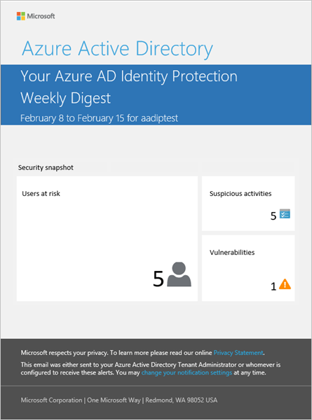
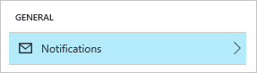

# Azure Active Directory Identity Protection notifications
Azure AD Identity Protection sends two types of automated notification emails to help you manage user risk and risk events:

* User compromised alert email
* Weekly digest email

## User compromised alert email
A user compromised email alert is generated when Azure AD Identity Protection identifies an account as compromised. The email includes a link to the Users flagged for risk report in the Identity Protection dashboard. We recommend that you immediately investigate notifications of compromised accounts.

## Weekly digest email
The weekly digest email contains a summary of new risk events. 
It includes:

* Users at risk
* Suspicious activities
* Detected vulnerabilities
* Links to the related reports in Identity Protection

 

 

You can switch sending a weekly digest email off.
  

 

**To open the related configuration dialog**:

1. On the **Azure AD Identity Protection** blade, click **Settings**.
     
   
    
2. In the **General** section, click **Notifications**.
     
   
    

## See also
* [Azure Active Directory Identity Protection](active-directory-identityprotection.md)
