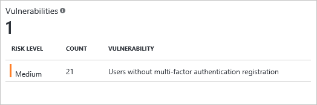

<properties
	pageTitle="Vulnerabilities detected by Azure Active Directory Identity Protection | Microsoft Azure"
	description="Overview of the vulnerabilities detected by Azure Active Directory Identity Protection."
	services="active-directory"
	keywords="azure active directory identity protection, cloud app discovery, managing applications, security, risk, risk level, vulnerability, security policy"
	documentationCenter=""
	authors="markusvi"
	manager="stevenpo"
	editor=""/>

<tags
	ms.service="active-directory"
	ms.workload="identity"
	ms.tgt_pltfrm="na"
	ms.devlang="na"
	ms.topic="article"
	ms.date="06/06/2016"
	ms.author="markvi"/>

# Vulnerabilities detected by Azure Active Directory Identity Protection 

Vulnerabilities are weaknesses in your environment that can be exploited by an attacker. We recommend that you address these vulnerabilities to improve the security posture of your organization, and prevent attackers from exploiting them.
  

 

The following sections provide you with an overview of the vulnerabilities reported by Identity Protection.

## Multi-factor authentication registration not configured 

This vulnerability helps you control the deployment of Azure Multi-Factor Authentication in your organization. 

Azure multi-factor authentication provides a second layer of security to user authentication. It helps safeguard access to data and applications while meeting user demand for a simple sign-in process. It delivers strong authentication via a range of easy verification options—phone call, text message, or mobile app notification or verification code and 3rd party OATH tokens.

We recommend that you require Azure Multi-Factor Authentication for user sign-ins. Multi-factor authentication plays a key role in risk-based conditional access policies available through Identity Protection.

For more details, see [What is Azure Multi-Factor Authentication?](../multi-factor-authentication/multi-factor-authentication.md)

## Unmanaged cloud apps

This vulnerability helps you identify unmanaged cloud apps in your organization.
 
In modern enterprises, IT departments are often unaware of all the cloud applications that users in their organization are using to do their work. It is easy to see why administrators would have concerns about unauthorized access to corporate data, possible data leakage and other security risks. 

We recommend that your organization deploy Cloud App Discovery to discover unmanaged cloud applications, and to manage these applications using Azure Active Directory.

For more details, see [Finding unmanaged cloud applications with Cloud App Discovery](active-directory-cloudappdiscovery-whatis.md).

##Security Alerts from Privileged Identity Management

This vulnerability helps you discover and resolve alerts about privileged identities in your organization.  

To enable users to carry out privileged operations, organizations need to grant users temporary or permanent privileged access in Azure AD, Azure or Office 365 resources, or other SaaS apps. Each of these privileged users increases the attack surface of your organization. This vulnerability helps you identify users with unnecessary privileged access, and take appropriate action to reduce or eliminate the risk they pose. 

We recommend that your organization uses Azure AD Privileged Identity Management to manage, control, and monitor privileged identities and their access to resources in Azure AD as well as other Microsoft online services like Office 365 or Microsoft Intune.

For more details, see [Azure AD Privileged Identity Management](active-directory-privileged-identity-management-configure.md). 

## See also

 - [Azure Active Directory Identity Protection](active-directory-identityprotection.md)