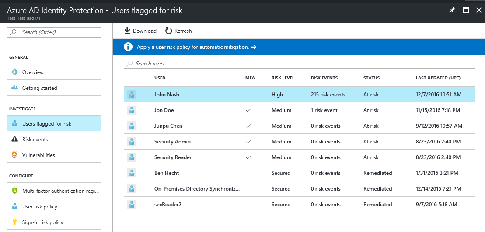
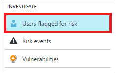
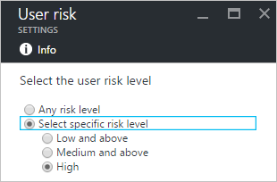

# Azure Active Directory Identity Protection

Azure Active Directory Identity Protection is a feature of the Azure AD Premium P2 edition that enables you to:

- Detect potential vulnerabilities affecting your organization’s identities

- Configure automated responses to detected suspicious actions that are related to your organization’s identities  

- Investigate suspicious incidents and take appropriate action to resolve them   

## Getting started

Microsoft secures cloud-based identities for more than a decade. With Azure Active Directory Identity Protection, in your environment, you can use the same protection systems Microsoft uses to secure identities.

The vast majority of security breaches take place when attackers gain access to an environment by stealing a user’s identity. Over the years, attackers have become increasingly effective in leveraging third party breaches and using sophisticated phishing attacks. As soon as an attacker gains access to even low privileged user accounts, it is relatively easy for them to gain access to important company resources through lateral movement.

As a consequence of this, you need to:

- Protect all identities regardless of their privilege level

- Proactively prevent compromised identities from being abused

Discovering compromised identities is no easy task. Azure Active Directory uses adaptive machine learning algorithms and heuristics to detect anomalies and suspicious incidents that indicate potentially compromised identities. Using this data, Identity Protection generates reports and alerts that enable you to evaluate the detected issues and take appropriate mitigation or remediation actions.

Azure Active Directory Identity Protection is more than a monitoring and reporting tool. To protect your organization's identities, you can configure risk-based policies that automatically respond to detected issues when a specified risk level has been reached. These policies, in addition to other conditional access controls provided by Azure Active Directory and EMS, can either automatically block or initiate adaptive remediation actions including password resets and multi-factor authentication enforcement.

#### Identity Protection capabilities

**Detecting vulnerabilities and risky accounts:**  

* Providing custom recommendations to improve overall security posture by highlighting vulnerabilities
* Calculating sign-in risk levels
* Calculating user risk levels

**Investigating risk events:**

* Sending notifications for risk events
* Investigating risk events using relevant and contextual information
* Providing basic workflows to track investigations
* Providing easy access to remediation actions such as password reset

**Risk-based conditional access policies:**

* Policy to mitigate risky sign-ins by blocking sign-ins or requiring multi-factor authentication challenges.
* Policy to block or secure risky user accounts
* Policy to require users to register for multi-factor authentication

## Identity Protection roles

To load balance the management activities around your Identity Protection implementation, you can assign several roles. Azure AD Identity Protection supports 3 directory roles:

| Role                         | Can do                          | Cannot do
| :--                          | ---                                |  ---   |
| Global administrator         | Full access to Identity Protection, Onboard Identity Protection| |
| Security administrator       | Full access to Identity Protection | Onboard Identity Protection,  reset passwords for a user |
| Security reader              | Ready-only access to Identity Protection | Onboard Identity Protection, remidiate users, configure policies,  reset passwords |

For more details, see [Assigning administrator roles in Azure Active Directory](active-directory-assign-admin-roles-azure-portal.md)

## Detection

### Vulnerabilities

Azure Active Directory Identity Protection analyses your configuration and detects vulnerabilities that can have an impact on your user's identities. For more details, see [Vulnerabilities detected by Azure Active Directory Identity Protection](active-directory-identityprotection-vulnerabilities.md).

### Risk events

Azure Active Directory uses adaptive machine learning algorithms and heuristics to detect suspicious actions that are related to your user's identities. The system creates a record for each detected suspicious action. These records are also known as risk events.  
For more details, see [Azure Active Directory risk events](active-directory-identity-protection-risk-events.md).

## Investigation
Your journey through Identity Protection typically starts with the Identity Protection dashboard.

The dashboard gives you access to:

* Reports such as **Users flagged for risk**, **Risk events** and **Vulnerabilities**
* Settings such as the configuration of your **Security Policies**, **Notifications** and **multi-factor authentication registration**

It is typically your starting point for investigation, which is the process of reviewing the activities, logs, and other relevant information related to a risk event to decide whether remediation or mitigation steps are necessary,  and how the identity was compromised, and understand how the compromised identity was used.

You can tie your investigation activities to the [notifications](active-directory-identityprotection-notifications.md) Azure Active Directory Protection sends per email.

The following sections provide you with more details and the steps that are related to an investigation.  

## Risky sign-ins

Aure Active Directory detects some [risk event types](active-directory-reporting-risk-events.md#risk-event-types) in real-time. All real-time risk events that have been detected during a sign-in of a user contribute to a logical concept called *risky sign-in*. A risky sign-in is an indicator for a sign-in attempt that might not have been performed by the legitimate owner of a user account. The lifecycle of a risky sign-in ends when a user signs out.

### Sign-in risk level

A sign-in risk level is an indication (High, Medium, or Low) of the likelihood that a sign-in attempt was not performed by the legitimate owner of a user account.

### Mitigating sign-in risk events

A mitigation is an action to limit the ability of an attacker to exploit a compromised identity or device without restoring the identity or device to a safe state. A mitigation does not resolve previous sign-in risk events associated with the identity or device.

To mitigate risky sign-ins automatically, you can configure sign-in risk security policicies. Using these policies, you consider the risk level of the user or the sign-in to block risky sign-ins or require the user to perform multi-factor authentication. These actions may prevent an attacker from exploiting a stolen identity to cause damage, and may give you some time to secure the identity.

### Sign-in risk security policy
A sign-in risk policy is a conditional access policy that evaluates the risk to a specific sign-in and applies mitigations based on predefined conditions and rules.

Azure AD Identity Protection helps you manage the mitigation of risky sign-ins by enabling you to:

* Set the users and groups the policy applies to:

    
* Set the sign-in risk level threshold (low, medium, or high) that triggers the policy:

    
* Set the controls to be enforced when the policy triggers:  

    
* Switch the state of your policy:

    
* Review and evaluate the impact of a change before activating it:

    

#### What you need to know
You can configure a sign-in risk security policy to require multi-factor authentication:

However, for security reasons, this setting only works for users that have already been registered for multi-factor authentication. If the condition to require multi-factor authentication is satisfied for a user who is not yet registered for multi-factor authentication, the user is blocked.

As a best practice, if you want to require multi-factor authentication for risky sign-ins, you should:

1. Enable the [multi-factor authentication registration policy](#multi-factor-authentication-registration-policy) for the affected users.
2. Require the affected users to login in a non-risky session to perform a MFA registration

Completing these steps ensures that multi-factor authentication is required for a risky sign-in.

#### Best practices
Choosing a **High** threshold reduces the number of times a policy is triggered and minimizes the impact to users.  

However, it excludes **Low** and **Medium** sign-ins flagged for risk from the policy, which may not block an attacker from exploiting a compromised identity.

When setting the policy,

* Exclude users who do not/cannot have multi-factor authentication
* Exclude users in locales where enabling the policy is not practical (for example no access to helpdesk)
* Exclude users who are likely to generate a lot of false-positives (developers, security analysts)
* Use a **High** threshold during initial policy roll out, or if you must minimize challenges seen by end users.
* Use a **Low**  threshold if your organization requires greater security. Selecting a **Low** threshold introduces additional user sign-in challenges, but increased security.

The recommended default for most organizations is to configure a rule for a **Medium** threshold to strike a balance between usability and security.

The sign-in risk policy is:

* Applied to all browser traffic and sign-ins using modern authentication.
* Not applied to applications using older security protocols by disabling the WS-Trust endpoint at the federated IDP, such as ADFS.

The **Risk Events** page in the Identity Protection console lists all events:

* This policy was applied to
* You can review the activity and determine whether the action was appropriate or not

For an overview of the related user experience, see:

* [Risky sign-in recovery](active-directory-identityprotection-flows.md#risky-sign-in-recovery)
* [Risky sign-in blocked](active-directory-identityprotection-flows.md#risky-sign-in-blocked)  
* [Sign-in experiences with Azure AD Identity Protection](active-directory-identityprotection-flows.md)  

**To open the related configuration dialog**:

- On the **Azure AD Identity Protection** blade, in the **Configure** section, click **Sign-in risk policy**.

    

## Users flagged for risk

All [risk events](active-directory-identity-protection-risk-events.md) that were detected by Azure Active Directory for a user contribute to a logical concept called *users flagged for risk*. A *user flag for risk* or *risky user* is an indicator for a user account that might have been compromised.   

### User risk level

A user risk level is an indication (High, Medium, or Low) of the likelihood that the user’s identity has been compromised. It is calculated based on the user risk events that are associated with a user's identity.

The status of a risk event is either **Active** or **Closed**. Only risk events that are **Active** contribute to the user risk level calculation.

The user risk level is calculated using the following inputs:

* Active risk events impacting the user
* Risk level of these events
* Whether any remediation actions have been taken

You can use the user risk levels to create conditional access policies that block risky users from signing in, or force them to securely change their password.

### Closing risk events manually

In most cases, you will take remediation actions such as a secure password reset to automatically close risk events. However, this might not always be possible.  
This is, for example, the case, when:

* A user with Active risk events has been deleted
* An investigation reveals that a reported risk event has been perform by the legitimate user

Because risk events that are **Active** contribute to the user risk calculation, you may have to manually lower a risk level by closing risk events manually.  
During the course of investigation, you can choose to take any of these actions to change the status of a risk event:

* **Resolve** - If after investigating a risk event, you took an appropriate remediation action outside Identity Protection, and you believe that the risk event should be considered closed, mark the event as Resolved. Resolved events will set the risk event’s status to Closed and the risk event will no longer contribute to user risk.
* **Mark as false-positive** - In some cases, you may investigate a risk event and discover that it was incorrectly flagged as a risky. You can help reduce the number of such occurrences by marking the risk event as False-positive. This will help the machine learning algorithms to improve the classification of similar events in the future. The status of false-positive events is to **Closed** and they will no longer contribute to user risk.
* **Ignore** - If you have not taken any remediation action, but want the risk event to be removed from the active list, you can mark a risk event Ignore and the event status will be Closed. Ignored events do not contribute to user risk. This option should only be used under unusual circumstances.
* **Reactivate** - Risk events that were manually closed (by choosing **Resolve**, **False positive**, or **Ignore**) can be reactivated, setting the event status back to **Active**. Reactivated risk events contribute to the user risk level calculation. Risk events closed through remediation (such as a secure password reset) cannot be reactivated.

**To open the related configuration dialog**:

1. On the **Azure AD Identity Protection** blade, under **Investigate**, click **Risk events**.

    
2. In the **Risk events** list, click a risk.

    
3. On the risk blade, right-click a user.

    

### Closing all risk events for a user manually
Instead of manually closing risk events for a user individually, Azure Active Directory Identity Protection also provides you with a method to close all events for a user with one click.

When you click **Dismiss all events**, all events are closed and the affected user is no longer at risk.

### Remediating user risk events

A remediation is an action to secure an identity or a device that was previously suspected or known to be compromised. A remediation action restores the identity or device to a safe state, and resolves previous risk events associated with the identity or device.

To remediate user risk events, you can:

* Perform a secure password reset to remediate user risk events manually
* Configure a user risk security policy to mitigate or remediate user risk events automatically
* Re-image the infected device  

#### Manual secure password reset
A secure password reset is an effective remediation for many risk events, and when performed, automatically closes these risk events and recalculates the user risk level. You can use the Identity Protection dashboard to initiate a password reset for a risky user.

The related dialog provides two different methods to reset a password:

**Reset password** - Select **Require the user to reset their password** to allow the user to self-recover if the user has registered for multi-factor authentication. During the user's next sign-in, the user will be required to solve a multi-factor authentication challenge successfully and then, forced to change the password. This option isn't available if the user account is not already registered multi-factor authentication.

**Temporary password** - Select **Generate a temporary password** to immediately invalidate the existing password, and create a new temporary password for the user. Send the new temporary password to an alternate email address for the user or to the user's manager. Because the password is temporary, the user will be prompted to change the password upon sign-in.

**To open the related configuration dialog**:

1. On the **Azure AD Identity Protection** blade, click **Users flagged for risk**.

    
2. From the list of users, select a user with at least one risk events.

    
3. On the user blade, click **Reset password**.

    

### User risk security policy
A user risk security policy is a conditional access policy that evaluates the risk level to a specific user and applies remediation and mitigation actions based on predefined conditions and rules.

Azure AD Identity Protection helps you manage the mitigation and remediation of users flagged for risk by enabling you to:

* Set the users and groups the policy applies to:

    
* Set the user risk level threshold (low, medium, or high) that triggers the policy:

    
* Set the controls to be enforced when the policy triggers:

    
* Switch the state of your policy:

    
* Review and evaluate the impact of a change before activating it:

    

Choosing a **High** threshold reduces the number of times a policy is triggered and minimizes the impact to users.
However, it excludes **Low** and **Medium** users flagged for risk from the policy, which may not secure identities or devices that were previously suspected or known to be compromised.

When setting the policy,

* Exclude users who are likely to generate a lot of false-positives (developers, security analysts)
* Exclude users in locales where enabling the policy is not practical (for example no access to helpdesk)
* Use a **High** threshold during initial policy roll out, or if you must minimize challenges seen by end users.
* Use a **Low** threshold if your organization requires greater security. Selecting a **Low** threshold introduces additional user sign-in challenges, but increased security.

The recommended default for most organizations is to configure a rule for a **Medium** threshold to strike a balance between usability and security.

For an overview of the related user experience, see:

* [Compromised account recovery flow](active-directory-identityprotection-flows.md#compromised-account-recovery).  
* [Compromised account blocked flow](active-directory-identityprotection-flows.md#compromised-account-blocked).  

**To open the related configuration dialog**:

- On the **Azure AD Identity Protection** blade, in the **Configure** section, click **User risk policy**.

    

### Mitigating user risk events
Administrators can set a user risk security policy to block users upon sign-in depending on the risk level.

Blocking a sign-in:

* Prevents the generation of new user risk events for the affected user
* Enables administrators to manually remediate the risk events affecting the user's identity and restore it to a secure state

## Multi-factor authentication registration policy
Azure multi-factor authentication is a method of verifying who you are that requires the use of more than just a username and password. It provides a second layer of security to user sign-ins and transactions.  
We recommend that you require Azure multi-factor authentication for user sign-ins because it:

* Delivers strong authentication with a range of easy verification options
* Plays a key role in preparing your organization to protect and recover from account compromises

For more details, see [What is Azure Multi-Factor Authentication?](../multi-factor-authentication/multi-factor-authentication.md)

Azure AD Identity Protection helps you manage the roll-out of multi-factor authentication registration by configuring a policy that enables you to:

* Set the users and groups the policy applies to:

    
* Set the controls to be enforced when the policy triggers::  

    
* Switch the state of your policy:

    
* View the current registration status:

    

For an overview of the related user experience, see:

* [Multi-factor authentication registration flow](active-directory-identityprotection-flows.md#multi-factor-authentication-registration).  
* [Sign-in experiences with Azure AD Identity Protection](active-directory-identityprotection-flows.md).  

**To open the related configuration dialog**:

- On the **Azure AD Identity Protection** blade, in the **Configure** section, click **Multi-factor authentication registration**.

    

## Next steps
* [Channel 9: Azure AD and Identity Show: Identity Protection Preview](https://channel9.msdn.com/Series/Azure-AD-Identity/Azure-AD-and-Identity-Show-Identity-Protection-Preview)

* [Enabling Azure Active Directory Identity Protection](active-directory-identityprotection-enable.md)

* [Vulnerabilities detected by Azure Active Directory Identity Protection](active-directory-identityprotection-vulnerabilities.md)

* [Azure Active Directory risk events](active-directory-identity-protection-risk-events.md)

* [Azure Active Directory Identity Protection notifications](active-directory-identityprotection-notifications.md)

* [Azure Active Directory Identity Protection playbook](active-directory-identityprotection-playbook.md)

* [Azure Active Directory Identity Protection glossary](active-directory-identityprotection-glossary.md)

* [Sign-in experiences with Azure AD Identity Protection](active-directory-identityprotection-flows.md)

* [Azure Active Directory Identity Protection - How to unblock users](active-directory-identityprotection-unblock-howto.md)

* [Get started with Azure Active Directory Identity Protection and Microsoft Graph](active-directory-identityprotection-graph-getting-started.md)
