<properties
	pageTitle="Azure Active Directory Identity Protection | Microsoft Azure"
	description="Learn how Azure AD Identity Protection enables you to limit the ability of an attacker to exploit a compromised identity or device and to secure an identity or a device that was previously suspected or known to be compromised."
	services="active-directory"
	keywords="azure active directory identity protection, cloud app discovery, managing applications, security, risk, risk level, vulnerability, security policy"
	documentationCenter=""
	authors="markusvi"
	manager="femila"
	editor=""/>

<tags
	ms.service="active-directory"
	ms.workload="identity"
	ms.tgt_pltfrm="na"
	ms.devlang="na"
	ms.topic="article"
	ms.date="07/25/2016"
	ms.author="markvi"/>

#Azure Active Directory Identity Protection 

Azure Active Directory Identity Protection is a security service that provides a consolidated view into risk events and potential vulnerabilities affecting your organization’s identities. Microsoft has been securing cloud-based identities for over a decade, and with Azure AD Identity Protection, Microsoft is making these same protection systems available to enterprise customers. Identity Protection leverages existing Azure AD’s anomaly detection capabilities (available through Azure AD’s Anomalous Activity Reports), and introduces new risk event types that can detect anomalies in real-time.

## Limitations of the current preview
This section lists limitations that apply to the current preview of Azure Active Directory Identity Protection.

### Country or Region limitation

The preview of Azure Active Directory Identity Protection is currently available only for directories with a **Country or Region** value of **United States**.   
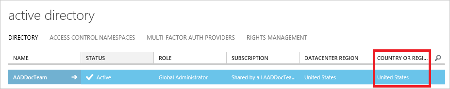

### Identity Protection and federated domains

The preview of Azure Active Directory Identity Protection has the following limitations in conjunction with federated domains:

- Only Sign-in risk security policy works for federated domains. Currently, user risk security policy does not work for federated domains 

- Risk events are only detected for apps federating with Azure Active Directory

##Getting Started

The vast majority of security breaches take place when attackers gain access to an environment by stealing a user’s identity. Attackers have become increasingly effective at leveraging third party breaches, and using sophisticated phishing attacks. Once an attacker gains access to even a low privileged user account, it is relatively straightforward for them to gain access to important company resources through lateral movement. It is therefore essential to protect all identities and, when an identity is compromised, proactively prevent the compromised identity from being abused. 

Discovering compromised identities is no easy task. Fortunately, Identity Protection can help: Identity Protection uses adaptive machine learning algorithms and heuristics to detect anomalies and risk events that may indicate that an identity has been compromised.
 
Using this data, Identity Protection generates reports and alerts that enables you to investigate these risk events and take appropriate remediation or mitigation action.
 
But Azure Active Directory Identity Protection more than a monitoring and reporting tool. Based on risk events, Identity Protection calculates a user risk level for each user, enabling you to configure risk-based policies to automatically protect the identities of your organization.  These risk-based policies, in addition to other conditional access controls provided by Azure Active Directory and EMS, can automatically block or offer adaptive remediation actions that include password resets and multi-factor authentication enforcement.  

####Explore Identity Protection's capabilities 

**Detecting risk events and risky accounts:**  

- Detecting 6 risk event types using machine learning and heuristic rules 

- Calculating user risk levels

- Providing custom recommendations to improve overall security posture by highlighting vulnerabilities

 

**Investigating risk events:**

- Sending notifications for risk events

- Investigating risk events using relevant and contextual information

- Providing basic workflows to track investigations

- Providing easy access to remediation actions such as password reset

 

**Risk-based conditional access policies:**

- Policy to mitigate risky sign-ins by blocking sign-ins or requiring multi-factor authentication challenges.

- Policy to block or secure risky user accounts

- Policy to require users to register for multi-factor authentication

## Detection and Risk

### Risk events

Risk events are events that were flagged as suspicious by Identity Protection, and indicate that an identity may have been compromised. For a complete list of risk events, see [Types of risk events detected by Azure Active Directory Identity Protection](active-directory-identityprotection-risk-events-types.md). 

Some of these risk events have been available through the Azure AD Anomalous Activity reports in the Azure Management Portal. 
The table below lists the various risk event types and the corresponding **Azure AD Anomalous Activity** report. Microsoft is continuing to invest in this space, and plans to continuously improve the detection accuracy of existing risk events and add new risk event types on an ongoing basis. 

| Identity Protection Risk Event Type | Corresponding Azure AD Anomalous Activity Report |
| :-- | :-- |
| Leaked credentials	| Users with leaked credentials |
| Impossible travel to atypical locations |	Irregular sign-in activity |
| Sign-ins from infected devices	| Sign-ins from possibly infected devices |
| Sign-ins from anonymous IP addresses	| Sign-ins from unknown sources |
| Sign-ins from IP addresses with suspicious activity |	Sign-ins from IP addresses with suspicious activity |
| Signs in from unfamiliar locations	| - |
| Lockout events (not in public preview)	| - |

The following Azure AD Anomalous Activity reports are not included as risk events in Azure AD Identity Protection, and will therefore not be available through Identity Protection. These reports are still available in the Azure Management Portal however they will be deprecated at some time in the future as they are being superseded by risk events in Identity Protection.

- Sign-ins after multiple failures
- Sign-ins from multiple geographies

### Risk level

The Risk level for a risk event is an indication (High, Medium, or Low) of the severity of the risk event. The risk level helps Identity Protection users prioritize the actions they must take to reduce the risk to their organization. The severity of the risk event represents the strength of the signal as a predictor of identity compromise, combined with the amount of noise that it typically introduces. 

- **High**: High confidence and high severity risk event. These events are strong indicators that the user’s identity has been compromised, and any user accounts impacted should be remediated immediately.

- **Medium**: High severity, but lower confidence risk event, or vice versa. These events are potentially risky, and any user accounts impacted should be remediated.

- **Low**: Low confidence and low severity risk event. This event may not require an immediate action, but when combined with other risk events, may provide a strong indication that the identity is compromised. 

 

Risk events are either identified in **real-time**, or in post-processing after the risk event has already taken place (offline). Currently most risk events in Identity Protection are computed offline, and show up in Identity Protection within 2-4 hours. 
While evaluated in real-time, the real-time risk events will show up in the Identity Protection Console within 5-10 minutes.

Several legacy clients do not currently support real-time risk event detection and prevention. As a result, sign-ins from these clients cannot be detected or prevented in real-time.

## Investigation
Your journey through Identity Protection typically starts with the Identity Protection dashboard. 

  

  

The dashboard gives you access to:
 
- Reports such as **Users flagged for risk**, **Risk events** and **Vulnerabilities**
- Settings such as the configuration of your **Security Policies**, **Notifications** and **multi-factor authentication registration**
 

It is typically your starting point for investigation, which is the process of reviewing the activities, logs, and other relevant information related to a risk event to decide whether remediation or mitigation steps are necessary,  and how the identity was compromised, and understand how the compromised identity was used.

You can tie your investigation activities to the [notifications](active-directory-identityprotection-notifications.md) Azure Active Directory Protection sends per email.

The following sections provide you with more details and the steps that are related to an investigation.  

## What is a user risk level?

A user risk level is an indication (High, Medium, or Low) of the likelihood that the user’s identity has been compromised. It is calculated based on the user risk events that are associated with the user's identity. 

The status of a risk event is either **Active** or **Closed**. Only risk events that are **Active** contribute to the user risk calculation. 

The user risk level is calculated using the following inputs:

- Active risk events impacting the user
- Risk level of these events 
- Whether any remediation actions have been taken 

 
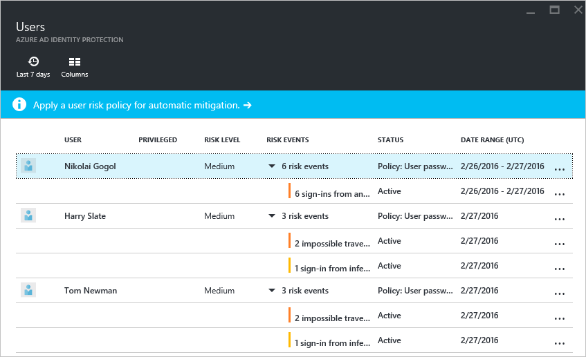
 

You can use the user risk levels to create conditional access policies to block risky users from signing in, or force them to securely change their password. 

## Closing risk events manually

In most cases, you will take remediation actions such as a secure password reset to automatically close risk events. However, this might not always be possible.   
This is, for example, the case, when:

- A user with Active risk events has been deleted
- An investigation reveals that a reported risk event has been perform by the legitimate user

Because risk events that are **Active** contribute to the user risk calculation, you may have to manually lower a risk level by closing risk events manually.  
During the course of investigation, you can choose to take any of these actions to change the status of a risk event:

 

 

- **Resolve** - If after investigating a risk event, you took an appropriate remediation action outside Identity Protection, and you believe that the risk event should be considered closed, mark the event as Resolved. Resolved events will set the risk event’s status to Closed and the risk event will no longer contribute to user risk.

- **Mark as false-positive** - In some cases, you may investigate a risk event and discover that it was incorrectly flagged as a risky. You can help reduce the number of such occurrences by marking the risk event as False-positive. This will help the machine learning algorithms to improve the classification of similar events in the future. The status of false-positive events is to **Closed** and they will no longer contribute to user risk.

- **Ignore** - If you have not taken any remediation action, but want the risk event to be removed from the active list, you can mark a risk event Ignore and the event status will be Closed. Ignored events do not contribute to user risk. This option should only be used under unusual circumstances. 

- **Reactivate** - Risk events that were manually closed (by choosing **Resolve**, **False positive**, or **Ignore**) can be reactivated, setting the event status back to **Active**. Reactivated risk events contribute to the user risk level calculation. Risk events closed through remediation (such as a secure password reset) cannot be reactivated. 

**To open the related configuration dialog**:

1. On the **Azure AD Identity Protection** blade, click **Users flagged for risk**.
  
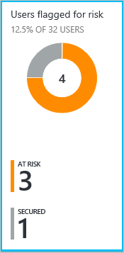
 

2. Right-click the affected user.
  
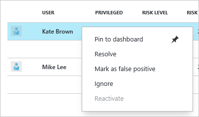
 

## Remediating user risk events

A remediation is an action to secure an identity or a device that was previously suspected or known to be compromised. A remediation action restores the identity or device to a safe state, and resolves previous risk events associated with the identity or device.

To remediate user risk events, you can:

- Perform a secure password reset to remediate user risk events manually 

- Configure a user risk security policy to mitigate or remediate user risk events automatically

- Re-image the infected device  

### Manual secure password reset

A secure password reset is an effective remediation for many risk events, and when performed, automatically closes these risk events and recalculates the user risk level. You can use the Identity Protection dashboard to initiate a password reset for a risky user. 

The related dialog provides two different methods to reset a password:

**Reset password** - Select **Require user to reset password** to allow the user to self-recover if the user has registered for multi-factor authentication. During the user's next sign-in, the user will be required to solve a multi-factor authentication challenge successfully and then, forced to change the password. This option isn't available if the user account is not already registered multi-factor authentication.

**Temporary password** - Select **Generate a temporary password** to immediately invalidate the existing password, and create a new temporary password for the user. Send the new temporary password to an alternate email address for the user or to the user's manager. Because the password is temporary, the user will be prompted to change the password upon sign-in.

 
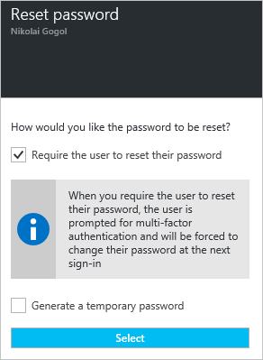
 

**To open the related configuration dialog**:

1. On the **Azure AD Identity Protection** blade, click **Users flagged for risk**.
  

 

2. Click the affected user
  
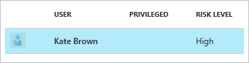
 

2. Click Reset password
  
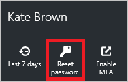
 

## User risk security policy

A user risk security policy is a conditional access policy that evaluates the risk level to a specific user and applies remediation and mitigation actions based on predefined conditions and rules.
  
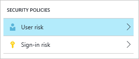
 

Azure AD Identity Protection helps you manage the mitigation and remediation of users flagged for risk by enabling you to:

- Set the users and groups the policy applies to: 
  
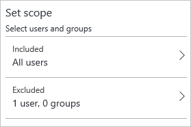
 

- Set the user risk level threshold (low, medium, or high) that triggers a password change: 
  
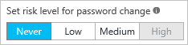
 

- Set the user risk level threshold (low, medium, or high) that triggers blocking a user:
  

 

- Switch the state of your policy:
  

 

- Review and evaluate the impact of a change before activating it:
  
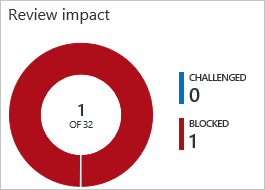
 

Choosing a **High** threshold reduces the number of times a policy is triggered and minimizes the impact to users.
However, it excludes **Low** and **Medium** users flagged for risk from the policy, which may not secure identities or devices that were previously suspected or known to be compromised.

When setting the policy,

- Exclude users who are likely to generate a lot of false-positives (developers, security analysts)

- Exclude users in locales where enabling the policy is not practical (for example no access to helpdesk)

- Use a **High** threshold during initial policy roll out, or if you must minimize challenges seen by end users.

- Use a **Low** threshold if your organization requires greater security. Selecting a **Low** threshold introduces additional user sign-in challenges, but increased security.

The recommended default for most organizations is to configure a rule for a **Medium** threshold to strike a balance between usability and security.

For an overview of the related user experience, see:

- [Compromised account recovery flow](active-directory-identityprotection-flows.md#compromised-account-recovery).  

- [Compromised account blocked flow](active-directory-identityprotection-flows.md#compromised-account-blocked).  

**To open the related configuration dialog**:

1. On the **Azure AD Identity Protection** blade, click **Settings**.
  
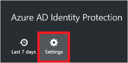
 

2. In the **Security Policies** section, click **User risk**.
  

 

## Mitigating user risk events
Administrators can set a user risk security policy to block users upon sign-in depending on the risk level. 

Blocking a sign-in:
 
- Prevents the generation of new user risk events for the affected user

- Enables administrators to manually remediate the risk events affecting the user's identity and restore it to a secure state

## What is a sign-in risk level?

A sign-in risk level is an indication (High, Medium, or Low) of the likelihood that for a specific sign-in, someone else is attempting to authenticate with the user’s identity. The sign-in risk level is evaluated at the time of a sign-in and considers risk events and indicators detected in real-time for that specific sign-in. 

## Mitigating sign-in risk events 
A mitigation is an action to limit the ability of an attacker to exploit a compromised identity or device without restoring the identity or device to a safe state. A mitigation does not resolve previous sign-in risk events associated with the identity or device.

You can use conditional access in Azure AD Identity Protection to automatically mitigate sign-in risk events. Using these policies, you consider the risk level of the user or the sign-in to block risky sign-ins or require the user to perform multi-factor authentication. These actions may prevent an attacker from exploiting a stolen identity to cause damage, and may give you some time to secure the identity. 

## Sign-in risk security policy

A sign-in risk policy is a conditional access policy that evaluates the risk to a specific sign-in and applies mitigations based on predefined conditions and rules.
  

 

Azure AD Identity Protection helps you manage the mitigation of risky sign-ins by enabling you to:

- Set the users and groups the policy applies to: 
  
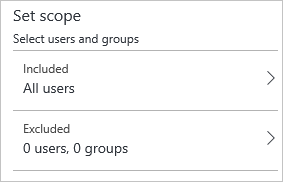
 

- Set the sign-in risk level threshold (low, medium, or high) that triggers a multi-factor authentication challenge for the affected sign-ins: 
  
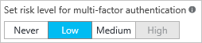
 

- Set the sign-in risk level threshold (low, medium, or high) that blocks the affected sign-ins:  
  
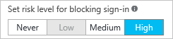
 

- Switch the state of your policy:
  

 

- Review and evaluate the impact of a change before activating it: 
  
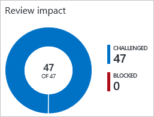
 

 
Choosing a **High** threshold reduces the number of times a policy is triggered and minimizes the impact to users.  
However, it excludes **Low** and **Medium** sign-ins flagged for risk from the policy, which may not block an attacker from exploiting a compromised identity. 

When setting the policy, 

- Exclude users who do not/cannot have multi-factor authentication

- Exclude users in locales where enabling the policy is not practical (for example no access to helpdesk)

- Exclude users who are likely to generate a lot of false-positives (developers, security analysts)

- Use a **High** threshold during initial policy roll out, or if you must minimize challenges seen by end users.

- Use a **Low**  threshold if your organization requires greater security. Selecting a **Low** threshold introduces additional user sign-in challenges, but increased security.

The recommended default for most organizations is to configure a rule for a **Medium** threshold to strike a balance between usability and security.

 
The sign-in risk policy is:

- Applied to all browser traffic and sign-ins using modern authentication.
- Not applied to applications using older security protocols by disabling the WS-Trust endpoint at the federated IDP, such as ADFS.

The **Risk Events** page in the Identity Protection console lists all events:

- This policy was applied to
- You can review the activity and determine whether the action was appropriate or not 

For an overview of the related user experience, see:

- [Risky sign-in recovery](active-directory-identityprotection-flows.md#risky-sign-in-recovery) 

- [Risky sign-in blocked](active-directory-identityprotection-flows.md#risky-sign-in-blocked)  

- [Multi-factor authentication registration during a risky sign-in](active-directory-identityprotection-flows.md#multi-factor-authentication-registration-during-a-risky-sign-in)  

**To open the related configuration dialog**:

1. On the **Azure AD Identity Protection** blade, click **Settings**.
  

 

1. In the **Security Policies** section, click **Sign-in risk**.
  

 

## Multi-factor authentication registration policy

Azure Multi-factor authentication is a method of verifying who you are that requires the use of more than just a username and password. It provides a second layer of security to user sign-ins and transactions.  
We recommend that you require Azure Multi-Factor Authentication for user sign-ins because it:

- Delivers strong authentication with a range of easy verification options

- Plays a key role in preparing your organization to protect and recover from account compromises

For more details, see [What is Azure Multi-Factor Authentication?](../multi-factor-authentication/multi-factor-authentication.md)

Azure AD Identity Protection helps you manage the roll-out of multi-factor authentication registration by configuring a policy that enables you to: 

- View the current registration status: 
  
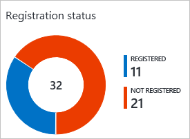
 

- Set the users and groups the policy applies to:
  
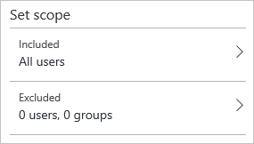
 

- Define how long they are allowed to skip registration:
  
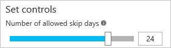
 

- Switch the state of your policy:
  

 

For an overview of the related user experience, see:

- [Multi-factor authentication registration flow](active-directory-identityprotection-flows.md#multi-factor-authentication-registration).  

- [Multi-factor authentication registration during a risky sign-in](active-directory-identityprotection-flows.md#multi-factor-authentication-registration-during-a-risky-sign-in).  

**To open the related configuration dialog**:

1. On the **Azure AD Identity Protection** blade, click **Settings**.
  

 

2. In the **Multi-Factor Authentication** section, click **Registration**.
  
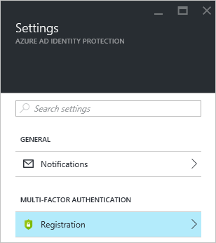
 

## See also

 - [Channel 9: Azure AD and Identity Show: Identity Protection Preview](https://channel9.msdn.com/Series/Azure-AD-Identity/Azure-AD-and-Identity-Show-Identity-Protection-Preview)
 - [Types of risk events detected by Azure Active Directory Identity Protection](active-directory-identityprotection-risk-events-types.md)
 - [Vulnerabilities detected by Azure Active Directory Identity Protection](active-directory-identityprotection-vulnerabilities.md)
 - [Azure Active Directory Identity Protection notifications](active-directory-identityprotection-notifications.md)
 - [Azure Active Directory Identity Protection flows](active-directory-identityprotection-flows.md)
 - [Azure Active Directory Identity Protection playbook](active-directory-identityprotection-playbook.md)
 - [Azure Active Directory Identity Protection glossary](active-directory-identityprotection-glossary.md)
 - [Get started with Azure Active Directory Identity Protection and Microsoft Graph](active-directory-identityprotection-graph-getting-started.md)

