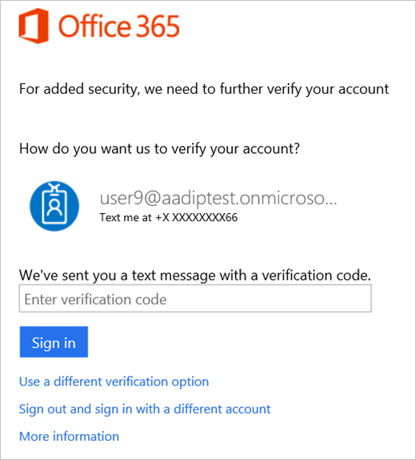
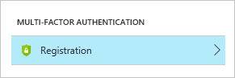
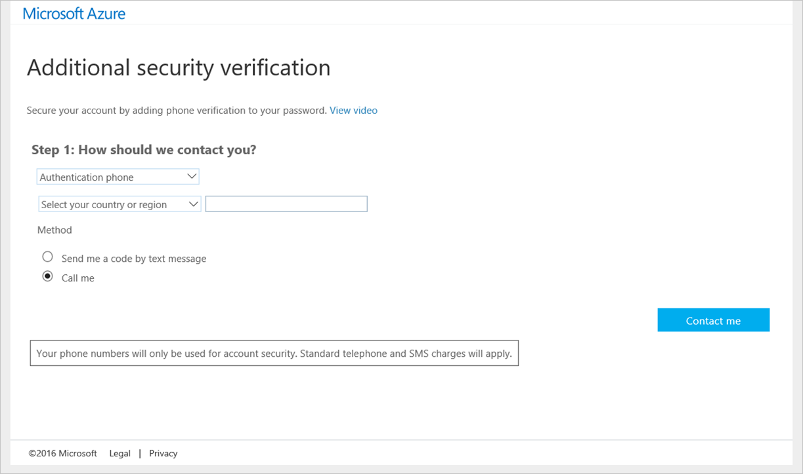
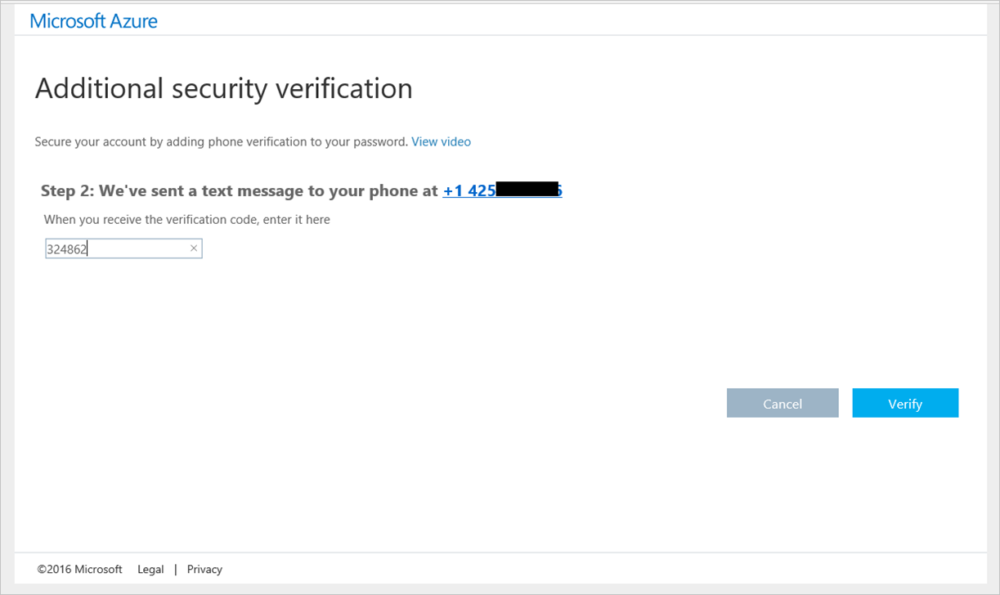

<properties
	pageTitle="Azure Active Directory Identity Protection | Microsoft Azure"
	description="Learn how Azure AD Identity Protection enables you to limit the ability of an attacker to exploit a compromised identity or device and to secure an identity or a device that was previously suspected or known to be compromised."
	services="active-directory"
	keywords="azure active directory identity protection, cloud app discovery, managing applications, security, risk, risk level, vulnerability, security policy"
	documentationCenter=""
	authors="markusvi"
	manager="stevenpo"
	editor=""/>

<tags
	ms.service="active-directory"
	ms.workload="identity"
	ms.tgt_pltfrm="na"
	ms.devlang="na"
	ms.topic="article"
	ms.date="03/02/2016"
	ms.author="markvi"/>

#Azure Active Directory Identity Protection 

Azure Active Directory Identity Protection is a security service that provides a consolidated view into risk events and potential vulnerabilities affecting your organization’s identities. Microsoft has been securing cloud-based identities for over a decade, and with Azure AD Identity Protection, Microsoft is making these same protection systems available to enterprise customers. Identity Protection leverages existing Azure AD’s anomaly detection capabilities (available through Azure AD’s Anomalous Activity Reports), and introduces new risk event types that can detect anomalies in real-time.

> [AZURE.NOTE] The preview of Azure Active Directory Identity Protection is currently available only for directories with a **Country or Region** value of **United States**.   

.
 

The vast majority of security breaches take place when attackers gain access to an environment by stealing a user’s identity. Attackers have become increasingly effective at leveraging third party breaches, and using sophisticated phishing attacks. Once an attacker gains access to even a low privileged user account, it is relatively straightforward for them to gain access to important company resources through lateral movement. It is therefore essential to protect all identities and, when an identity is compromised, proactively prevent the compromised identity from being abused. 

Discovering compromised identities is no easy task. Fortunately, Identity Protection can help: Identity Protection uses adaptive machine learning algorithms and heuristics to detect anomalies and risk events that may indicate that an identity has been compromised.
 
Using this data, Identity Protection generates reports and alerts that enables you to investigate these risk events and take appropriate remediation or mitigation action.
 
But Azure Active Directory Identity Protection more than a monitoring and reporting tool. Based on risk events, Identity Protection calculates a user risk level for each user, enabling you to configure risk-based policies to automatically protect the identities of your organization.  These risk-based policies, in addition to other conditional access controls provided by Azure Active Directory and EMS, can automatically block or offer adaptive remediation actions that include password resets and multi-factor authentication enforcement.  

####Explore Identity Protection's capabilities 

**Detecting risk events and risky accounts:**  

- Detecting 6 risk event types using machine learning and heuristic rules 

- Calculating user risk levels

- Providing custom recommendations to improve overall security posture by highlighting vulnerabilities

 

**Investigating risk events:**

- Sending notifications for risk events

- Investigating risk events using relevant and contextual information

- Providing basic workflows to track investigations

- Providing easy access to remediation actions such as password reset

 

**Risk-based conditional access policies:**

- Policy to mitigate risky sign-ins by blocking sign-ins or requiring multi-factor authentication challenges.

- Policy to block or secure risky user accounts

- Policy to require users to register for multi-factor authentication

## Detection and Risk

### Risk events

Risk events are events that were flagged as suspicious by Identity Protection, and indicate that an identity may have been compromised. For a complete list of risk events, see [Types of Risk Events](#types-of-risk-events). Some of these risk events have been available through the Azure AD Anomalous Activity reports in the Azure Management Portal. 
The table below lists the various risk event types and the corresponding **Azure AD Anomalous Activity** report. Microsoft is continuing to invest in this space, and plans to continuously improve the detection accuracy of existing risk events and add new risk event types on an ongoing basis. 

| Identity Protection Risk Event Type | Corresponding Azure AD Anomalous Activity Report |
| :-- | :-- |
| Leaked credentials	| Users with leaked credentials |
| Impossible travel to atypical locations |	Irregular sign-in activity |
| Sign-ins from infected devices	| Sign-ins from possibly infected devices |
| Sign-ins from anonymous IP addresses	| Sign-ins from unknown sources |
| Sign-ins from IP addresses with suspicious activity |	Sign-ins from IP addresses with suspicious activity |
| Signs in from unfamiliar locations	| - |
| Lockout events (not in public preview)	| - |

The following Azure AD Anomalous Activity reports are not included as risk events in Azure AD Identity Protection, and will therefore not be available through Identity Protection. These reports are still available in the Azure Management Portal however they will be deprecated at some time in the future as they are being superseded by risk events in Identity Protection.

- Sign-ins after multiple failures
- Sign-ins from multiple geographies

### Risk level

The Risk level for a risk event is an indication (High, Medium, or Low) of the severity of the risk event. The risk level helps Identity Protection users prioritize the actions they must take to reduce the risk to their organization. The severity of the risk event represents the strength of the signal as a predictor of identity compromise, combined with the amount of noise that it typically introduces. 

- **High**: High confidence and high severity risk event. These events are strong indicators that the user’s identity has been compromised, and any user accounts impacted should be remediated immediately.

- **Medium**: High severity, but lower confidence risk event, or vice versa. These events are potentially risky, and any user accounts impacted should be remediated.

- **Low**: Low confidence and low severity risk event. This event may not require an immediate action, but when combined with other risk events, may provide a strong indication that the identity is compromised. 

 

Risk events are either identified in **real-time**, or in post-processing after the risk event has already taken place (offline). Currently most risk events in Identity Protection are computed offline, and show up in Identity Protection within 2-4 hours. 
While evaluated in real-time, the real-time risk events will show up in the Identity Protection Console within 5-10 minutes.

Several legacy clients do not currently support real-time risk event detection and prevention. As a result, sign-ins from these clients cannot be detected or prevented in real-time.

### Types of risk events

This section gives you an overview of the available types of risk events

#### Leaked credentials

Leaked credentials are found posted publicly in the dark web by Microsoft security researchers. These credentials are usually found in plain text. They are checked against Azure AD credentials, and if there is a match, they are reported as “Leaked credentials” in Identity Protection.

Leaked credentials risk events are classified as a “High” severity risk event, because they provide a clear indication that the user name and password are available to an attacker.

#### Impossible travel to atypical locations

This risk event type identifies two sign-ins originating from geographically distant locations, where at least one of the locations may also be atypical for the user, given past behavior. In addition, the time between the two sign-ins is shorter than the time it would have taken the user to travel from the first location to the second, indicating that a different user is using the same credentials. 

This machine learning algorithm that ignores obvious "*false positives*" contributing to the impossible travel condition, such as VPNs and locations regularly used by other users in the organization.  The system has an initial learning period of 14 days during which it learns a new user’s sign-in behavior.

Impossible travel is usually a good indicator that a hacker was able to successfully sign-in. However, false-positives may occur when a user is traveling using a new device or using a VPN that is typically not used by other users in the organization. Another source of false-positives is applications that incorrectly pass server IPs as client IPs, which may give the appearance of sign-ins taking place from the data center where that application’s back-end is hosted (often these are Microsoft datacenters, which may give the appearance of sign-ins taking place from Microsoft owned IP addresses). As a result of these false-positives, the risk level for this risk event is “**Medium**”.

####Sign-ins from infected devices

This risk event type identifies sign-ins from devices infected with malware, that are known to actively communicate with a bot server. This is determined by correlating IP addresses of the user’s device against IP addresses that were in contact with a bot server. 

This risk event identifies IP addresses, not user devices. If several devices are behind a single IP address, and only some are controlled by a bot network, sign-ins from other devices my trigger this event unnecessarily, which is the reason for classifying this risk event as “**Low**”.  

We recommend that you contact the user and scan all the user's devices. It is also possible that a user's personal device is infected, or as mentioned earlier, that someone else was using an infected device from the same IP address as the user. Infected devices are often infected by malware that have not yet been identified by anti-virus software, and may also indicate as bad user habits that may have caused the device to become infected.

For more information about how to address malware infections, see the [Malware Protection Center](http://go.microsoft.com/fwlink/?linkid=335773&clcid=0x409).

#### Sign-ins from anonymous IP addresses

This risk event type identifies users who have successfully signed in from an IP address that has been identified as an anonymous proxy IP address. These proxies are used by people who want to hide their device’s IP address, and may be used for malicious intent.

We recommend that you immediately contact the user to verify if they were using anonymous IP addresses. The risk level for this risk event type is “**Medium**” because in itself an anonymous IP is not a strong indication of an account compromise.

#### Sign-ins from IP addresses with suspicious activity

This risk event type identifies IP addresses from which a high number of failed sign-in attempts were seen, across multiple user accounts, over a short period of time. This matches traffic patterns of IP addresses used by attackers, and is a strong indicator that accounts are either already or are about to be compromised. This is a machine learning algorithm that ignores obvious "*false-positives*", such as IP addresses that are regularly used by other users in the organization.  The system has an initial learning period of 14 days where it learns the sign-in behavior of a new user and new tenant.

We recommend that you contact the user to verify if they actually signed in from an IP address that was marked as suspicious. The risk level for this event type is “**Medium**” because several devices may be behind the same IP address, while only some may be responsible for the suspicious activity. 

#### Sign-in from unfamiliar locations

This risk event type is a real-time sign-in evaluation mechanism that considers past sign-in locations (IP, Latitude / Longitude and ASN) to determine new / unfamiliar locations. The system stores information about previous locations used by a user, and considers these “familiar” locations. The risk even is triggered when the sign-in occurs from a location that's not already in the list of familiar locations. The system has an initial learning period of 14 days, during which it does not flag any new locations as unfamiliar locations. The system also ignores sign-ins from familiar devices, and locations that are geographically close to a familiar location.  
Unfamiliar locations can provide a strong indication that an attacker is able attempting to use a stolen identity. False-positives may occur when a user is traveling, trying out a new device or uses a new VPN. As a result of these false positives, the risk level for this event type is “**Medium**”.

### Vulnerabilities

Vulnerabilities are weaknesses in your environment that can be exploited by an attacker. We recommend that you address these vulnerabilities to improve the security posture of your organization, and prevent attackers from exploiting these vulnerabilities.

#### Multi-factor authentication registration not configured 

This vulnerability helps you control the deployment of Azure Multi-Factor Authentication in your organization. 

Azure multi-factor authentication provides a second layer of security to user authentication. It helps safeguard access to data and applications while meeting user demand for a simple sign-in process. It delivers strong authentication via a range of easy verification options—phone call, text message, or mobile app notification or verification code and 3rd party OATH tokens.

We recommend that you require multi-factor authentication for user sign-ins. Multi-factor authentication play a key role in risk-based conditional access policies available through Identity Protection.

For more details, see [What is Azure Multi-Factor Authentication?](../multi-factor-authentication/multi-factor-authentication.md)

#### Unmanaged cloud apps

This vulnerability helps you identify unmanaged cloud apps in your organization.
 
In modern enterprises, IT departments are often unaware of all the cloud applications that users in their organization are using to do their work. It is easy to see why administrators would have concerns about unauthorized access to corporate data, possible data leakage and other security risks. 

We recommend that your organization deploy Cloud App Discovery to discover unmanaged cloud applications, and to manage these applications using Azure Active Directory.

For more details, see [Finding unmanaged cloud applications with Cloud App Discovery](active-directory-cloudappdiscovery-whatis.md).

####Security Alerts from Privileged Identity Management

This vulnerability helps you discover and resolve alerts about privileged identities in your organization.  

To enable users to carry out privileged operations, organizations need to grant users temporary or permanent privileged access in Azure AD, Azure or Office 365 resources, or other SaaS apps. Each of these privileged users increases the attack surface of your organization. This vulnerability helps you identify users with unnecessary privileged access, and take appropriate action to reduce or eliminate the risk they pose. 

We recommend that your organization uses Azure AD Privileged Identity Management to manage, control, and monitor privileged identities and their access to resources in Azure AD as well as other Microsoft online services like Office 365 or Microsoft Intune.

For more details, see [Azure AD Privileged Identity Management](active-directory-privileged-identity-management-configure.md). 

## Investigation
Your journey through Identity Protection typically starts with the Identity Protection dashboard. 

  

  

The dashboard gives you access to:
 
- reports such as **Users flagged for risk**, **Risk events** and **Vulnerabilities**
- settings such as the configuration of your **Security Policies**, **Notifications** and **multi-factor authentication registration**
 

It is typically your starting point for investigation, which is the process of reviewing the activities, logs, and other relevant information related to a risk event to decide whether remediation or mitigation steps are necessary,  and how the identity was compromised, and understand how the compromised identity was used.

### Notifications

Azure AD Identity Protection sends two types of automated notification emails to help you manage user risk and risk events:

- User compromised alert email

- Weekly digest email

#### User compromised alert email

A user compromised email alert is generated when Azure AD Identity Protection identifies an account as compromised. The email includes a link to the Users flagged for risk report in the Identity Protection Console. We recommend that notifications of compromised users be investigated immediately.

#### Weekly digest email

The weekly digest email contains a summary of new risk events. 
It includes:
- Users at risk
- Reported risk events
- Detected vulnerabilities
- Links to the related reports in Identity Protection

 

  

By default, the compromised user alert is sent to all Azure Active Directory administrators. You can customize the recipients by:

- Following the manage recipients link at the bottom of the alert

- Clicking Notifications under Identity Protection settings
 
 

 
 

## What is a user risk level?

A user risk level is an indication (High, Medium, or Low) of the likelihood that the user’s identity has been compromised. It is calculated based on the user risk events that are associated with the user's identity. 

The status of a risk event is either **Active** or **Closed**. Only risk events that are **Active** contribute to the user risk calculation. 

The user risk level is calculated using the following inputs:

- Active risk events impacting the user
- Risk level of these events 
- Whether any remediation actions have been taken 

 

 

You can use the user risk levels to create conditional access policies to block risky users from signing in, or force them to securely change their password. 

## Closing risk events manually

In most cases, you will take remediation actions such as a secure password reset to automatically close risk events. However, this might not always be possible.   
Because risk events that are **Active** contribute to the user risk calculation, you may have to manually lower a risk level by closing risk events manually.  
During the course of investigation, you can choose to take any of these actions to change the status of a risk event:

 

 

- **Resolve** - If after investigating a risk event, you took an appropriate remediation action outside Identity Protection, and you believe that the risk event should be considered closed, mark the event as Resolved. Resolved events will set the risk event’s status to Closed and the risk event will no longer contribute to user risk.

- **Mark as false-positive** - In some cases, you may investigate a risk event and discover that it was incorrectly flagged as a risky. You can help reduce the number of such occurrences by marking the risk event as False-positive. This will help the machine learning algorithms to improve the classification of similar events in the future. The status of false-positive events is to **Closed** and they will no longer contribute to user risk.

- **Ignore** - If you have not taken any remediation action, but want the risk event to be removed from the active list, you can mark a risk event Ignore and the event status will be Closed. Ignored events do not contribute to user risk. This option should only be used under unusual circumstances. 

- **Reactivate** - Risk events that were manually closed (by choosing **Resolve**, **False positive**, or **Ignore**) can be reactivated, setting the event status back to **Active**. Reactivated risk events contribute to the user risk level calculation. Risk events closed through remediation (such as a secure password reset) cannot be reactivated. 

## Remediating user risk events

A remediation is an action to secure an identity or a device that was previously suspected or known to be compromised. A remediation action restores the identity or device to a safe state, and resolves previous risk events associated with the identity or device.

To remediate user risk events, you can:

- perform a secure password reset to remediate user risk events manually 

- configure a user risk security policy to mitigate or remediate user risk events automatically

- re-image the infected device  

### Secure password reset

A secure password reset is an effective remediation for many risk events, and when performed, automatically closes these risk events and recalculates the user risk level. You can use the Identity Protection console to initiate a password reset for a risky user. 

The console provides two different ways to reset a password:

**Reset password** - Select **Require user to reset password** to allow the user to self-recover if the user has registered for multi-factor authentication. During the user's next sign-in, the user will be required to solve a multi-factor authentication challenge successfully and then, forced to change the password. This option isn't available if the user account is not already registered multi-factor authentication.

**Temporary password** - Select **Generate a temporary password** to immediately invalidate the existing password, and create a new temporary password for the user. Send the new temporary password to an alternate email address for the user or to the user's manager. Because the password is temporary, the user will be prompted to change the password upon sign-in.

 

 

## User risk security policy

A user risk security policy is a conditional access policy that evaluates the risk level to a specific user and applies remediation and mitigation actions based on predefined conditions and rules.
  

 

Azure AD Identity Protection helps you manage the mitigation and remediation of users flagged for risk by enabling you to:

- set the users and groups the policy applies to 
  

 

- set the user risk level threshold (low, medium, or high) that triggers a password change 
  

 

- set the user risk level threshold (low, medium, or high) that triggers blocking a user
  

 

- review and evaluate the impact of a change before activating it
  

 

Choosing a **High** threshold reduces the number of times a policy is triggered and minimizes the impact to users.
However, it excludes **Low** and **Medium** users flagged for risk from the policy, which may not secure identities or devices that were previously suspected or known to be compromised.

When setting the policy,

- exclude users who are likely to generate a lot of false-positives (developers, security analysts)

- exclude users in locales where enabling the policy is not practical (for example no access to helpdesk)

- use a **High** threshold during initial policy roll out, or if you must minimize challenges seen by end users.

- use a **Low** threshold if your organization requires greater security. Selecting a **Low** threshold introduces additional user sign-in challenges, but increased security.

The recommended default for most organizations is to configure a rule for a **Medium** threshold to strike a balance between usability and security.

## Mitigating user risk events
Administrators can set a user risk security policy to block users upon sign-in depending on the risk level. 

Blocking a sign-in:
 
- prevents the generation of new user risk events for the affected user

- enables administrators to manually remediate the risk events affecting the user's identity and restore it to a secure state

## User risk remediation and mitigation flows  

The following sections provide an overview of the user experience for user risk remediation and mitigation flows.

#### Compromised Account Recovery Flow

When a user risk security policy has been configured, users who meet the user risk level specified in the policy (and are therefore assumed compromised) must go through the user compromise recovery flow before they can sign-in. 

The user compromise recovery flow has three steps:

1. The user is informed that their account security is at risk because of suspicious activity or leaked credentials.

 

  

2.	The user is required to prove their identity by solving a security challenge. If the user is registered for multi-factor authentication they can self-recover from being compromised. They will need to round-trip a security code to their phone number. 

 

 

3.	Finally, the user is forced to change their password since someone else may have had access to their account. 
Screenshots of this experience are below.
 
 

 

 
#### Reset password
If a user is blocked from signing in, an administrator can generate a temporary password for them. They will have to change their password the next time they sign in. A password change remediates and closes most types of risk events for the user.

 

  

### User risk level mitigation

### Compromised account: blocked 

To get a user that was blocked by a user risk security policy unblocked, the user must contact an administrator or help desk. Self-recovering by solving multi-factor authentication is not an option in this case.

 

 

## What is a sign-in risk level?

A sign-in risk level is an indication (High, Medium, or Low) of the likelihood that for a specific sign-in, someone else is attempting to authenticate with the user’s identity. The sign-in risk level is evaluated at the time of a sign-in and considers risk events and indicators detected in real-time for that specific sign-in. 

## Mitigating sign-in risk events 
A mitigation is an action to limit the ability of an attacker to exploit a compromised identity or device without restoring the identity or device to a safe state. A mitigation does not resolve previous sign-in risk events associated with the identity or device.

You can use conditional access in Azure AD Identity Protection to automatically mitigate sign-in risk events. Using these policies, you consider the risk level of the user or the sign-in to block risky sign-ins or require the user to perform multi-factor authentication. These actions may prevent an attacker from exploiting a stolen identity to cause damage, and may give you some time to secure the identity. 

## Sign-in risk security policy

A sign-in risk policy is a conditional access policy that evaluates the risk to a specific sign-in and applies mitigations based on predefined conditions and rules.
  

 

Azure AD Identity Protection helps you manage the mitigation of risky sign-ins by enabling you to:

- set the users and groups the policy applies to 
  

 

- set the sign-in risk level threshold (low, medium, or high) that triggers a multi-factor authentication challenge for the affected sign-ins 
  

 

- set the sign-in risk level threshold (low, medium, or high) that blocks the affected sign-ins.  
  

 

- review and evaluate the impact of a change before activating it 
  

 

 
Choosing a **High** threshold reduces the number of times a policy is triggered and minimizes the impact to users.  
However, it excludes **Low** and **Medium** sign-ins flagged for risk from the policy, which may not block an attacker from exploiting a compromised identity. 

When setting the policy, 

- exclude users who do not/cannot have multi-factor authentication

- exclude users in locales where enabling the policy is not practical (for example no access to helpdesk)

- exclude users who are likely to generate a lot of false-positives (developers, security analysts)

- use a **High** threshold during initial policy roll out, or if you must minimize challenges seen by end users.

- use a **Low**  threshold if your organization requires greater security. Selecting a **Low** threshold introduces additional user sign-in challenges, but increased security.

The recommended default for most organizations is to configure a rule for a **Medium** threshold to strike a balance between usability and security.

 
The sign-in risk policy is:

- applied to all browser traffic and sign-ins using modern authentication.
- not applied to applications using older security protocols by disabling the WS-Trust endpoint at the federated IDP, such as ADFS.

The **Risk Events** page in the Identity Protection console lists all events:

- this policy was applied to
- you can review the activity and determine whether the action was appropriate or not 

## Multi-factor authentication registration policy

Multi-factor authentication is used to gain additional assurance of a user’s identity.  
Registering for multi-factor authentication is a critical step in preparing your organization to protect and recover from account compromises. 
 

 

Azure AD Identity Protection helps you manage the roll-out of multi-factor authentication registration by enabling you to: 

- set the users and groups the policy applies to
  

 

- define how long they are allowed to skip registration
  

 

- view the current registration state of impacted users. 
  

 

##Sign-in risk mitigation flows 

#### Risky sign-in recovery flow

When an administrator has configured a policy for sign-in risks, the affected users are notified when they try to sign-in. 

The risky sign-in flow has two steps: 

1. The user is informed that something unusual was detected about their sign-in, such as signing in from a new location, device, or app. 
 

 

2. The user is required to prove their identity by solving a security challenge. If the user is registered for multi-factor authentication they need to round-trip a security code to their phone number. Since this is a just a risky sign in and not a compromised account, the user won’t have to change the password in this flow. 
 

 
 
#### Risky sign-in blocked
Administrators can also choose to set a Sign-In Risk policy to block users upon sign-in depending on the risk level. To get unblocked, end users must contact an administrator or help desk, or they can try signing in from a familiar location or device. Self-recovering by solving multi-factor authentication is not an option in this case.

 

 
 
#### Multi-factor authentication registration

The best user experience for both, the compromised account recovery flow and the risky sign-in flow, is when the user can self-recover. If a user is registered for multi-factor authentication, they already have a phone number associated with their account that can be used to pass security challenges. No help desk or administrator involvement is needed to recover from account compromise. Thus, it’s highly recommended to get your users registered for multi-factor authentication. 

Administrators can:

- set a policy that requires users to set up their accounts for additional security verification. 
- allow skipping multi-factor authentication registration for up to 30 days, in case they want to give users a grace period before registering.

 
  

 
  

 
  

 

 

#### Multi-factor authentication registration during a risky sign-in

It is important that users register for multi-factor authentication so that they are prepared and able to pass security challenges. If a user isn’t registered for multi-factor authentication but the policy requires them to be, they could be asked to register during a risky sign-in. This means, an attacker could end up being asked to add a phone number instead of the good user.  
To avoid this situation, require users to register for multi-factor authentication as soon as possible, so that a phone number is already associated with their account in case they ever get compromised. Alternatively, administrators can completely block compromised users who aren’t registered for multi-factor authentication.

  

 
  

  

 
## Playbook

### Simulating Risk Events

This section will give an overview of simulating the following risk event types:

- Sign-ins from anonymous IP addresses (easy)

- Sign-ins from unfamiliar locations (moderate)

- Impossible travel to atypical locations (difficult)

Other risk events cannot be simulated in a secure manner.

#### Sign-ins from anonymous IP addresses

This risk event type identifies users who have successfully signed in from an IP address that has been identified as an anonymous proxy IP address. These proxies are used by people who want to hide their device’s IP address and may be used for malicious intent.

To simulate a sign-in from an anonymous IP, follow these steps:

1.	Download the [Tor Browser](https://www.torproject.org/projects/torbrowser.html.en)
2.	Using the Tor Browser, navigate to https://myapps.microsoft.com   
3.	Enter the credentials of the account you want to appear in the Sign-ins from anonymous IP addresses report

You are done! The sign-in should be viewable in Identity Protection within 5 minutes. 

####Sign-ins from unfamiliar locations
Unfamiliar locations risk is a real-time sign-in evaluation mechanism that considers past sign-in locations (IP, Latitude/Longitude and ASN) to determine new/unfamiliar locations. The system stores previous IPs, Latitude/Longitude, and ASNs of a user and considers these to be “familiar” locations. A sign-in location is considered unfamiliar if the sign-in location does not match any of the existing familiar locations. The system has an initial learning period of 14 days during which it does not flag any new locations as unfamiliar locations. The system also ignores sign-ins from familiar devices and locations that are geographically close to an existing familiar location.

To simulate unfamiliar locations, you will have to sign in from a location and device that the account has not signed in from before. Step by step:

1.	Choose an account that has at least a 14-day sign-in history 

2.	Do either:
	
    a. While using a VPN, navigate to [https://myapps.microsoft.com](https://myapps.microsoft.com) and enter the credentials of the account you want to simulate the risk event for

    b. Ask an associate in a different location to sign in using the account’s credentials (not recommended)

You are done! The sign-in should be viewable in Identity Protection within 5 minutes.
 
#### Impossible travel to atypical location
Simulating the impossible travel condition is difficult because the algorithm uses machine learning to weed out false-positives, such as impossible travel from familiar devices, or sign-ins from VPNs that are used by other users in the directory. Additionally, the algorithm requires a sign-in history of 3 to 14 days for the user before it begins generating risk events.

1.	Using your standard browser, navigate to [https://myapps.microsoft.com](https://myapps.microsoft.com)  

2.	Enter the credentials of the account you want to generate an impossible travel risk event for

3.	Now change your user agent. You can change user agent in Internet Explorer from Developer Tools, or change your user agent in Firefox or Chrome using a user-agent switcher add-on

4.	Now change your IP address. You can change your IP address by using a VPN, Tor add-on, or spinning up a new machine in Azure in a different datacenter

5.	Sign-in to [https://myapps.microsoft.com](https://myapps.microsoft.com) using the same credentials as before, and within a short a few minutes of the previous sign-in

The sign-in should be viewable in Identity Protection within 2-4 hours. However, because of complex machine learning models involved, there is a chance it will not get picked up. It might be a good idea to replicate these steps for multiple Azure AD accounts.

#### Simulating vulnerabilities 
Vulnerabilities are weaknesses in an Azure AD environment that can be exploited by a bad actor. Currently 3 types of vulnerabilities are surfaced in Azure AD Identity Protection that leverage other features of Azure AD. These Vulnerabilities will be displayed in Identity Protection automatically once these features are set up.

-	Azure AD [Multi-Factor Authentication?](../multi-factor-authentication/multi-factor-authentication.md)
-	Azure AD [Cloud App Discovery](active-directory-cloudappdiscovery-whatis.md).
-	Azure AD [Privileged Identity Management](active-directory-privileged-identity-management-configure.md). 

###Risk-based Conditional Access Policies
####User compromise risk

**To test User compromise risk, perform the following steps**:

1.	Sign-in to [https://portal.azure.com](https://portal.azure.com) with global administrator credentials for your tenant.

2.	Navigate to **Identity Protection**. 

3.	On the main Azure AD Identity Protection blade, click **Settings**. 

4.	On the **Portal Settings** blade, under **Security rules**, click **User compromise risk**. 

5.	On the **Sign in Risk** blade, turn **Enable rule** off, and then click **Save** settings.

6.	For a given user account, simulate an unfamiliar locations or anonymous IP risk event. This will elevate the user risk level for that user to **Medium**.

7.	Wait a few minutes and verify that user level for your user is **Medium**.

8.	Go to the **Portal Settings** blade.

9.	On the **User Compromise Risk** blade, select **On** under **Enable rule**. 

10.	Select one of the following options:

    a. To block, select **Medium** under **Block sign in**

    b. To enforce secure password change, select **Medium** under **Require multi-factor authentication**.

13.	Click **Save**.

14. You can now test risk-based conditional access by signing in using a user with an elevated risk level. If the user risk is Medium, your sign-in will be blocked, or you will be forced to change your password, depending on the policy you set.
  

 

 
####Sign-in risk

 

To test Sign in risk, perform the following steps:

1.	Sign-in to [https://portal.azure.com ](https://portal.azure.com) with global administrator credentials for your tenant.

2.	Navigate to **Identity Protection**.

3.	On the main **Azure AD Identity Protection** blade, click **Settings**. 

4.	On the **Portal Settings** blade, under **Security rules**, click **Sign in risk**.

5.	On the **Sign in Risk **blade, select **On** under **Enable rule**. 

7.	Select one of the following options:

    a. To block, select **Medium** under **Block sign in**

    b. To enforce secure password change, select **Medium** under **Require multi-factor authentication**.

8.	To block, select Medium under Block sign in…

9.	To enforce multi-factor authentication, select Medium under Require multi-factor authentication…

10.	Click on **Save**.

11.	You can now test risk-based conditional access by simulating the unfamiliar locations or anonymous IP risk events, both of which are considered Medium risk events.

 

 

## See also

 - [Channel 9: Azure AD and Identity Show: Identity Protection Preview](https://channel9.msdn.com/Series/Azure-AD-Identity/Azure-AD-and-Identity-Show-Identity-Protection-Preview)
 - [The Identity Protection glossary](active-directory-identityprotection-glossary.md)

