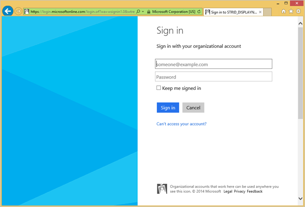
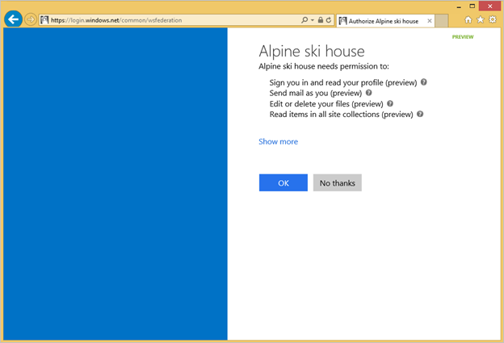
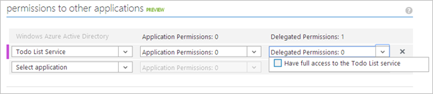
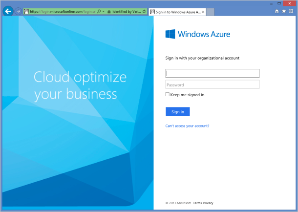

<properties
   pageTitle="Integrating Applications with Azure Active Directory | Microsoft Azure"
   description="Details on how to add, update, or remove an application in Azure Active Directory (Azure AD)."
   services="active-directory"
   documentationCenter=""
   authors="msmbaldwin"
   manager="mbaldwin"
   editor="mbaldwin" />
<tags
   ms.service="active-directory"
   ms.devlang="na"
   ms.topic="article"
   ms.tgt_pltfrm="na"
   ms.workload="identity"
   ms.date="08/25/2015"
   ms.author="mbaldwin" />

# Integrating Applications with Azure Active Directory

[AZURE.INCLUDE [active-directory-devguide](../../includes/active-directory-devguide.md)]

Enterprise developers and software-as-a-service (SaaS) providers can develop commercial cloud services or line of business applications that can be integrated with Azure Active Directory (Azure AD) to provide secure sign in and authorization for their services. To integrate an application or service with Azure AD, a developer must first register the details about their application with Azure AD by using the Azure Management Portal.

This article shows you how to add, update, or remove an application in Azure AD. You will learn about the different types of applications that can be integrated with Azure AD, how to configure your applications to access other resources such as web APIs, and more.

To more information about app properties, see [Application Objects and Service Principal Objects](active-directory-application-objects.md); to learn the branding guidelines you should use when developing applications with Azure Active Directory, see [Branding Guidelines for Integrated Apps](active-directory-branding-guidelines.md); application manifests are explained in [Understanding the Azure Active Directory application manifest](active-directory-application-manifest.md).

## Adding an Application

Any application that wants to use the capabilities of Azure AD must first be registered in a directory. This registration process involves giving Azure AD details about your application, such as the URL where it’s located, the URL to send replies after a user is authenticated, the URI that identifies the app, and so on.

If you’re building a web application that just needs sign-on for users in Azure AD, you can simply follow the instructions below. If your application needs access to a web API, you’re building a native application that needs to access a web API, or you want to make your application multi-tenant, you’ll need to continue reading in the [Updating an Application](#updating-an-application) section to continue configuring your application.

If you want to make your application available to other organizations, you will also need to enable external access once the application has been added.

### To register an application in the Azure Management Portal

1. Sign in to the Azure Management Portal.

1. Click on the Active Directory icon on the left menu, and then click on the desired directory.

1. On the top menu, click Applications. If no apps have been added to your directory, this page will only show the Add an App link. Click on the link, or alternatively you can click on the Add button on the command bar.

1. On the What do you want to do page, click on the link to Add an application my organization is developing.

1. On the Tell us about your application page, you must specify a name for your application as well as indicate the type of application you are registering with Azure AD.  You can choose from a web application and/or web API (default) or native client application which represents an application that is installed on a device such as a phone or computer.Once finished, click the arrow icon on the bottom-right corner of the page.

1. On the App properties page, provide the Sign-on URL and App ID URI for your web application (or just the Redirect URI for a native client application), then click the checkbox in the bottom-right hand corner of the page.

1. Your application has been added, and you will be taken to the Quick Start page for your application. Depending on whether your application is a web or native application, you will see different options on how to add additional capabilities to your application. Once your application has been added, you can begin updating your application to enable users to sign in, access web APIs in other applications, or configure multi-tenant application (which allows other organizations to access your application).

>[AZURE.NOTE] By default, the newly created application registration is configured to allow users from your directory to sign in to your application.

## Updating an Application

Once your application has been registered with Azure AD, it may need to be updated to provide access to web APIs, be made available in other organizations, and more. This section describes how to configure your application further. For more information on the way authentication works in Azure AD, see [Authentication Scenarios for Azure AD](active-directory-authentication-scenarios.md).

### Overview of the Consent Framework

Azure AD’s new consent framework makes it easy to develop web and native applications that need to access web APIs secured by Azure AD. These web APIs include the Graph API, Office 365, and other Microsoft services, in addition to your own web APIs. The framework is based on a user or an administrator giving consent to an application to be registered in their directory, which may involve accessing directory data. For example, if a web application needs to call Office 365’s web API to read calendar information about the user, that user will be required to consent to the application. After consent is given, the web application will be able to call the Office 365 web API on behalf of the user, and use the calendar information as needed.

The consent framework is built on OAuth 2.0 and its various flows, such as authorization code grant and client credentials grant, using public or confidential clients. By using OAuth 2.0, Azure AD makes it possible to build many different types of client applications, such as on a phone, tablet, server, or a web application, and gain access to the required resources.

For more detailed information about the consent framework, see [OAuth 2.0 in Azure AD](https://msdn.microsoft.com/library/azure/dn645545.aspx), [Authentication Scenarios for Azure AD](active-directory-authentication-scenarios.md), and Office 365’s topic [Authentication and Authorization using Common Consent Framework](https://msdn.microsoft.com/library/office/dn605895(v=office.15).aspx).

#### Example of the consent experience

The following steps will show you how the consent experience works for both the application developer and user.

1. On your application’s configuration page in the Azure Management Portal, set the permissions your application requires by using the drop-down menus in the Permissions to other applications control.

    

1. Consider that your application’s permissions have been updated, the application is running, and a user is about to use it for the first time. If the application has not already acquired an access or refresh token, the application needs to go to Azure AD’s authorization endpoint to obtain an authorization code that can be used to acquire a new access and refresh token.

1. If the user is not already authenticated, they’ll be asked to sign in to Azure AD.

    

1. After the user has signed in, Azure AD will determine if the user needs to be shown a consent page. This determination is based on whether the user (or their organization’s administrator) has already granted the application consent. If consent has not already been granted, Azure AD will prompt the user for consent and will display the required permissions it needs to function. The set of permissions that is displayed in the consent dialog are the same as what was selected in the Permissions to other applications control in the Azure Management Portal.

    

1. After the user grants consent, an authorization code is returned to your application, which can be redeemed to acquire an access token and refresh token. For more information about this flow, see the [Web Application to Web API section](active-directory-authentication-scenarios.md#web-application-to-web-api) section in [Authentication Scenarios for Azure AD](active-directory-authentication-scenarios.md).

### Accessing Web APIs in Other Applications

Using the consent framework described above, you can configure your application to require permissions to access data exposed by web APIs in your directory. By default, all applications can choose permissions from Azure Active Directory (Graph API) and Azure Service Management API, with the Azure AD “Enable sign on and read user’s profile” permission already selected by default. If your directory also has a subscription to Office 365, then web APIs and permissions for SharePoint and Exchange Online will also be available for selection. You can select from two types of permissions in the drop-down menus next to the desired web API:

- Application Permissions: Your application needs to access the web API directly as itself (no user context). This type of permission requires administrator consent and is also not available for native client applications.

- Delegation Permissions: Your application needs to access the web API as the signed-in user, but with access limited by the selected permission. This type of permission can be granted by a user unless the permission is configured as requiring administrator consent.

#### To add access to web APIs in other applications

1. Sign in to the Azure Management Portal.

1. Click on the Active Directory icon on the left menu, then click on the desired directory.

1. On the top menu, click Applications, and then click the application you want to configure. The Quick Start page will appear with single sign-on and other configuration information.

1. Expand the Access Web APIs in Other Applications section of the Quick Start, and then click the Configure it now link under the Select permissions section. The application properties page will appear.

1. Scroll down to the Permissions to other applications section. The first column allows you to select from the available applications in your directory that expose a web API.  Once selected, you may select application and delegation permissions that the web API exposes.

1. Once selected, click the Save button on the command bar.

>[AZURE.NOTE] Clicking the Save button also automatically sets the permissions for your application in your directory based on the Permissions to other applications that you configured.  You can view these application permissions by looking at the application Properties tab.

### Exposing Web APIs to Other Applications

You can develop a web API and make it available to other organizations by exposing your permission scopes to other application developers. A correctly configured web API is made available just like the other Microsoft web APIs, including the Graph API and the Office 365 APIs. Your web API is made available by configuring an [application manifest](active-directory-application-manifest.md), which is a JSON file that represents your application’s identity configuration. You can expose your permission scopes by navigating to your application in the Azure Management Portal and clicking on the Application Manifest button on the command bar.  For more information, see [Understanding the Azure Active Directory application manifest](active-directory-application-manifest.md).

#### To expose a web API to other applications

1. Sign in to the Azure Management Portal.

1. Click on the Active Directory icon on the left menu, then click on the desired directory.

1. On the top menu, click Applications, and then click the application you want to configure. The Quick Start page will appear with single sign-on and other configuration information.

1. Click on the Manage manifest button in the command bar, and select Download manifest.

1. Open the JSON application manifest file and replace “oauth2Permissions” node with the following JSON snippet. This snippet is an example of how to expose a permission scope known as user impersonation, make sure that you change the text and values for your own application:

		"oauth2Permissions": [
		{
			"adminConsentDescription": "Allow the application full access to the Todo List service on behalf of the signed-in 	user",
			"adminConsentDisplayName": "Have full access to the Todo List service",
			"id": "b69ee3c9-c40d-4f2a-ac80-961cd1534e40",
			"isEnabled": true,
			“origin”: “Application”
			"type": "User",
			"userConsentDescription": "Allow the application full access to the todo service on your behalf",
			"userConsentDisplayName": "Have full access to the todo service",
			"value": "user_impersonation"
			}
		],

    The id value must be a new generated GUID that you create by using a GUID generation tool or programmatically. It represents a unique identifier for the permission that is exposed by the web API. Once your client is appropriately configured to request access to your web API and calls the web API, it will present an OAuth 2.0 JWT token that has the scope (scp) claim set to the value above, which in this case is user_impersonation.

	>[AZURE.NOTE] You can expose additional permission scopes later as necessary. Consider that your web API might expose multiple permissions associated with a variety of different functions. Now you can control access to the web API by using the scope (scp) claim in the received OAuth 2.0 JWT token.

1. Save the updated JSON file and upload it by clicking the Manage manifest button in the command bar, selecting Upload manifest, browsing to your updated manifest file and then selecting it. Once uploaded, your web API is now configured to be used by other applications in your directory.

#### To verify the web API is exposed to other applications in your directory

1. On the top menu, click Applications, select the desired application you want to configure access to the web API, and then click Configure.

1. Scroll down to the permissions to other applications section. Click on the Select application drop-down menu and you will be able to select the web API that you just exposed a permission for. From the Delegation Permissions drop-down menu, select the new permission.

#### AppPermissions Schema for Application Manifest JSON File

The following table lists the possible values for the oauth2Permissions portion of the Application Manifest JSON file.

|Element|Description|
|---|---|
|adminConsentDescription|The help description in the hover over in the administrator’s consent dialog and in the consented app’s properties page.|
|adminConsentDisplayName|The friendly name for the permission shown in the application and/or delegation permission scope dropdowns, and to administrators during consent, and in the app’s properties page.|
|id|Represents a unique internal identifier for the permission scope.  It must be unique amongst all permissions for the application, and it must also be a GUID.|
|isEnabled|When creating or updating an OAuth2 permission, always set this to true. If you wish to delete a permission, you must first set this value to false, and upload the manifest. Then you may remove the permission in a subsequent manifest upload.|
|origin|Reserved for future use. Always set to “application”.|
|type|Can be one of the following values:“User”: may be consented to by end users“Admin”: must be consented to by a company administrator|
|userConsentDescription|The help description in the hover over in the user’s consent dialog.|
|userConsentDisplayName|The friendly name for the permission shown to end-users during consent, and in the app’s properties page in the App Access Panel.|
|value|This value is placed in the scp claim of the OAuth 2.0 access token if this particular permission has been consented to by the user. The web API can use this value to scope the level of access that the application has when impersonating the user. It must not contain any white spaces and must be unique amongst all permissions in the application.|

### Accessing the Graph API

This section describes how to update your application to access the Graph API, which is called “Azure Active Directory” in the list of Permissions to other applications. It’s available by default for all applications that are registered with Azure AD. You can select from the following permissions with the Graph API:

|Permission name|Description|Type|
|---|---|---|
|Enable sign-on and read users' profiles|Allow users to sign in to the application with their organizational accounts and let the application read the profiles of signed-in users, such as their email address and contact information.|Delegation permission only. Can be consented by users.|
|Access your organization's directory|Allow the application to access your organization's directory on behalf of the signed-in user.|Delegation permission only. Can be consented by users in a native client and only by an administrator for web applications.|
|Read directory data|Allow the application to read data in your organization's directory, such as users, groups and applications.|Delegation and application permission. Must be consented by an administrator.|
|Read and write directory data|Allow the application to read and write data in your organization's directory, such as users and groups.|Delegation and application permission. Must be consented by an administrator.|

For existing users of the Azure Management Portal, setting the Read directory data and Read and write directory data application permissions through the new Permissions to other applications control is equivalent to the previous Manage Access wizard.  To see the permission scopes exposed by Office 365 please see the [Authentication and Authorization using Common Consent Framework](https://msdn.microsoft.com/office/office365/howto/common-app-authentication-tasks) topic.

>[AZURE.NOTE] Due to a current limitation, native client applications can only call into the Azure AD Graph API if they use the “Access your organization's directory” permission.  This restriction does not apply for web applications.

### Configuring Multi-Tenant Applications

When adding an application to Azure AD, you may want your application to be accessed only by users in your organization. Alternatively, you may want your application to be accessed by users in external organizations. These two application types are called single tenant and multi-tenant applications. You can modify the configuration of a single tenant application to make it a multi-tenant application, which this section discusses below.

It’s important to note the differences between a single tenant and multi-tenant application. A single tenant application is intended for use in one organization. They are typically a line-of-business (LoB) application written by an enterprise developer. A single tenant application only needs to be accessed by users in one directory, and as a result, it only needs to be provisioned in one directory. A multi-tenant application intended for use in many organizations. They are typically a software-as-a-service (SaaS) application written by an independent software vendor (ISV). Multi-tenant applications need to be provisioned in each directory where they will be used, which requires user or administrator consent to register them.

#### Enabling External Users to Grant Access

If you are writing an application that you want to make available to your customers or partners outside of your organization, you will need to update the application definition in the Azure Management Portal.

>[AZURE.NOTE] When enabling external access, you must ensure that your application’s App ID URI belongs in a verified domain. Additionally, the Return URL must begin with https://. For more information, see [Application Objects and Service Principal Objects](active-directory-application-objects.md).

##### To enable access to your app for external users

1. Sign in to the Azure Management Portal.

1. Click on the Active Directory icon on the left menu, then click on the desired directory.

1. On the top menu, click Applications, and then click the application you want to configure. The Quick Start page will appear with single sign-on and other configuration information.

1. Expand the Configure multi-tenant application section of the Quick Start, then click the Configure it now link in the Enable Access section. The application properties page will appear.

1. Click the Yes button next to Application is multi-tenant, then click the Save button on the command bar.

Once you have made the change above, users and administrators in other organizations will be able to grant your application access to their directory and other data.

### Granting Access Using the Consent Framework

To grant access using the consent framework, the client application must request authorization using OAuth 2.0. [Code samples](https://github.com/AzureADSamples) are available to show you how a web application, native application, or server/daemon application requests authorization codes and access tokens to call web APIs.

Your web application may offer a sign-up experience for users. If you do offer a sign-up experience, it is expected that the user will click on a sign up (or sign-in button) that will redirect the browser to the Azure AD OAuth2.0 authorize endpoint or an OpenID Connect userinfo endpoint. These endpoints allow the application to get information about the new user by inspecting the id_token.

Alternatively, your web application may also offer an experience that allows administrators to “sign up my company”.  This experience would also redirect the user to the Azure AD OAuth 2.0 authorize endpoint. In this case, you can also pass a prompt=admin_consent parameter to trigger the administrator consent experience, where the administrator will grant consent on behalf of their organization. On successful consent, the response will contain admin_consent=true. When redeeming an access token, you’ll also receive an id_token that will provide information on the organization and the administrator that signed up for your application.

#### Enabling OAuth 2.0 Implicit Grant for Single Page Applications

Single Page Application’s (SPAs) are typically structured with a JavaScript-heavy front end that runs in the browser, which calls the application’s web API back end to perform its business logic. For SPAs hosted in Azure AD, you use OAuth 2.0 Implicit Grant to authenticate the user with Azure AD and obtain a token that you can use to secure calls from the application's JavaScript client to its back end web API. After the user has granted consent, this same authentication protocol can be used to obtain tokens to secure calls between the client and other web API resources configured for the application. By default, OAuth 2.0 Implicit Grant is disabled for applications. You can enable OAuth 2.0 Implicit Grant for your application by setting the `oauth2AllowImplicitFlow`”` value in its [application manifest](active-directory-application-manifest.md), which is a JSON file that represents your application's identity configuration.

##### To enable OAuth 2.0 Implicit Grant

1. Sign in to the Azure Management Portal.
1. Click on the **Active Directory** icon on the left menu, then click on the desired directory.
1. On the top menu, click **Applications**, and then click the application you want to configure. The Quick Start page will appear with single sign-on and other configuration information.
1. Click on the **Manage manifest** button in the command bar, and select **Download manifest**.
Open the JSON application manifest file and set the “oauth2AllowImplicitFlow” value to “true”. By default, it is “false”.

       "oauth2AllowImplicitFlow": true,

1. Save the updated JSON file and upload it by clicking the **Manage manifest** button in the command bar, selecting **Upload manifest**, browsing to your updated manifest file and then selecting it. Once uploaded, your web API is now configured to use OAuth 2.0 Implicit Grant to authenticate users.

### Legacy Experiences for Granting Access

This section describes the legacy consent experience prior to March 12, 2014. This experience is still supported, and is described below. Prior to the new functionality, you could only grant the following permissions:

- Sign on users from their organization

- Sign on users and read the their organization’s directory data (as the application only)

- Sign on users and read and write their organization’s directory data (as the application only)

You can follow the steps in the [Developing Multi-Tenant Web Applications with Azure AD](https://msdn.microsoft.com/library/azure/dn151789.aspx) to grant access for new applications registered in Azure AD. It’s important to note that the new consent framework allows much more powerful applications, and also enables users to consent to these applications instead of just administrators.

#### Building the Link that Grants Access for External Users (Legacy)

In order for external users to sign up for your app using their organizational accounts, you’ll need to update your app to show a button that links to the page on Azure AD that enables them to grant access. Branding guidance for this sign up button is discussed in the [Branding Guidelines for Integrated Applications](active-directory-branding-guidelines.md) topic. After the user either grants or denies access, the Azure AD grant access page will redirect the browser back to your app with a response. For more information about application properties, see [Application Objects and Service Principles](active-directory-application-objects.md).

The grant access page is created by Azure AD, and you can find a link to it in your app’s Configuration page in the Management Portal. To get to the Configuration page, click on the Applications link in the top menu of your Azure AD tenant, click the app you want to configure, then click on Configure from the top menu of the Quick Start page.

The link for your application will look like this: `http://account.activedirectory.windowsazure.com/Consent.aspx?ClientID=058eb9b2-4f49-4850-9b78-469e3176e247&RequestedPermissions=DirectoryReaders&ConsentReturnURL=https%3A%2F%2Fadatum.com%2FExpenseReport.aspx%3FContextId%3D123456`. The following table describes the parts of the link:

|Parameter|Description|
|---|---|
|ClientId|Required. The Client ID you obtained as part of adding your app.|
|RequestedPermissions|Optional. Access level that your app is requesting, that will be displayed to the user granting your app access. If not specified, the requested access level will default to single sign-on only. The other options are DirectoryReaders and DirectoryWriters. See Application Access Levels for more details on these access levels.|
|ConsentReturnUrl|Optional. The URL that you want the grant access response returned to. This value must be URL-encoded and must be under the same domain as the Reply URL configured in your app definition. If not supplied, the grant access response will be redirected to your configured Reply URL.|

Specifying a ConsentReturnUrl separate from the Reply URL will allow your app to implement separate logic that can process the response on a different URL from the Reply URL (which normally processes SAML tokens for sign on). You may also specify additional parameters in the ConsentReturnURL encoded URL; these will be passed back as query string parameters to your app upon redirection.  This mechanism can be used to maintain additional info or to tie your app’s request for an access grant to the response from Azure AD.

#### Grant Access User Experience and Response (Legacy)

When an application redirects to the grant access link, the following images demonstrate what the user will experience.

If the user is not already signed in, they will be prompted to do so:

Once the user is authenticated, Azure AD will redirect the user to the grant access page:

>[AZURE.NOTE] Only the company administrator of the external organization can grant access to your app. If the user is not a company administrator, they will be given the option to send mail to their company administrator to request that this app be granted access.

After the customer has granted access for your app by clicking Grant Access, or if they have denied access by clicking Cancel, Azure AD sends a response to the ConsentReturnUrl or to your configured Reply URL. This response contains the following parameters:

|Parameter|Description|
|---|---|
|TenantId|The unique ID of the organization in Azure AD that has granted access for your app. This parameter will only be specified if the customer granted access.|
|Consent|The value will be set to Granted if the app was granted access, or Denied if the request was rejected.|

Additional parameters will be returned to the app if they were specified as part of the ConsentReturnUrl encoded URL. The following is an example response to a grant access request that indicates the application has been authorized, and it includes a ContextID that was supplied in the grant access request: `https://adatum.com/ExpenseReport.aspx?ContextID=123456&Consent=Granted&TenantId=f03dcba3-d693-47ad-9983-011650e64134`.

>[AZURE.NOTE] The access grant response will not contain a security token for the user; the app must sign the user in separately.

The following is an example response to an access grant request that was denied: `https://adatum.com/ExpenseReport.aspx?ContextID=123456&Consent=Denied`

#### Rolling App Keys for Uninterrupted Access to the Graph API (Legacy)

During the lifetime of your app, you may need to change the keys that you use when you call into Azure AD to acquire an access token to call the Graph API.  Generally changing keys falls into two categories: emergency roll over where your key has been compromised or a roll over when your current key is about to expire. The following procedure should be followed to provide your app with uninterrupted access while you refresh your keys (primarily for the second case).

1. In the Azure Management Portal, click on your directory tenant, click Applications from the top menu, then click the app you want to configure. The Quick Start page will appear with single sign-on and other configuration information.

1. Click on Configure in the top menu to see a list of your app’s properties, and you’ll see a list of your keys.

1. Under Keys, click on the drop down that says Select duration and pick 1 or 2 years, and then click Save in the command bar. This generates a new password key for your app. Copy this new password key. At this point both the existing and new key can be used by your app to obtain an access token from Azure AD.

1. Go back to your app and update the configuration to start using the new password key. See [Using the Graph API to Query Azure AD](https://msdn.microsoft.com/library/azure/dn151791.aspx) for an example of where this update should happen.

1. You should now roll this change out across your production environment – verifying it first on one service node, before rolling it out across the rest.

1. Once the update is complete across your production deployment, you are free to come back to the Azure Management Portal and remove the old key.

#### Changing App Properties After Enabling Access (Legacy)

Once you enable access for external users to your app, you may still continue to make changes to your app’s properties in the Azure Management Portal. However, customers who have already granted access to your app before you made app changes will not see those changes reflected when viewing details about your app in the Azure Management Portal. Once the app is made available to customers, you need to be very careful when making certain changes. For example, if you update the App ID URI, then your existing customers who granted access before this change will be unable to log in to your app using their company or school accounts.

If you make a change to the RequestedPermissions to request a greater access level, existing customers using app functionality that now leverages new API calls using this increased access level may get an access denied response from the Graph API.  Your app should handle these cases and ask the customer to grant access to your app with the request for an increased access level.

## Removing an Application

This section describes how to remove an application from your directory for both single tenant and multi-tenant applications.

### To remove a single tenant application from your directory

1. Sign in to the Azure Management Portal.

1. Click on the Active Directory icon on the left menu, and then click on the desired directory.

1. On the top menu, click Applications, and then click the application you want to configure. The Quick Start page will appear with single sign-on and other configuration information.

1. Click on the Delete button in the command bar.

1. Click Yes in the confirmation message.

### To remove a multi-tenant application from your directory

1. Sign in to the Azure Management Portal.

1. Click on the Active Directory icon on the left menu, and then click on the desired directory.

1. On the top menu, click Applications, and then click the application you want to configure. The Quick Start page will appear with single sign-on and other configuration information.

1. On the Application is multi-tenant section, click No. This converts your application to be single tenant, but the application will still remain in an organization who has already consented to it.

1. Click on the Delete button in the command bar.

1. Click Yes in the confirmation message.

In order for a company administrator to remove an app’s access to their directory (after having granted consent), the company administrator must have an Azure subscription to remove access through the Azure Management Portal. Alternatively, the company administrator can use the [Azure AD PowerShell Cmdlets](http://go.microsoft.com/fwlink/?LinkId=294151) to remove access.

## Next steps

- See the [Branding Guidelines for Integrated Apps](active-directory-branding-guidelines.md)

- Learn about [Application Objects and Service Principal Objects](active-directory-application-objects.md)

- Understand the [Azure Active Directory application manifest](active-directory-application-manifest.md)

- Visit the [Active Directory developer's guide](active-directory-developer's guide.md)
