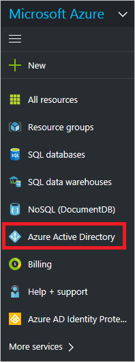

# Named networks in Azure Active Directory

> [!div class="op_single_selector"]
> * [Azure portal](active-directory-known-networks-azure-portal.md)
> * [Azure classic portal](active-directory-known-networks.md)
>
>

Azure Active Directory creates a record for each detected [risk event](active-directory-identity-protection-risk-events.md). With the risk event information available through the Azure Active Directory security reports, you can gain insights into the probability of compromised user accounts in your environment.   

It is possible that Azure Active Directory detects false positives of the *impossible travel to atypical locations* and the *sign ins from IP addresses with suspicious activity* [risk event types](active-directory-reporting-risk-events.md#risk-event-types) for IP addresses that are actually owned by your organization. 

This can, for example, happen when:

- A user in your Boston office has signed in remotely to your data center in San Francisco generates a *sign ins from multiple geographies* risk event

- A user of your organization tries to sign-on several times with an incorrect password generates a *sign ins from IP addresses with suspicious activity* risk event

To prevent these cases from generating misleading risk events, you should add named IP address ranges to the list of your organization's public IP address.    

### To add your organization’s public IP address ranges, perform the following steps:

1. Sign-on to the Azure management portal.

2. In the left pane, click **Active Directory**.

	

3. On the directory blade, in the **Manage** section, click **Named networks**.

	

4. Click **Add location**

	

5. On the **Add** blade, do:

	

    a. In the **Name** textbox, type a name.

    b. In the **IP range** textbox, type an IP range. The IP range needs to be in CIDR format. For bulk update, you can upload a CSV file with the IP ranges. An upload adds the IP ranges in the file to the list instead of overwriting the list.

    c. Click **Create**.

**Additional resources:**

* [View your access and usage reports](active-directory-view-access-usage-reports.md)
* [Sign ins from IP addresses with suspicious activity](active-directory-reporting-sign-ins-from-ip-addresses-with-suspicious-activity.md)
* [Sign ins from multiple geographies](active-directory-reporting-sign-ins-from-multiple-geographies.md)
