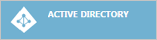
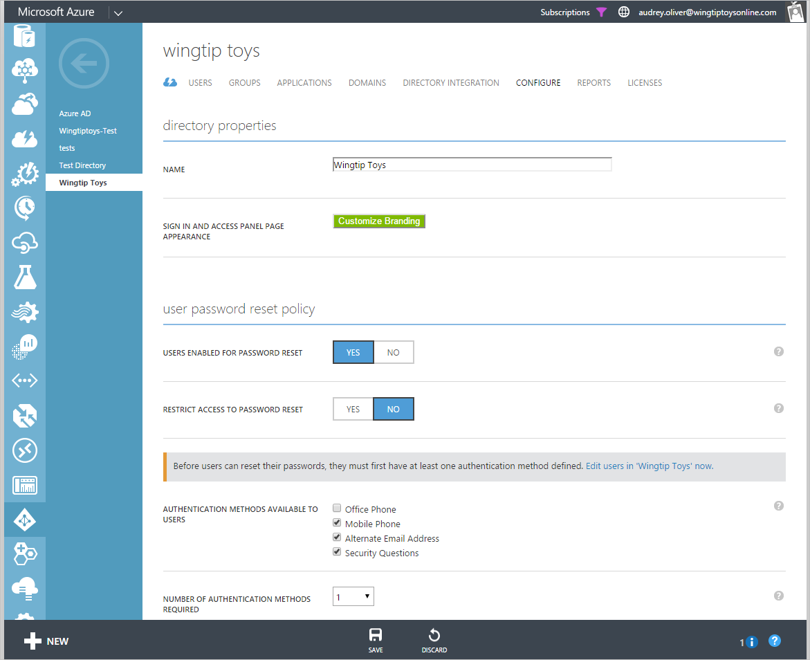
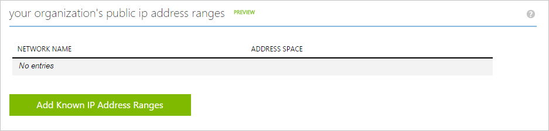
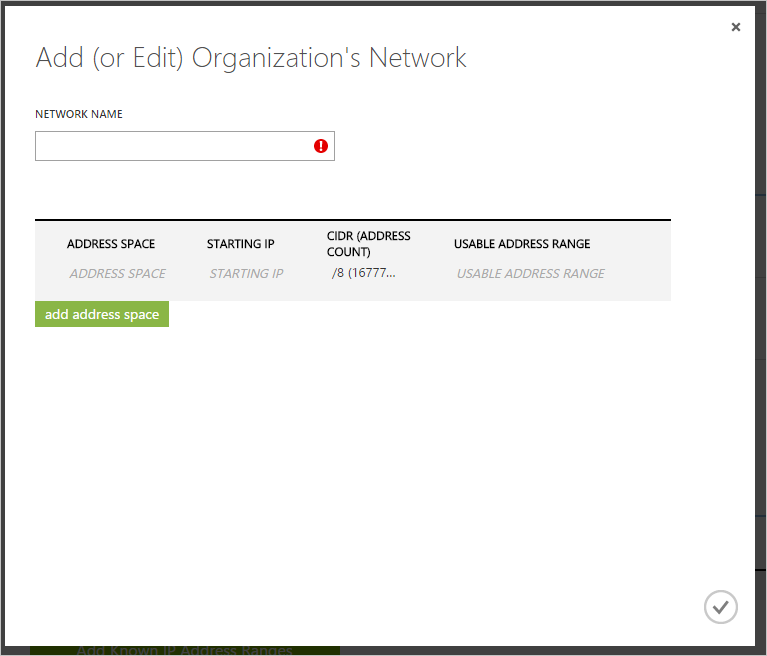

<properties 
	pageTitle="Known Networks | Microsoft Azure" 
	description="By configuring known networks, you can avoid having IP addresses that are owned by your organization included in the Sign ins from multiple geographies and Sign ins from IP addresses with suspicious activity reports." 
	services="active-directory" 
	documentationCenter="" 
	authors="markusvi" 
	manager="femila"  
	editor=""/>

<tags 
	ms.service="active-directory" 
	ms.workload="identity" 
	ms.tgt_pltfrm="na" 
	ms.devlang="na" 
	ms.topic="article" 
	ms.date="07/20/2016" 
	ms.author="markvi"/>

# Known Networks

You can use Azure Active Directory's access and usage reports to gain visibility into the integrity and security of your organization’s directory. With this information, a directory admin can better determine where possible security risks may lie so that they can adequately plan to mitigate those risks.

It is possible that the “*Sign ins from multiple geographies*” and “*Sign ins from IP addresses with suspicious activity*” reports incorrectly flag IP addresses that are actually owned by your organization. 

This can, for example, happen when: 

- A user in your Boston office has signed in remotely to your data center in San Francisco triggers the “Sign ins from multiple geographies” report 

- A user of your organization tries to sign-on several times with an incorrect password triggers the “Sign ins from IP addresses with suspicious activity” report 

To prevent these cases from generating misleading security reports, you should add known IP address ranges to the list of your organization's public IP address.    

###To add your organization’s public IP address ranges, perform the following steps: 

1.	Sign-on to the [Azure management portal](https://manage.windowsazure.com).

2.	In the left pane, click **Active Directory**.   

3.	In the **Directory** tab, select your directory.

4.	In the menu on the top, click **Configure**.   

5.	On the Configure tab, go to **your organizations public IP address ranges**   

6.	Click **Add Known IP Address Ranges**.

7.	Add your address ranges in the dialog box that appears, and then click the check button  when you are done.   

**Additional Resources**

* [View your access and usage reports](active-directory-view-access-usage-reports.md)
* [Sign ins from IP addresses with suspicious activity](active-directory-reporting-sign-ins-from-ip-addresses-with-suspicious-activity.md)
* [Sign ins from multiple geographies](active-directory-reporting-sign-ins-from-multiple-geographies.md)

