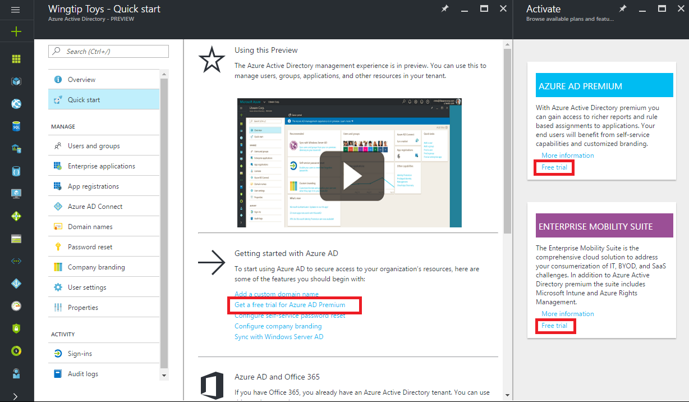
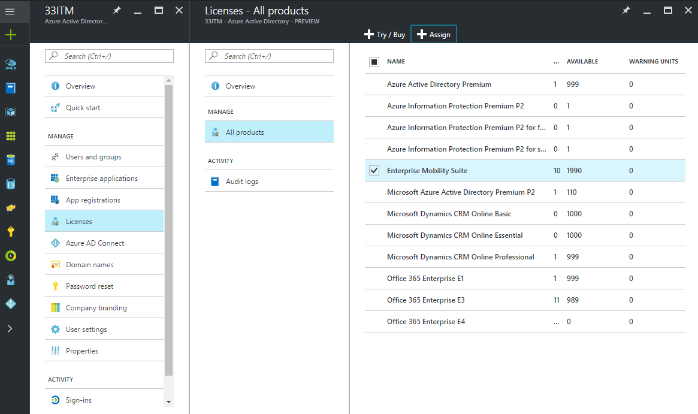
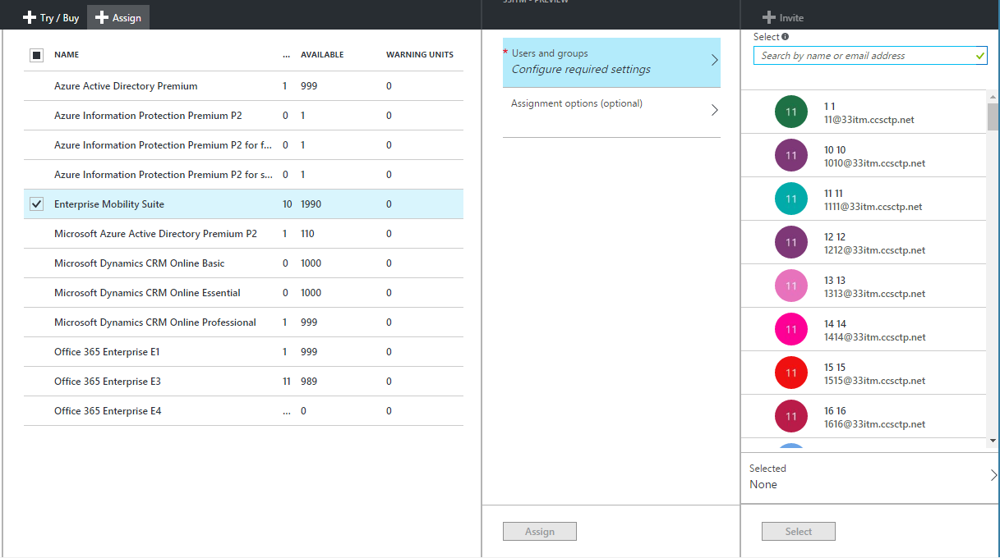
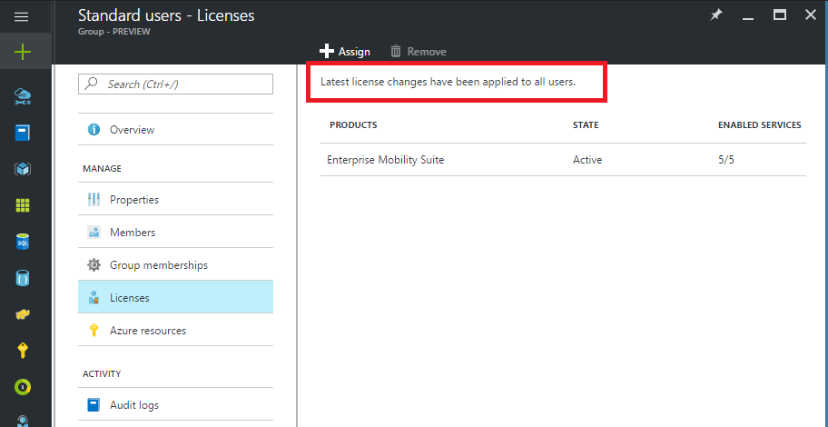
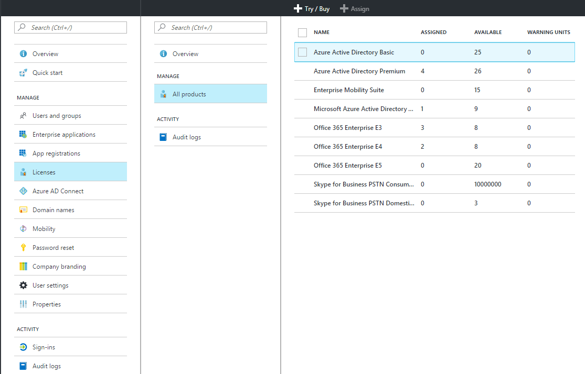
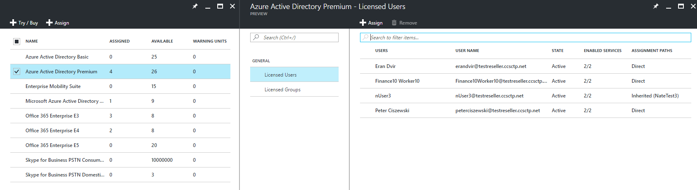
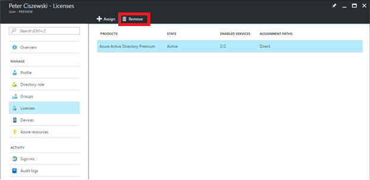
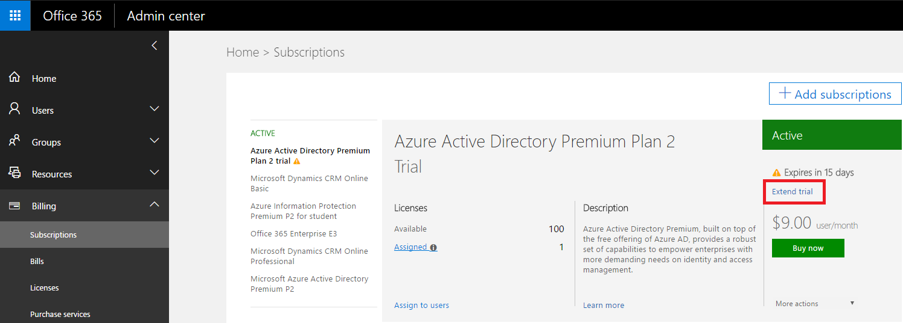

---

  title: Get started with licensing in Azure Active Directory | Microsoft Docs
  description: How Azure Active Directory licensing works, how to get started with best practices
  services: active-directory
  keywords: Azure AD licensing
  documentationcenter: ''
  author: curtand
  manager: femila
  editor: ''

  ms.assetid:
  ms.service: active-directory
  ms.devlang: na
  ms.topic: article
  ms.tgt_pltfrm: na
  ms.workload: identity
  ms.date: 06/29/2017
  ms.author: curtand
  ms.reviewer: piotrci

  ms.custom: H1Hack27Feb2017;it-pro

---

# License yourself and your users in Azure Active Directory

> [!div class="op_single_selector"]
> * [Azure portal instructions](active-directory-licensing-get-started-azure-portal.md)
> * [Get Azure classic portal info](active-directory-licensing-what-is.md)
>
>

Azure Active Directory (Azure AD) is an identity as a service (IDaaS) solution and platform from Microsoft. Azure AD is offered in different service editions:

* Azure Active Directory Free, which is available with any Microsoft service such as Office 365, Dynamics, Microsoft Intune, or Azure. Azure AD does not generate any consumption charges in this mode.

* Azure AD paid editions, such as:
  - Enterprise Mobility + Security 
  - Azure AD Premium (P1 and P2)
  - Azure AD Basic
  - Azure Multi-Factor Authentication

Like many of Microsoft online services, most Azure AD paid versions are delivered through per-user entitlements as they are in Office 365, Microsoft Intune, and Azure AD. In these cases, the service purchase is represented by one or more subscriptions, and each subscription includes a prepurchase number of licenses in your tenant. Per-user entitlements are achieved by:

* Assigning a license. 
* Creating a link between the user and the product.
* Enabling the service components for the user.
* Consuming one of the prepaid licenses.

[Try Azure AD Premium now.](https://portal.office.com/Signup/Signup.aspx?OfferId=01824d11-5ad8-447f-8523-666b0848b381&ali=1#0)

For a broad overview of Azure AD service capabilities, see [What is
Azure AD?](https://azure.microsoft.com/en-us/documentation/articles/active-directory-whatis/). For more information, see our [Service Level Agreements page](https://azure.microsoft.com/en-us/support/legal/sla/active-directory/v1_0/).

> [!NOTE]
> Azure pay-as-you-go subscriptions enable creation of Azure resources and then map them to your payment method. There are no license counts associated with the subscription. When you grant a user permission to operate on Azure resources mapped to the subscription, they are associated with the subscription and can manage subscription resources.

## How does Azure Active Directory licensing work?

License-based Azure AD services work by activating a subscription in your Azure AD directory/service tenant. After the subscription is active, the service capabilities can be managed by directory/service administrators and used by licensed users.

### Manage subscription information

When you purchase Enterprise Mobility + Security, Azure AD Premium, or Azure AD Basic, your tenant is updated with the subscription, including its validity period and prepaid licenses. Your subscription information, including the number of assigned or available licenses, is available through the Azure portal: Under **Azure Active Directory**, open the **Licenses** tile for the specific directory. The **Licenses** blade is also the best place to manage your license assignments.

Each subscription consists of one or more service plans, such as Azure AD, Multi-Factor Authentication, Intune, Exchange Online, or SharePoint Online.  Azure AD license management does *not* require service-plan-level management. Office 365 differs because it relies on this advanced configuration mode to manage access to included services. Azure AD relies on in-service configuration to enable features and manage individual permissions.

> [!IMPORTANT]
> Azure AD Premium, Azure AD Basic, and Enterprise Mobility + Security subscriptions are confined to their provisioned directory/tenant. Subscriptions cannot be split between directories or used to entitle users in other directories. Moving a subscription between directories is possible, but requires submitting a support ticket, or cancellation and repurchase for direct purchases.
>
> When Azure AD or Enterprise Mobility + Security is purchased through a Volume Licensing subscription, and when the agreement includes other Microsoft Online services (for example, Office 365), activation happens automatically. 

### Assign licenses

Although obtaining a subscription is all you need to configure paid capabilities, you must still distribute licenses for Azure AD paid features to users. Any user who should have access to or who is managed through an Azure AD paid feature must be assigned a license. License assignment is a mapping between a user and a purchased service, such as Azure AD Premium, Basic, or Enterprise Mobility + Security.

Managing which users in your directory should have a license can be accomplished by: 

* Assigning licenses to groups in the [Azure portal](https://docs.microsoft.com/en-us/azure/active-directory/active-directory-licensing-whatis-azure-portal).
* Assigning licenses directly to users by way of the portal, PowerShell, or APIs. 

When you're assigning licenses to a group, all group members are assigned a license. If users are added or removed from the group, the appropriate license is assigned or removed. Group assignment can utilize any group management available to you, and it is consistent with group-based assignment to applications.

You can use [group-based license assignment](https://docs.microsoft.com/en-us/azure/active-directory/active-directory-licensing-whatis-azure-portal) to set up rules such as the following:
* All users in your directory automatically get a license
* Everyone with the appropriate job title gets a license
* You can delegate the decision to other managers in the organization (by using [self-service groups](https://docs.microsoft.com/en-us/azure/active-directory/active-directory-accessmanagement-self-service-group-management))

For a detailed discussion of license assignment to groups, including advanced scenarios and Office 365 licensing scenarios, see [Assign licenses to users by group membership in Azure Active Directory](https://docs.microsoft.com/en-us/azure/active-directory/active-directory-licensing-group-assignment-azure-portal).

## Get started with Azure AD licensing

Getting started with Azure AD is easy. You can always create your directory as a part of signing up for a free Azure trial. Learn more about [signing up as an organization](https://azure.microsoft.com/en-us/documentation/articles/sign-up-organization/).

The following best practices can help ensure that your tenant is aligned with other Microsoft services you might be consuming and with your goals for the service:

- If you are already using any of the organizational services from Microsoft, you already have an Azure AD directory. It is useful to use the same directory for other services so that core identity management, including provisioning and hybrid single sign-on (SSO), can be used across the services. With single sign-on, your users benefit from the rich capabilities across the services. Thus, if you decide to buy an Azure AD paid service for your workforce, we recommend that you use the same directory again.

- We recommend that you use a new tenant in the Azure portal if you are planning to:
  - Use Azure AD for a different set of users (such as partners or customers).
  - Evaluate Azure AD services in isolation from your production service.
  - Set up a sandbox environment for your services.

  The new directory is created with your account as an external user with global administrator permissions. When you sign in to the Azure portal with this account, you can see this tenant and access all administration tasks.

> [!NOTE]
> Azure AD supports “guest users,” which are user accounts in an Azure AD tenant that were created through either a Microsoft account or an Azure AD identity from another tenant. The Office 365 administration portal does not currently support these users. Guest users with Microsoft accounts are not able to access the Office 365 administration portal at all, while guest users from other Azure AD tenants are ignored. In the latter case, only the user’s local account, in the Azure AD or Office 365 tenant where the user was originally created, is accessible.

### Select one or more license trials

You can activate an Azure AD Premium or Enterprise Mobility + Security trial subscription under **Azure Active Directory** &gt; **Quick start**.

Trial licenses are available on the **Licenses** blade.

### Assign licenses to users and groups

After the subscription is active, you should assign a license to yourself. Then refresh the browser to ensure that you are seeing all the features. The next step is to assign licenses to the users who need access to paid Azure AD features. As described in [Assign licenses](#assign-licenses), one easy way to assign licenses is to identify the group representing the desired audience and assign the license to it. In this way, users who are added or removed from the group over its lifecycle are assigned or removed from the license, respectively.

> [!NOTE]
> Some Microsoft services are not available in all locations. Before a license can be assigned to a user, the administrator must specify the **Usage location** property for the user. You can set this property under **User** &gt; **Profile** &gt; **Settings** in the Azure portal. When using group license assignment, any user whose usage location is not specified inherits the location of the directory.

To assign a license, under **Azure Active Directory** &gt; **Licenses** &gt; **All Products**, select one or more products, and then select **Assign** on the command bar.

You can use the **Users and groups** blade to choose multiple users or groups or to disable service plans in the product. Use the search box on top to search for user and group names.

When you're assigning a license to a group, it can take some time before all users inherit the license, depending on the number of users in the group. You can check the processing status on the **Group** blade, under the **Licenses** tile.

Assignment errors can occur during Azure AD license assignment but are relatively rare when managing Azure AD and Enterprise Mobility + Security products. Potential assignment errors are limited to:
- Assignment conflict: When a user was previously assigned a license that is incompatible with the current license. In this case, assigning the new license requires removing the current one.
- Exceeded available licenses: When the number of users in assigned groups exceeds the available licenses, a user's assignment status reflects a failure to assign due to missing licenses.

#### Azure AD B2B collaboration licensing

B2B collaboration allows you to invite guest users into your Azure AD tenant to provide access to Azure AD services and any Azure resources you make available.  

There is no charge for inviting B2B users and assigning them to an application in Azure AD. Up to 10 apps per guest user and 3 basic reports are also free for B2B collaboration users. If your guest user has any appropriate licenses assigned in the partner's Azure AD tenant, they'll be licensed in yours as well.

It's not required, but if you want to provide access to paid Azure AD features, those B2B guest users must be licensed with appropriate Azure AD licenses. An inviting tenant with an Azure AD paid license can assign B2B collaboration user rights to an additional five guest users invited to the tenant. For scenarios and information, see [B2B collaboration licensing guidance](active-directory-b2b-licensing.md).

### View assigned licenses

A summary view of assigned and available licenses is displayed under **Azure Active Directory** &gt; **Licenses** &gt; **All products**.

A detailed list of assigned users and groups is available when selecting a specific product. The **Licensed Users** list shows all users currently consuming a license and whether the license was assigned directly to the user or if it is inherited from a group.

Similarly, the **Licensed Groups** list shows all groups to which licenses have been assigned. Select a user or group to open the **Licenses** blade, which shows all licenses assigned to that object.

### Remove a license

To remove a license, go to the user or group, and open the **Licenses** tile. Select the license, and click **Remove**.

Licenses inherited by the user from a group cannot be removed directly. Instead, remove the user from the group from which they are inheriting the license.

### Extend trials

Trial extensions for customers are available as self-service sign-up through the Office 365 portal. A customer admin can go to the Office portal (access depends on permissions for the Office portal) and select the Azure AD Premium trial. Clicking the **Extend trial** link starts the extension process. A credit card is required, but it is not charged.

## Next steps

To learn more about advanced scenarios for license management through
groups, read the article [Assigning licenses to a group](active-directory-licensing-group-assignment-azure-portal.md).

Here's information about how to configure and use other Azure AD paid features:

* [Self-service password reset](active-directory-manage-passwords.md)
* [Self-service group management](active-directory-accessmanagement-self-service-group-management.md)
* [Azure AD Connect health](active-directory-aadconnect-health.md)
* [Azure Multi-Factor Authentication](../multi-factor-authentication/multi-factor-authentication.md)
* [Direct purchase of Azure AD Premium licenses](http://aka.ms/buyaadp)
