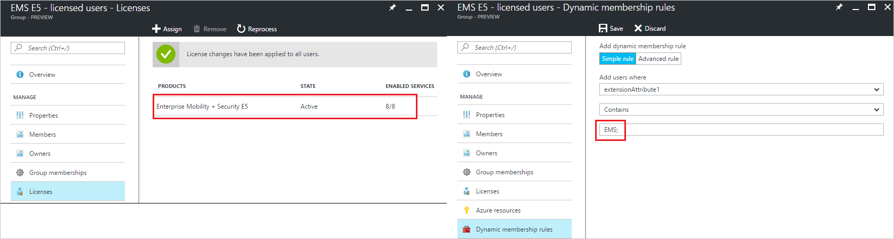
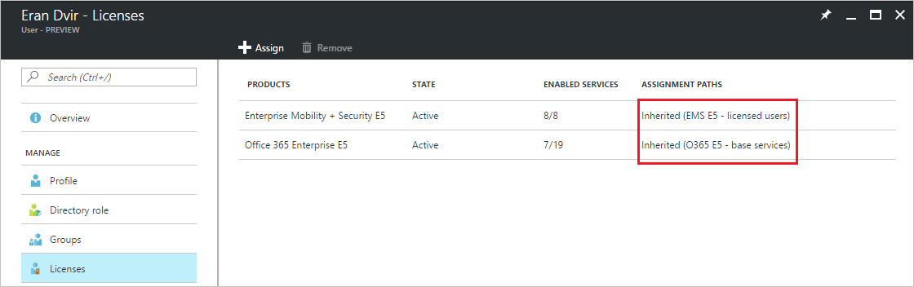
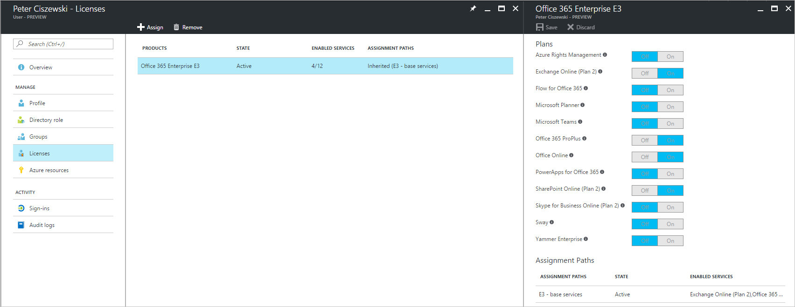
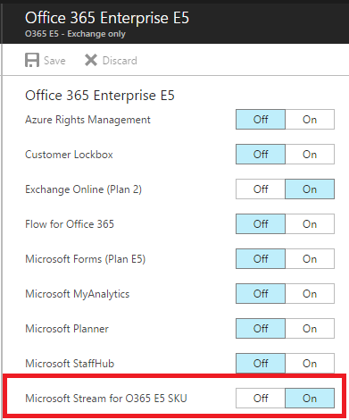
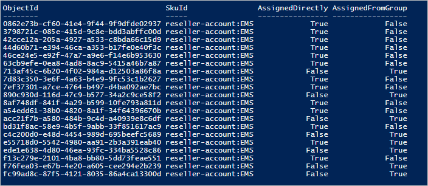

---

  title: Azure Active Directory group-based licensing additional scenarios | Microsoft Docs
  description: More scenarios for Azure Active Directory group-based licensing
  services: active-directory
  keywords: Azure AD licensing
  documentationcenter: ''
  author: curtand
  manager: femila
  editor: 'piotrci'

  ms.assetid:
  ms.service: active-directory
  ms.devlang: na
  ms.topic: article
  ms.tgt_pltfrm: na
  ms.workload: identity
  ms.date: 06/02/2017
  ms.author: curtand

  ms.custom: H1Hack27Feb2017

---

# Scenarios, limitations, and known issues using groups to manage licensing in Azure Active Directory

Use the following information and examples to gain a more advanced understanding of Azure Active Directory (Azure AD) group-based licensing.

## Usage location

Some Microsoft services are not available in all locations. Before a license can be assigned to a user, the administrator has to specify the **Usage location** property on the user. In [the Azure portal](https://portal.azure.com), you can specify in **User** &gt; **Profile** &gt; **Settings**.

For group license assignment, any users without a usage location specified will inherit the location of the directory. If you have users in multiple locations, make sure to reflect that correctly in your user objects before adding users to groups with licenses.

> [!NOTE]
> Group license assignment will never modify an existing usage location value on a user. We recommend that you always set usage location as part of your user creation flow in Azure AD (e.g. via AAD Connect configuration) - that will ensure the result of license assignment is always correct, and users do not receive services in locations that are not allowed.

## Use group-based licensing with dynamic groups

You can use group-based licensing with any security group, which means it can be combined with Azure AD dynamic groups. Dynamic groups run rules against user object attributes to automatically add and remove users from groups.

For example, you can create a dynamic group for some set of products you want to assign to users. Each group is populated by a rule adding users by their attributes, and each group is assigned the licenses that you want them to receive. You can assign the attribute on-premises and sync it with Azure AD, or you can manage the attribute directly in the cloud.

Licenses are assigned to the user shortly after they are added to the group. When the attribute is changed, the user leaves the groups and the licenses are removed.

### Example

Consider the example of an on-premises identity management solution that decides which users should have access to Microsoft web services. It uses **extensionAttribute1** to store a string value representing the licenses the user should have. Azure AD Connect syncs it with Azure AD.

Users might need one license but not another, or might need both. Here's an example, in which you are distributing Office 365 Enterprise E5 and Enterprise Mobility + Security (EMS) licenses to users in groups:

#### Office 365 Enterprise E5: base services


#### Enterprise Mobility + Security: licensed users



For this example, modify one user and set their extensionAttribute1 to the value of `EMS;E5_baseservices;` if you want the user to have both licenses. You can make this modification on-premises. After the change syncs with the cloud, the user is automatically added to both groups, and licenses are assigned.



### Modify a dynamic group membership rule

Use caution when modifying an existing group’s membership rule. When a rule is changed, all users are removed from the group. The rule is evaluated, and then users are added to the group based on the new conditions.

If the group has licenses assigned, all users have those licenses removed during the process. New licenses are applied only after the new rule is evaluated and users are added back. Users might experience loss of service, or in some cases, loss of data.

It's better not to change the membership rule on a group used for license assignment. Instead, create a group with a new membership rule and specify the same license settings as in the original group. Wait until all members are added and licenses are applied to all users. Only then should you delete the original group. This approach ensures a safe, staged transition to a new membership rule, without any loss of access or data for users.


## Multiple groups and multiple licenses

A user can be a member of multiple groups with licenses. Here are some things to consider:

- Multiple licenses for the same product can overlap, and they result in all enabled services being applied to the user. The following example shows two licensing groups: *E3 base services* contains the foundation services to deploy first, to all users. And *E3 extended services* contains additional services (Sway and Planner) to deploy only to some users. In this example, the user was added to both groups:

  

  As a result, the user has 7 of the 12 services in the product enabled, while using only one license for this product.

- Selecting the *E3* license shows more details, including information about which groups caused what services to be enabled for the user.

  

## Direct licenses coexist with group licenses

When a user inherits a license from a group, you can't directly remove or modify that license assignment in the user's properties. Changes must be made in the group and then propagated to all users.

It is possible, however, to assign the same product license directly to the user, in addition to the inherited license. You can enable additional services from the product just for one user, without affecting other users.

Directly assigned licenses can be removed, and don’t affect inherited licenses. Consider the user who inherits an Office 365 Enterprise E3 license from a group.

1. Initially, the user inherits the license only from the *E3 basic services* group, which enables four service plans, as shown:

  

2. You can select **Assign** to directly assign an E3 license to the user. In this case, you are going to disable all service plans except Yammer Enterprise:

  

3. As a result, the user still uses only one license of the E3 product. But the direct assignment enables the Yammer Enterprise service for that user only. You can see which services are enabled by the group membership versus the direct assignment:

  

4. When you use direct assignment, the following operations are allowed:

  - Yammer Enterprise can be turned off on the user object directly. The **On/Off** toggle in the illustration was enabled for this service, as opposed to the other service toggles. Because the service is enabled directly on the user, it can be modified.
  - Additional services can be enabled as well, as part of the directly assigned license.
  - The **Remove** button can be used to remove the direct license from the user. You can see that the user now only has the inherited group license and only the original services remain enabled:

    

## Managing new services added to products
When Microsoft adds a new service to a product, it will be enabled by default in all groups to which you have assigned the product license. Users in your tenant who are subscribed to notifications about product changes will receive emails ahead of time notifying them about the upcoming service additions.

As an administrator, you can review all groups affected by the change and take action, such as disabling the new service in each group. For example, if you created groups targeting only specific services for deployment, you can revisit those groups and make sure that any newly added services are disabled.

Here is an example of what this process may look like:

1. Originally, you assigned the *Office 365 Enterprise E5* product to several groups. One of those groups, called *O365 E5 - Exchange only* was designed to enable only the *Exchange Online (Plan 2)* service for its members.

2. You received a notification from Microsoft that the E5 product will be extended with a new service - *Microsoft Stream*. On the day the change became effective, you can do the following:

3. Go to the [**Azure Active Directory > Licenses > All products**](https://portal.azure.com/#blade/Microsoft_AAD_IAM/LicensesMenuBlade/Products) blade and select *Office 365 Enterprise E5*, then select **Licensed Groups** to view a list of all groups with that product.

4. Click on the group you want to review (in this case, *O365 E5 - Exchange only*). This will open the **Licenses** tab. Clicking on the E5 license will open a blade listing all enabled services.
> [!NOTE]
> The *Microsoft Stream* service has been automatically added and enabled in this group, in addition to the *Exchange Online* service:

  

5. If you want to disable the new service in this group, click the **On/Off** toggle next to the service and click the **Save** button to confirm the change. Azure AD will now process all users in the group to apply the change; any new users added to the group will not have the *Microsoft Stream* service enabled.

  > [!NOTE]
  > Users may still have the service enabled through some other license assignment (another group they are members of or a direct license assignment).

6. If needed, perform the same steps for other groups with this product assigned.

## Use PowerShell to see who has inherited and direct licenses
While group-based licensing is in public preview, PowerShell cannot be used to fully control group license assignments. However, you can use it to discover basic information about user state, and see whether licenses are inherited from a group or assigned directly. The following code example shows how an administrator can produce a basic report about license assignments.

1. Run the `connect-msolservice` cmdlet to authenticate and connect to your tenant.

2. `Get-MsolAccountSku` can be used to discover all provisioned product licenses in the tenant.

  

3. In this example, you want to find out which users have the Enterprise Mobility + Security license assigned directly, from a group, or both. You can use the following script:

  ```
  #Returns TRUE if the user has the license assigned directly
  function UserHasLicenseAssignedDirectly
  {
      Param([Microsoft.Online.Administration.User]$user, [string]$skuId)
      foreach($license in $user.Licenses)
      {
          #we look for the specific license SKU in all licenses assigned to the user
          if ($license.AccountSkuId -ieq $skuId)
          {
              #GroupsAssigningLicense contains a collection of IDs of objects assigning the license
              #This could be a group object or a user object (contrary to what the name suggests)
              #If the collection is empty, this means the license is assigned directly. This is the case for users who have never been licensed via groups in the past
              if ($license.GroupsAssigningLicense.Count -eq 0)
              {
                  return $true
              }
              \#If the collection contains the ID of the user object, this means the license is assigned directly
              #Note: the license may also be assigned through one or more groups in addition to being assigned directly
              foreach ($assignmentSource in $license.GroupsAssigningLicense)
              {
                  if ($assignmentSource -ieq $user.ObjectId)
                  {
                      return $true
                  }
              }
              return $false
          }
      }
      return $false
  }
  #Returns TRUE if the user is inheriting the license from a group
  function UserHasLicenseAssignedFromGroup
  {
    Param([Microsoft.Online.Administration.User]$user, [string]$skuId)
     foreach($license in $user.Licenses)
     {
        #we look for the specific license SKU in all licenses assigned to the user
        if ($license.AccountSkuId -ieq $skuId)
        {
          #GroupsAssigningLicense contains a collection of IDs of objects assigning the license
          #This could be a group object or a user object (contrary to what the name suggests)
            foreach ($assignmentSource in $license.GroupsAssigningLicense)
          {
                  #If the collection contains at least one ID not matching the user ID this means that the license is inherited from a group.
                  #Note: the license may also be assigned directly in addition to being inherited
                  if ($assignmentSource -ine $user.ObjectId)

            {
                      return $true
            }
          }
              return $false
        }
      }
      return $false
  }
  ```

4. The rest of the script gets all users, and runs these functions on each user. Then it formats the output into a table.

  ```
  #the license SKU we are interested in
  $skuId = "reseller-account:EMS"
  #find all users that have the SKU license assigned
  Get-MsolUser -All | where {$_.isLicensed -eq $true -and $_.Licenses.AccountSKUID -eq $skuId} | select `
      ObjectId, `
      @{Name="SkuId";Expression={$skuId}}, `
      @{Name="AssignedDirectly";Expression={(UserHasLicenseAssignedDirectly $_ $skuId)}}, `
      @{Name="AssignedFromGroup";Expression={(UserHasLicenseAssignedFromGroup $_ $skuId)}}
  ```

5. The output of the complete script is similar to this example:

  

## Limitations and known issues

If you use group-based licensing, it's a good idea to familiarize yourself with the following list of limitations and known issues.

- Group-based licensing currently does not support groups that contain other groups (nested groups). If you apply a license to a nested group, only the immediate first-level user members of the group have the licenses applied.

- The feature can only be used with security groups. Office groups are currently not supported and you will not be able to use them in the license assignment process.

- The [Office 365 admin portal](https://portal.office.com ) does not currently support group-based licensing. If a user inherits a license from a group, this license appears in the Office admin portal as a regular user license. If you try to modify that license or try to remove the license, the portal returns an error message. Inherited group licenses cannot be modified directly on a user.

- When a user is removed from a group and loses the license, the service plans from that license (for example, SharePoint Online) are set to a **Suspended** state. The service plans are not set to a final, disabled state. This precaution can avoid accidental removal of user data, if an admin makes a mistake in group membership management.

- When licenses are assigned or modified for a large group (for example, 100,000 users), it could impact performance. Specifically, the volume of changes generated by Azure AD automation might negatively impact the performance of your directory synchronization between Azure AD and on-premises systems.

- License management automation does not automatically react to all types of changes in the environment. For example, you might have run out of licenses, causing some users to be in an error state. To free up the available seat count, you can remove some directly assigned licenses from other users. However, the system does not automatically react to this change and fix users in that error state.

  As a workaround to these types of limitations, you can go to the **Group** blade in Azure AD, and click **Reprocess**. This command processes all users in that group and resolves the error states, if possible.

## Next steps

To learn more about other scenarios for license management through group-based licensing, see:

* [What is group-based licensing in Azure Active Directory?](active-directory-licensing-whatis-azure-portal.md)
* [Assigning licenses to a group in Azure Active Directory](active-directory-licensing-group-assignment-azure-portal.md)
* [Identifying and resolving license problems for a group in Azure Active Directory](active-directory-licensing-group-problem-resolution-azure-portal.md)
* [How to migrate individual licensed users to group-based licensing in Azure Active Directory](active-directory-licensing-group-migration-azure-portal.md)
