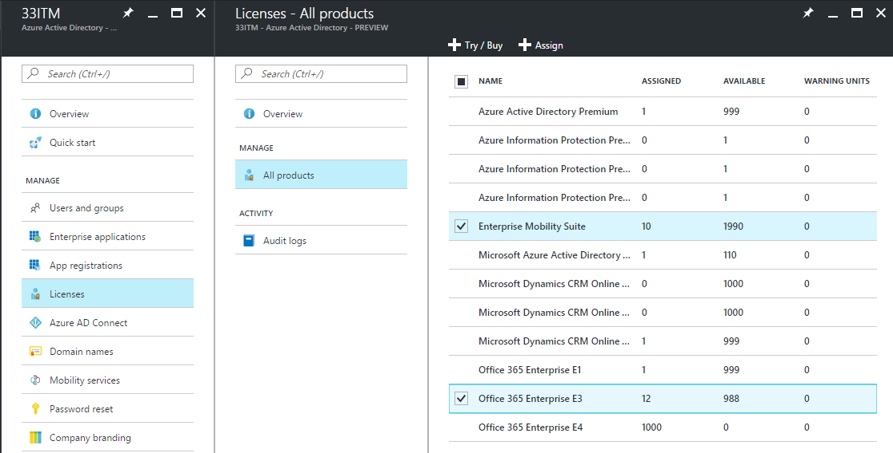
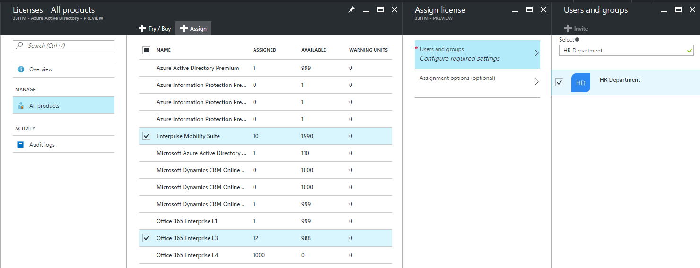
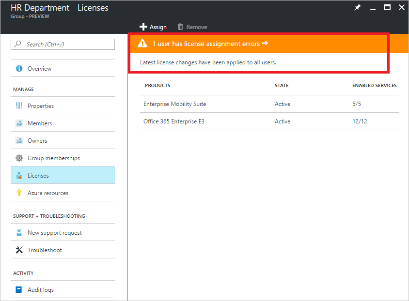
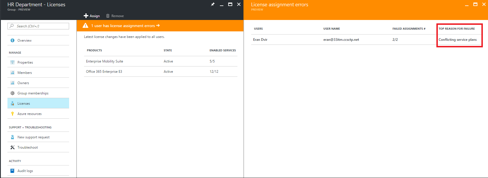
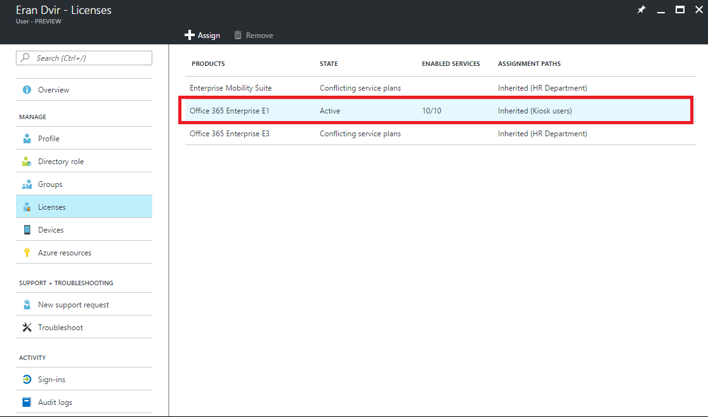

---

  title: Assign licenses to a group in Azure Active Directory | Microsoft Docs
  description: How to assign licenses to users by means of Azure Active Directory group licensing
  services: active-directory
  keywords: Azure AD licensing
  documentationcenter: ''
  author: curtand
  manager: femila
  editor: ''

  ms.assetid:
  ms.service: active-directory
  ms.devlang: na
  ms.topic: article
  ms.tgt_pltfrm: na
  ms.workload: identity
  ms.date: 06/05/2017
  ms.author: curtand

  ms.custom: H1Hack27Feb2017

---

# Assign licenses to users by group membership in Azure Active Directory

This article walks you through assigning product licenses to a group of users in Azure Active Directory (Azure AD) and then verifying that they're licensed correctly.

In this example, the tenant contains a security group called **HR Department**. This group includes all members of the human resources department (around 1,000 users). You want to assign Office 365 Enterprise E3 licenses to the entire department. The Yammer Enterprise service that's included in the product must be temporarily disabled until the department is ready to start using it. You also want to deploy Enterprise Mobility + Security licenses to the same group of users.

> [!NOTE]
> Some Microsoft services are not available in all locations. Before a license can be assigned to a user, the administrator has to specify the Usage location property on the user.

> For group license assignment, any users without a usage location specified will inherit the location of the directory. If you have users in multiple locations, we recommend that you always set usage location as part of your user creation flow in Azure AD (e.g. via AAD Connect configuration) - that will ensure the result of license assignment is always correct and users do not receive services in locations that are not allowed.

## Step 1: Assign the required licenses

1. Sign in to the [**Azure portal**](https://portal.azure.com) with an Administrator account. To manage licenses, the account must be a global administrator role or user account administrator.

2. Select **More services** in the left navigation pane, and then select **Azure Active Directory**. You can add this blade to Favorites or pin it to the portal dashboard.

3. On the **Azure Active Directory** blade, select **Licenses**. This opens a blade where you can see and manage all licensable products in the tenant.

4. Under **All products**, select both Office 365 Enterprise E3 and Enterprise Mobility + Security by selecting the product names. To start the assignment, select **Assign** at the top of the blade.

   

5. On the **Assign license** blade, click **Users and groups** to open the **Users and groups** blade. Search for the group name *HR Department*, select the group, and then be sure to confirm by clicking **Select** at the bottom of the blade.

   

6. On the **Assign license** blade, click **Assignment options (optional)**, which displays all service plans included in the two products that we selected previously. Find **Yammer Enterprise** and turn it **Off** to disable that service from the product license. Confirm by clicking **OK** at the bottom of **Assignment options**.

   

7. To complete the assignment, on the **Assign license** blade, click **Assign** at the bottom of the blade.

8. A notification is displayed in the upper-right corner that shows the status and outcome of the process. If the assignment to the group couldn't be completed (for example, because of pre-existing licenses in the group), click the notification to view details of the failure.

We've now specified a license template for the HR Department group. A background process in Azure AD has been started to process all existing members of that group. This initial operation might take some time, depending on the current size of the group. In the next step, we'll describe how to verify that the process has finished and determine if further attention is required to resolve problems.

> [!NOTE]
> You can start the same assignment from an alternative location: **Users and groups** in Azure AD. Go to **Azure Active Directory** > **Users and groups** > **All groups**. Then find the group, select it, and go to the **Licenses** tab. The **Assign** button on top of the blade opens the license assignment blade.

## Step 2: Verify that the initial assignment has finished

1. Go to **Azure Active Directory** > **Users and groups** > **All groups**. Then find the **HR Department** group that licenses were assigned to.

2. On the **HR Department** group blade, select **Licenses**. This lets you quickly confirm if licenses have been fully assigned to users and if there are any errors that you need to look into. The following information is available:

   - List of product licenses that are currently assigned to the group. Select an entry to show the specific services that have been enabled and to make changes.

   - Status of the latest license changes that were made to the group (if the changes are being processed or if processing has finished for all user members).

   - Information about users who are in an error state because licenses couldn't be assigned to them.

   

3. See more detailed information about license processing under **Azure Active Directory** > **Users and groups** > *group name* > **Audit logs**. Note the following activities:

   - Activity: **Start applying group based license to users**. This is logged when the system picks up the license-assignment change on the group and starts applying it to all user members. It contains information about the change that was made.

   - Activity: **Finish applying group based license to users**. This is logged when the system finishes processing all users in the group. It contains a summary of how many users were successfully processed and how many users couldn't be assigned group licenses.

## Step 3: Check for license problems and resolve them

1. Go to **Azure Active Directory** > **Users and groups** > **All groups**, and find the **HR Department** group that licenses were assigned to.
2. On the **HR Department** group blade, select **Licenses**. The notification on top of the blade shows that there are 10 users that licenses couldn't be assigned to. Clicking it opens a list of all users in a licensing-error state for this group.
3. The **Failed assignments** column tells us that both product licenses couldn't be assigned to the users. The **Top reason for failure** column contains the cause of the failure. In this case, it's **Conflicting service plans**.

   

4. Select a user to open the **Licenses** blade. This blade shows all licenses that are currently assigned to the user. In this example, the user has the Office 365 Enterprise E1 license that was inherited from the **Kiosk users** group. This conflicts with the E3 license that the system tried to apply from the **HR Department** group. As a result, none of the licenses from that group has been assigned to the user.

   

5. To solve this conflict, remove the user from the **Kiosk users** group. After Azure AD processes the change, the **HR Department** licenses are correctly assigned.

   

## Next steps

To learn more about the feature set for license management through groups, see the following articles:

* [What is group-based licensing in Azure Active Directory?](active-directory-licensing-whatis-azure-portal.md)
* [Identifying and resolving license problems for a group in Azure Active Directory](active-directory-licensing-group-problem-resolution-azure-portal.md)
* [How to migrate individual licensed users to group-based licensing in Azure Active Directory](active-directory-licensing-group-migration-azure-portal.md)
* [Azure Active Directory group-based licensing additional scenarios](active-directory-licensing-group-advanced.md)
