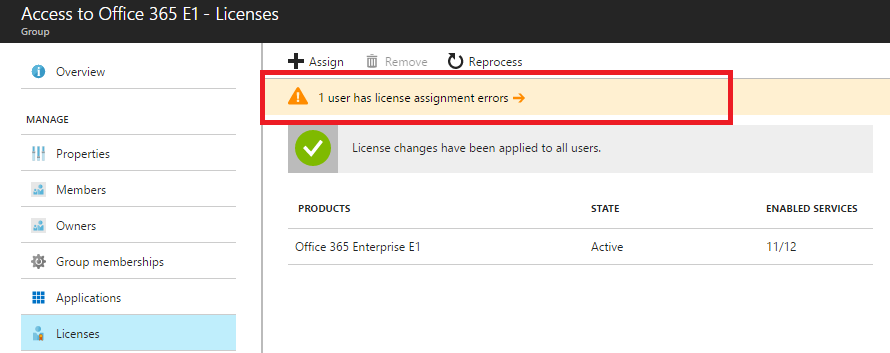
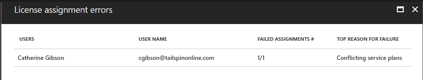
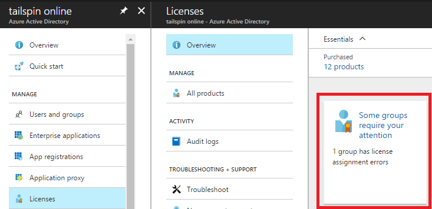
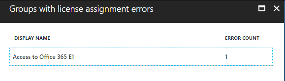

---

  title: Resolve license problems for a group in Azure Active Directory | Microsoft Docs
  description: How to identify and resolve license assignment problems when you're using Azure Active Directory group-based licensing
  services: active-directory
  keywords: Azure AD licensing
  documentationcenter: ''
  author: curtand
  manager: femila
  editor: ''

  ms.assetid:
  ms.service: active-directory
  ms.devlang: na
  ms.topic: article
  ms.tgt_pltfrm: na
  ms.workload: identity
  ms.date: 06/05/2017
  ms.author: curtand

  ms.custom: H1Hack27Feb2017

---

# Identify and resolve license assignment problems for a group in Azure Active Directory

Group-based licensing in Azure Active Directory (Azure AD) introduces the concept of users in a licensing error state. In this article, we explain the reasons why users might end up in this state.

When you assign licenses directly to individual users, without using group-based licensing, the assignment operation might fail. For example, when you execute the PowerShell cmdlet `Set-MsolUserLicense` on a user, the cmdlet can fail for a number of reasons that are related to business logic. For example, there might be an insufficient number of licenses or a conflict between two service plans that can't be assigned at the same time. The problem is immediately reported back to you.

When you're using group-based licensing, the same errors can occur, but they happen in the background when the Azure AD service is assigning licenses. For this reason, the errors can't be communicated to you immediately. Instead, they're recorded on the user object and then reported via the administrative portal. Note that the original intent to license the user is never lost, but it's recorded in an error state for future investigation and resolution.

## How to find license assignment errors

1. To find users in an error state in a specific group, open the blade for the group. Under **Licenses**, there will be a notification displayed if there are any users in an error state.

2. Click the notification to open a list of all affected users. You can click on each user individually to see more details.

3. To find all groups that contain at least one error, on the **Azure Active Directory** blade select **Licenses** and then **Overview**. An info box is displayed when some groups require your attention.

4. Click on the box to see a list of all groups with errors. You can click each group for more details.

Below is a description of each potential problem and the way to resolve it.

## Not enough licenses

**Problem:** There aren't enough available licenses for one of the products that's specified in the group. You need to either purchase more licenses for the product, or free up unused licenses from other users or groups.

To see how many licenses are available, go to **Azure Active Directory** > **Licenses** > **All products**.

To see which users and groups are consuming licenses, click a product. Under **Licensed users**, you'll see all users who've had licenses assigned directly or via one or more groups. Under **Licensed groups**, you'll see all groups that have that product assigned.

**PowerShell:** PowerShell cmdlets report this error as _CountViolation_.

## Conflicting service plans

**Problem:** One of the products that's specified in the group contains a service plan that conflicts with another service plan that's already assigned to the user via a different product. Some service plans are configured in a way that they can't be assigned to the same user as another related service plan.

Consider the following example. A user has a license for Office 365 Enterprise **E1** assigned directly, with all the plans enabled. The user has been added to a group that has the Office 365 Enterprise **E3** product assigned to it. This product contains service plans that can't overlap with the plans included in E1, so the group license assignment will fail with the “Conflicting service plans” error. In this example, the conflicting service plans are:

-   SharePoint Online (Plan 2) conflicts with SharePoint Online (Plan 1).
-   Exchange Online (Plan 2) conflicts with Exchange Online (Plan 1).

To solve this conflict, you need to disable those two plans either on the E1 license that's directly assigned to the user. Or, you need to modify the entire group license assignment and disable the plans in the E3 license. Alternatively, you might decide to remove the E1 license from the user if it's redundant in the context of the E3 license.

The decision about how to resolve conflicting product licenses always belongs to the administrator. Azure AD doesn't automatically resolve license conflicts.

**PowerShell:** PowerShell cmdlets report this error as _MutuallyExclusiveViolation_.

## Other products depend on this license

**Problem:** One of the products that's specified in the group contains a service plan that must be enabled for another service plan, in another product, to
function. This error occurs when Azure AD attempts to remove the underlying service plan. For example, this can happen as a result of the user being removed from the group.

To solve this problem, you'll need to make sure that the required plan is still assigned to users through some other method, or that the dependent services are disabled for those users. After doing that, you can properly remove the group license from those users.

**PowerShell:** PowerShell cmdlets report this error as _DependencyViolation_.

## Usage location isn't allowed

**Problem:** Some Microsoft services aren't available in all locations because of local laws and regulations. Before you can assign a license to a user, you have to specify the “Usage location” property for the user. You can do this under the **User** > **Profile** > **Settings** section in the Azure portal.

When Azure AD attempts to assign a group license to a user whose usage location isn't supported, it will fail and record this error on the user.

To solve this problem, remove users from nonsupported locations from the licensed group. Alternatively, if the current usage location values don't represent the actual user location, you can modify them so that the licenses are correctly assigned next time (if the new location is supported).

**PowerShell:** PowerShell cmdlets report this error as _ProhibitedInUsageLocationViolation_.

> [!NOTE]
> When Azure AD assigns group licenses, any users without a usage location specified inherit the location of the directory. We recommend that administrators set the correct usage location values on users before using group-based licensing to comply with local laws and regulations.

## What happens when there's more than one product license on a group?

You can assign more than one product license to a group. For example, you can assign Office 365 Enterprise E3 and Enterprise Mobility + Security to a group to easily enable all included services for users.

Azure AD attempts to assign all licenses that are specified in the group to each user. If Azure AD can't assign one of the products because of business logic problems (for example, if there aren't enough licenses for all, or if there are conflicts with other services that are enabled on the user), it won't assign the other licenses in the group either.

You'll be able to see the users who failed to get assigned failed and check which products have been affected by this.

## How do you force license processing in a group to resolve errors?

Depending on what steps you've taken to resolve errors, it might be necessary to manually trigger processing of a group to update the user state.

For example, if you freed up some licenses by removing direct license assignments from users, you'll need to trigger processing of groups that previously failed to fully license all user members. To do that, find the group blade, open **Licenses**, and select the **Reprocess** button in the toolbar.

## Next steps

To learn more about other scenarios for license management through groups, see the following:

* [Assigning licenses to a group in Azure Active Directory](active-directory-licensing-group-assignment-azure-portal.md)
* [What is group-based licensing in Azure Active Directory?](active-directory-licensing-whatis-azure-portal.md)
* [How to migrate individual licensed users to group-based licensing in Azure Active Directory](active-directory-licensing-group-migration-azure-portal.md)
* [Azure Active Directory group-based licensing additional scenarios](active-directory-licensing-group-advanced.md)
