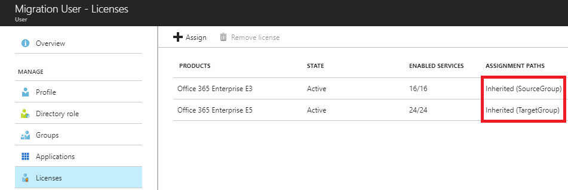

---

  title: How to safely migrate users between product licenses using group-based licensing in Azure Active Directory | Microsoft Docs
  description: Describes the recommended process for migrating users between different product licenses (e.g. Office 365 E1 and E3) using group-based licensing
  services: active-directory
  keywords: Azure AD licensing
  documentationcenter: ''
  author: piotrci
  manager: mtillman
  editor: ''

  ms.assetid:
  ms.service: active-directory
  ms.devlang: na
  ms.topic: article
  ms.tgt_pltfrm: na
  ms.workload: identity
  ms.date: 02/07/2018
  ms.author: piotrci

---

# How to safely migrate users between product licenses using group-based licensing

This article describes the recommended method for moving users between product licenses when using group-based licensing. The goal of this approach is to ensure that there is no loss of service or data during migration: users should switch between products seamlessly. Two variants of the migration process are covered:

-	Simple: between product licenses that do not contain conflicting service plans, for example: *Office 365 Enterprise E3* and *Office 365 Enterprise E5*

-	More complex: between products that contain some conflicting service plans, for example: *Office 365 Enterprise E1* and *Office 365 Enterprise E3*. More information regarding conflicts is available [here](https://docs.microsoft.com/en-us/azure/active-directory/active-directory-licensing-group-problem-resolution-azure-portal#conflicting-service-plans) and [here](https://docs.microsoft.com/en-us/azure/active-directory/active-directory-licensing-product-and-service-plan-reference#service-plans-that-cannot-be-assigned-at-the-same-time).

This article includes sample PowerShell code that can be used to perform the migration and verification steps. It is especially useful for large-scale operations where it is not feasible to perform the steps manually.

## Before you begin
Before executing the migration process, it is important to verify the following assumptions are true for all users being migrated. If not, the migration may fail for some of the users and, as a result, they could lose access to services or data:

-	Users have the *source license* assigned using group based-licensing. Licenses for the product to move away from are inherited from a single source group and are not assigned directly. Note: if licenses are also assigned directly, they may prevent the application of the *target license*. Learn more about direct and group license assignment [here](https://docs.microsoft.com/en-us/azure/active-directory/active-directory-licensing-group-advanced#direct-licenses-coexist-with-group-licenses). You may want to use a PowerShell script like [this one](https://docs.microsoft.com/en-us/azure/active-directory/active-directory-licensing-ps-examples#check-if-user-license-is-assigned-directly-or-inherited-from-a-group) to check if users have direct licenses.

-	You have enough available licenses for the target product. If not, some users may fail to get the *target license*. You can check the number of available licenses [here](https://portal.azure.com/#blade/Microsoft_AAD_IAM/LicensesMenuBlade/Products).

-	Users do not have other product licenses assigned that could conflict with the *target license* or could prevent the *source license* from being removed (for example, add-on products like Workplace Analytics or Project Online that have a dependency on other products).

-	Understand how groups are managed in your environment. For example, if you manage groups on-premises and sync them into Azure AD using AAD Connect, you need to add/remove users using your on-premises system and it will take some time for the changes to sync into AAD and get picked up by group-based licensing. If you are using Azure AD dynamic group memberships, you will add/remove users by modifying their attributes instead. However, the overall migration process remains the same, the only difference being how users are added/removed from groups.

## Migrating users between products without conflicting service plans
The goal is to use group-based licensing to change user licenses from *source license* (in this example: *Office 365 Enterprise E3*) to *target license* (in this example: *Office 365 Enterprise E5*). The two products do not contain conflicting service plans, so they can be fully assigned at the same time, without a conflict. At no point during migration should users lose access to services or data. Furthermore, the migration is performed in small “batches”, so there is a chance to validate the outcome for each batch and minimize the scope of any problems that may occur during the process. Overall, the process is as follows:
1.	Users are members of source group and inherit the *source license* from that group.
2.	Create a target group with the *target license* but without any members.
3.	Add a batch of users to target group. This will cause group-based licensing (GBL) to pick up the change and assign the *target license*. Note that this may take some time depending on the size of the batch and other activities in the tenant.
4.	Verify that the batch of users has been fully processed by GBL and each user actually has the *target license* assigned. Check that users did not end up in an error state, such as conflicts with other products or lack of sufficient licenses. More information on errors is available [here](https://docs.microsoft.com/en-us/azure/active-directory/active-directory-licensing-group-problem-resolution-azure-portal).
5.	At this point, users have both the source and *target licenses* assigned.
6.	Remove the same user batch from the source group. GBL will respond to the change and the *source licenses* will be removed from users.
7.	Repeat the process for subsequent batches of users.

### Migrating a single user using Azure portal
This is a simple walkthrough for a single user being migrated.

- **Step 1:** User has the *source license* inherited from a group and no direct assignments for the license.


- **Step 2:** User has been added to the target group and GBL has processed the change; user now has both the *source* and *target* licenses inherited from both groups.


- **Step 3:** User has been removed from the source group and GBL has processed the change; user now only has the *target license*


### Automating migration using PowerShell
> [!NOTE]
> This sample code uses PowerShell functions included in [the last section](#powershell-automation-of-migration-and-verification-steps) of this document.

This snippet shows how the migration process can be automated at larger scale.
```
#A batch of users that we want to migrate in this iteration. This can be an array of User Principal Names (string) or ObjectIds (Guid)
#Note: this could be loaded from a text file that represents a larger batch of users we want to migrate
[string[]]$usersToMigrate = 'MigrationUser@tailspinonline.com','MigrationUser2@tailspinonline.com'

###############NON-CONFLICTING LICENSES SCENARIO################
#The group and license that we are moving from
$sourceGroupId = [Guid]'b82c04f0-ce30-4ff1-bac7-735d92d83036'
$sourceSkuId = 'TailspinOnline:ENTERPRISEPACK'      #<- this is the O365 E3 product
#The group and license that we are moving to
$targetGroupId = [Guid]'bcf279d1-5ad5-46a5-b469-4b8a552aa2fe'
$targetSkuId = 'TailspinOnline:ENTERPRISEPREMIUM'   #<- this is the O365 E5 product

if(-Not (VerifyAssumptions $usersToMigrate $sourceGroupId $sourceSkuId $targetGroupId $targetSkuId))
{
    throw "Some users did not pass validation checks. See the output for details. Aborting migration process."
}

Write-Host "STEP 1: Adding users to the target group $targetGroupId. This will assign the target license $targetSkuId to all users"
AddUsersToGroup $usersToMigrate $targetGroupId

#Verify that the target license shows up in conflict state for each user on the list. This step will run in a loop, forever, until all users are in the expected state.
#Since GBL may take some time to reflect the changes on users, this loop should terminate after some time dependent on the size of the user collection.
#Note: If the loop has not terminated for a long time, stop the script and inspect the users reported as not yet in the expected state and verify that they are not blocked for some other reason.
ExecuteVerificationLoop ${function:VerifySourceandTargetLicensePresent} 'STEP 2: Checking if all users still have the source license and now also have the target license from target group' $usersToMigrate $sourceGroupId $sourceSkuId $targetGroupId $targetSkuId

#Now it is safe to remove the users from the source group
Write-Host "STEP 3: Removing users from the source group $sourceGroupId. This will remove the source license $sourceSkuId."
RemoveUsersFromGroup $usersToMigrate $sourceGroupId

#Verify that target license is now active on each user and the source license has been removed.
ExecuteVerificationLoop ${function:VerifySourceLicenseRemovedAndTargetLicenseAssignedFromGroup} 'STEP 4: Checking if all users have source license removed and target license assigned from target group' $usersToMigrate $sourceGroupId $sourceSkuId $targetGroupId $targetSkuId
```

Sample output (migrating 2 users):
```
Verifying initial assumptions:
Enough TailspinOnline:ENTERPRISEPREMIUM licenses available (13) for users: 2.
migrationuser@tailspinonline.com                OK
migrationuser2@tailspinonline.com               OK
Checks passed for all 2 users.

STEP 1: Adding users to the target group bcf279d1-5ad5-46a5-b469-4b8a552aa2fe. This will assign the target license TailspinOnline:ENTERPRISEPREMIUM to all users
Adding user MigrationUser@tailspinonline.com to group bcf279d1-5ad5-46a5-b469-4b8a552aa2fe
Adding user MigrationUser2@tailspinonline.com to group bcf279d1-5ad5-46a5-b469-4b8a552aa2fe

STEP 2: Checking if all users still have the source license and now also have the target license from target group. Check iteration: 1

MigrationUser@tailspinonline.com                Expected state: NO
MigrationUser2@tailspinonline.com               Expected state: NO

Total users checked: 2. In expected state: 0. Not yet: 2
Not all users are in expected state. Waiting 60 seconds to try again.

STEP 2: Checking if all users still have the source license and now also have the target license from target group. Check iteration: 2

MigrationUser@tailspinonline.com                Expected state: YES
MigrationUser2@tailspinonline.com               Expected state: YES

Total users checked: 2. In expected state: 2. Not yet: 0
Check passed for all users. Exiting check loop.

STEP 3: Removing users from the source group b82c04f0-ce30-4ff1-bac7-735d92d83036. This will remove the source license TailspinOnline:ENTERPRISEPACK.
Removing user MigrationUser@tailspinonline.com from group b82c04f0-ce30-4ff1-bac7-735d92d83036
Removing user MigrationUser2@tailspinonline.com from group b82c04f0-ce30-4ff1-bac7-735d92d83036

STEP 4: Checking if all users have source license removed and target license assigned from target group. Check iteration: 1

MigrationUser@tailspinonline.com                Expected state: NO
MigrationUser2@tailspinonline.com               Expected state: NO

Total users checked: 2. In expected state: 0. Not yet: 2
Not all users are in expected state. Waiting 60 seconds to try again.

STEP 4: Checking if all users have source license removed and target license assigned from target group. Check iteration: 2

MigrationUser@tailspinonline.com                Expected state: YES
MigrationUser2@tailspinonline.com               Expected state: YES

Total users checked: 2. In expected state: 2. Not yet: 0
Check passed for all users. Exiting check loop.
```

## Migrating users between products with conflicting service plans
The goal is to use group-based licensing to change user licenses from *source license* (in this example: *Office 365 Enterprise E1*) to *target license* (in this example: *Office 365 Enterprise E3*). The two products do contain conflicting service plans (read more about conflicts [here](https://docs.microsoft.com/en-us/azure/active-directory/active-directory-licensing-group-problem-resolution-azure-portal#conflicting-service-plans)), so we will have to work around that to seamlessly migrate users. At no point during migration should users lose access to services or data. Furthermore, the migration is performed in small “batches”, so there is a chance to validate the outcome for each batch and minimize the scope of any problems that may occur during the process. Overall, the process is as follows:
1.	Users are members of source group and inherit the *source license* from that group.
2.	Create a target group with the *target license* but without any members.
3.	Add a batch of users to target group. This will cause group-based licensing (GBL) to pick up the change and try to assign the *target license*. The assignment will fail due to conflicts between services in the two products, and instead GBL will record an error on each user.
Note that this may take some time depending on the size of the batch and other activities in the tenant.
4.	Verify that the batch of users has been fully processed by GBL and each user has the conflict error recorded. Check that some users did not end up in an unexpected error state. More information on errors is available [here](https://docs.microsoft.com/en-us/azure/active-directory/active-directory-licensing-group-problem-resolution-azure-portal).
5.	At this point, users still have the *source license* and a conflict error for the *target license* – they do not have the *target license* actually assigned, yet.
6.	Remove the same user batch from the source group. GBL will respond to the change and the *source license* will be removed from each user and, at the same time, the conflict error will also be removed (assuming that no other product license is contributing to the error) and the *target licenses* will be assigned. This ensures no loss of services or data during the transition.
7.	Repeat the process for subsequent batches of users.

### Migrating a single user using Azure portal
This is a simple walkthrough for a single user being migrated.

- **Step 1:** User has the *source license* inherited from a group and no direct assignments for the license.


- **Step 2:** User has been added to the target group and GBL has processed the change; user still has the *source license* and now they have the *target license* in error state due to the conflict.


- **Step 3:** User has been removed from the source group and GBL has processed the change; the *target license* has now been applied to the user


### Automating migration using PowerShell
> [!NOTE]
> This sample code uses PowerShell functions included in [the last section](#powershell-automation-of-migration-and-verification-steps) of this document.

This snippet shows how the migration process can be automated at larger scale.
```
#A batch of users that we want to migrate in this iteration. This can be an array of User Principal Names (string) or ObjectIds (Guid)
#Note: this could be loaded from a text file that represents a larger batch of users we want to migrate
[string[]]$usersToMigrate = 'MigrationUser@tailspinonline.com', 'MigrationUser2@tailspinonline.com'

###############CONFLICTING LICENSES SCENARIO################
#The group and license that we are moving from
$sourceGroupId = [Guid]'b82c04f0-ce30-4ff1-bac7-735d92d83036'
$sourceSkuId = 'TailspinOnline:STANDARDPACK'             #<- this is the O365 E1 product
#The group and license that we are moving to
$targetGroupId = [Guid]'bcf279d1-5ad5-46a5-b469-4b8a552aa2fe'
$targetSkuId = 'TailspinOnline:ENTERPRISEPACK'           #<- this is the O365 E3 product

#Assumptions before migration:
#1. Users are already in the source group and they have the source license assigned from that group
#2. Users do not have the same source license assigned from another group at the same time and they do not have the source license assigned directly
#This is important - if not true, removing users from the source group in Step 3 is not going to result in the target license getting applied correctly
#3. There are enough available licenses for the target license to assign to the users we are migrating.
if(-Not (VerifyAssumptions $usersToMigrate $sourceGroupId $sourceSkuId $targetGroupId $targetSkuId))
{
    throw "Some users did not pass validation checks. See the output for details. Aborting migration process."
}

Write-Host "STEP 1: Adding users to the target group $targetGroupId. This will put target license $targetSkuId in conflict state with the source license $sourceSkuId"
AddUsersToGroup $usersToMigrate $targetGroupId

#Verify that the target license shows up in conflict state for each user on the list. This step will run in a loop, forever, until all users are in the expected state.
#Since GBL may take some time to reflect the changes on users, this loop should terminate after some time dependent on the size of the user collection.
#Note: If the loop has not terminated for a long time, stop the script and inspect the users reported as not yet in the expected state and verify that they are not blocked for some other reason.
ExecuteVerificationLoop ${function:VerifySourceLicensePresentAndTargetLicenseInConflictState} 'STEP 2: Checking if all users still have the source license and are in conflict state for license from target group' $usersToMigrate $sourceGroupId $sourceSkuId $targetGroupId $targetSkuId

#Now it is safe to remove the users from the source group
Write-Host "STEP 3: Removing users from the source group $sourceGroupId. This will remove the source license $sourceSkuId and remove the conflict on target license $targetSkuId which will become assigned."
RemoveUsersFromGroup $usersToMigrate $sourceGroupId

#Verify that target license is now active on each user and the source license has been removed.
ExecuteVerificationLoop ${function:VerifySourceLicenseRemovedAndTargetLicenseAssignedFromGroup} 'STEP 4: Checking if all users have source license removed and target license assigned from target group' $usersToMigrate $sourceGroupId $sourceSkuId $targetGroupId $targetSkuId
```

Sample output (migrating 2 users):
```
Verifying initial assumptions:
Enough TailspinOnline:ENTERPRISEPACK licenses available (61) for users: 2.
migrationuser@tailspinonline.com                OK
migrationuser2@tailspinonline.com               OK
Checks passed for all 2 users.
STEP 1: Adding users to the target group bcf279d1-5ad5-46a5-b469-4b8a552aa2fe. This will put target license TailspinOnline:ENTERPRISEPACK in conflict state with the source license TailspinOnline:STANDARDPACK
Adding user MigrationUser@tailspinonline.com to group bcf279d1-5ad5-46a5-b469-4b8a552aa2fe
Adding user MigrationUser2@tailspinonline.com to group bcf279d1-5ad5-46a5-b469-4b8a552aa2fe

STEP 2: Checking if all users still have the source license and are in conflict state for license from target group. Check iteration: 1

MigrationUser@tailspinonline.com                Expected state: NO
MigrationUser2@tailspinonline.com               Expected state: NO

Total users checked: 2. In expected state: 0. Not yet: 2
Not all users are in expected state. Waiting 60 seconds to try again.

STEP 2: Checking if all users still have the source license and are in conflict state for license from target group. Check iteration: 3

MigrationUser@tailspinonline.com                Expected state: YES
MigrationUser2@tailspinonline.com               Expected state: YES

Total users checked: 2. In expected state: 2. Not yet: 0
Check passed for all users. Exiting check loop.

STEP 3: Removing users from the source group b82c04f0-ce30-4ff1-bac7-735d92d83036. This will remove the source license TailspinOnline:STANDARDPACK and remove the conflict on target license TailspinOnline:ENTERPRISEPACK which will become assigned.
Removing user MigrationUser@tailspinonline.com from group b82c04f0-ce30-4ff1-bac7-735d92d83036
Removing user MigrationUser2@tailspinonline.com from group b82c04f0-ce30-4ff1-bac7-735d92d83036

STEP 4: Checking if all users have source license removed and target license assigned from target group. Check iteration: 1

MigrationUser@tailspinonline.com                Expected state: NO
MigrationUser2@tailspinonline.com               Expected state: NO

Total users checked: 2. In expected state: 0. Not yet: 2
Not all users are in expected state. Waiting 60 seconds to try again.

STEP 4: Checking if all users have source license removed and target license assigned from target group. Check iteration: 3

MigrationUser@tailspinonline.com                Expected state: YES
MigrationUser2@tailspinonline.com               Expected state: YES

Total users checked: 2. In expected state: 2. Not yet: 0
Check passed for all users. Exiting check loop.
```

## PowerShell automation of migration and verification steps
This section contains the PowerShell code required to execute the scripts used earlier in the article.

>[!WARNING]
>This code is provided as an example for demonstration purposes. If you intend to use it in your environment, consider testing it first on a small scale, or in a separate test tenant. You may have to adjust the code to meet the specific needs of your environment.

In order to execute the code, you will need to use the [Azure AD PowerShell v1.0 libraries](https://docs.microsoft.com/en-us/powershell/azure/active-directory/install-msonlinev1?view=azureadps-1.0] for instructions). Execute the *connect-msolservice* cmdlet first to sign in into the tenant before executing the script.
```
#BEGIN: Helper functions used in the script

#Retrieves user object based on ObjectId or UserPrincipalName
function GetUserObject
{
    [OutputType([Microsoft.Online.Administration.User])]
    Param([object]$userId)

    $userIdType = $userId.GetType()

    if($userIdType -eq [Guid])
    {
        return Get-MsolUser -ObjectId $userId
    }
    elseif($userIdType -eq [string])
    {
        return Get-MsolUser -UserPrincipalName $userId
    }
    else
    {
        throw "User Id type must be a Guid or a string (UserPrincipalName). The user id type was: $($userIdType.Name)"
    }
}

#Gets a Guid objectId for a user, even if a UserPrincipal string was passed in. Guid ids are needed for group membership manipulation, where UPNs cannot be used
function GetGuidUserId
{
    [OutputType([Guid])]
    Param([object]$userId)

    [Guid]$guidId = [Guid]::Empty
    if($userId.GetType() -eq [String])
    {
        $user = GetUserObject $userId
        return $user.ObjectId
    }
    elseif($userId.GetType() -eq [Guid])
    {
        return $userId
    }
    else
    {
        throw "UserId type must be a Guid or a string (UserPrincipalName). The user id type was: $($userId.GetType().Name)"
    }
}

#Adds a collection of users to a group. Note: this fails if a user is already a member of the group
function AddUsersToGroup
{
    Param([object[]]$userIds, [Guid]$groupId)

    foreach($userId in $userIds)
    {
        $fetchId = GetGuidUserId $userId
        Write-Host "Adding user $userId to group $groupId"
        Add-MsolGroupMember -GroupObjectId $groupId -GroupMemberType User -GroupMemberObjectId $fetchId
    }
}

#Removes a collection of users from a group. Note: this fails if a user is not a member of the group
function RemoveUsersFromGroup
{
    Param([object[]]$userIds, [Guid]$groupId)

    foreach($userId in $userIds)
    {
        $fetchId = GetGuidUserId $userId
        Write-Host "Removing user $userId from group $groupId"
        Remove-MsolGroupMember -GroupObjectId $groupId -GroupMemberType User -GroupMemberObjectId $fetchId
    }
}

#Returns the license object corresponding to the skuId. Returns NULL if not found
function GetUserLicense
{
    [OutputType([Microsoft.Online.Administration.UserLicense])]
    Param([Microsoft.Online.Administration.User]$user, [string]$skuId)

    #we look for the specific license SKU in all licenses assigned to the user
    foreach($license in $user.Licenses)
    {
        if ($license.AccountSkuId -ieq $skuId)
        {
            return $license
        }
    }
    return $null
}

#Checks if the specific SKU license is assigned to the user, regardless of how it may be assigned (directly or via GBL)
function IsLicenseAssignedToUser
{
    [OutputType([bool])]
    Param([Microsoft.Online.Administration.User]$user,  [string]$skuId)

    $license = GetUserLicense $user $skuId

    return ($license -ne $null)
}

function GetObjectIdsAssigningLicense
{
    [OutputType([Guid[]])]
    Param([Microsoft.Online.Administration.User]$user, [string]$skuId)

    $license = GetUserLicense $user $skuId

    if ($license -ne $null)
    {
        return [Guid[]]$license.GroupsAssigningLicense
    }
    return [Array]::CreateInstance([Guid],0)
}

#Returns TRUE if the user is inheriting the license from the specific group.
#Note: this returns true only if the license is successfully assigned from the group. If the license is in error state, this return false
function UserHasLicenseAssignedFromThisGroup
{
    [OutputType([bool])]
    Param([Microsoft.Online.Administration.User]$user, [string]$skuId, [Guid]$groupId)

    [Guid[]]$objectsAssigningLicense = GetObjectIdsAssigningLicense $user $skuId

    #GroupsAssigningLicense contains a collection of IDs of objects assigning the license
    #This could be a group object or a user object (contrary to what the name suggests)
    foreach ($assignmentSource in $objectsAssigningLicense)
    {
        #If the collection contains at least one ID not matching the user ID this means that the license is inherited from a group.
        #Note: the license may also be assigned directly in addition to being inherited
        if ($assignmentSource -ieq $groupId)
        {
            return $true
        }
    }
    return $false
}

#Returns error objects for a specific license
function GetErrorsForLicense
{
    [OutputType([Microsoft.Online.Administration.IndirectLicenseError[]])]
    Param([Microsoft.Online.Administration.User]$user, [string]$skuId)

    [Microsoft.Online.Administration.IndirectLicenseError[]] $errorObjects = $user.IndirectLicenseErrors | Where {"$($_.AccountSku.AccountName):$($_.AccountSku.SkuPartNumber)" -ieq $skuId}

    if($errorObjects -eq $null)
    {
        #there are no errors at all
        return [Array]::CreateInstance([Microsoft.Online.Administration.IndirectLicenseError],0)
    }

    return $errorObjects
}
#Returns an error label associated with a specific license inherited from a specific group. return $null if there is no error
function GetErrorForLicenseFromGroup
{
    [OutputType([string])]
    Param([Microsoft.Online.Administration.User]$user,  [Guid]$groupId, [string]$skuId)


    #There are some errors. Check if any of them is associated with the group
    foreach($licenseError in GetErrorsForLicense $user $skuId)
    {
        if($licenseError.ReferencedObjectId -eq $groupId)
        {
            return $licenseError.Error
        }
    }
    return $null
}

#Checks if the license is in an expected state for a given group.
#If expectedError is set to a value, this looks if the license is in that specific error state from the group
#If expectedError is NULL, this checks if the license is successfully assigned from the group
function IsExpectedLicenseStateForGroup
{
    [OutputType([bool])]
    Param([Microsoft.Online.Administration.User]$user,  [Guid]$groupId, [string]$skuId, [string]$expectedError)

    #we expect the license to be fully assigned from the group and not in error state
    if([string]::IsNullOrEmpty($expectedError))
    {
        #check if the assigned license is inherted from the expected group, without an error on it
        return (UserHasLicenseAssignedFromThisGroup $user $skuId $groupId)
    }
    #we expect the license to be in the specific error state on the specific group
    else
    {
        $error = GetErrorForLicenseFromGroup $user $groupId $skuId
        return ($error -ieq $expectedError)
    }
}

#Detects if the licenses are in the specific state where the source license is still assigned, but the target license is in conflict state
#Note: if the source license is not present, this throws an exception to abort the script, because that state may signify something went wrong with the migration steps and user lost access to services
function VerifySourceLicensePresentAndTargetLicenseInConflictState
{
    [OutputType([bool])]
    Param([Microsoft.Online.Administration.User]$user,  [Guid]$sourceGroupId, [string]$sourceSkuId, [Guid]$targetGroupId, [string]$targetSkuId)

    #check user still has source license - if not, abort because something is seriously wrong
    if(-Not (UserHasLicenseAssignedFromThisGroup $user $sourceSkuId $sourceGroupId))
    {
        throw "User $($user.UserPrincipalName) ($($user.ObjectId)) does not have the expected license $sourceSkuId from source group $sourceGroupId, which may result in loss of access and data. This is unexpected and should be investigated. Aborting execution."
    }
    #check if the target license is in conflict, as expected
    $conflictError = 'MutuallyExclusiveViolation'
    return (IsExpectedLicenseStateForGroup $user $targetGroupId $targetSkuId $conflictError)
}

#Detects if the licenses are in the specific state where the source license is no longer present, but the target license is correctly assigned
#Note: if the source license is gone, but target license is not present, this throws an exception to abort the script, because something went wrong and the user may have lost access to services
function VerifySourceLicenseRemovedAndTargetLicenseAssignedFromGroup
{
    [OutputType([bool])]
    Param([Microsoft.Online.Administration.User]$user,  [Guid]$sourceGroupId, [string]$sourceSkuId, [Guid]$targetGroupId, [string]$targetSkuId)

    #check if user has the source license completely removed, which is a prerequisite to the target license eventually kicking in
    if(IsLicenseAssignedToUser $user $sourceSkuId)
    {
        return $false
    }

    #check user has the target license at all - if not, abort because something is seriously wrong
    if(-Not (IsLicenseAssignedToUser $user $targetSkuId))
    {
        throw "User $($user.UserPrincipalName) ($($user.ObjectId)) does not have the expected license $targetSkuId assigned, which may result in loss of access and data. This is unexpected and should be investigated. Aborting execution."
    }
    #check if the target license is assigned from the expected target group, and not in error state anymore
    return (IsExpectedLicenseStateForGroup $user $targetGroupId $targetSkuId $null)
}

#Detects if the licenses are in the specific state where the source license is still assigned and the target license is assigned as well
#Note: if the source license is not present, this throws an exception to abort the script, because that state may signify something went wrong with the migration steps and user lost access to services
function VerifySourceandTargetLicensePresent
{
    [OutputType([bool])]
    Param([Microsoft.Online.Administration.User]$user,  [Guid]$sourceGroupId, [string]$sourceSkuId, [Guid]$targetGroupId, [string]$targetSkuId)

    #check user still has source license - if not, abort because something is seriously wrong
    if(-Not (UserHasLicenseAssignedFromThisGroup $user $sourceSkuId $sourceGroupId))
    {
        throw "User $($user.UserPrincipalName) ($($user.ObjectId)) does not have the expected license $sourceSkuId from source group $sourceGroupId, which may result in loss of access and data. This is unexpected and should be investigated. Aborting execution."
    }
    #check if the target license is also assigned from the target group
    return (UserHasLicenseAssignedFromThisGroup $user $targetSkuId $targetGroupId)
}


#Verifies basic assumptions that should be true for a user before we execute the migration process.
#Returns TRUE if all assumptions are true. Prints details
function VerifyAssumptionsForUser
{
    [OutputType([bool])]
    Param([Microsoft.Online.Administration.User]$user,  [Guid]$sourceGroupId, [string]$sourceSkuId, [Guid]$targetGroupId, [string]$targetSkuId)

    $userName = $user.UserPrincipalName
    #1. User has the source license assigned from the source group.
    if(-Not (UserHasLicenseAssignedFromThisGroup $user $sourceSkuId $sourceGroupId))
    {
        Write-Host "$userName does not have source license $sourceSkuId assigned from source group $sourceGroupId."
        return $false
    }

    #2. User does not have the same source license assigned from another group at the same time and they do not have the source license assigned directly
    [Guid[]]$otherObjectsAssigningLicense = GetObjectIdsAssigningLicense $user $sourceSkuId | Where {$_ -ne $sourceGroupId}
    foreach($otherObject in $otherObjectsAssigningLicense)
    {
        if($otherObject -eq $user.ObjectId)
        {
            Write-Host "$userName has source license assigned directly to the user."
        }
        else
        {
            Write-Host "$username has source license assigned from an additional unexpected group $otherObject."
        }
    }
    if($otherObjectsAssigningLicense -and $otherObjectsAssigningLicense.Count -gt 0)
    {
        return $false
    }

    #3. User does not have the target license assigned
    if(IsLicenseAssignedToUser $user $targetSkuId)
    {
        Write-Host "$userName already has target license assigned."
        return $false
    }

    #4. User does not have the target license in error state from some groups
    [Microsoft.Online.Administration.IndirectLicenseError[]]$licenseErrors = GetErrorsForLicense $user $targetSkuId
    foreach($licenseError in $licenseErrors)
    {
        Write-Host "$userName has target license in error state $($licenseError.Error) from unexpected group $($licenseError.ReferencedObjectId)."
    }
    if($licenseErrors -and $licenseErrors.Count -gt 0)
    {
        return $false
    }

    Write-Host "$userName`t`tOK"
    return $true
}

#Checks if all users to be migrated are in correct state
function VerifyAssumptions
{
    [OutputType([bool])]
    Param([object[]]$userIds, [Guid]$sourceGroupId, [string]$sourceSkuId, [Guid]$targetGroupId, [string]$targetSkuId)

    Write-Host "Verifying initial assumptions:"

    #Check if there are enough target licenses for all users
    $skuState = Get-MsolAccountSku | Where {$_.AccountSkuId -ieq $targetSkuId}

    if($skuState -eq $null)
    {
        Write-Host "Target license SKU $targetSkuId does not exist in the tenant at all."
        return $false
    }

    $availableLicenses = $skuState.ActiveUnits - $skuState.ConsumedUnits

    if($userIds.Count -gt $availableLicenses)
    {
        Write-Host "Not enough licenses for all users. User count: $($userIds.Count), licenses available: $availableLicenses"
        return $false
    }
    else
    {
        Write-Host "Enough $targetSkuId licenses available ($availableLicenses) for users: $($userIds.Count)."
    }

    #Check if each user to be migrated is in expected state
    $usersOK = 0
    $usersNotOK = 0
    foreach($userId in $userIds)
    {
        $user = GetUserObject $userId
        if(VerifyAssumptionsForUser $user $sourceGroupId $sourceSkuId $targetGroupId $targetSkuId)
        {
            ++$usersOK
        }
        else
        {
            ++$usersNotOK
        }
    }
    if($usersNotOK -gt 0)
    {
        Write-Host "Checks passed for $usersOK users, but failed for $usersNotOK users."
        return $false
    }
    Write-Host "Checks passed for all $usersOK users."
    return $true
}

#Helper function: it executes one of the verification functions (passed in as a delegate using $checkFunction) for each user, keeps track of how many users passed/failed verification
#and repeats the loop until all users have passed the check. The loop may never terminate if some users never reach the expected state, which should be investigated.
#Note: if the verification function fails with an exception (e.g. because it detected unexpected user state) this loop will terminate and investigation into user state is needed
function ExecuteVerificationLoop
{
    Param([System.Management.Automation.ScriptBlock]$checkFunction, [string]$consoleMessage, [object[]]$userIds,  [Guid]$sourceGroupId, [string]$sourceSkuId, [Guid]$targetGroupId, [string]$targetSkuId)

    #how long to wait until the loop is retried
    $sleepIntervalSeconds = 60
    $retryIteration = 1

    While($true)
    {
        Write-Host "`n$consoleMessage. Check iteration: $retryIteration`n"

        $usersInExpectedState = 0
        $usersNotYet = 0

        foreach ($userId in $userIds)
        {
            $user = GetUserObject $userId
            if($checkFunction.InvokeReturnAsIs($user, $sourceGroupId, $sourceSkuId, $targetGroupId, $targetSkuId))
            {
                Write-Host "$userId`t`tExpected state: YES"
                ++$usersInExpectedState
            }
            else
            {
                Write-Host "$userId`t`tExpected state: NO"
                ++$usersNotYet
            }
        }

        Write-Host "`nTotal users checked: $($userIds.Count). In expected state: $usersInExpectedState. Not yet: $usersNotYet"

        if($usersNotYet -eq 0)
        {
            Write-Host "Check passed for all users. Exiting check loop."
            return
        }

        ++$retryIteration
        Write-Host "Not all users are in expected state. Waiting $sleepIntervalSeconds seconds to try again."
        Start-Sleep -Seconds $sleepIntervalSeconds
    }
}
#END: Helper functions used in the script

#BEGIN: Execute script

#enable strict mode
Set-StrictMode -Version latest
#stop on first exception thrown
$ErrorActionPreference = "Stop"

#A batch of users that we want to migrate in this iteration. This can be an array of User Principal Names (string) or ObjectIds (Guid)
#Note: this could be loaded from a text file that represents a larger batch of users we want to migrate
[string[]]$usersToMigrate = 'MigrationUser@tailspinonline.com', 'MigrationUser2@tailspinonline.com'

###############CONFLICTING LICENSES SCENARIO################
#The group and license that we are moving from
$sourceGroupId = [Guid]'b82c04f0-ce30-4ff1-bac7-735d92d83036'
$sourceSkuId = 'TailspinOnline:STANDARDPACK'             #<- this is the O365 E1 product
#The group and license that we are moving to
$targetGroupId = [Guid]'bcf279d1-5ad5-46a5-b469-4b8a552aa2fe'
$targetSkuId = 'TailspinOnline:ENTERPRISEPACK'           #<- this is the O365 E3 product

#Assumptions before migration:
#1. Users are already in the source group and they have the source license assigned from that group
#2. Users do not have the same source license assigned from another group at the same time and they do not have the source license assigned directly
#This is important - if not true, removing users from the source group in Step 3 is not going to result in the target license getting applied correctly
#3. There are enough available licenses for the target license to assign to the users we are migrating.
if(-Not (VerifyAssumptions $usersToMigrate $sourceGroupId $sourceSkuId $targetGroupId $targetSkuId))
{
    throw "Some users did not pass validation checks. See the output for details. Aborting migration process."
}

Write-Host "STEP 1: Adding users to the target group $targetGroupId. This will put target license $targetSkuId in conflict state with the source license $sourceSkuId"
AddUsersToGroup $usersToMigrate $targetGroupId

#Verify that the target license shows up in conflict state for each user on the list. This step will run in a loop, forever, until all users are in the expected state.
#Since GBL may take some time to reflect the changes on users, this loop should terminate after some time dependent on the size of the user collection.
#Note: If the loop has not terminated for a long time, stop the script and inspect the users reported as not yet in the expected state and verify that they are not blocked for some other reason.
ExecuteVerificationLoop ${function:VerifySourceLicensePresentAndTargetLicenseInConflictState} 'STEP 2: Checking if all users still have the source license and are in conflict state for license from target group' $usersToMigrate $sourceGroupId $sourceSkuId $targetGroupId $targetSkuId

#Now it is safe to remove the users from the source group
Write-Host "STEP 3: Removing users from the source group $sourceGroupId. This will remove the source license $sourceSkuId and remove the conflict on target license $targetSkuId which will become assigned."
RemoveUsersFromGroup $usersToMigrate $sourceGroupId

#Verify that target license is now active on each user and the source license has been removed.
ExecuteVerificationLoop ${function:VerifySourceLicenseRemovedAndTargetLicenseAssignedFromGroup} 'STEP 4: Checking if all users have source license removed and target license assigned from target group' $usersToMigrate $sourceGroupId $sourceSkuId $targetGroupId $targetSkuId

#END: Execute script
```

## Next steps

To learn more about other scenarios for license management through groups, read

* [Identifying and resolving license problems for a group in Azure Active Directory](active-directory-licensing-group-problem-resolution-azure-portal.md)
* [PowerShell examples for group-based licensing in Azure AD](active-directory-licensing-ps-examples.md)
* [Azure Active Directory group-based licensing additional scenarios](active-directory-licensing-group-advanced.md)
