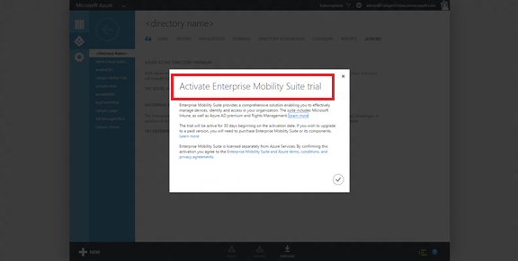
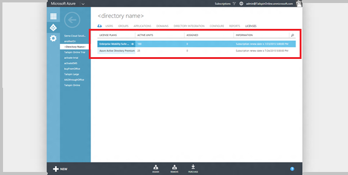
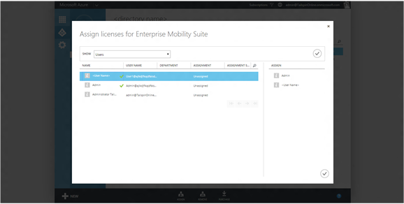
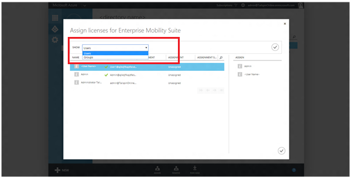
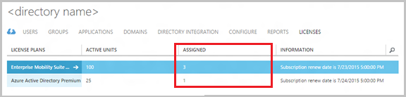
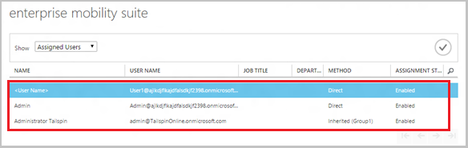
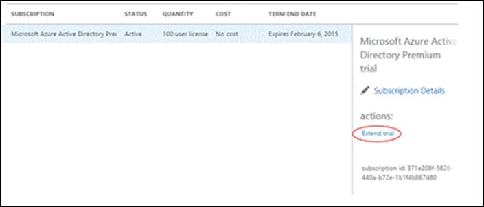
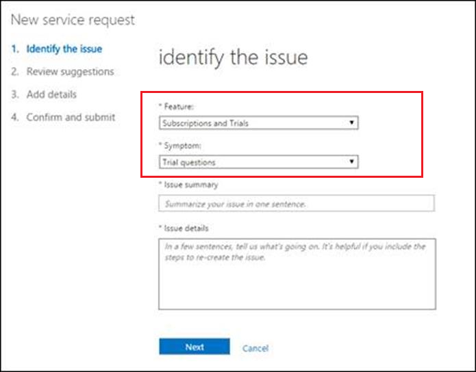

<properties
    pageTitle="What is Microsoft Azure Active Directory licensing? | Microsoft Azure"
    description="Description of Microsoft Azure Active Directory licensing, how it works, how to get started, and best practices, including Office 365, Microsoft Intune, and Azure Active Directory Premium and Basic editions"
    services="active-directory"
	  keywords="Azure AD licensing"
    documentationCenter=""
    authors="curtand"
    manager="stevenpo"
    editor=""/>

<tags
    ms.service="active-directory"
    ms.devlang="na"
    ms.topic="article"
    ms.tgt_pltfrm="na"
    ms.workload="identity"
    ms.date="05/16/2016"
    ms.author="curtand"/>

# What is Microsoft Azure Active Directory licensing?

##Description
Azure Active Directory (Azure AD) is Microsoft's Identity as a Service (IDaaS) solution and platform. Azure AD is offered in a number of functional and technical versions ranging from Azure AD Free, which is available with any Microsoft service such as Office 365, Dynamics, Microsoft Intune and Azure (Azure AD does not generate any consumption charges in this mode), to Azure AD paid versions such as Enterprise Mobility Suite (EMS), Azure AD Premium and Basic, as well as Azure Multi-Factor Authentication (MFA). Like many of Microsoft online services, most Azure AD paid versions are delivered through per-user entitlements as they are in Office 365, Microsoft Intune, and Azure AD. In these cases, the service purchase is represented with one or more subscriptions, and each subscription includes a pre-purchase number of licenses in your tenant. Per-user entitlements are achieved through license assignment, creating a link between the user and the product, enabling the service components for the user, and consuming one of the prepaid licenses.

[Try Azure AD premium now.](https://portal.office.com/Signup/Signup.aspx?OfferId=01824d11-5ad8-447f-8523-666b0848b381&ali=1#0)

> [AZURE.NOTE] Azure AD administration portal is a part of the Azure classic portal. While using Azure AD does not require any Azure purchases, accessing this portal requires an active Azure subscription or an [Azure trial subscription](https://azure.microsoft.com/pricing/free-trial/).

For a broad overview of Azure AD service capabilities, see [What is Azure AD](active-directory-whatis.md).
[Learn more about Azure AD service levels](https://azure.microsoft.com/support/legal/sla/)

> [AZURE.NOTE]  Azure pay as you go subscriptions are different: while also represented in your directory, these subscriptions enable creation of Azure resources and map them to your payment method. In this case there are NO license counts associated with the subscription. Users' association with the subscription, the users' access to managing subscription resources, is achieved by granting them permissions to operate on Azure resources mapped to the subscription.

##How does Azure AD licensing work?

License-based (Entitlement-based) Azure AD services work by activating a subscription in your Azure AD directory/service tenant. Once the subscription is active the service capabilities can be managed by directory/service administrators and used by licensed users.

When you purchase or activate Enterprise Mobility Suite, Azure AD Premium, or Azure AD Basic, your directory is updated with the subscription, including its validity period and prepaid licenses. Your subscription information, including status, next lifecycle event, and the number of assigned or available licenses is available through the Azure classic portal under the Licenses tab for the specific directory. This is also to best place to manage your license assignments.

Each subscription consists of one or more service plans, each mapping the included functional level of the service type; for example, Azure AD, Azure MFA, Microsoft Intune, Exchange Online, or SharePoint Online. Azure AD license management does NOT require service plan level management. This is different from Office 365 which relies on this advanced configuration mode to manage access to included services. Azure AD relies on in service configuration, to enable features and manage individual permissions.

In general, Azure AD subscription information is managed through the Azure classic portal, under the Licenses tab for the specific directory. Azure AD subscriptions, with the exception of Azure AD Premium, do NOT show up in the Office portal.

> [AZURE.IMPORTANT] Azure AD Premium and Basic, as well as Enterprise Mobility Suite subscriptions, are confined to their provisioned directory/tenant. Subscriptions cannot be split between directories or used to entitle users in other directories. Moving a subscription between directories is possible but requires submitting a support ticket or cancellation and re-purchase in the case of direct purchases.

> When purchasing Azure AD or Enterprise Mobility Suite through Volume Licensing subscription activation will happen automatically when the agreement includes other Microsoft Online services, e.g. Office 365.

Paid Azure AD features span the breadth of the directory. Examples include:
- Group-based assignment to applications, which is enabled under the specific application you are managing.
- Advanced and self-service group management capabilities are available under the directory configuration or within the specific group.
- Premium security reports are on the Reporting tab
- Cloud application discovery shows up in the Azure portal under Identity.

###Assigning licenses
While obtaining a subscription is all you need to configure paid capabilities, using your Azure AD paid features requires distributing licenses to the right individuals. In general, any user who should have access to or who is managed through an Azure AD paid feature must be assigned a license. A license assignment is a mapping between a user and a purchased service, such as Azure AD Premium, Basic, or Enterprise Mobility Suite.

Managing which users in your directory should have a license is simple. It can be accomplished by assigning to a group to create assignment rules through the Azure AD administration portal or by assigning licenses directly to the right individuals through a portal, PowerShell, or APIs. When assigning licenses to a group, all group members will be assigned a license. If users are added or removed from the group they will be assigned or removed the appropriate license. Group assignment can utilize any group management available to you and is consistent with group-based assignment to applications. Using this approach, you can set up rules such that all users in your directory are automatically assigned, ensure that everyone with the appropriate job title has a license or even delegate the decision to other managers in the organization.

With group-based license assignment, any user missing a usage location will inherit the directory location during assignment. This location can be changed by the administrator at any time. In cases where the automated assignment failed due to error, the user information under that license type will reflect that state.

##Getting started with Azure AD licensing

Getting started with Azure AD is easy; you can always create your directory as a part of signing up to a free Azure trial. [Learn more about signing up as an organization](sign-up-organization.md). The following can help you make sure that your directory is best aligned with other Microsoft services you may be consuming or are planning to consume, and your goals in obtaining the service.

Here are a couple of best practices:
- If you are already using any of Microsoft's organizational services, you already have an Azure AD directory. In this case, you should continue to use the same directory for other services, so that core identity management, including provisioning and hybrid SSO, can be utilized across the services. Your users will have a single logon experience and will benefit from richer capabilities across the services. As a result, if you decide to buy an Azure AD paid service for your workforce, we recommend that you use the same directory to do this.
- If you are planning to use Azure AD for a different set of users (partners, customers, and so on), or if you would like to evaluate Azure AD services and would like to do that in isolation of your production service, or if you are looking to setup a sandbox environment for your services, we recommend that you first create a new directory through the Azure Azure classic portal. [Learn more about creating a new Azure AD directory in the Azure classic portal](active-directory-licensing-directory-independence.md). The new directory will be created with your account as an external user with global administrator permissions. When you sign in to the Azure classic portal with this account, you will be able to see this directory and access all directory administration tasks. We recommend that you create a local account with appropriate privileges to manage other Microsoft services (those not accessible through the Azure classic portal). [Learn more about creating user accounts in Azure AD](active-directory-create-users.md).

> [AZURE.NOTE] Azure AD supports “external users,” which are user accounts in an instance of Azure AD that were created using either a Microsoft Account (MSA) or an Azure AD identity from another directory. While we are busy extending this capability into all of Microsoft's organizational services, right now these accounts are not supported in some of the services' experiences; for example, the Office 365 administration portal does not currently support these users. As a result, external users with Microsoft accounts will not be able to access the Office 365 administration portal at all, while external users from other Azure AD directories will be ignored. In the latter case, only the user’s local account, the Azure AD or Office 365 directory where the user was originally created, would be accessible through these experiences.

As indicated, Azure AD has different paid versions. These versions have some minor differences in their purchase availability:

| Product	| EA/VL		| Open	| 	CSP	| 	MPN use rights	| 	Direct purchase	| Trial |
|---|---|---|---|---|---|---|
| Enterprise Mobility Suite |	X |	X |	X |	X |	 |	 	X |
| Azure AD Premium	| X	| X	| X	| 	| X	| X |
| Azure AD Basic	| X	| X | X	| X	|    |     |

###Select one or more license trials
 In all cases, you can activate an Azure AD Premium or Enterprise Mobility Suite trial subscription by selecting the specific trial you want on the Licenses tab in your directory. Either trial contains a 30-day subscription with 100 licenses.

###Assign licenses
Once the subscription is active, you should assign a license to yourself and refresh the browser to ensure you are seeing all your features. The next step is to assign licenses to the users that will need to access or be included in paid Azure AD features. As we mentioned above in "Assigning licenses," the best way to do this is to identify the group representing the desired audience and assign it to the license; in this way, users who are added or removed from the group over its lifecycle will be assigned to or removed from the license.

To assign a license to a group or individual users, select the license plan you would like to assign and click **Assign** on the command bar.

Once in the assignment dialog for the selected plan, you can select users and adding them to the **Assign** column on the right. You can page through the user list or search for specific individuals using the looking glass on the top right of the user grid. To assign groups, select "Groups" from the **Show** menu and then click the check button on the right to refresh the assignments that are displayed.

You can now search or page through groups and add them to the **Assign** column in the same way. You can use these to assign a combination of users and groups in a single operation. To complete the assignment process, click the check button in the bottom right corner of the page.

When a group is assigned, its members inherit the licenses within 30 minutes, but usually within 1-2 minutes.

Assignment errors can occur during Azure AD license assignment, but are relatively rare. Potential assignment errors are limited to:
- Assignment conflict - when a user was previously assigned a license that is incompatible with the current license. In this case, assigning the new license will require removing the previous one.
- Exceeded available licenses - when the number of users in assigned groups exceed available licenses, the users' assignment status will reflect a failure to assign due to missing licenses.

###View assigned licenses

A summary view of assigned licenses including available, assigned, and next subscription lifecycle event are displayed on the **Licenses** tab.

A detailed list of assigned users and groups, including assignment status and path (direct or inherited from one or more groups) is available when navigating into a license plan.

Removing licenses is just as easy as assigning them. If the user is directly assigned or for an assigned group, you can remove the license by selecting the license type, selecting **Remove**, adding the user or group to the remove list, and confirming the action. Alternatively, you can open a license type, select the specific user or group, and tap **Remove** on the command bar. To end a user’s inheritance of a license from a group, simply remove the user from the group.

###Extending trials

Trial extensions for customers are available as self-service through the Office 365 portal. A customer admin can navigate to the [Office portal](https://portal.office.com/#Billing) (access depends on permissions for the Office portal) and select your Azure AD Premium trial. Click the **Extend trial** link and follow the instructions. You will need to enter a credit card, but it will not be charged.

Customers can also request a trial extension by submitting a support request. A customer admin can navigate to the Office 365 portal [support page](http://aka.ms/extendAADtrial) (access depends on permissions for the Office support page). On this page select “Subscriptions and Trials” under Features and “Trial questions” under Symptom. Finally, enter information on the circumstances

## Next steps

Now you might be ready to configure and use some Azure AD Premium features.

- [Self-service password reset](active-directory-manage-passwords.md)
- [Self-service group management](active-directory-accessmanagement-self-service-group-management.md)
- [Azure AD Connect heath](active-directory-aadconnect-health.md)
- [Group assignment to applications](active-directory-manage-groups.md)
- [Azure Multi-Factor Authentication](../multi-factor-authentication/multi-factor-authentication.md)
- [Direct purchase of Azure AD Premium licenses](http://aka.ms/buyaadp)
