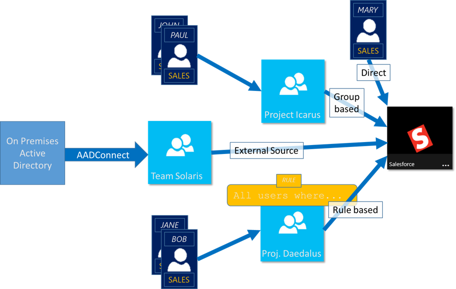

<properties
	pageTitle="Managing access to resources with Azure Active Directory groups| Microsoft Azure"
	description="How to use groups in Azure Active Directory to manage user access to on-premises and cloud applications and resources."
	services="active-directory"
	documentationCenter=""
	authors="curtand"
	manager="femila"
	editor=""
/>

<tags
	ms.service="active-directory"
	ms.workload="identity"
	ms.tgt_pltfrm="na"
	ms.devlang="na"
	ms.topic="article"
	ms.date="08/10/2016"
	ms.author="curtand"/>

# Managing access to resources with Azure Active Directory groups

Azure Active Directory (Azure AD) is a comprehensive identity and access management solution that provides a robust set of capabilities to manage access to on-premises and cloud applications and resources including Microsoft online services like Office 365 and a world of non-Microsoft SaaS applications. This article provides an overview, but if you want to start using Azure AD groups right now, follow the instructions in [Managing security groups in Azure AD](active-directory-accessmanagement-manage-groups.md). If you want to see how you can use PowerShell to manage groups in Azure Active directory you can read more in [Azure Active Directory preview cmdlets for group management](active-directory-accessmanagement-groups-settings-v2-cmdlets.md).

> [AZURE.NOTE] To use Azure Active Directory, you need an Azure account. If you don't have an account, you can [sign up for a free Azure account](https://azure.microsoft.com/pricing/free-trial/).

Within Azure AD, one of the major features is the ability to manage access to resources. These resources can be part of the directory, as in the case of permissions to manage objects through roles in the directory, or resources that are external to the directory, such as SaaS applications, Azure services, and SharePoint sites or on premise resources. There are four ways a user can be assigned access rights to a resource:

1. Direct assignment

	Users can be assigned directly to a resource by the owner of that resource.

2. Group membership

	A group can be assigned to a resource by the resource owner, and by doing so, granting the members of that group access to the resource. Membership of the group can then be managed by the owner of the group. Effectively, the resource owner delegates the permission to assign users to their resource to the owner of the group.

3. Rule-based

	The resource owner can use a rule to express which users should be assigned access to a resource. The outcome of the rule depends on the attributes used in that rule and their values for specific users, and by doing so, the resource owner effectively delegates the right to manage access to their resource to the authoritative source for the attributes that are used in the rule. The resource owner still manages the rule itself and determines which attributes and values provide access to their resource.

4. External authority

	The access to a resource is derived from an external source; for example, a group that is synchronized from an authoritative source such as an on-premises directory or a SaaS app such as WorkDay. The resource owner assigns the group to provide access to the resource, and the external source manages the members of the group.

  

## Watch a video that explains access management

You can watch a short video that explains more about this:

**Azure AD: Introduction to dynamic membership for groups**

> [AZURE.VIDEO azure-ad--introduction-to-dynamic-memberships-for-groups]

## How does access management in Azure Active Directory work?
At the center of the Azure AD access management solution is the security group. Using a security group to manage access to resources is a well-known paradigm, which allows for a flexible and easily understood way to provide access to a resource for the intended group of users. The resource owner (or the administrator of the directory) can assign a group to provide a certain access right to the resources they own. The members of the group will be provided the access, and the resource owner can delegate the right to manage the members list of a group to someone else, such as a department manager or a helpdesk administrator.

The owner of a group can also make that group available for self-service requests. In doing so, an end user can search for and find the group and make a request to join, effectively seeking permission to access the resources that are managed through the group. The owner of the group can set up the group so that join requests are approved automatically or require approval by the owner of the group. When a user makes a request to join a group, the join request is forwarded to the owners of the group. If one of the owners approves the request, the requesting user is notified and the user is joined to the group. If one of the owners denies the request, the requesting user is notified but not joined to the group.

## Getting started with access management
Ready to get started? You should try out some of the basic tasks you can do with Azure AD groups. Use these capabilities to provide specialized access to different groups of people for different resources in your organization. A list of basic first steps are listed below.

* [Creating a simple rule to configure dynamic memberships for a group](active-directory-accessmanagement-manage-groups.md#how-can-i-manage-the-membership-of-a-group-dynamically)

* [Using a group to manage access to SaaS applications](active-directory-accessmanagement-group-saasapps.md)

* [Making a group available for end user self-service](active-directory-accessmanagement-self-service-group-management.md)

* [Syncing an on-premises group to Azure using Azure AD Connect](active-directory-aadconnect.md)

* [Managing owners for a group](active-directory-accessmanagement-managing-group-owners.md)

## Next steps for access management
Now that you have understood the basics of access management, here are some additional advanced capabilities available in Azure Active Directory for managing access to your applications and resources.

* [Using attributes to create advanced rules](active-directory-accessmanagement-groups-with-advanced-rules.md)

* [Managing security groups in Azure AD](active-directory-accessmanagement-manage-groups.md)

* [Setting up dedicated groups in Azure AD](active-directory-accessmanagement-dedicated-groups.md)

* [Graph API reference for groups](https://msdn.microsoft.com/Library/Azure/Ad/Graph/api/groups-operations#GroupFunctions)

* [Azure Active Directory cmdlets for configuring group settings](active-directory-accessmanagement-groups-settings-cmdlets.md)
